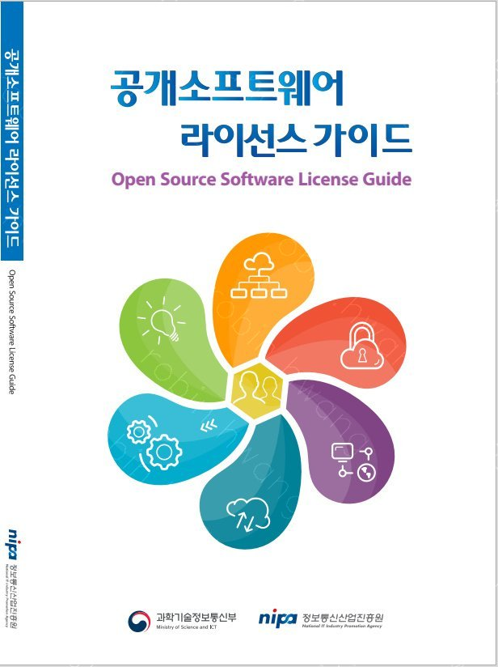
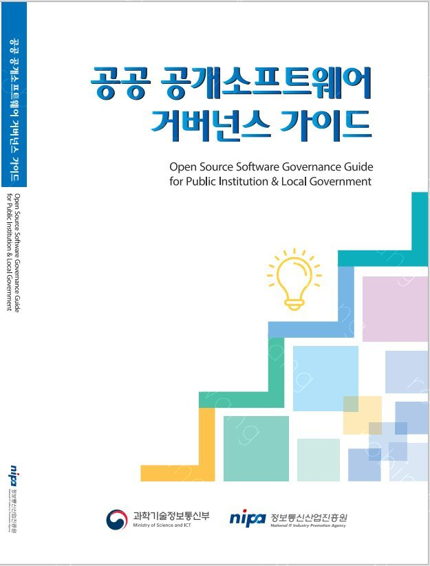

NIPA에서 공개소프트웨어 활용을 위한 4종의 가이드를 발간했습니다.
공개소프트웨어 가이드 4종의 내용은 아래와 같습니다.
참고로 기업 공개소프트웨어 거버넌스 가이드는 현재 OpenChain KWG 운영진이신 장학성, 이서연, 황민호님이 집필에 참여했습니다.

## 공개소프트웨어 라이선스 가이드 (개정판)
📖[공개 소프트웨어 라이선스 다운로드](https://www.oss.kr/oss_guide/show/a17c94f3-a470-4e1d-8cfe-d5d15d6535f7)

공개소프트웨어 라이선스 개요 및 소개, 의무사항 준수 방법, 저작권 및 특허권 관련 검토사항, 라이선스 관련 체크리스트, 관리방안, 주요 분쟁사례, 자주하는 질문 등 기업이나 조직에 적용할 핵심 내용을 파악하여 다양한 환경에서 활용 가능하도록 구성

공개소프트웨어 라이선스 가이드는 기업 및 조직의 개발자, 관리자들이 공개소프트웨어 라이선스에 대한 전반적인 개념과 주요 준수사항에 대해 보다 쉽게 이해하고 실무에 활용할 수 있도록 제반 검토사항에 대한 가이드를 제공한다.▲공개소프트웨어 개념 및 정의 ▲공개소프트웨어 라이선스 개념과 의무사항 ▲공개소프트웨어의 저작권 및 특허 이슈 ▲공개소프트웨어 라이선스 양립성 및 듀얼 라이선스 ▲배포 방식에 따른 공개소프트웨어 라이선스 체크리스트 ▲공개소프트웨어 라이선스 관리 ▲공개소프트웨어 라이선스 분쟁사례 ▲공개소프트웨어 라이선스 관련 지원에 대한 내용으로 구성된다.공개소프트웨어를 사용하는 사용자 관점에서는 동일한 공개소프트웨어를 사용하더라도 사용 라이선스와 사용형태, 배포 방식 등에 따라 검토 및 적용해야 할 의무사항이 차별화됨에 따라 본 가이드에서는 자신의 기업이나 조직에 적용할 핵심 내용을 파악하여 다양한 환경에서 활용할 수 있도록 각 구성 항목별로 이해에 도움을 주는 별도의 팁도 제시하였다.

## 공공 공개소프트웨어 거버넌스 가이드
📖[공공 공개소프트웨어 거버넌스 가이드 다운로드](https://www.oss.kr/oss_guide/show/824f56c5-8ed7-40cc-84d1-a03fa2f42bb1)

가이드공공부문에서 정보화사업의 ▷기획 단계 ▷계획수립 단계▷사업자 선정 및 계약 단계 ▷사업수행 단계 ▷검사 및 운영 단계 ▷성과평가 단계 등 각 단계별 공개소프트웨어 활용 시 확인해야 할 관련 법령·지침, 고려 및 점검 사항을 제공

공공 공개소프트웨어 거버넌스 가이드는 국내외의 공개소프트웨어 관련 정책 동향과 기술 동향을 수집하여 분석한 결과를 반영하고 국내 공공부문에서 정보화사업을 추진함에 있어 공개소프트웨어를 활용하고 관리할 때 필수적으로 확인해야 하는 관련 법령·지침 및 고려해야 할 실무 관점의 정보들과 접근법을 제공한다.각 장은 ▲정보화사업 공개소프트웨어 관리 필요성 ▲정보화사업 공개소프트웨어 관리로 구성된다.‘정보화사업 공개소프트웨어 관리 필요성’에서는 국내외 각국 정부의 공개소프트웨어 정책 및 활용 사례를 소개하고 정보화사업의 관련 법령 및 지침, 해설서를 정리하고 공개소프트웨어 관리를 위한 관련조항을 설명한다.‘정보화사업 공개소프트웨어 관리’에서는 ▷기획 단계 ▷계획수립 단계 ▷사업자 선정 및 계약 단계 ▷사업수행 단계 ▷검사 및 운영 단계 ▷성과평가 단계 등 단계별 기본 관리점검 프로세스 소개와 단계별로 실무담당자가 참고할 수 있는 지침 및 해설서 목록을 제공하며 공개소프트웨어 관리 점검을 위한 관리요소 및 검토사항 등을 제공한다.

## 기업 공개소프트웨어 거버넌스 가이드
📖[기업 공개소프트웨어 거버넌스 다운로드](https://www.oss.kr/oss_guide/show/2f7c25e8-df31-4ad9-9d25-1d8234c322c0)

기업에서 소프트웨어 개발 및 공급 시 실무에서 활용 가능하도록 공개소프트웨어를 활용하는 세 가지 경우(사용/기여/공개)로 구분하여 설명하고, 마지막으로는 기업의 공개소프트웨어 거버넌스를 위해 필요한 조직의 구성 방안 제공

기업 공개소프트웨어 거버넌스 가이드는 기업에서 공개소프트웨어를 활용한 소프트웨어 제품 및 서비스의 개발과 출시가 증가함에 따라 공개소프트웨어 기반 소프트웨어 개발 및 공급 시 소스 관리 및 공급 정책, 컴플라이언스 프로세스, 관리 도구, 조직 구성 등 기업에서 공개소프트웨어 거버넌스를 수립에 필요한 가이드는 물론 기업의 입장에서 커뮤니티에 기여하는 방법, 공개하는 방법도 함께 설명한다.각 장은 ▲공개소프트웨어 사용하기 ▲공개소프트웨어 기여하기 ▲공개소프트웨어 공개하기▲OSPO(Open Source Program Office), 공개소프트웨어 프로그램 사무소로 구성된다.각 주제는 이해를 돕기 위해 기업 및 구성원의 입장에 따라 각각 기업 편과 개발자 편으로 나누어 설명한다. 기업 편은 공개소프트웨어 담당자가 정책과 프로세스를 구축하기 위해 알아야 할 사항을 중점적으로 다루고, 개발자 편에서는 기업에 속한 개발자가 공개소프트웨어를 활용하는 데에 필요한 사항을 설명한다.

## 개방형OS 도입가이드
📖[개방형OS 도입가이드 다운로드](https://www.oss.kr/oss_guide/show/0e9ad67e-9d2a-4a0a-8f2d-092226e3ea07)

업무용 PC의 개방형OS 전환 시 필요한 개방형OS 소개, 종류, 도입 절차/범위, 유지관리, 적용 사례 등 소개하여 실무담당자가 개방형OS 도입을 검토함에 있어 전체적인 사업계획에 대한 가이드를 제시

개방형OS 도입가이드는 공개소프트웨어 관련 정책 중 최근 국내에서 활발하게 논의되고 있는 개방형OS 확산 정책과 관련하여 개방형OS를 도입하고자 하는 기관의 개방형OS에 대한 이해를 돕고 개방형OS 도입의 검토 및 실행과정에 유용한 자료로 활용될 수 있도록 실 도입 사례를 바탕으로 설명한다.각 장은 ▲개방형OS 개요 ▲개방형OS 도입 사례 ▲개방형OS 도입 사전 검토사항 ▲개방형OS 도입 사업추진 절차 ▲개방형OS 유지관리 프로세스 ▲개방형OS 도입 가이드 활용으로 구성된다.개방형OS 도입에 대한 다양한 레퍼런스 모델 및 사례 등을 바탕으로 전체적인 사업계획에 대한 가이드를 제시하고 실무담당자가 개방형OS 도입을 검토함에 있어 도입의 절차와 고려사항을 제공한다.

---------
