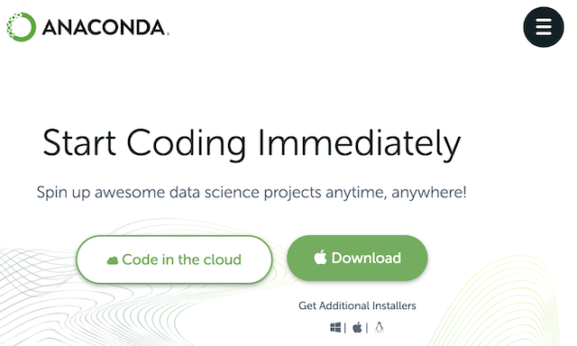
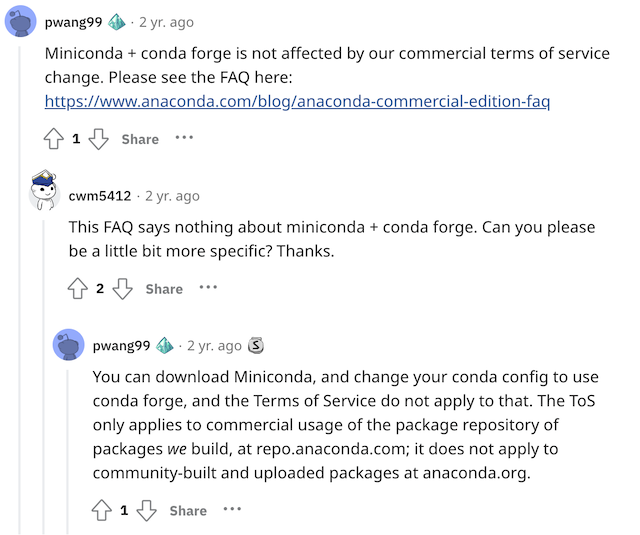

안녕하세요. 

Python 개발 환경 만들면서 Anaconda 많이 사용하시지 않나요? Python은 간단한 업무 자동화부터 데이터 분석, 인공지능 학습, 모델링 작업 등에 많이 사용되고 있는데요, 여러 Python 프로젝트 개발을 수행하다 보면 package 버전이 충돌하는 불편함이 생길 수 있습니다. Anaconda는 개발 프로젝트별로 가상 환경을 제공하여 버전 충돌을 방지할 수 있다는 장점이 있으며, [홈페이지](https://www.anaconda.com/)에서 쉽게 다운받아 설치가 간단하여 널리 사용되고 있습니다. 



[https://www.anaconda.com/](https://www.anaconda.com/)

## 그런데 Anaconda는 사서 쓰셔야 합니다.

[2020년 9월](https://www.anaconda.com/blog/anaconda-commercial-edition-faq), Anaconda사는 서비스 약관(Terms of Service)를 변경하여 200명 이상의 직원이 있는 기업 또는 정부 조직이 Anaconda Repository를 사용하는 경우 유료로 구매하게 하였습니다.

따라서, 200명 이상의 기업에서 근무하는 개발자라면 Anaconda 웹사이트에서 Pro 이상의 라이선스를 구매해야 합니다. 


[https://www.anaconda.com/pricing](https://www.anaconda.com/pricing)

조금 자세히 살펴보면, 일반적으로 Anaconda 설치를 위해서는 Anaconda 홈페이지에서 [Anaconda Distribution](https://www.anaconda.com/products/distribution)을 무료로 다운 받을 수 있습니다. 


[https://www.anaconda.com/products/distribution](https://www.anaconda.com/products/distribution)

이를 설치하면 conda package manager와 더불어 Python 및 150여개의  package가 함께 설치되어 손쉽게 개발 환경을 구성할 수 있습니다. 

Anaconda사는 [Anaconda Repository](https://repo.anaconda.com)를 호스팅하며 8천 개 이상의 오픈소스 package를 제공하고, 사용자는 conda install PACKAGENAME 명령어로 이들 package를 안정적으로 설치/관리 할 수 있습니다. 


[https://repo.anaconda.com/](https://repo.anaconda.com/)

그런데, 바로 이 [Anaconda Repository](https://repo.anaconda.com)의 [서비스 약관](https://legal.anaconda.com/policies/en/?name=terms-of-service)이 2020년 9월에 변경된 것이고, commercial activity 목적일 때에는 Anaconda Repository의 무료 사용이 불가능해졌습니다. 

많은 개발자가 Anaconda Distribution을 쉽게 다운받아서 사용하지만 이 과정에서 Anconda Repository를 사용하게 되는데요, 200명 이상 기업의 개발자라면 ‘의도하지는 않았지만’ Anaconda의 서비스 약관을 위반하게 되는 것이고, 이를 방지하기 위해서는 꼭 Anaconda Pro 이상을 구매하셔야 합니다. 

참고로, [Miniconda](https://docs.conda.io/en/latest/miniconda.html)는 Anaconda와 마찬가지로 conda package manager와 Python 및 최소한의 dependency를 설치하는 소프트웨어 패키지인데요, Miniconda를 사용하면서도 마찬가지로 Anaconda Repository에 Access하여 package를 다운 받아 사용하게 되며, Anaconda와 동일하게 유료 구매 대상으로 간주될 수 있습니다. 


[https://docs.conda.io/en/latest/miniconda.html](https://docs.conda.io/en/latest/miniconda.html)


결국, 200인 이상 기업의 개발자가 Anaconda Distribution을 무료로 다운받아서 사용하더라도 당장 비용이 청구되거나 기능이 막히지는 않겠지만, Anaconda의 안정적인 발전을 위해서도 200인 이상의 기업 개발자는 자발적으로 구매하여 사용하는 것이 좋을 것 같습니다. (물론 어느 순간 회사로 라이선스 위반 통지 및 비용 청구서가 날아올 수도 있습니다. ^^)


## 대안은 있습니다. 'conda-forge'

Anaconda사는 [conda](https://conda.io/)라는 package manager를 오픈소스로 공개하여 관리하고 있습니다. [conda](https://github.com/conda/conda) 자체는 [BSD-3-Clause](https://github.com/conda/conda/blob/main/LICENSE.txt) 라이선스로 공개된 오픈소스여서 기업이 무료로 사용하는 데 문제되지 않습니다. 


[https://github.com/conda/conda](https://github.com/conda/conda)

conda는 package 설치/관리를 위해 설치할 package를 찾기 위한 저장소 위치가 필요한데요, 이를 channel이라고 칭합니다. 기본 channel이 바로 [Anaconda Repository](https://repo.anaconda.com/)입니다. 그런데, commuinity 기반의 repository가 또 있습니다. 바로 [conda-forge](https://conda-forge.org/)인데요, 


[https://conda-forge.org/](https://conda-forge.org/)

conda를 설치하고 channel에 conda-forge를 추가할 수 있습니다.

```
conda config --add channels conda-forge
conda config --set channel_priority strict
```

이렇게 하면 Anaconda Repository를 사용하지 않기 때문에 위에서 설명한 [서비스 약관](https://legal.anaconda.com/policies/en/?name=terms-of-service)을 위반하지 않고 conda를 사용할 수 [있습니다](https://florianwilhelm.info/2021/09/Handling_Anaconda_without_getting_constricted/). 

Anaconda사의 CEO인 Peter Wang은 Miniconda를 다운 받아서 conda config를 conda-forge로 변경할 경우, 무료로 사용할 수 있다고 직접 밝힌 바 [있습니다](https://www.reddit.com/r/Python/comments/iqsk3y/comment/g4xuabr/). 



[https://www.reddit.com/r/Python/comments/iqsk3y/comment/g4xuabr/](https://www.reddit.com/r/Python/comments/iqsk3y/comment/g4xuabr/)

Anaconda Repository를 가리키는 defaults channel을 아예 삭제해 버리면 보다 확실하게 Anaconda Repository 사용을 제한할 수 있습니다.
```
conda config --remove channels defaults
```

원하는대로 channel이 변경되었는지는 아래 명령어로 확인할 수 있습니다.

```
### 변경 전
% conda config --show channels
channels:
  - defaults

### 변경 후
% conda config --show channels
channels:
  - conda-forge
```

## Miniforge는 설치 시 channel에 conda-forge를 추가합니다.

한 걸음 더 나아가서 [Miniforge](https://github.com/conda-forge/miniforge)는 conda 설치를 위한 최소의 installer를 제공하는 오픈소스 프로젝트로, 기본 설치 시 channel에 conda-forge를 추가합니다. 또한, Miniforge는 Apple M1을 포함한 다양한 CPU 아키텍처를 지원한다고도 알려져 있습니다.


[https://github.com/conda-forge/miniforge](https://github.com/conda-forge/miniforge)

따라서, Anaconda 대신 Miniforge를 설치한다면 비교적 수월하게 라이선스 위반 없이 conda package manager로 개발 환경을 구성할 수 있는 것으로 보입니다. 


한 가지 특이한 점은 conda-forge 운영에는 막대한 호스팅 비용이 필요한데 이를 Anaconda사가 지불하고 있다는 점입니다. Anaconda사는 conda-forge를 계속 무료로 유지하기 위해서라도 Anaconda Repository의 서비스 약관 변경을 통한 수익이 [필요했다](https://conda-forge.org/blog/posts/2020-11-20-anaconda-tos/)고 설명합니다. 

개발 편의성과 안정성을 고려하여 가급적 Anaconda Pro를 구매하여 사용하는 것이 좋겠습니다. 구매 전까지 라이선스 이슈 방지를 위해 Miniconda + conda-forge 조합, 혹은 Miniforge를 대안으로 고려할 수 있을 것 같습니다.

혹시 틀린 내용이 있다면 알려주시면 감사하겠습니다. ^^

감사합니다.