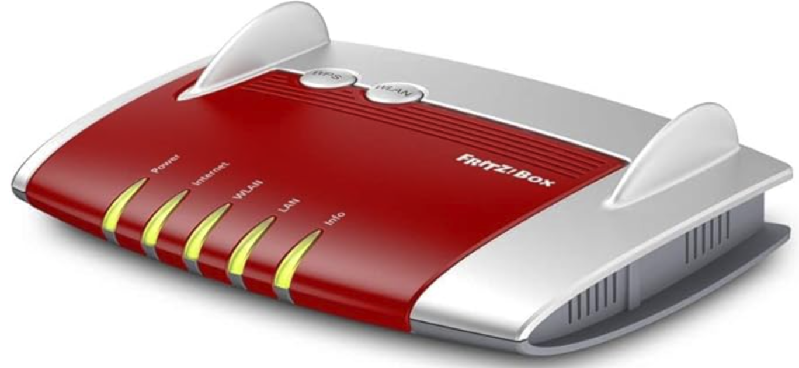

> 본 글은 Ars Technica의 ["German router maker is latest company to inadvertently clarify the LGPL license"](https://arstechnica.com/gadgets/2025/01/suing-wi-fi-router-makers-remains-a-necessary-part-of-open-source-license-law/) 기사를 바탕으로 작성되었습니다. 해당 기사는 AVM과 Sebastian Steck 간의 소송에 대한 자세한 내용과 LGPL 라이선스 준수의 중요성을 다루고 있습니다.

## 1. 사건 개요

2025년 1월 9일, Software Freedom Conservancy (SFC)는 독일의 네트워크 장비 제조업체 AVM을 상대로 제기한 소송이 마무리되었다고 [발표했습니다](https://sfconservancy.org/news/2025/jan/09/avm-copyleft-lawsuit-resolved-with-install/). 이 소송의 핵심은 GNU Lesser General Public License (LGPL) 버전 2.1에 명시된 사용자의 권리, 특히 **설치 정보** 제공 의무에 관한 것이었습니다.

Sebastian Steck이라는 독일의 소프트웨어 개발자가 2021년 5월 AVM의 라우터를 구매한 후, AVM이 제공한 소스 코드로는 수정된 소프트웨어를 라우터에 재설치할 수 없다는 사실을 발견했습니다. Steck은 AVM에게 "uClibc, libblkid, libexif 및 libosip2 라이브러리의 완전한 소스 코드와 컴파일 및 설치 스크립트 제공"을 요구했습니다. AVM이 이를 시정하지 않자 Steck은 2023년 7월 베를린 법원에 소송을 제기했습니다.

소송 결과, 독일 법원은 AVM에게 Steck의 변호사 비용을 지불하도록 판결했습니다. AVM은 이 판결에 대해 항소하지 않기로 결정했습니다. 법원은 이 사건의 분쟁 금액을 7,500 유로로 정했는데, 이는 오픈소스 라이선스 준수 문제의 경제적 가치와 중요성을 반영합니다.

또한, 이 사건은 LGPL-2.1이 **사용자**에게 장치의 소프트웨어를 수정, 수리, 재설치할 권리를 보장한다는 점을 명확히 했습니다. 특히 네트워크 장비와 같은 임베디드 시스템에서도 이러한 권리가 보장되어야 한다는 점을 확인했다는 데 큰 의의가 있습니다.

> **Disclaimer:** 
> 
> *본 글은 법률 전문가가 작성한 것이 아니며, 법적 근거로 사용될 수 없습니다. 라이선스 및 법적 문제와 관련된 구체적인 상황에 대해서는 반드시 법률 전문가의 조언을 구하시기 바랍니다. 또한 이 글은 공개된 정보를 바탕으로 작성되었으며, 소송 당사자들의 입장을 모두 반영하지 않을 수 있습니다. 판결의 전체 내용과 맥락은 원문을 참고하시기 바랍니다.*

## 2. 소송의 배경과 경과

### 배경

독일의 소프트웨어 개발자 Sebastian Steck은 2021년 5월, AVM사의 인기 제품인 [Fritz!Box 4020](https://en.avm.de/products/fritzbox/fritzbox-4020/) 라우터를 구입했습니다. Steck은 이 라우터의 펌웨어에 사용된 소스 코드를 요청했는데, 여기서 문제가 발생했습니다. AVM이 제공한 소스 코드로는 라우터에 수정된 소프트웨어를 다시 설치할 수 없었던 것입니다.

### 법적 근거

이 소송의 중요한 특징은 Sebastian Steck이 LGPL-2.1 소프트웨어의 저작권자가 아님에도 불구하고 소송을 제기할 수 있었다는 점입니다. 이는 LGPL-2.1 라이선스가 제3자를 위한 계약의 성격을 가지고 있기 때문입니다. [소장(Complaint)](https://sfconservancy.org/static/docs/avm-Complaint_Klageschrift_EN.pdf)에 따르면 LGPL-2.1 라이선스는 제3자를 위한 계약의 성격을 가지고 있습니다:

> "This license agreement represents a genuine contract in favor of third parties in accordance with Section 328 of the German Civil Code (BGB), namely in favor of the users who receive the software in object code and, in accordance with the wording of the LGPL-2.1 license conditions to be handed over to them, have a direct right to the transfer of the complete corresponding source code."

이러한 법적 근거는 오픈소스 소프트웨어 사용자의 권리를 크게 강화합니다. 제조업체가 라이선스 의무를 제대로 이행하지 않을 경우, 저작권자뿐만 아니라 일반 사용자도 법적 조치를 취할 수 있게 되었습니다.

### 소송 경과

1. 2021년 5월 7일: Steck이 AVM에 Fritz!Box 4020의 펌웨어 버전 6.83 소스 코드를 요청
2. 2021년 5월 11일: AVM 자회사가 소스 코드 다운로드 링크 제공
3. 2021년 5월 14일: Steck이 제공된 소스 코드의 불완전성을 지적하고 시정 요구
4. 2023년 1월 12일: Steck의 변호인이 AVM에 법적 상황을 설명하고 소스 코드 시정 요구
5. 2023년 3월 9일: Steck이 펌웨어 버전 7.02의 소스 코드도 추가로 요청
6. 2023년 7월 27일: Steck이 베를린 지방법원에 소송 제기
7. 소송 제기 수개월 후: AVM이 Steck에게 요청받은 모든 소스 코드를 제공. "라이브러리 설치를 제어하는 스크립트"도 포함
8. 2025년 1월 9일: AVM이 Steck의 변호사 비용을 지불하고 소송 종결. AVM은 판결에 대해 항소하지 않기로 결정

### 소송의 쟁점

이 소송에서 주요하게 다뤄진 쟁점들은 다음과 같습니다:

1. 컴파일 및 설치 스크립트 제공: AVM이 처음에 제공한 소스 코드에는 LGPL-2.1에서 요구하는 컴파일 및 설치 스크립트가 빠져 있었습니다. 이 스크립트는 소스 코드를 실행 가능한 프로그램으로 변환하고, 그 프로그램을 기기에 설치하는 데 필요한 중요한 요소입니다.
2. 환경 변수 정보: 컴파일 과정에 필수적인 KERNEL_LAYOUT 등의 환경 변수 설정 정보가 제공되지 않았습니다. 환경 변수는 프로그램이 실행되는 환경을 설정하는 중요한 정보로, 이것이 없으면 소스 코드를 제대로 컴파일할 수 없습니다.
3. 영구 설치 가능성: AVM이 제공한 정보로는 수정된 라이브러리를 Fritz!Box에 영구적으로 설치할 수 없었습니다. 이는 사용자가 자신의 기기에 수정된 소프트웨어를 지속적으로 사용할 수 있어야 한다는 LGPL-2.1의 핵심 요구사항을 위반하는 것입니다.
4. 펌웨어 이미지 생성: 제공된 소스 코드로는 Fritz!Box에 설치 가능한 펌웨어 이미지를 만들 수 없었습니다. 펌웨어 이미지는 라우터의 운영 체제와 기능을 담고 있는 파일로, 이를 생성할 수 없다는 것은 사실상 소프트웨어를 수정하고 재설치할 수 없다는 것을 의미합니다.
5. 사용자의 소송 제기 권리 인정:
이번 판결은 오픈소스 소프트웨어의 저작권자가 아닌 일반 사용자도 LGPL-2.1 라이선스 위반에 대해 소송을 제기할 수 있음을 인정했습니다. 이는 오픈소스 소프트웨어 사용자의 권리를 크게 강화하는 결과를 가져왔습니다.

이러한 쟁점들은 모두 LGPL-2.1 라이선스의 핵심 원칙인 '사용자의 소프트웨어 자유'와 직결됩니다. 소스 코드를 제공하는 것만으로는 충분하지 않고, 사용자가 그 코드를 실제로 수정하고 기기에 다시 설치할 수 있어야 한다는 것이 이 소송의 핵심 주장이었습니다.

> [참고] SFC가 공개한 [소장(Complaint)](https://sfconservancy.org/static/docs/avm-Complaint_Klageschrift_EN.pdf) 중 일부: 
> 
> "The information required for the reinstallation of the compiled program libraries on the Fritz!Box ("installation script") was also deliberately withheld from the plaintiff. Upon request, the plaintiff only received information that could be used to load the libraries in dispute into the working memory (RAM). However, this is not a sufficient installation on the Fritz!Box because the copy is only created temporarily, meaning "fleetingly [volatile]." When the Fritz!Box is switched off and restarted, the modified versions of the LGPL 2.1 libraries would no longer be present on the device, and the versions created by the defendant would be used instead. This is diametrically opposed to the purpose of the LGPL-2.1, namely, to be able to customize and reinstall the software.”
> 

또한, 이번 판결은 오픈소스 소프트웨어 사용자의 권리를 실질적으로 보장했을 뿐만 아니라, 사용자가 직접 이러한 권리를 법적으로 주장할 수 있는 근거를 마련했다는 점에서 큰 의의가 있습니다. 이는 오픈소스 생태계의 건전성을 유지하는 데 중요한 역할을 할 것으로 예상됩니다.

## 3. 판결 의의

이번 판결은 오픈소스 소프트웨어 라이선스 준수에 대한 중요한 기준을 제시했습니다. 독일 법원은 LGPL(Lesser General Public License) 라이선스 준수를 위해서는 단순히 소스 코드를 제공하는 것만으로는 부족하다고 판단했습니다. 제공된 소스 코드는 실제로 사용자가 펌웨어를 수정하고 재설치할 수 있어야 한다는 것입니다.

이번 판결에서 확인할 수 있는 주요 내용은 다음과 같습니다:

1. LGPL 준수의 실질적 의미:
법원은 LGPL 준수가 단순한 형식적 절차가 아니라는 점을 분명히 했습니다. 소스 코드를 제공하는 것은 시작일 뿐, 그 코드가 실제로 사용 가능해야 합니다.
2. 실용성 요구:
제공된 소스 코드는 단순히 읽을 수 있는 형태여서는 안 됩니다. 사용자가 이를 실제로 컴파일하고, 수정된 버전을 기기에 재설치할 수 있어야 합니다. 이는 소프트웨어의 '수리 가능성'을 보장하는 중요한 요소입니다.
3. 컴파일 및 설치 스크립트 제공 의무:
LGPL은 소스 코드 자체뿐만 아니라, 이를 컴파일하고 설치하는 데 필요한 스크립트도 함께 제공할 것을 요구합니다. 이는 평균적인 기술 수준을 가진 사용자도 소프트웨어를 수정하고 재설치할 수 있어야 한다는 의미입니다.
4. 사용자 권리의 실질적 보장:
LGPL의 근본적인 목적은 사용자에게 소프트웨어를 자유롭게 수정하고 재설치할 수 있는 실질적인 능력을 부여하는 것입니다. 이번 판결은 이러한 권리가 단순한 선언에 그치지 않고 실제로 행사 가능해야 함을 강조했습니다.

이번 판결의 의의는 오픈소스 소프트웨어 사용자의 권리를 실질적으로 보장했다는 점입니다. 특히 임베디드 기기나 IoT 기기와 같이 일반 사용자가 쉽게 수정하기 어려운 환경에서도 제조사가 사용자의 소프트웨어 수정권을 보장해야 한다는 점을 명확히 했습니다. 

또한, 사용자가 직접 이러한 권리를 법적으로 주장할 수 있는 근거를 마련했다는 점에서 큰 의의가 있습니다.

## 4. 시사점

1. LGPL-2.1의 설치 정보 제공 의무: 이번 판결은 LGPL-2.1도 GPL-3.0과 마찬가지로 설치 정보 제공을 요구한다는 점을 명확히 했습니다. 이는 임베디드 기기 제조사들에게 상당한 부담이 될 수 있습니다.
2. 임베디드 기기 제조사의 부담 증가: 라우터, IoT 기기 등 임베디드 시스템을 생산하는 기업들은 이제 LGPL-2.1 라이브러리 사용 시에도 설치 정보를 제공해야 한다고 볼 수 있습니다. 이는 기술적, 경제적 부담을 증가시킬 수 있습니다.
3. 오픈소스 라이선스 준수의 중요성 재확인: 기업들은 오픈소스 소프트웨어 사용 시 해당 라이선스 조건을 더욱 철저히 준수해야 합니다. LGPL이라고 해서 의무가 가벼운 것이 아님을 인식해야 합니다.
4. 사용자의 법적 권리 강화: 이번 판결로 오픈소스 소프트웨어 사용자들이 직접 라이선스 위반에 대해 법적 조치를 취할 수 있게 되었습니다. 이는 오픈소스 커뮤니티의 힘을 강화하고, 기업들의 라이선스 준수를 더욱 촉진할 것으로 예상됩니다.
5. 오픈소스 생태계의 자정 능력 향상: 저작권자뿐만 아니라 일반 사용자도 라이선스 준수를 요구할 수 있게 됨으로써, 오픈소스 생태계의 자정 능력이 크게 향상될 것으로 보입니다.
6. 기업의 책임 범위 확대: 기업들은 이제 저작권자뿐만 아니라 모든 사용자에 대해 LGPL-2.1 라이선스 의무를 이행해야 합니다. 이는 기업의 책임 범위를 확대하고, 더욱 철저한 라이선스 준수를 요구하게 될 것입니다.

이번 AVM 사건은 LGPL-2.1을 포함한 오픈소스 라이선스 준수의 중요성을 다시 한 번 일깨워주는 계기가 되었습니다. 특히 임베디드 기기 제조사들은 이를 교훈 삼아 라이선스 준수에 더욱 신경 써야 할 것이며, 사용자들의 권리도 더욱 존중해야 할 것입니다.
