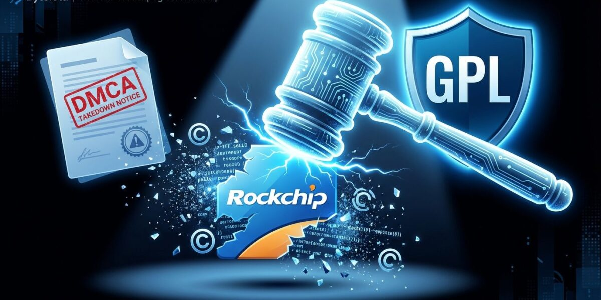
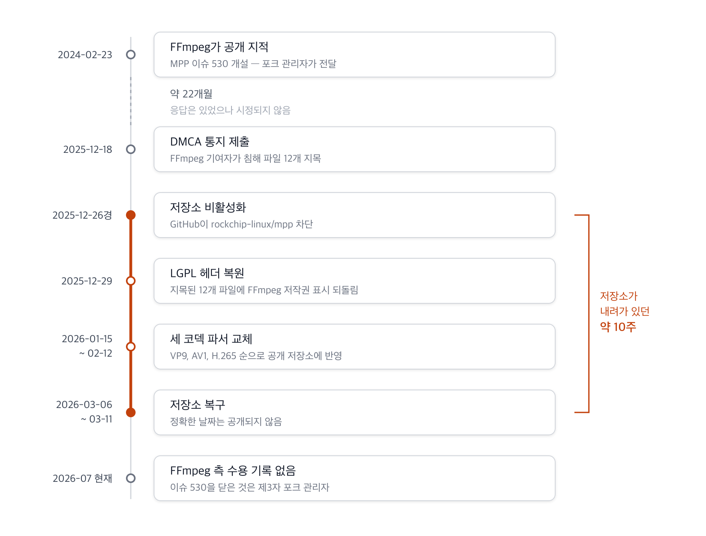
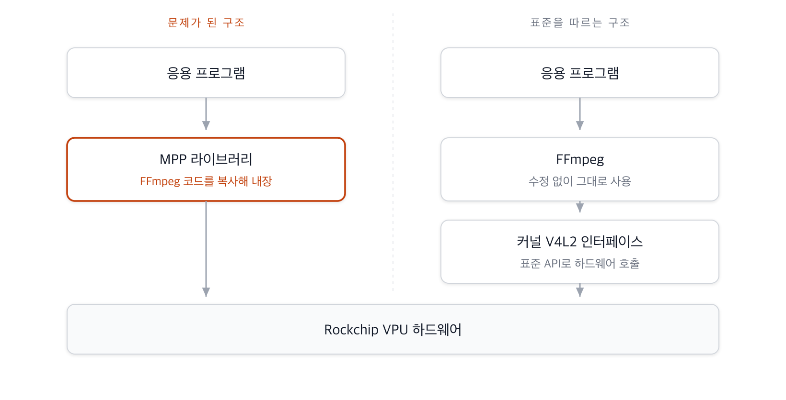

{}
이 글은 Claude Code를 이용해 작성했고, 인용한 핵심 사실은 1차 출처로 교차 검증했습니다.
{}

{}
이 글은 작성자 개인의 분석과 정리이며, 법률 자문이 아닙니다. 인용한 사실은 공개 출처에 근거해 확인했으나, 침해 성립 여부와 같은 법적 판단은 다투어질 수 있는 사안이므로 구체적 사안의 판단은 변호사 등 전문가의 검토를 받으시기 바랍니다.
{}

안녕하세요.

임베디드 리눅스 업계에서 화제가 된 Rockchip과 FFmpeg의 라이선스 분쟁을 정리해 보았습니다. 
2025년 12월 저장소가 내려간 시점에 처음 썼던 글인데, 그 뒤 Rockchip이 대응에 나서면서 
저장소가 복구되었습니다. 경과를 반영해 전면 개정하고, 저장소가 다시 열린 덕분에 확인할 수 
있게 된 실제 코드로 근거를 바꿨습니다.

이 사례는 한 기업의 실수에 그치지 않습니다. 하드웨어 벤더가 제공하는 SDK나 BSP를 그대로 
가져다 쓸 때 어떤 공급망 위험이 따라오는지, 그리고 라이선스를 잘못 이해하면 간단한 시정이 
어떻게 2년짜리 과제로 부풀어 오르는지를 함께 보여줍니다.



## 1. 사건 개요

2025년 12월, Rockchip의 GitHub 저장소 `rockchip-linux/mpp`(Media Process Platform)가 
비활성화되었습니다. FFmpeg 기여자가 제출한 DMCA(Digital Millennium Copyright Act) 
테이크다운 통지에 따른 조치였습니다.

Rockchip은 자사 칩셋(RK3588 등)의 하드웨어 영상 가속을 위해 `mpp`라는 미들웨어 라이브러리를 
제공해 왔습니다. 문제는 이 라이브러리의 스트림 헤더 파서 코드가 FFmpeg의 `libavcodec`에서 
왔다는 것입니다. 단순히 가져다 쓴 것이 문제가 아니라, 세 가지 행위가 겹치면서 컴플라이언스 
위반이 되었습니다. 원본의 저작권 고지를 삭제했고, Rockchip이 저작자인 것처럼 헤더를 바꿨으며, 
LGPL 2.1이던 코드를 Apache-2.0으로 재배포했습니다.

통지서는 이 세 가지를 그대로 적시하면서, 침해 근거로 "코드 구조와 동일한 주석에서 분명히 
드러나며, 원래 이름 그대로 주석 처리된 FFmpeg 내부 함수 호출까지 있다"고 밝혔습니다.

### 경과



**그림 1.** 분쟁 경과 *(출처: DMCA 통지서, MPP 커밋 이력, 이슈 530·73, Internet Archive. 2026-07-23 확인)*

저장소가 다시 열린 정확한 날짜는 공개되지 않았습니다. Internet Archive 스냅샷이 
2026년 3월 6일까지 HTTP 451(법적 사유로 이용 불가)을 반환하다가, 3월 11일부터 새 포크가 
생기기 시작한 것으로 미루어 그 사이로 봅니다. 비활성 기간은 약 10주입니다.

DMCA에 대해 한 가지 짚어둘 것이 있습니다. 통지가 들어오면 정해진 시간 안에 차단해야 한다는 
설명이 흔히 돌아다니지만, 미국 저작권법 17 U.S.C. §512(c)(1)(C)에는 "신속히"(expeditiously)라는 
표현만 있고 구체적 시한은 없습니다. GitHub은 운영 정책으로 파일을 특정한 통지의 경우 저장소 
소유자에게 약 1영업일의 자체 수정 기회를 준 뒤 차단합니다.

## 2. 무엇이 복사되었나

통지서는 침해 파일 12개를 지목했습니다. AV1 관련 4개, H.265 관련 3개, VP9 관련 5개입니다. 
저장소가 복구되면서 침해 지목 시점의 커밋을 직접 받아 FFmpeg 원본과 맞춰볼 수 있게 되었습니다. 
아래는 그 대조 결과입니다.

### 저작권 헤더 교체

FFmpeg `libavcodec/vpx_rac.h`의 헤더입니다.

```c
/*
 * Copyright (C) 2006  Aurelien Jacobs <aurel@gnuage.org>
 *
 * This file is part of FFmpeg.
 *
 * FFmpeg is free software; you can redistribute it and/or
 * modify it under the terms of the GNU Lesser General Public
 * License as published by the Free Software Foundation; either
 * version 2.1 of the License, or (at your option) any later version.
...
*/
```

MPP `mpp/codec/dec/vp9/vpx_rac.h`의 같은 자리입니다.

```c
/*
*
* Copyright 2015 Rockchip Electronics Co. LTD
*
* Licensed under the Apache License, Version 2.0 (the "License");
* you may not use this file except in compliance with the License.
...
*/
```

원저작자 Aurelien Jacobs의 이름, LGPL 조항, FFmpeg 언급이 모두 사라지고 Rockchip 명의의 
Apache-2.0 헤더로 바뀌었습니다. `vpx_rac.c`의 원저작자 Fiona Glaser, `vp9data.h`의 원저작자 
Ronald S. Bultje와 Clément Bœsch도 마찬가지로 자취를 감췄습니다.

### 함수 본문의 일치

VP9 범위 부호기(Range Coder)의 핵심 함수를 비교해 보겠습니다.

FFmpeg `libavcodec/vpx_rac.h`:

```c
static av_always_inline int vpx_rac_get_prob(VPXRangeCoder *c, uint8_t prob)
{
    unsigned int code_word = vpx_rac_renorm(c);
    unsigned int low = 1 + (((c->high - 1) * prob) >> 8);
    unsigned int low_shift = low << 16;
    int bit = code_word >= low_shift;

    c->high = bit ? c->high - low : low;
    c->code_word = bit ? code_word - low_shift : code_word;

    return bit;
}
```

MPP `mpp/codec/dec/vp9/vpx_rac.c`(침해 지목 당시 커밋 `14667441`):

```c
rk_s32 vpx_rac_get_prob(VpxRangeCoder *c, uint8_t prob)
{
    unsigned int code_word = vpx_rac_renorm(c);
    unsigned int low = 1 + (((c->high - 1) * prob) >> 8);
    unsigned int low_shift = low << 16;
    int bit = code_word >= low_shift;

    c->high = bit ? c->high - low : low;
    c->code_word = bit ? code_word - low_shift : code_word;

    return bit;
}
```

인라인 지정자를 떼고 반환 타입을 `int`에서 `rk_s32`로 바꾼 것이 전부입니다. 본문은 공백까지 
같고, 매개변수의 `uint8_t`와 본문의 `unsigned int`는 FFmpeg 표기 그대로 남았습니다.

### 코드에 남은 흔적

기능과 무관한 주석이야말로 출처를 드러냅니다. MPP 파일에는 다음 주석들이 그대로 있었습니다.

```c
// branchy variant, to be used where there's a branch based on the bit decoded
// rounding is different than vpx_rac_get, is vpx_rac_get wrong?
```

앞의 것은 FFmpeg `vpx_rac.h`와 완전히 일치합니다. 뒤의 것은 FFmpeg 개발자가 스스로에게 던진 
질문인데, 원문은 `vp56_rac_get`을 가리키고 MPP는 함수 이름만 자기 표기로 바꿔 옮겼습니다. 
이런 자문형 주석이 독립적으로 작성한 코드에 우연히 같은 문장으로 등장할 수는 없습니다.

파일 상단에는 MPP가 지원하지도 않는 코덱을 가리키는 설명이 남아 있었습니다.

```c
/**
 * vp56 specific range coder implementation
 */
```

FFmpeg에서는 이 파일이 VP5부터 VP9까지 공용으로 쓰이기 때문에 붙은 설명인데, VP5나 VP6를 
다루지 않는 MPP로 그대로 따라온 것입니다. 정렬 매크로를 아무 일도 하지 않도록 재정의해 둔 
자리도 있습니다.

```c
#define DECLARE_ALIGNED(n,t,v)      t v
```

이 매크로 이름은 FFmpeg에도 libvpx에도 있어 그 자체로는 출처가 되지 못합니다. 다만 쓰는 
자리가 FFmpeg를 그대로 따라갑니다. FFmpeg `vp56.h`의 움직임 벡터 구조체가 첫 필드를 
`DECLARE_ALIGNED(4, int16_t, x);`로 선언하는데, MPP의 대응 구조체가 이 줄을 그대로 갖고 
있습니다. libvpx의 같은 구조체에는 이 매크로가 쓰이지 않습니다.

이 정도 일치는 저작권법의 실질적 유사성(substantial similarity) 판단을 통과하기 어렵습니다. 
타입명이나 매크로를 바꾸는 것만으로는 독립 저작물이 되지 않습니다. 사내 코드베이스에 외부 
오픈소스를 흡수할 때 이런 방식을 쓰는 경우가 있는데, 이번 사례가 그 위험을 그대로 보여줍니다.

### 확률 테이블은 조금 다른 문제입니다

한편 코덱의 확률 테이블은 성급하게 판단하면 안 되는 영역입니다. 이 수치들은 VP9 비트스트림 
사양에 정의된 상수이고, 값 옆에 붙은 `/* a/l both not split */` 같은 주석도 FFmpeg가 만든 
표현이 아닙니다. VP9 참조 구현인 libvpx(Google, BSD 계열)에 같은 문구가 이미 들어 있습니다. 
FFmpeg 역시 libvpx에서 받아온 것으로 보아야 합니다.

그래서 주석이 같다는 사실만으로는 어디서 가져왔는지 말할 수 없습니다. 세 코드를 나란히 놓으면 
갈라지는 지점은 문구가 아니라 서식입니다.

libvpx:

```c
      { 222, 34, 30 },  // a/l both not split
```

FFmpeg:

```c
            { 222,  34,  30 } /* a/l both not split */,
```

libvpx는 쉼표를 찍고 `//` 주석을 붙이지만, FFmpeg는 `/* */` 주석을 쉼표 앞에 넣고 숫자를 
두 칸으로 정렬합니다. MPP 쪽은 FFmpeg 형태와 바이트 단위로 같습니다. 값과 문구는 libvpx까지 
거슬러 올라가되, 실제로 복사한 대상은 FFmpeg 판본이었다고 보는 편이 서식에 맞습니다.

이런 구별이 필요한 이유는 분명합니다. 같은 알고리즘을 구현하면 코드가 비슷해지는 것이 
자연스러운 영역에서는 유사성 자체가 침해의 근거가 되지 못합니다. 어느 판본의 어떤 흔적을 
따랐는지까지 짚어야 합니다.

## 3. 왜 22개월이 걸렸나

이 사건에서 가장 배울 점이 많은 대목입니다. 문제가 처음 공개된 것은 2024년 2월 23일입니다. 
FFmpeg 공식 계정이 X에 지적을 올렸고, 같은 날 `ffmpeg-rockchip` 포크를 관리하는 개발자가 
MPP 저장소에 이슈 530을 열어 전달했습니다. DMCA까지는 그로부터 22개월이 걸렸습니다.

흔히 알려진 것과 달리 Rockchip이 침묵한 것은 아닙니다. 담당자는 2024년 2월 공개 사과를 했고, 
그 뒤로도 "지연되고 있다", "진행 중이다", "리팩터링은 보류 상태다"라고 계속 답했습니다. 
응답은 했으나 시정하지 않은 사안입니다.

지연의 이유는 Rockchip이 나중에 밝혔습니다.

```
But after studying the license details, we realised that simply restoring
the LGPL headers would convert the entire MPP library to LGPL-licensed code.
While this is acceptable for dynamically linked libraries, it would mandate
that any project statically linking MPP also adopt the LGPL license.
To avoid this mixed-license scenario, we decided to develop a brand-new parser.
```

LGPL 헤더를 되돌리면 MPP 전체가 LGPL이 되고, MPP를 정적 링크하는 고객 프로젝트까지 LGPL을 
따라야 한다고 판단한 것입니다. 그 상황을 피하려고 파서를 새로 만들기로 했는데, 작업량을 
과소평가했고 일상 업무에 밀려 진척이 멈췄습니다.

이 판단은 절반만 맞습니다. 앞부분은 근거가 있습니다. MPP에 FFmpeg 코드를 통합했다면 MPP는 
LGPL 2.1이 말하는 "라이브러리에 기반한 저작물"이 되고, Section 2(c)가 저작물 전체를 이 
라이선스 조건으로 제공하도록 요구합니다.

뒷부분은 다릅니다. Section 6은 정적 링크를 포함한 결합 저작물에 예외를 둡니다.

```
6. As an exception to the Sections above, you may also combine or
link a "work that uses the Library" with the Library to produce a
work containing portions of the Library, and distribute that work
under terms of your choice, ...
```

결합 저작물은 원하는 조건으로 배포할 수 있습니다. 고객이 자기 용도로 수정할 수 있게 하고, 
디버깅을 위한 리버스 엔지니어링을 허용하며, 재링크가 가능한 형태를 제공하거나 공유 라이브러리 
방식을 쓰는 것이 조건입니다. MPP를 정적 링크하는 고객사가 자기 제품을 LGPL로 공개해야 하는 
것이 아닙니다.

라이선스 조항을 잘못 읽은 탓에 헤더 복원이면 끝날 일이 파서 전면 재작성이라는 과제로 
부풀었고, 그 과제가 무거워서 2년 가까이 방치되었습니다. 그사이에도 위반 상태의 배포는 
계속되었습니다. 컴플라이언스 판단이 틀리면 비용이 이런 식으로 불어납니다.

## 4. Rockchip의 대응과 남은 문제

DMCA 이후 Rockchip은 빠르게 움직였습니다. 통지 열흘 남짓 만에 지목된 12개 파일의 LGPL 헤더를 
복원했고, 이어서 VP9, AV1, H.265 파서를 차례로 교체했습니다. 2026년 2월 중순에는 "FFmpeg 
LGPL 코드를 전부 제거했다"고 밝히며 검토를 요청했습니다.

실제로 상당 부분이 이행되었습니다. 지목된 12개 중 8개가 저장소에서 사라졌고, 범위 부호기는 
함수 이름과 구조가 모두 다른 구현으로 바뀌었습니다. 저장소 전체 소스 778개 파일을 훑어 
`ff_vp9_`, `av_always_inline`, `AVCodecContext`, `libavcodec` 같은 FFmpeg 고유 식별자를 
찾아봤지만 하나도 나오지 않았습니다. LGPL을 언급하는 소스 파일도 없습니다. 변경 이력 문서에 
복원 커밋의 제목이 남아 있는 것이 전부입니다.

다만 몇 가지가 남습니다.

지목된 `vp9data.h`는 삭제된 것이 아니라 `vp9d_codec.c`로 이름이 바뀌었습니다. 커밋 기록에서 
이 파일의 상태는 삭제가 아니라 이름 변경으로 표시됩니다. 그 과정에서 헤더가 다시 바뀌었습니다. 
LGPL 복원 커밋이 넣었던 FFmpeg 저작권 표시와 LGPL 조항이 제거되고 Rockchip 단독 저작권에 
Apache-2.0 표기로 돌아갔습니다. 두 커밋의 작성 시각은 같은 날 세 시간 차이입니다. 내용은 
1,299줄 가운데 1,045줄이 그대로이고, 확률 테이블과 주석도 앞서 본 FFmpeg 서식 그대로 
남아 있습니다.

통지서에 나열되지 않은 파일은 손대지 않았습니다. 하드웨어 추상화 계층의 `hal_vp9d_com.c`에는 
앞서 본 VP9 확률 테이블이 FFmpeg 서식 그대로 남아 있습니다. 통지서가 파일 목록 앞에 
"(and possibly others)"라는 단서를 달아 둔 부분이 실제로 들어맞은 셈입니다.

이 부분이 침해에 해당하는지는 단정하기 어렵습니다. 값과 주석 문구는 libvpx와 사양 문서까지 
거슬러 올라가므로 저작권 보호 범위 자체가 다툼의 대상입니다.

무엇보다 FFmpeg 측이 이 상태를 검토했거나 수용했다는 공개 기록이 없습니다. 이슈 530은 
2026년 4월 1일에 닫혔지만, 닫은 사람은 FFmpeg 프로젝트가 아니라 이슈를 열었던 제3자 포크 
관리자입니다. 권리자의 면책과는 다릅니다. 이미 배포된 과거 버전에 대한 처리 방침도 어느 
쪽에서도 나오지 않았습니다.

## 5. 라이선스 세탁이 위험한 이유

"Apache-2.0으로 공개된 코드는 안전하다"고 생각하기 쉽습니다. 이번 사례는 저작권 출처가 
불투명한 Apache-2.0 코드가 오히려 더 큰 위험이 될 수 있음을 보여줍니다. 표기된 라이선스가 
아니라 실제 코드의 출처가 의무를 결정하기 때문입니다.

위반 행위별로 어떤 조항에 걸리는지 정리하면 이렇습니다.

| 행위 | LGPL 2.1 관련 조항 |
|:---|:---|
| 저작권 고지 삭제 | Section 1 — 라이선스와 보증 부인 관련 고지를 원상 유지 |
| 수정 사실 미고지 | Section 2(b) — 변경한 파일에 변경 사실과 날짜 표시 |
| 저작물 전체의 라이선스 미적용 | Section 2(c) — 저작물 전체를 이 라이선스 조건으로 제공 |
| Apache-2.0으로 재라이선싱 | Section 3(GPL로의 전환만 허용) 및 Section 8(그 밖의 처분은 무효, 권리 자동 소멸) |

저작자 표시를 허위로 바꾼 행위는 나라에 따라 다르게 다뤄집니다. 한국과 프랑스에서는 
저작인격권 중 성명표시권 침해가 성립합니다. 미국 저작권법에는 일반적 저작인격권이 없고, 
시각예술저작물권리법(VARA)이 시각예술에 한정해 적용될 뿐입니다.

### 올바른 구조는 어떤 모습인가

리눅스 커널은 하드웨어 가속을 위해 V4L2(Video for Linux 2)라는 표준 인터페이스를 제공합니다. 
FFmpeg는 사용자 공간에 수정 없이 두고, 하드웨어 의존 코드는 커널 드라이버로 분리하는 구조입니다.



**그림 2.** 하드웨어 가속 연동 구조 비교

FFmpeg와 커널 드라이버가 사용자 공간과 커널 공간으로 명확히 나뉘므로, 벤더가 FFmpeg 코드 
자체를 뜯어고쳐 배포할 이유가 사라집니다.

이 방향의 진전은 Rockchip이 아니라 Collabora가 이끌었습니다. RK3588의 VDPU381과 RK3576의 
VDPU383 디코더 지원이 2026년 2월 메인라인에 병합되어 리눅스 7.0(2026년 4월)에 들어갔습니다. 
현재 범위는 H.264와 H.265이며, AV1과 VP9, 멀티코어 디코딩은 후속 과제로 남아 있습니다.

한 가지 주의할 점이 있습니다. Rockchip 하드웨어를 쓰는 개발자들이 흔히 대안으로 거론하는 
`nyanmisaka/ffmpeg-rockchip` 포크는 MPP를 대체하지 않습니다. 이 프로젝트는 MPP와 librga를 
호출해 하드웨어 가속을 구현하는 FFmpeg 포크이므로, MPP의 출처 문제를 피해 가지 못합니다. 
MPP 의존을 벗어나려면 메인라인 V4L2 경로를 써야 합니다.

## 6. 10년 전 Allwinner 사례

임베디드 칩 벤더가 멀티미디어 코덱 라이선스에서 같은 실수를 반복해 온 역사가 있습니다. 
가장 가까운 선례는 2015년 Allwinner의 CedarX입니다.

| 비교 항목 | Allwinner CedarX (2015) | Rockchip MPP (2025~2026) |
|:---|:---|:---|
| 배포 형태 | 바이너리 블롭 중심 | 소스 공개 |
| 위반 내용 | 사용자 공간 CedarX 라이브러리에 FFmpeg `libavcodec` 유래 코드를 포함하고 소스를 공개하지 않음 | FFmpeg 코드를 복사한 뒤 저작권 고지 제거, Rockchip 명의로 변경, Apache-2.0으로 재라이선싱 |
| 대응 | 리버스 엔지니어링으로 Cedrus 드라이버 개발, 이후 메인라인 편입 | DMCA 테이크다운, 저장소 비활성화, 파서 재작성, V4L2 드라이버는 별도 트랙에서 진행 |
| 교훈 | 바이너리 배포는 위반을 감추기 쉽지만 결국 심볼 분석으로 드러남 | 소스를 공개해도 출처를 지우고 재라이선싱하면 위반이며, 오히려 증거가 명확히 남음 |

Allwinner는 2015년 3월 "LGPL 공개"를 내놓았지만 실제로는 폐쇄 바이너리를 감싼 API 계층에 
그쳤습니다. 실질적인 결말은 커뮤니티가 리버스 엔지니어링으로 만든 Cedrus 드라이버가 메인라인에 
편입된 것이었습니다. 이번 Rockchip 사례에서 V4L2 드라이버 작업이 Collabora 주도로 진행된 것과 
구조가 비슷합니다.

라이선스 위반이 실제 금전적 책임으로 이어진 사례도 있습니다. 파리 항소법원은 2024년 2월 14일 
Entr'ouvert가 Orange를 상대로 낸 소송에서 배상 80만 유로를 명했습니다. 재산적 손해 50만 유로, 
저작인격권 침해 15만 유로, 부당이득 반환 15만 유로이고, 여기에 소송비용 6만 유로가 별도로 
더해졌습니다. 2011년 제소 이후 1심과 항소심, 대법원 파기환송을 거쳐 13년 만에 나온 결론이었습니다. 
이 판결이 중요한 이유는 오픈소스 라이선스 위반을 계약 위반이 아니라 저작권 침해로 판단했다는 
점입니다.

독일에서는 함부르크 지방법원이 2013년 Fantec 사건에서 "공급자가 라이선스를 준수한다고 확약했다는 
이유만으로는 면책되지 않으며, 배포자가 스스로 확인해야 한다"고 판시했습니다. SoC 벤더에게서 
BSP를 받아 제품에 넣는 기업이라면 그대로 적용되는 이야기입니다.

## 7. 기업이 점검할 것

벤더가 제공한 SDK나 BSP에 같은 문제가 숨어 있을 수 있습니다. 세 가지를 확인하시기 바랍니다.

첫째, 공급망 라이선스 감사입니다. 벤더가 준 라이브러리가, 특히 멀티미디어나 그래픽, AI 가속 
관련 코드가 원저작자의 라이선스를 유지하고 있는지 확인해야 합니다. 벤더가 Apache-2.0이나 MIT를 
주장하더라도 내부 코드가 GPL이나 LGPL 프로젝트에서 왔다면 제품 전체가 위험에 노출됩니다. 
Black Duck이나 FOSSID 같은 소스 코드 분석 도구로 벤더 제공 코드를 스캔하면 내부에 남은 원본 
라이선스 고지나 저작권 표시를 찾아낼 수 있습니다. 이번 사례에서 보듯 결정적 단서는 기능과 
무관한 주석에 남는 경우가 많습니다.

둘째, 벤더 드라이버가 메인라인 커널에 올라가 있는지 확인하십시오. 메인라인에 병합된 코드는 
여러 개발자의 리뷰와 라이선스 검토를 거친 것이라 벤더가 자체 운영하는 저장소보다 신뢰도가 
높습니다. 다만 메인라인화 여부와 기능 완성도는 별개이므로 지원 범위를 함께 확인해야 합니다.

셋째, 사내 개발 규칙입니다. 외부 오픈소스를 가져올 때 파일 상단의 저작권 헤더를 지우거나 
회사 명의로 바꿔 커밋하는 행위는 허용해서는 안 됩니다. 고의적 침해로 볼 여지가 있고 이후 
분쟁에서 불리한 증거가 됩니다. 통합이 필요하다면 링크 방식을 우선하고, 원저작자의 라이선스와 
저작권 표시는 반드시 유지하는 것을 표준으로 삼으십시오.

## 요약

Rockchip 사례는 소스를 공개하는 것과 오픈소스 라이선스를 준수하는 것이 서로 다른 문제임을 
보여줍니다. LGPL 코드는 저작권자 동의 없이 Apache-2.0 같은 다른 라이선스로 바꿀 수 없고, 
저작권 고지 삭제와 저작자 표시 변경은 그 자체로 침해입니다.

더 실무적인 교훈은 지연의 경위 쪽에 있습니다. 라이선스 조항을 잘못 읽은 탓에 헤더 복원으로 
끝날 일이 파서 전면 재작성이라는 과제가 되었고, 그 무게 때문에 2년 가까이 방치되었습니다. 
라이선스 판단은 법무나 컴플라이언스 조직과 함께 내려야 하고, 시정 비용이 커 보일수록 그 
판단이 맞는지 다시 확인해야 합니다.

벤더가 준 소프트웨어를 그대로 신뢰하기보다는, 소스 코드 분석 도구로 어떤 라이선스와 저작권 
고지가 들어 있는지 주기적으로 확인하고, 그 결과를 근거로 벤더와 책임 범위를 정리하는 절차를 
갖추는 것이 필요합니다.

## 참고 자료

- [FFmpeg DMCA Notice on GitHub (2025-12-18)](https://github.com/github/dmca/blob/master/2025/12/2025-12-18-ffmpeg.md)
- [rockchip-linux/mpp Issue #530 — LGPL license violation reported by upstream FFmpeg](https://github.com/rockchip-linux/mpp/issues/530)
- [HermanChen/mpp Issue #73 — Rockchip 측 공식 해명](https://github.com/HermanChen/mpp/issues/73)
- [rockchip-linux/mpp 저장소](https://github.com/rockchip-linux/mpp)
- [GNU LGPL 2.1 원문](https://www.gnu.org/licenses/old-licenses/lgpl-2.1.txt)
- [17 U.S.C. §512 (Cornell LII)](https://www.law.cornell.edu/uscode/text/17/512)
- [Hackaday: GitHub Disables Rockchip's Linux MPP Repository After DMCA Request](https://hackaday.com/2026/01/05/github-disables-rockchips-linux-mpp-repository-after-dmca-request/)
- [Tom's Hardware: Rockchip Repository Disabled](https://www.tomshardware.com/software/chinese-semiconductor-outfit-has-linux-mpp-repository-on-github-disabled-after-a-dmca-takedown-request-ffmpeg-team-accuses-it-of-using-libavcodec-code-without-attribution)
- [Collabora: RK3588 and RK3576 video decoders support merged in the upstream Linux Kernel](https://www.collabora.com/news-and-blog/news-and-events/rk3588-and-rk3576-video-decoders-support-merged-in-the-upstream-linux-kernel.html)
- [libvpx (VP9 참조 구현)](https://github.com/webmproject/libvpx)
- [CNX Software: Allwinner's CedarX May Infringe on Open Source Licenses (2015-02-26)](https://www.cnx-software.com/2015/02/26/allwinners-new-media-codec-library-cedarx-may-infringe-on-open-source-licenses-and-copyrtights/)
- [CNX Software: Allwinner CedarX GPL/LGPL Compliance Update (2015-03-23)](https://www.cnx-software.com/2015/03/23/allwinner-cedarx-media-codec-library-gpl-lgpl-compliance-update/)
- [nyanmisaka/ffmpeg-rockchip](https://github.com/nyanmisaka/ffmpeg-rockchip)

*2026년 7월 23일 후속 경과를 반영해 개정했습니다.*
