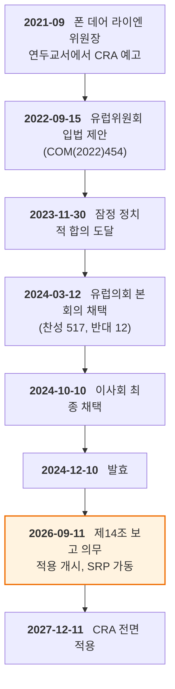
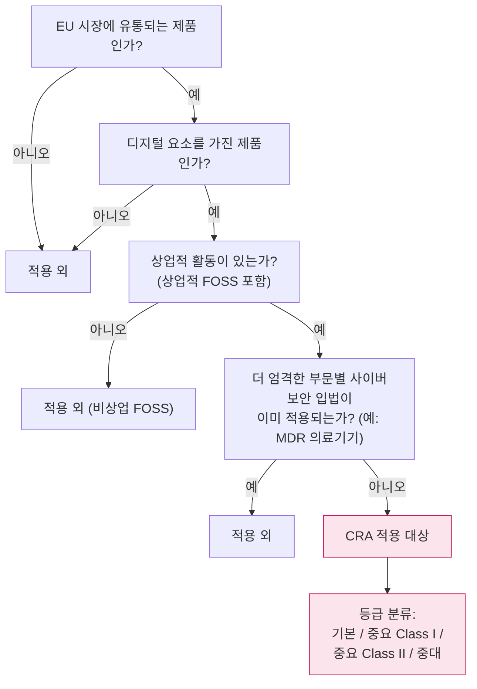
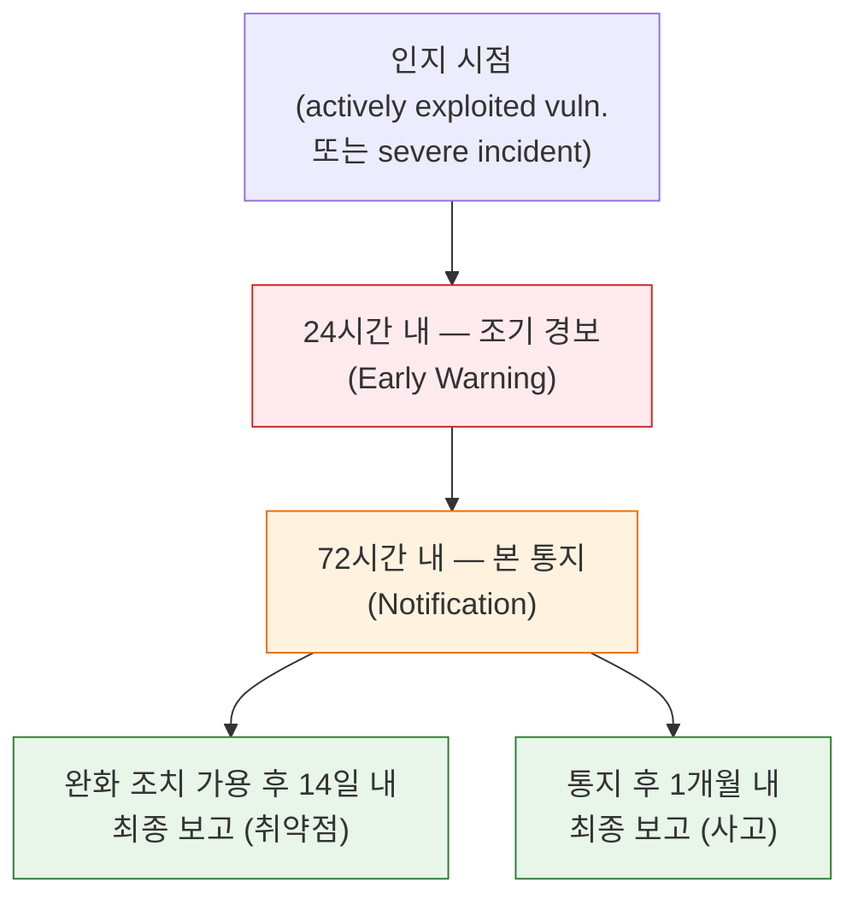
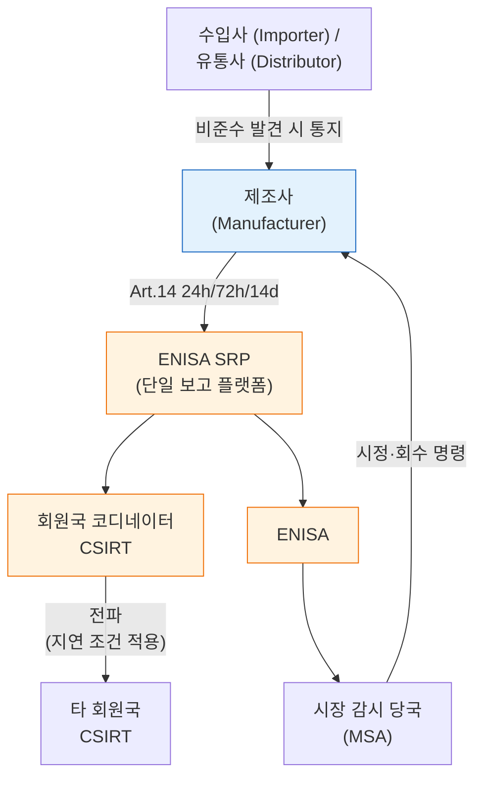

{}
이 글은 Claude Code를 이용해 작성했고, 인용한 핵심 사실은 1차 출처로 교차 검증했습니다.
{}

> **요약**
>
> EU 사이버 복원력법(Cyber Resilience Act, CRA — Regulation (EU) 2024/2847)은 EU 시장에 출시되는 모든 "디지털 요소를 가진 제품(product with digital elements, PDE)"에 수평적 사이버보안 의무를 부과하는, EU 역사상 첫 포괄적 제품 보안 규정입니다. 2024년 12월 10일 발효된 이 규정은 단계적으로 적용되며, 2026년 9월 11일부터는 제14조 보고 의무가 발효되어 제조사와 수입사, 유통사가 실제 악용 중인 취약점과 중대한 보안 사고를 24시간, 72시간, 14일의 단계별 시한 안에 ENISA(유럽 사이버보안청)와 회원국 CSIRT에 통지해야 합니다. 이 날짜까지 보고 워크플로우가 가동되지 않으면 최대 1,500만 유로 또는 전 세계 연간 매출 2.5%의 과징금 위험이 생기고, 한국 기업이라도 EU 시장에 제품을 출시하면 즉시 적용 대상이 됩니다. [A1](#a1), [B1](#b1), [E1](#e1)

---

## 1. 왜 2026-09-11이 한국 기업에 중요한가

오는 2026년 9월 11일은 CRA 제14조 보고 의무의 첫 적용일입니다. 이날 ENISA의 단일 보고 플랫폼(Single Reporting Platform, SRP)도 함께 가동됩니다. [A1](#a1), [B4](#b4) CE 마킹과 적합성 평가 등 CRA의 나머지 본질 의무는 2027년 12월 11일이 시한이지만, 보고 워크플로우만큼은 그보다 15개월 앞서 갖춰야 합니다.

한국 기업에 이 날짜가 갖는 무게는 CRA의 법적 성격에서 나옵니다. CRA는 회원국이 국내법으로 옮겨야 하는 지침(Directive)이 아니라 직접 효력을 갖는 규정(Regulation)이어서, 별도의 국내 이행 입법 없이 EU 시장 진입 즉시 적용됩니다. [A1](#a1) 한국에 본사를 두고 EU 법인 없이 직수출하더라도 적용 대상에서 벗어나지 못합니다. 레거시 제품, 곧 이미 EU 시장에 출시된 제품도 포함된다는 점 역시 주의가 필요합니다. [E1](#e1)

2026년 6월 현재 보고 의무 시행까지 약 3개월이 남았습니다. ENISA는 시험 기간(testing period)을 두겠다고 밝혔을 뿐 공식 일정은 아직 내놓지 않았고, 운영 매뉴얼은 2026년 6월 중에 제공하겠다고 예고했습니다. 현 단계에서 SRP 연동 API를 제공하지 않는다는 점도 ENISA가 명시했습니다. [B4](#b4) 자동 연계를 전제했던 기업은 사람이 플랫폼에 직접 제출하는 절차로 보고 체계를 다시 설계해야 합니다.

---

## 2. CRA의 구조

### 2.1 입법 배경과 발효 일정

CRA의 공식 명칭은 *Regulation (EU) 2024/2847 on horizontal cybersecurity requirements for products with digital elements*입니다. 2021년 9월 우어줄라 폰 데어 라이엔(Ursula von der Leyen) 위원장의 연두교서에서 처음 예고된 뒤, 2022년 9월 15일 유럽위원회(European Commission)가 입법안을 제안했습니다. 유럽의회는 2024년 3월 12일 본회의에서 찬성 517표, 반대 12표로 채택했고, 이사회(Council)가 같은 해 10월 10일 최종 채택해 10월 23일 서명을 거쳐 11월 20일 EU 관보에 게재했습니다. 발효일은 2024년 12월 10일입니다. [A1](#a1), [B1](#b1)

**그림 1.** CRA 입법·시행 타임라인 *(출처: Regulation (EU) 2024/2847, EC 입법 트레인)* [A1](#a1), [B1](#b1)

입법 과정에서는 오픈소스 커뮤니티의 입장 표명이 눈에 띄었습니다. 2022~2023년 초안 단계에서 이클립스 재단(Eclipse Foundation), 오픈소스 이니셔티브(OSI), 도큐먼트 재단 등은 "상업 활동" 정의가 불명확해 자원봉사 개발자에게도 컴플라이언스 부담이 돌아갈 수 있다고 우려했습니다. 2023년 12월 잠정 합의에서 "오픈소스 스튜어드(open-source steward)" 개념과 예외 조항이 도입되면서 우려가 일부 해소됐지만, 소규모 재배포자에 대한 적용 범위 문제는 여전히 논란으로 남아 있습니다. [D1](#d1)

### 2.2 적용 범위 (Art. 2~3)

CRA는 "디지털 요소를 가진 제품(product with digital elements, PDE)"에 적용됩니다. 장치나 네트워크와 논리적·물리적 데이터 연결이 가능한 하드웨어와 소프트웨어를 포괄하며, 독립적으로 시장에 출시된 소프트웨어 구성요소도 포함합니다. [B3](#b3)

적용 범위에서 빠지는 제품도 있습니다. 상업적 활동 없이 공급되는 자유·오픈소스 소프트웨어, 그리고 의료기기나 자동차처럼 더 엄격한 부문별 사이버보안 규제가 이미 적용되는 제품이 대표적입니다. 다만 기존 사이버보안 규제의 적용 대상이어도 CRA가 "보완적"으로 적용될 여지가 있어 부문별 판단이 필요합니다. [A1](#a1), [E2](#e2)

**그림 2.** CRA 적용 여부 판단 흐름 *(출처: CRA Art. 2~3, 시행규칙 (EU) 2025/2392)* [A1](#a1), [A3](#a3)

### 2.3 단계적 시행

CRA의 전면 적용은 단일 시점에 이뤄지지 않습니다.

| 시점 | 적용 의무 | 법적 근거 |
|---|---|---|
| 2024-12-10 | 발효 | CRA Art. 71 |
| 2026-06-11 | 적합성 평가기관 통보 관련 조항(제IV장) | CRA Art. 71(2) |
| **2026-09-11** | **제14조 보고 의무 + SRP 가동** | CRA Art. 14, 16 |
| 2027-12-11 | CE 마킹·적합성 평가·본질 요건 전면 적용 | CRA Art. 71(2) |

[A1](#a1), [B3](#b3)

2026년 9월 11일까지 갖춰야 하는 것은 제품 인증이 아니라 취약점·사고 보고 워크플로우입니다. CE 마킹과 적합성 평가의 시한은 그보다 15개월 뒤인 2027년 12월 11일입니다.

---

## 3. 제조사 의무 (Art. 13)

### 3.1 Annex I 본질 요건

제13조는 제조사가 CRA Annex I의 본질적 사이버보안 요건(essential cybersecurity requirements)을 충족하도록 규정합니다. 요건은 크게 두 그룹으로 나뉩니다. [A1](#a1), [B3](#b3)

**Part I — 제품 보안 요건**: 알려진 취약점 없는 상태 출시, 기본 비밀번호 금지, 보안 업데이트 제공, 최소 권한 원칙 적용, 데이터 보호, 공격 표면 축소, 사이버 복원력 설계, 개인 데이터 접근·수정 이력 제공.

**Part II — 취약점 처리 요건**: 취약점 식별·문서화, SBOM 유지, 신속한 패치 제공과 무료 배포, 조정된 취약점 공개(Coordinated Vulnerability Disclosure, CVD) 정책, 악용 취약점·사고 보고(Art. 14), 생애 주기 전반에 걸친 취약점 모니터링.

이 요건들에는 현재 확정된 조화 표준이 없어, CRA 원문의 기능적 요건을 기준으로 직접 이행해야 합니다. ENISA와 JRC가 공동 발간한 *CRA Requirements Standards Mapping*(2024)이 기존 표준과의 매핑을 제공하며, ISO/IEC 30111(취약점 처리)과 29147(취약점 공시), NIST SP 800-218(SSDF)이 주요 참조점입니다. [B5](#b5), [C1](#c1), [C2](#c2), [C6](#c6)

### 3.2 지원 기간

제조사는 시장 출시 후 예상 사용 기간 동안, 최소 5년 이상 보안 지원을 제공해야 합니다. 예상 사용 기간이 5년 미만인 제품은 그 기간을 지원 기간으로 삼을 수 있습니다. 지원 기간은 제품에 명시적으로 표시해야 하며, 이 기간 동안 취약점 처리와 보안 업데이트 제공이 의무입니다. [A1](#a1), [B3](#b3)

### 3.3 SBOM 요건

CRA Annex I Part II는 소프트웨어 부품 명세서(Software Bill of Materials, SBOM)를 의무화합니다. 출고 버전마다 SBOM을 생성하고, 시장 감시 당국(Market Surveillance Authority)의 요청에 대비해 기계 판독 가능한 형식으로 보관해야 합니다. SBOM을 제3자에게 공개할 의무는 없지만, 시장 감시 당국에는 제출해야 합니다. [A1](#a1)

형식은 SPDX 또는 CycloneDX가 사실상 표준으로 자리잡았습니다. SPDX는 ISO/IEC 5962:2021로 표준화됐고(SPDX v2.2.1 기반, 현행 사양은 v3.0), [C3](#c3), [C4](#c4) CycloneDX는 OWASP가 관리하는 사양으로 2025년 12월 10일 ECMA-424 2nd Edition(v1.7 기반)이 발행됐습니다. [C5](#c5) CRA 차원의 공식 SBOM 스키마 시행규칙은 2026년 6월 현재까지 나오지 않았습니다. 독일 연방정보보안청(Bundesamt für Sicherheit in der Informationstechnik, BSI)이 2025년 8월 발간한 TR-03183-2 v2.1.0이 CRA 정합 SBOM의 필드 매핑을 제공하는 현실적 참조점입니다. [G1](#g1)

---

## 4. 보고 의무 (Art. 14) — 2026-09-11 시행

### 4.1 통지 트리거

제14조는 두 부류의 사건을 제조사의 통지 트리거로 규정합니다. [A1](#a1), [B2](#b2)

하나는 실제 악용되고 있는 취약점(actively exploited vulnerability)입니다. 취약점이 이론적으로 존재하는 데 그치지 않고 공격자가 실제로 악용한다는 사실이 확인된 시점이 트리거입니다. 다른 하나는 중대한 보안 사고(severe incident)입니다. 제품의 보안에 영향을 미치는 심각한 운영 중단이나 손실, 손해를 일으키거나 일으킬 가능성이 있는 사건을 말합니다.

제조사 외에 수입사와 유통사도 비준수를 발견하거나 사고를 인지하면 해당 정보를 제조사에 통지해야 합니다.

### 4.2 3단계 시한 (24h/72h/14d)

**그림 3.** CRA Article 14 보고 시한 *(출처: CRA Art. 14, EC "CRA — Reporting obligations")* [A1](#a1), [B2](#b2)

단계마다 담아야 할 내용이 다릅니다. [A1](#a1), [B2](#b2)

| 단계 | 시한 | 포함 내용 |
|---|---|---|
| 조기 경보 (Early Warning) | 인지 후 24시간 | 영향 받는 회원국, 악의적 활동과의 연관 여부 |
| 본 통지 (Notification) | 72시간 | 취약점·사고의 일반적 성격, 사용 가능한 완화 조치, 민감도 평가 |
| 최종 보고 — 취약점 | 완화 조치 가용 후 14일 | 심각도·영향 범위, 위협 행위자 정보, 보안 업데이트 내용 |
| 최종 보고 — 사고 | 본 통지 후 1개월 | 상세 사고 기술, 위협 유형 및 근본 원인, 적용된 완화 조치 |

24시간 시한이 취약점 분류나 해결 완료까지 요구하지는 않는다는 점을 CRA 원문이 분명히 합니다. 조기 경보로서 존재를 알리는 것이 목적입니다. 마이크로기업과 소기업은 24시간 시한을 지키지 못해도 과징금이 면제될 수 있습니다. [A1](#a1)

### 4.3 단일 보고 플랫폼 (Art. 16)

제14조 통지는 모두 단일 보고 플랫폼(Single Reporting Platform, SRP)을 거칩니다. ENISA가 운영하며, 제조사가 한 번 제출하면 주 사업장 소재 회원국의 코디네이터 CSIRT(Computer Security Incident Response Team)와 ENISA로 자동 라우팅됩니다. [B4](#b4), [A1](#a1)

ENISA는 SRP를 조달하면서 NIS2와 DORA의 사고·취약점 보고 체계와 통합할 수 있는 미래지향 아키텍처를 요구했습니다. CRA 의무에 그치지 않고 인접 규제 체계와 연동 가능한 플랫폼이 설계 목표입니다.

**그림 4.** CRA 보고 체계의 이해관계자 상호작용 *(출처: CRA Art. 13~16, 위임법 (EU) 2026/881)* [A1](#a1), [A2](#a2)

### 4.4 CSIRT 간 전파 지연 조건 (위임법 2026/881)

2025년 12월 11일 채택된 위임법 (EU) 2026/881(관보 게재 2026-04-20)은 회원국 CSIRT가 단일 보고 플랫폼으로 수신한 통지를 다른 CSIRT에 즉시 전파하지 않아도 되는 조건을 명시했습니다. [A2](#a2) 지연이 허용되는 경우는 통지된 정보의 성격을 평가한 결과 지연이 정당화되는 경우, 수신 CSIRT가 해당 정보의 기밀성을 보장할 수 없는 경우, 단일 보고 플랫폼 자체가 침해되었거나 일시적으로 운영이 불가한 경우입니다. 여기에 더해 트래픽 라이트 프로토콜(Traffic Light Protocol, TLP)이나 정보 접근 프로토콜(Permissible Actions Protocol, PAP) 같은 도구로 위험을 완화할 수 없을 때, "엄격히 필요한 기간"에 한해서만 지연할 수 있습니다.

제조사가 CSIRT에 보내는 24시간 시한은 이 위임법의 영향을 받지 않습니다. 위임법이 손댄 곳은 CSIRT 간의 추가 전파 단계이며, 거기에 보안 사유의 완화 장치를 마련한 것입니다.

### 4.5 GDPR·NIS2와의 병행 적용

CRA 보고와 다른 규제의 보고 의무가 동시에 발생할 수 있습니다. 취약점이나 사고로 침해된 데이터에 개인정보가 포함된 경우, CRA 통지가 GDPR(General Data Protection Regulation) 제33조의 72시간 감독기관 통지 의무를 대체하지 않습니다. [A5](#a5) 두 통지는 데이터보호당국과 CSIRT/ENISA라는 서로 다른 채널과 수신처로 각각 이뤄져야 합니다.

NIS2 지침(Directive (EU) 2022/2555)의 적용을 받는 필수 서비스·중요 서비스 운영자가 자사 제품에서 취약점이나 사고를 인지한 경우도 마찬가지입니다. CRA 보고와 NIS2 보고가 동시에 필요할 수 있습니다. Digital Omnibus 패키지의 "report once, share many" 모델이 두 보고 의무를 통합하는 방향으로 논의되고 있으나 아직 입법으로 확정되지 않았습니다. [A4](#a4), [E2](#e2)

---

## 5. 적합성 평가와 CE 마킹 (2027-12-11)

적합성 평가는 2027년 12월 11일이 시한입니다. 등급에 따라 경로가 다릅니다. 기본(default) 등급 제품은 자체 평가(self-assessment)로 EU 적합성 선언(EU Declaration of Conformity)을 발행하고 CE 마킹을 부착할 수 있습니다. 중요 Class I 제품은 EU 조화 표준을 적용한 자체 평가를 하거나 제3자 적합성 평가 기관(Conformity Assessment Body, CAB)의 평가를 받을 수 있습니다. 중요 Class II와 중대(critical) 등급 제품은 CAB의 강화된 검사가 필수입니다. [A1](#a1), [B3](#b3)

ENISA는 2025년 2월 *CRA Implementation via EUCC and its Applicable Technical Elements*를 발간해, EU 공통 기준(EU Common Criteria, EUCC) 인증을 CRA 적합성 평가에 활용할 수 있는 경로를 분석했습니다. [B6](#b6)

2026년 6월 11일부터는 적합성 평가기관의 통보(notification) 관련 조항이 적용됩니다. 각 회원국은 이 시점까지 통보 당국(notifying authority)을 지정해야 하고, 제3자 적합성 평가를 맡을 통보 기관(notified body)이 2026년 12월 11일까지 충분히 갖춰지도록 공인 절차가 시작됩니다. [B3](#b3)

위반 시 제재는 위반 유형에 따라 달라집니다. 가장 엄중한 위반(본질 요건 미충족, 보고 의무 위반)에는 1,500만 유로 또는 전 세계 연간 매출액의 2.5% 중 큰 금액이 과징금으로 부과될 수 있고, EU 시장에서 제품을 회수하라는 명령도 가능합니다. [A1](#a1), [E1](#e1)

---

## 6. 표준·프레임워크 매핑

CRA는 본질 요건만 규정하고 기술적 세부는 조화 표준에 위임합니다. CEN/CENELEC JTC 13 WG 9가 CRA용 유럽 조화 표준(EN)을 만들고 있으며, 2026년 8월 30일 수평 표준, 2026년 10월 30일 수직 표준 발행이 목표입니다. 수평 표준은 어휘(prEN 40000-1-1), 원칙(prEN 40000-1-2), 취약점 처리(prEN 40000-1-3), 일반 보안 요건(prEN 40000-1-4)으로 구성된 prEN 40000-1 시리즈로 진행됩니다. 최종 인용 표준 목록이 아직 확정되지 않았으므로, 현 시점에는 아래 표를 매핑 후보로 활용할 수 있습니다. [B5](#b5)

| 표준·프레임워크 | 주관 | CRA 매핑 |
|---|---|---|
| ISO/IEC 30111:2019 | ISO/IEC | 취약점 처리 절차 — Annex I Part II "취약점 처리" 요건 |
| ISO/IEC 29147:2018 | ISO/IEC | 조정된 취약점 공개(CVD) — Art. 14 통지 워크플로우 |
| SPDX v3.0 (ISO/IEC 5962) | Linux Foundation / ISO | SBOM 표준 형식 |
| CycloneDX v1.7 (ECMA-424) | OWASP / Ecma | SBOM 표준 형식 — VEX(Vulnerability Exploitability eXchange) 네이티브 지원 |
| NIST SP 800-218 (SSDF) | NIST | 설계 보안 실무 — Annex I Part I 요건과 기능적 정렬 |
| prEN 40000-1-3 (초안) | CEN/CENELEC | CRA 조화 수평 표준 — 취약점 처리, 2026-08-30 발행 목표 |
| BSI TR-03183-2 v2.1.0 | BSI (독일) | CRA 정합 SBOM 필드 매핑 기술 가이드라인 |

[C1](#c1), [C2](#c2), [C3](#c3), [C4](#c4), [C5](#c5), [C6](#c6), [G1](#g1), [C7](#c7)

유럽 취약점 데이터베이스(European Vulnerability Database, EUVD)는 NIS2 지침 제12조를 이행하는 형태로 ENISA가 2025년 5월 13일 정식 가동했습니다. [F1](#f1) CRA의 "취약점 모니터링" 요건에서 EUVD를 1차 모니터링 출처로 활용할 수 있습니다. EUVD는 독자적 식별자(`EUVD-YYYY-NNNNNN`)를 쓰면서 CVE ID와 CVSS 점수를 함께 표기합니다. SRP와는 별개 시스템입니다. SRP는 제조사가 당국에 통지하는 채널이고, EUVD는 공개 데이터베이스입니다. [B4](#b4), [F2](#f2)

---

## 7. 최신 동향 (2025~2026)

2024년 12월 발효 이후 규제 환경은 위임법과 시행규칙, 가이던스 세 방향에서 구체화됐습니다.

시행규칙 (EU) 2025/2392는 2025년 11월 28일 채택돼 12월 21일 발효됐습니다. CRA Annex III와 IV가 가리키는 "중요(important)·중대(critical) 제품"을 28개 범주로 구분해 Class I과 Class II, 중대 세 등급에 배치하는 기술 정의를 확정했습니다. 제조사가 자사 제품의 적합성 평가 경로를 판단할 1차 법적 기준이 이 규칙입니다. [A3](#a3)

위임법 (EU) 2026/881은 2025년 12월 11일 채택돼 2026년 4월 20일 관보에 실렸습니다. CSIRT 간 통지 전파를 지연할 수 있는 조건을 법제화한 것입니다(§4.4 참조). [A2](#a2)

가이던스 문서는 두 단계로 나왔습니다. 2025년 12월 3일 Commission의 첫 공식 FAQ가 발행됐고(12월 19일 업데이트), 위험 평가의 범위와 반복성, "의도된 사용(intended purpose)" 개념을 비구속적이지만 처음으로 풀어냈습니다. 이어 2026년 3월 3일에는 CRA 제26조에 따른 첫 가이던스 초안이 공개됐습니다. 총 75쪽 분량 중 약 4분의 1을 오픈소스 스튜어드 정의에 할애한 이 초안은 원격 데이터 처리 솔루션, 자유·오픈소스 소프트웨어, 지원 기간, 그리고 CRA와 NIS2, DORA 등 타 규정과의 상호관계를 다뤘습니다. 3월 31일 의견수렴이 마감됐으나 최종본은 2026년 6월 현재까지 나오지 않았습니다. [E3](#e3)

오픈소스 커뮤니티의 집단 대응은 2024년 4월 2일 아파치(Apache Software Foundation), 블렌더(Blender Foundation), 이클립스(Eclipse Foundation), OpenSSL, PHP(PHP Foundation), 파이썬(Python Software Foundation), 러스트(Rust Foundation) 등 7개 재단이 안전한 소프트웨어 개발을 위한 공통 표준을 함께 마련하겠다고 발표하면서 가시화됐습니다. 이 작업은 브뤼셀의 이클립스 재단(Eclipse Foundation AISBL)이 주관했고, 같은 해 9월 24일 Open Regulatory Compliance Working Group(ORC WG)으로 발전해 스튜어드의 의무 범위를 정리한 백서를 공개했습니다. OpenSSF는 SBOM 표준 정렬 방향을 2025년 10월 22일 공개했습니다. [F3](#f3), [D1](#d1)

가장 끈질긴 쟁점은 24시간 통지의 실효성입니다. HackerOne 등 보안 연구자 측은 "패치가 준비되기 전에 취약점 존재 사실이 당국에 통지되면 미완화 취약점이 노출될 위험이 있다"는 주장을 2024년부터 거듭 제기해 왔습니다. [E4](#e4) 위임법 (EU) 2026/881은 CSIRT 간 전파 지연 조건만 신설했을 뿐, 제조사가 CSIRT에 보내는 24시간 시한 자체에는 손대지 않았습니다.

---

## 8. 한국 기업 관점 — 약 3개월 안에 해야 할 것

### 8.1 적용 여부 진단

2026년 9월 11일이 시한인 보고 의무가 자사에 적용되는지부터 확정해야 합니다. EU 시장에 제품이 유통되는가, 그 제품이 디지털 요소를 가진 제품인가, 더 엄격한 부문별 사이버보안 입법이 이미 적용되는가를 차례로 확인합니다. EU 유통에는 직판과 재판매, OEM 공급이 모두 포함되며, EU 법인이 없어도 한국 본사가 직수출하면 적용됩니다. 네트워크나 장치와 데이터 연결이 가능한 소프트웨어나 하드웨어라면 디지털 요소를 가진 제품에 해당합니다. 의료기기나 자동차 안전처럼 더 엄격한 규제가 이미 적용되는 영역이라면 CRA 적용이 배제될 수 있습니다.

레거시 제품도 적용 대상입니다. 이미 EU 시장에 출시된 제품에도 9월 11일부터 보고 의무가 발생한다는 점은 많은 기업이 간과하기 쉬운 부분입니다. [E1](#e1)

### 8.2 준비 단계

9월 11일까지는 인증서를 갖출 필요가 없습니다. 필요한 것은 보고 워크플로우입니다. 취약점이나 사고를 인지한 순간부터 24시간 안에 조기 경보를 발신할 수 있는 인적 체계와 기술 연결이 있어야 하며, 온콜(on-call) 체계, 의사결정 권한, 외부 커뮤니케이션 담당자를 미리 지정해 두어야 합니다.

모든 출고 버전의 SBOM을 SPDX 또는 CycloneDX 형식으로 자동 생성하고 보관하는 파이프라인도 9월 11일까지 필요합니다. BSI TR-03183-2 v2.1.0의 필드 매핑을 현실적 참조점으로 활용할 수 있습니다. [G1](#g1)

ENISA는 현 단계에서 SRP 연동 API를 제공하지 않는다고 밝힌 상태입니다(2026년 6월 현재). 운영 매뉴얼은 6월 중 제공이 예고됐으므로, 자동 연동을 전제하기보다 사람이 플랫폼에 직접 제출하는 절차를 마련하고 ENISA의 매뉴얼과 시험 기간 공지를 지켜봐야 합니다.

EUVD(`https://euvd.enisa.europa.eu`)를 자사 제품의 구성 요소와 연계해 모니터링하는 절차도 필요합니다. CVE ID와 `EUVD-YYYY-NNNNNN` 두 식별자 체계를 처리할 수 있어야 합니다.

2027년 12월 11일까지는 한 단계 더 나아가야 합니다. CE 마킹과 적합성 평가, 자사 제품 등급에 맞는 CAB 선정(Class I 이상이라면), 조화 표준 발행 후 적합성 선언이 필요합니다. CEN/CENELEC의 수평 표준(2026-08-30 목표)과 수직 표준(2026-10-30 목표) 발행을 주시해야 합니다.

### 8.3 타 관할권 비교

| 항목 | EU CRA | 미국 (EO 14028·CISA KEV) | 영국 PSTI Act | 한국 SW공급망 가이드라인 |
|---|---|---|---|---|
| 적용 대상 | EU 시장의 모든 PDE | 연방 조달 SW (민간은 권고) | 소비자용 연결 제품 | 모든 SW (비강제) |
| 법적 강제력 | EU 규정 — 직접 효력 | 행정명령·구속성 운영 지침(BOD) | 법률 | 행정 가이드라인 |
| 보고 시한 | 24h/72h/14d | KEV별 기한 | 보고 채널 유지 의무만 | 없음 |
| SBOM | 의무 (SPDX/CycloneDX) | 연방 조달 SW 권고 (NTIA) | 없음 | SSDF 기반 권고 |
| 시행 | 2026-09-11 (보고) · 2027-12-11 (전면) | 2021-05 | 2024-04-29 | 2024-05 |

[C6](#c6), [E2](#e2)

CRA의 두드러진 특징은 IoT와 소프트웨어, 임베디드를 가리지 않는 수평적 적용과 직접 효력입니다. 한국 SW공급망 가이드라인 1.0은 NIST SSDF를 기반으로 30개 점검 항목과 SBOM 절차를 권고하는데, CRA 본질 요건과 SSDF가 기능적으로 정렬되므로 국내 가이드라인을 따라 구축한 체계는 CRA 대응의 출발점이 됩니다. 다만 한국 가이드라인은 권고이고 CRA는 과징금 체계를 갖춘 법적 의무이며, CRA는 그 위에 별도의 보고 의무를 추가합니다.

---

## 9. 결론과 권고

2026년 9월 11일은 CRA가 제조사에게 처음으로 실질적인 이행 의무를 부과하는 날입니다. CE 마킹과 적합성 평가는 2027년 12월 11일이 시한이지만, 보고 워크플로우는 그 전에 완성돼 있어야 합니다.

한국 기업이라면 자사 제품이 CRA 적용 대상인지부터 확정하고, 해당한다면 기본과 중요, 중대 가운데 어느 등급인지 시행규칙 (EU) 2025/2392 기준으로 판단하는 일이 우선입니다. 등급에 따라 2027년의 적합성 평가 경로와 거기에 드는 준비 기간이 달라지기 때문입니다.

보고 인프라와 내부 플레이북 구성이 그 다음입니다. SRP 운영 매뉴얼이 아직 나오지 않았지만, 인적 체계와 내부 절차는 그와 무관하게 지금 바로 설계할 수 있습니다. ENISA가 연동 API를 제공하지 않겠다고 밝힌 만큼 자동 연동보다 플랫폼 수동 제출 절차를 갖추고, 매뉴얼과 시험 기간 공지를 지켜봐야 합니다.

SBOM 파이프라인 자동화는 9월 11일까지 끝내야 합니다. 출고 버전마다 SPDX 또는 CycloneDX 형식의 SBOM이 자동 생성·보관되지 않으면, 보고 의무를 이행할 때 필요한 소프트웨어 구성 정보 자체가 없는 상황이 됩니다. [A1](#a1), [B2](#b2), [E2](#e2), [E4](#e4)

---

## 참고 자료

### A. 법령·규제 원문 (1차)

**A1.** European Parliament and Council (2024). *Regulation (EU) 2024/2847 of 23 October 2024 on horizontal cybersecurity requirements for products with digital elements (Cyber Resilience Act)*. Official Journal of the European Union, OJ L, 2024/2847, 20.11.2024. <https://eur-lex.europa.eu/eli/reg/2024/2847/oj/eng> (접속: 2026-05-12). <a href="#a1-ref-1" onclick="event.preventDefault(); history.back(); return false;" title="본문으로 돌아가기">↩</a>

**A2.** European Commission (2025). *Commission Delegated Regulation (EU) 2026/881 of 11 December 2025 supplementing Regulation (EU) 2024/2847 with regard to the conditions for delaying dissemination of notifications of actively exploited vulnerabilities and severe incidents*. Published 20 April 2026. <https://eur-lex.europa.eu/eli/reg_del/2026/881/oj> (접속: 2026-05-12). <a href="#a2-ref-1" onclick="event.preventDefault(); history.back(); return false;" title="본문으로 돌아가기">↩</a>

**A3.** European Commission (2025). *Commission Implementing Regulation (EU) 2025/2392 of 28 November 2025 laying down technical descriptions of categories of important and critical products with digital elements*. OJ L, 2025/2392. <https://eur-lex.europa.eu/legal-content/EN/TXT/PDF/?uri=OJ:L_202502392> (접속: 2026-05-12). <a href="#a3-ref-1" onclick="event.preventDefault(); history.back(); return false;" title="본문으로 돌아가기">↩</a>

**A4.** European Parliament and Council (2022). *Directive (EU) 2022/2555 of 14 December 2022 on measures for a high common level of cybersecurity across the Union (NIS2 Directive)*. OJ L 333, 27.12.2022. <https://eur-lex.europa.eu/eli/dir/2022/2555/oj/eng> (접속: 2026-05-12). <a href="#a4-ref-1" onclick="event.preventDefault(); history.back(); return false;" title="본문으로 돌아가기">↩</a>

**A5.** European Parliament and Council (2016). *Regulation (EU) 2016/679 — General Data Protection Regulation (GDPR)*. OJ L 119, 4.5.2016. <https://eur-lex.europa.eu/legal-content/EN/TXT/HTML/?uri=CELEX:32016R0679> (접속: 2026-05-12). <a href="#a5-ref-1" onclick="event.preventDefault(); history.back(); return false;" title="본문으로 돌아가기">↩</a>

---

### B. 발행 기관 공식 문서

**B1.** European Commission, DG CNECT (2026). *Cyber Resilience Act — Shaping Europe's digital future*. <https://digital-strategy.ec.europa.eu/en/policies/cyber-resilience-act> (접속: 2026-05-12). <a href="#b1-ref-1" onclick="event.preventDefault(); history.back(); return false;" title="본문으로 돌아가기">↩</a>

**B2.** European Commission, DG CNECT (2026). *Cyber Resilience Act — Reporting obligations*. <https://digital-strategy.ec.europa.eu/en/policies/cra-reporting> (접속: 2026-05-12). <a href="#b2-ref-1" onclick="event.preventDefault(); history.back(); return false;" title="본문으로 돌아가기">↩</a>

**B3.** European Commission, DG CNECT (2024). *The Cyber Resilience Act — Summary of the legislative text*. <https://digital-strategy.ec.europa.eu/en/policies/cra-summary> (접속: 2026-05-12). <a href="#b3-ref-1" onclick="event.preventDefault(); history.back(); return false;" title="본문으로 돌아가기">↩</a>

**B4.** ENISA (2026). *Single Reporting Platform (SRP)*. <https://www.enisa.europa.eu/topics/product-security-and-certification/single-reporting-platform-srp> (접속: 2026-05-12). <a href="#b4-ref-1" onclick="event.preventDefault(); history.back(); return false;" title="본문으로 돌아가기">↩</a>

**B5.** ENISA & Joint Research Centre (2024). *Cyber Resilience Act Requirements Standards Mapping — Joint Analysis*. April 2024. <https://www.enisa.europa.eu/publications/cyber-resilience-act-requirements-standards-mapping> (접속: 2026-05-12). <a href="#b5-ref-1" onclick="event.preventDefault(); history.back(); return false;" title="본문으로 돌아가기">↩</a>

**B6.** ENISA (2025). *Cyber Resilience Act implementation via EUCC and its applicable technical elements*. 26 February 2025. <https://certification.enisa.europa.eu/publications/cyber-resilience-act-implementation-eucc-and-its-applicable-technical-elements_en> (접속: 2026-05-12). <a href="#b6-ref-1" onclick="event.preventDefault(); history.back(); return false;" title="본문으로 돌아가기">↩</a>

---

### C. 표준·프레임워크

**C1.** ISO/IEC (2019). *ISO/IEC 30111:2019 — Information technology — Security techniques — Vulnerability handling processes*. Edition 2. <https://www.iso.org/standard/69725.html> (접속: 2026-05-12). <a href="#c1-ref-1" onclick="event.preventDefault(); history.back(); return false;" title="본문으로 돌아가기">↩</a>

**C2.** ISO/IEC (2018). *ISO/IEC 29147:2018 — Information technology — Security techniques — Vulnerability disclosure*. Edition 2. <https://www.iso.org/standard/72311.html> (접속: 2026-05-12). <a href="#c2-ref-1" onclick="event.preventDefault(); history.back(); return false;" title="본문으로 돌아가기">↩</a>

**C3.** ISO/IEC (2021). *ISO/IEC 5962:2021 — Information technology — SPDX® Specification V2.2.1*. <https://www.iso.org/standard/81870.html> (접속: 2026-05-12). <a href="#c3-ref-1" onclick="event.preventDefault(); history.back(); return false;" title="본문으로 돌아가기">↩</a>

**C4.** The Linux Foundation / SPDX Project (2024). *SPDX Specifications (current: v3.0)*. <https://spdx.dev/specifications/> (접속: 2026-05-12). <a href="#c4-ref-1" onclick="event.preventDefault(); history.back(); return false;" title="본문으로 돌아가기">↩</a>

**C5.** OWASP Foundation / Ecma International (2025). *CycloneDX Specification v1.7 / ECMA-424*, 2nd Edition. ECMA-424 published 2025-12-10. <https://cyclonedx.org/specification/overview/> (접속: 2026-05-12). <a href="#c5-ref-1" onclick="event.preventDefault(); history.back(); return false;" title="본문으로 돌아가기">↩</a>

**C6.** Souppaya, M., Scarfone, K., Dodson, D. — NIST (2022). *Secure Software Development Framework (SSDF) Version 1.1: Recommendations for Mitigating the Risk of Software Vulnerabilities*. NIST SP 800-218. DOI: 10.6028/NIST.SP.800-218. <https://csrc.nist.gov/publications/detail/sp/800-218/final> (접속: 2026-05-12). <a href="#c6-ref-1" onclick="event.preventDefault(); history.back(); return false;" title="본문으로 돌아가기">↩</a>

**C7.** OpenSSF Global Cyber Policy Working Group (2026). *CRA Standards Map*. <https://policy.openssf.org/CRA/standards.html> (접속: 2026-06-09). — *용도: CEN/CENELEC JTC 13 WG 9의 prEN 40000-1 시리즈(수평 조화 표준) 번호·진행 현황 확인.* <a href="#c7-ref-1" onclick="event.preventDefault(); history.back(); return false;" title="본문으로 돌아가기">↩</a>

---

### D. 학술·정책 연구

**D1.** OpenSSF Best Practices WG / Global Cyber Policy WG (2025). *Cyber Resilience Act (CRA) Brief Guide for Open Source Software (OSS) Developers*. Lead author: David A. Wheeler. <https://best.openssf.org/CRA-Brief-Guide-for-OSS-Developers.html> (접속: 2026-05-12). <a href="#d1-ref-1" onclick="event.preventDefault(); history.back(); return false;" title="본문으로 돌아가기">↩</a>

---

### E. 업계·법무법인 분석

**E1.** Bird & Bird LLP (2026). *CRA's phased entry into application starts in September 2026*. Bird & Bird Insights. <https://www.twobirds.com/en/insights/2026/cra%E2%80%99s-phased-entry-into-application-starts-in-september-2026> (접속: 2026-05-12). <a href="#e1-ref-1" onclick="event.preventDefault(); history.back(); return false;" title="본문으로 돌아가기">↩</a>

**E2.** DLA Piper — Blum, L. & Moylan Burke, L. (2026). *Cyber Resilience Act: What you need to know and what you need to be doing*. 19 February 2026. <https://www.dlapiper.com/en/insights/publications/2026/02/cyber-resilience-act-what-you-need-to-know-and-what-you-need-to-be-doing> (접속: 2026-05-12). <a href="#e2-ref-1" onclick="event.preventDefault(); history.back(); return false;" title="본문으로 돌아가기">↩</a>

**E3.** DLA Piper (2026). *Cyber Resilience Act: Commission unveils draft implementation guidance*. Law in Tech. <https://www.dlapiper.com/en-us/insights/publications/law-in-tech/2026/cyber-resilience-act> (접속: 2026-05-12). <a href="#e3-ref-1" onclick="event.preventDefault(); history.back(); return false;" title="본문으로 돌아가기">↩</a>

**E4.** HackerOne — Eldering, B. (2026). *EU Cyber Resilience Act: Preparing Your VDP for 2026 Reporting Requirements*. <https://www.hackerone.com/blog/cyber-resilience-act-vdp-2026-reporting-readiness> (접속: 2026-05-12). <a href="#e4-ref-1" onclick="event.preventDefault(); history.back(); return false;" title="본문으로 돌아가기">↩</a>

---

### F. 언론·공식 발표 (보조)

**F1.** ENISA (2025). *Consult the European Vulnerability Database to enhance your digital security!* News release, 13 May 2025. <https://www.enisa.europa.eu/news/consult-the-european-vulnerability-database-to-enhance-your-digital-security> (접속: 2026-05-12). <a href="#f1-ref-1" onclick="event.preventDefault(); history.back(); return false;" title="본문으로 돌아가기">↩</a>

**F2.** European Commission (2025). *EU launches a European vulnerability database to boost its digital security*. <https://digital-strategy.ec.europa.eu/en/news/eu-launches-european-vulnerability-database-boost-its-digital-security> (접속: 2026-05-12). <a href="#f2-ref-1" onclick="event.preventDefault(); history.back(); return false;" title="본문으로 돌아가기">↩</a>

**F3.** Eclipse Foundation (2024). *The Open Source Community is Building Cybersecurity Processes for CRA Compliance*. Life at Eclipse, 2 April 2024. <https://eclipse-foundation.blog/2024/04/02/open-source-community-cra-compliance/> (접속: 2026-05-29). <a href="#f3-ref-1" onclick="event.preventDefault(); history.back(); return false;" title="본문으로 돌아가기">↩</a>

---

### G. 회원국 기관 기술 가이드

**G1.** Bundesamt für Sicherheit in der Informationstechnik (BSI) (2025). *Technical Guideline TR-03183-2 v2.1.0 — Cyber Resilience Requirements for Manufacturers and Products, Part 2: Software Bill of Materials (SBOM)*. August 2025. 요지 정리: Sbomify, *EU Cyber Resilience Act (CRA) SBOM Requirements*. <https://sbomify.com/compliance/eu-cra/> (접속: 2026-05-12). <a href="#g1-ref-1" onclick="event.preventDefault(); history.back(); return false;" title="본문으로 돌아가기">↩</a>
