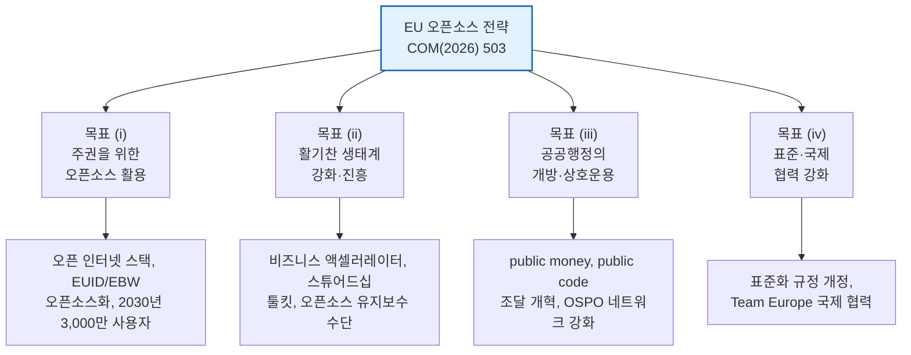
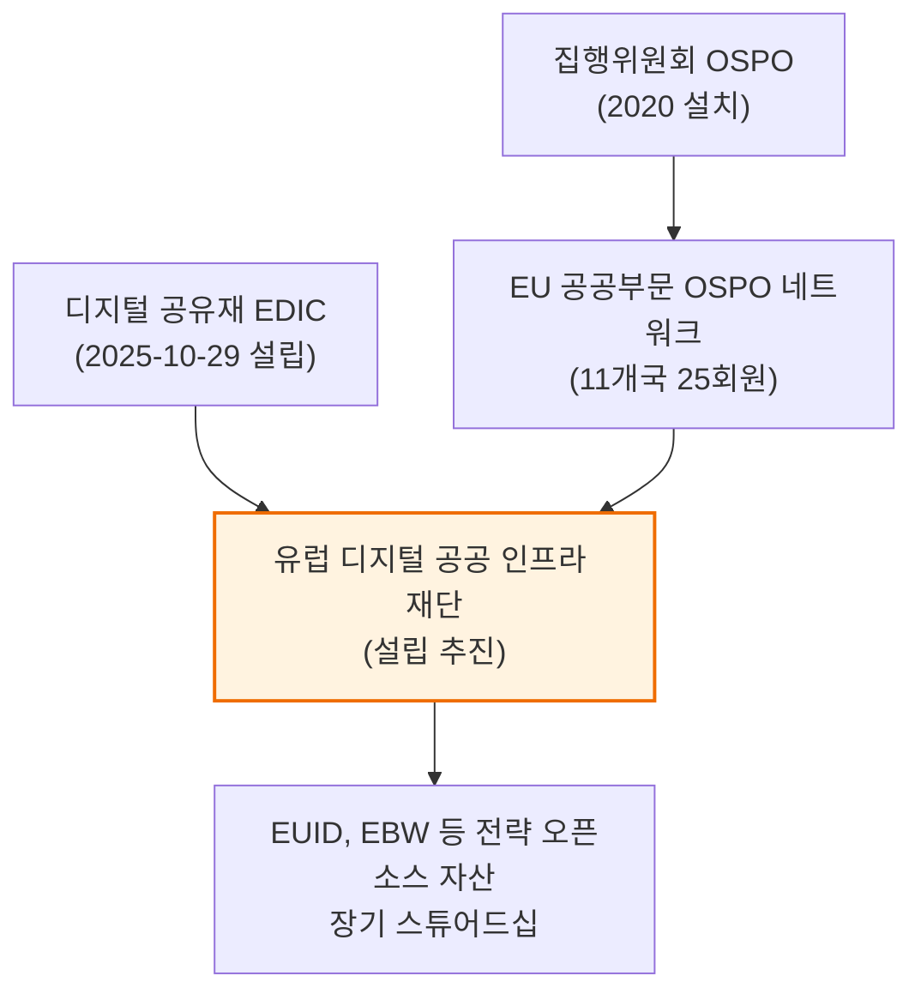
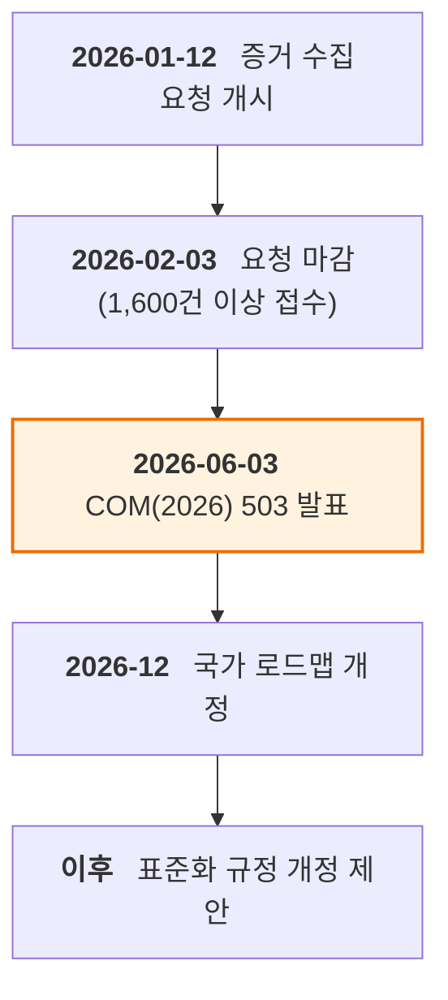

{}
이 글은 Claude Code를 이용해 작성했고, 인용한 핵심 사실은 1차 출처로 교차 검증했습니다.
{}

> **요약**
>
> 유럽연합 집행위원회가 2026년 6월 3일 발표한 「유럽 기술 주권에 관한 통신」(COM(2026) 503 final)에는 EU 오픈소스 전략(EU Open Source Strategy)이 첨부되어 있습니다. 오픈소스를 EU 디지털 정책의 중심에 놓은 첫 사례입니다. 전략은 주권을 위한 활용, 생태계 강화, 공공행정의 개방화, 표준과 국제 협력이라는 네 가지 목표를 제시하고, 향후 7년간 오픈소스 관련 조치에 약 20억 유로를 공공과 민간이 동원하도록 합니다. EU가 미국산 독점 IT에 매년 2,640억 유로를 지출하는 의존 구조를 줄이려는 것입니다. 시민사회(FSFE)와 정책 분석가들은 방향을 환영하면서도 재정 충분성, 오픈 표준과 오픈소스의 관계, 오픈 하드웨어 경시, 실무자 스킬 격차를 한계로 지적했습니다. 한국 공공과 기업 실무자에게는 EU 조달 개방화와 오픈소스 스튜어드 규제, EUDI 지갑의 오픈소스 기본값이 직접 지켜볼 지점입니다.

## 1. 개요

집행위원회는 2026년 6월 3일 브뤼셀에서 기술 주권 패키지(technological sovereignty package)를 발표했습니다. 통신(Communication)은 구속력 있는 입법이 아니라 위원회의 정책 방향과 후속 조치 계획을 담는 문서입니다.[A1](#a1)·[A2](#a2) 패키지는 서로 연결된 네 개의 이니셔티브, 곧 반도체의 칩스법 2.0(Chips Act 2.0), 클라우드·AI 개발법(Cloud and AI Development Act, CADA), 오픈소스 전략, 에너지 부문 디지털화와 AI 로드맵으로 이뤄집니다. 이 보고서가 다루는 범위는 그중 오픈소스 전략(COM 문서 제4장)입니다.[A1](#a1)

전략이 답하려는 문제는 분명합니다. 드라기 보고서(Draghi Report)는 EU가 디지털 제품과 서비스, 인프라, 지식재산의 80% 이상을 비EU 공급자에 의존한다고 지적했습니다.[A1](#a1) 오픈소스 전략은 이 의존을 줄이는 수단으로 오픈소스를 택했습니다. 리눅스(Linux)의 발상지인 유럽에는 300만 명이 넘는 오픈소스 기여자가 있고, 코드 커밋의 절반 가까이가 직원 50명 미만 소기업에서 나옵니다. 활용할 자산은 있지만 확장과 자금에서 구조적 한계를 안고 있습니다.[A1](#a1)

## 2. 핵심 내용: 네 가지 목표

전략은 두 갈래 조치를 결합합니다. EU 커뮤니티와 기업이 고품질 오픈소스 구성요소를 개발하고 유지보수하도록 돕는 공급측 조치와, 민간과 공공의 도입을 가속하는 수요측 조치입니다. 공공 자금과 시장·수요 주도 조치를 함께 묶었고, 위원회의 증거 수집 요청(call for evidence)에 접수된 1,600건 이상의 의견을 토대로 만들어졌습니다.[A1](#a1)·[B3](#b3)

**그림 1.** 오픈소스 전략의 4대 목표와 대표 조치 *(출처: COM(2026) 503 final 제4장, 2026-06-03)*

**기술 주권을 위한 활용(목표 i).** 위원회는 오픈 인터넷 스택(Open Internet Stack)을 유럽 오픈소스 빌딩블록의 공유 카탈로그로 확장하고, 호라이즌 유럽 2026–2027 작업 프로그램에서 세 건 공모로 4,130만 유로를 동원했습니다.[A1](#a1) EU 디지털 신원 생태계의 오픈소스화가 핵심 축입니다. EU 디지털 신원 규정(EUDIR)이 EUDI 지갑(Wallet) 응용 구성요소를 오픈소스로 하도록 법적 기본값을 정했고, 이를 토대로 신원 지갑(EUID)과 유럽 비즈니스 지갑(European Business Wallet, EBW)의 참조 구현을 오픈소스로 개발해 그 장기 스튜어드십을 유럽 디지털 공공 인프라 재단으로 이전합니다.[A1](#a1) 회원국과는 디지털 공유재(Digital Commons)에 관한 유럽 디지털 인프라 컨소시엄(EDIC)을 통해 협력하며, 2030년까지 오픈소스 협업과 생산성 도구, 보안 이메일의 활성 사용자 3,000만 명 도달을 목표로 삼습니다.[A1](#a1)

**생태계 강화(목표 ii).** 오픈소스 빌딩블록은 대부분 재단을 통해 유지되며, 자금의 다수는 미국과 중국 빅테크가 대고 있습니다.[A1](#a1) 사이버 복원력법(Cyber Resilience Act, CRA)이 도입한 오픈소스 소프트웨어 스튜어드(steward) 개념이 이 목표의 규제 축입니다. 위원회는 재단 설립을 돕는 스튜어드십 툴킷(stewardship toolkit)을 개발하고, EU가 자금을 지원한 전략 자산을 단일 거점에서 거버넌스하는 유럽 디지털 공공 인프라 스튜어드 조직 설립을 지원합니다. 핵심 구성요소의 유지와 보안을 위해서는 오픈소스 유지보수 수단(Open Source Maintenance Instrument)을 신설해, 필요할 때 프로젝트를 포크(fork)할 수 있는 유럽 역량을 구축합니다.[A1](#a1)

> [!IMPORTANT]
> 외부 분석에서 자주 인용되는 "오픈소스 유지보수 수단 3억 5,000만 유로"는 COM(2026) 503 원문에 나오는 수치가 아닙니다. TechPolicy.Press 저자들이 이 수단에 필요하다고 본 자체 추정치이며, 원문은 금액을 붙이지 않았습니다.[A1](#a1)·[E1](#e1) 반면 "RISC-V 약 5억 유로"는 부속서 II에 실제로 기재되어 있지만, 칩스 공동사업(Chips Joint Undertaking) 투자로 표기되며 오픈소스 전략의 20억 유로 예산과는 별개 항목입니다.[A1](#a1)

**공공행정의 개방화(목표 iii).** "공공 자금, 공공 코드(public money, public code)" 원칙이 전략에 명시적으로 들어왔습니다.[A1](#a1)·[B2](#b2) 위원회는 매트릭스(Matrix) 기반 통신 플랫폼, 오픈데스크(openDesk) 협업 환경, 300개 이상 europa.eu 사이트의 드루팔(Drupal)을 이미 운영하고 있습니다.[A1](#a1) 조달에서는 오픈소스가 독점 솔루션과 경쟁할 수 있도록 입찰 가이드라인을 개편하고, 오픈소스 프로그램 사무소(Open Source Programme Office, OSPO)와 EU 공공부문 OSPO 네트워크를 중심 허브로 강화합니다.[A1](#a1)·[B2](#b2)

**표준과 국제 협력(목표 iv).** 위원회는 EU 표준화 규정(Standardisation Regulation) 개정에서 오픈소스와 표준화 커뮤니티의 협력을 개선하고, 특정 표준이 오픈소스로 구현되도록 조건을 제공합니다. 팀 유럽(Team Europe) 접근으로 EU 오픈소스 솔루션을 확대 국가와 파트너 국가에 배치합니다.[A1](#a1)

### 거버넌스 구조

전략은 새 기구를 만들기보다 기존 거버넌스 자산을 엮습니다. 세 축이 맞물립니다.

**그림 2.** 오픈소스 전략의 거버넌스 기구 연결 *(출처: COM(2026) 503 final 제4장 및 부속서 II, 2026-06-03. OSPO 네트워크 회원 수는 2026-05 기준)*

집행위원회 OSPO(2020년 설치)와 11개국 25개 회원의 EU 공공부문 OSPO 네트워크가 공공행정 축을 맡고, 2025년 10월 29일 설립된 디지털 공유재 EDIC이 다국가 협력 축을 맡습니다.[A1](#a1)·[A5](#a5) 이 둘은 설립을 추진 중인 유럽 디지털 공공 인프라 재단으로 수렴하며, 재단이 EUID와 EBW 같은 전략 자산의 장기 스튜어드십을 맡게 됩니다.[A1](#a1)

## 3. 배경과 맥락

오픈소스 전략은 독립 규제가 아니라 여러 EU 법령 위에 얹힌 정책 우산입니다. 상호운용 유럽법(Interoperable Europe Act, Regulation (EU) 2024/903)이 "오픈소스 라이선스"를 정의하고 공공부문 재사용을 뒷받침하며,[A4](#a4) CRA(Regulation (EU) 2024/2847)가 스튜어드 규제 범주와 자발적 보안 입증(Article 25)을 제공합니다.[A3](#a3) AI법(AI Act)은 무료 오픈소스 모델에 비례적 의무를 두고, EUDIR은 EUDI 지갑의 오픈소스 기본값을 정합니다.[A1](#a1)·[C1](#c1)

정책 계보의 분수령은 2020년입니다. 위원회는 2020년 10월 21일 「오픈소스 소프트웨어 전략 2020–2023」(C(2020) 7149 final)을 채택해 "오픈으로 생각하기(think open)" 문화를 도입했고, 그 첫 조치로 집행위원회 OSPO를 설치했습니다.[A5](#a5) 이후 code.europa.eu(2026년 5월 기준 사용자 4,500명, 저장소 1,280개)와 EU 오픈소스 솔루션 카탈로그(2025년 3월 출범, 1,047개 솔루션)가 구축되었습니다.[A1](#a1) 새 전략은 이들을 명시적 토대로 인용합니다.

"공공 자금, 공공 코드" 원칙은 자유소프트웨어재단 유럽(FSFE)이 2017년 시작한 캠페인에서 비롯했습니다. 전략은 캠페인 출범 9년 만에 이 원칙을 받아들였습니다.[B4](#b4)

## 4. 최신 동향과 일정

발표가 며칠 전이어서, 동향은 발표 직후의 반응과 앞으로 예정된 절차로 모입니다.

**그림 3.** EU 오픈소스 전략 추진 일정 *(출처: COM(2026) 503 final 및 집행위원회 공지, 2026-06-05 기준)*

발표 당일 FSFE는 신중한 환영 입장을 냈습니다. "Public Money? Public Code!" 원칙 수용을 반기면서도, 요하네스 네더(Johannes Näder)는 "위원회는 구체적 목표와 마일스톤, 안전한 자금에서 여전히 미흡하다"고 했고, 루카스 라소타(Lucas Lasota)는 "이제 관건은 이행이며, 확보된 장기 자금과 시민사회의 실질적 참여, 디지털 시장법의 효과적 집행이 필요하다"고 밝혔습니다.[B4](#b4)

TechPolicy.Press의 정책 분석(Gates, Givropoulou, Karhu, 2026-06-03)은 전략을 "유럽의 지금까지 가장 의미 있는 진전"으로 평가하면서 네 가지 공백을 지적했습니다.[E1](#e1) 오픈 표준과 오픈소스의 선후 관계가 아직 정해지지 않았고, 오픈 하드웨어 취급이 RISC-V와 EDA 도구에 머물러 있으며, 7년 20억 유로는 연간 2,640억 유로 의존에 비해 부족하고, 실무자 수준의 기여와 유지, 거버넌스 역량 개발이 약하다는 것입니다. 법무법인 코빙턴(Covington)도 2026년 6월 4일 패키지의 투자 규모와 기업 영향을 정리했습니다.[E3](#e3)

재정의 성격이 불확실성을 키웁니다. 20억 유로는 확정 배정된 예산이 아니라 7년간 공공과 민간이 "동원해야 할" 합산 추정치입니다.[A1](#a1) 오픈소스 유지보수 수단, 유럽 디지털 공공 인프라 재단, 자발적 EU 평가 프레임워크는 모두 "만든다"는 약속 단계에 있어 구체적인 설계와 금액이 정해지지 않았습니다.

예정된 일정으로는 2026년 12월 회원국의 국가 디지털 디케이드 전략 로드맵 개정에 패키지가 반영되고, 표준화 규정 개정 제안과 CADA·칩스법 2.0 입법 절차가 오픈소스 요건을 구체화합니다. 위원회는 디지털 디케이드 위원회에서 매년 진척을 논의하고 3년마다 유럽의회에 보고합니다.[A1](#a1)

## 5. 시사점과 고려사항

한국 공공기관과 기업에 이 전략이 직접 적용되지는 않지만, 실무에서 지켜볼 지점이 몇 가지 있습니다.

EU 공공조달의 개방화가 가장 현실적인 변수입니다. 입찰 사양이 오픈 표준과 모델을 포함하고 오픈소스가 독점 솔루션과 경쟁하도록 바뀌면, EU 공공시장에 진입하려는 한국 SW 공급사는 오픈소스 친화적인 제안과 라이선스 명확성을 갖춰야 유리합니다.[A1](#a1)·[B2](#b2) 반대로 오픈소스 기반 사업을 하는 한국 기업에는 EU 조달 진입 기회가 넓어집니다.

오픈소스 스튜어드 규제는 CRA 적용을 받는 제품을 EU에 출시하는 기업이 살펴야 할 지점입니다. 오픈소스 구성요소에 의존하는 제품의 보안 입증(CRA Article 25)과 스튜어드의 책임 범위가 전략의 자발적 EU 평가 프레임워크로 구체화될 전망이므로, 소프트웨어 구성요소 목록(Software Bill of Materials, SBOM)과 의존성 관리 체계를 미리 정비해 두는 것이 안전합니다.[A1](#a1)·[A3](#a3) EUDI 지갑과 유럽 비즈니스 지갑이 오픈소스 참조 구현을 기본값으로 삼는 점은, EU 디지털 신원 연동을 검토하는 한국 핀테크와 인증 사업자가 주시할 사항입니다.[A1](#a1)

한국의 공공 SW 정책 관점에서는 "공공 자금, 공공 코드" 원칙의 제도화 경로와 OSPO 네트워크 거버넌스가 참고할 만한 모델입니다. 다만 EU 스스로 재정 충분성과 실무자 역량을 미해결 과제로 남긴 만큼, 선언과 이행 사이의 간극도 함께 지켜봐야 합니다.[B4](#b4)·[E1](#e1)

## 6. 참고 자료

### A. 법령·규제 원문 (1차)

**A1.** European Commission (2026). *Communication from the Commission on European Tech Sovereignty, accompanied by an EU Open Source Strategy*. COM(2026) 503 final, Brussels, 3.6.2026 (본문 및 ANNEXES 1–2). 본 보고서 원본. `sources/COM-2026-503-eu-tech-sovereignty.pdf` 및 `…-annexes.pdf`. 다운로드: <https://digital-strategy.ec.europa.eu/en/library/communication-european-tech-sovereignty-accompanied-eu-open-source-strategy> (접속: 2026-06-05). <a href="#a1-ref-1" onclick="event.preventDefault(); history.back(); return false;" title="본문으로 돌아가기">↩</a>

**A2.** European Commission (2026). *Strengthening Europe's tech sovereignty* (보도자료). 2026-06-03. <https://commission.europa.eu/news-and-media/news/strengthening-europes-tech-sovereignty-2026-06-03_en> (접속: 2026-06-05). <a href="#a2-ref-1" onclick="event.preventDefault(); history.back(); return false;" title="본문으로 돌아가기">↩</a>

**A3.** European Parliament and Council (2024). *Regulation (EU) 2024/2847 — Cyber Resilience Act*. Official Journal, OJ L, 2024/2847, 20.11.2024. <https://eur-lex.europa.eu/eli/reg/2024/2847/oj/eng> (접속: 2026-06-05). <a href="#a3-ref-1" onclick="event.preventDefault(); history.back(); return false;" title="본문으로 돌아가기">↩</a>

**A4.** European Parliament and Council (2024). *Regulation (EU) 2024/903 — Interoperable Europe Act*. Official Journal, OJ L, 2024/903, 22.3.2024. <https://eur-lex.europa.eu/eli/reg/2024/903/oj/eng> (접속: 2026-06-05). <a href="#a4-ref-1" onclick="event.preventDefault(); history.back(); return false;" title="본문으로 돌아가기">↩</a>

**A5.** European Commission (2020). *Open Source Software Strategy 2020–2023*. C(2020) 7149 final, Brussels, 21.10.2020. <https://commission.europa.eu/system/files/2023-02/en_ec_open_source_strategy_2020-2023.pdf> (접속: 2026-06-05). <a href="#a5-ref-1" onclick="event.preventDefault(); history.back(); return false;" title="본문으로 돌아가기">↩</a>

### B. 발행 기관 공식 문서·정책 페이지

**B1.** European Commission — Shaping Europe's digital future (2026). *The EU Open Source Strategy* (정책 페이지). 2026-06-03 갱신. <https://digital-strategy.ec.europa.eu/en/policies/open-source-strategy> (접속: 2026-06-05).

**B2.** European Commission (2026). *Commission boosts open and interoperable digital ecosystems for public administrations* (보도자료). 2026-06-03. <https://commission.europa.eu/news-and-media/news/commission-boosts-open-and-interoperable-digital-ecosystems-public-administrations-2026-06-03_en> (접속: 2026-06-05). <a href="#b2-ref-1" onclick="event.preventDefault(); history.back(); return false;" title="본문으로 돌아가기">↩</a>

**B3.** European Commission — Shaping Europe's digital future (2026). *Commission opens call for evidence on Open-Source Digital Ecosystems*. 2026-01-12(마감 2026-02-03). <https://digital-strategy.ec.europa.eu/en/news/commission-opens-call-evidence-open-source-digital-ecosystems> (접속: 2026-06-05). <a href="#b3-ref-1" onclick="event.preventDefault(); history.back(); return false;" title="본문으로 돌아가기">↩</a>

**B4.** Free Software Foundation Europe (2026). *EU Tech Sovereignty: A milestone for Public Code? Now implementation is key*. 2026-06-03. <https://fsfe.org/news/2026/news-20260603-01.en.html> (접속: 2026-06-05). <a href="#b4-ref-1" onclick="event.preventDefault(); history.back(); return false;" title="본문으로 돌아가기">↩</a>

### C. 표준·프레임워크

**C1.** European Commission (2024). *Regulation (EU) 2024/1689 — Artificial Intelligence Act*. Official Journal, OJ L, 2024/1689, 12.7.2024. <https://eur-lex.europa.eu/eli/reg/2024/1689/oj/eng> (접속: 2026-06-05). <a href="#c1-ref-1" onclick="event.preventDefault(); history.back(); return false;" title="본문으로 돌아가기">↩</a>

**C2.** European Parliament and Council (2023). *Regulation (EU) 2023/2854 — Data Act*. Official Journal, OJ L, 2023/2854, 22.12.2023. <https://eur-lex.europa.eu/eli/reg/2023/2854/oj/eng> (접속: 2026-06-05).

### D. 학술·정책 연구

**D1.** Blind, K. et al. (2021). *The impact of Open Source Software and Hardware on technological independence, competitiveness and innovation in the EU economy*. European Commission. <https://digital-strategy.ec.europa.eu/en/library/study-about-impact-open-source-software-and-hardware-technological-independence-competitiveness-and> (접속: 2026-06-05).

### E. 업계·법무법인·언론 분석 (보조)

**E1.** Gates, N., Givropoulou, A., Karhu, J. (2026). *How the EU's Tech Sovereignty Package Finally Puts Open Source to the Test*. TechPolicy.Press, 2026-06-03. <https://www.techpolicy.press/how-the-eus-tech-sovereignty-package-finally-puts-open-source-to-the-test/> (접속: 2026-06-05). <a href="#e1-ref-1" onclick="event.preventDefault(); history.back(); return false;" title="본문으로 돌아가기">↩</a>

**E2.** TechPolicy.Press (2026). *EU Unveils Sweeping Tech Sovereignty Push, Balancing Autonomy with Openness*. 2026-06-03. <https://www.techpolicy.press/eu-unveils-sweeping-tech-sovereignty-push-balancing-autonomy-with-openness/> (접속: 2026-06-05).

**E3.** Covington & Burling (2026). *EU Tech Sovereignty Package*. Global Policy Watch, 2026-06-04. <https://www.globalpolicywatch.com/2026/06/eu-tech-sovereignty-package/> (접속: 2026-06-05). <a href="#e3-ref-1" onclick="event.preventDefault(); history.back(); return false;" title="본문으로 돌아가기">↩</a>

**E4.** Agence Europe (2026). *European Commission seeks to harness open source in its tech sovereignty strategy and develop European alternatives*. 2026-06. <https://agenceurope.eu/en/bulletin/article/13877/4/european-commission-seeks-to-harness-open-source-in-its-tech-sovereignty-strategy-and-develop-european-alternatives> (접속: 2026-06-05).
