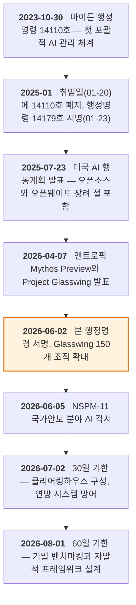
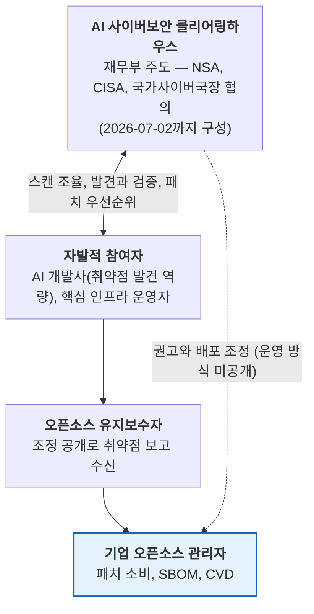

{}
이 글은 Claude Code를 이용해 작성했고, 인용한 핵심 사실은 1차 출처로 교차 검증했습니다.
{}

> **요약**
>
> 2026년 6월 2일 서명된 행정명령 "Promoting Advanced Artificial Intelligence Innovation and Security"는 기업에 어떤 의무도 부과하지 않습니다. 재무부가 이끄는 AI 사이버보안 클리어링하우스(취약점 정보를 한곳에 모아 검증하고 배분하는 중계 기구, 30일 내 구성)와 프런티어 모델의 자발적 사전 공유 체계(60일 내 설계)가 골자이고, 의무 라이선싱과 사전심사는 명시적으로 배제됐습니다 [A1](#a1). 기업 오픈소스 관리자에게 직접 적용되는 조항도 없습니다. 그런데도 이 명령을 읽어야 하는 이유는 배경에 있습니다. AI가 오픈소스 취약점을 사람보다 빠르게 찾아내는 상황이 이미 현실이 됐기 때문입니다. 행정명령에 앞서 앤트로픽의 미공개 모델은 두 달 만에 오픈소스 프로젝트에서 높음 또는 치명 등급 취약점 6,202건을 찾아냈고, 패치가 그 속도를 따라가지 못하고 있습니다 [A6](#a6)·[C1](#c1). 오픈소스 관리자가 준비할 것은 행정명령 컴플라이언스가 아니라 패치 처리 능력 점검과 EOL 컴포넌트 정리, 그리고 2026년 9월 11일 시행되는 EU 사이버 복원력법 보고 의무까지 한꺼번에 감당할 대응 체계입니다.

## 1. 행정명령이 실제로 정한 것

행정명령은 다섯 개 조로 구성되며, 모든 조항이 자발적 협력을 전제로 합니다. Section 1은 "과도한 규제로 혁신을 억누르기를 거부한다"는 기조와 미국 우선(America First) 사이버보안을 선언하고, Section 5는 통상적인 일반 규정입니다. 실질 내용은 가운데 세 개 조에 있습니다 [A1](#a1).

Section 2는 연방과 민간의 사이버 방어 강화를 다룹니다. 30일 내에 국가안보시스템, 전쟁부(Department of War) 시스템, 연방 민간 시스템의 방어를 우선시하고, 같은 기한에 재무부 장관이 국가사이버국장(National Cyber Director), 국가안보국(National Security Agency, NSA), 사이버보안·인프라보안청(Cybersecurity and Infrastructure Security Agency, CISA)과 협의해 AI 사이버보안 클리어링하우스(AI cybersecurity clearinghouse)를 구성합니다. 클리어링하우스는 본래 은행 간 어음 교환소를 가리키는 말로, 여러 참여자의 정보를 한곳에 모아 검증하고 배분하는 중계 기구를 뜻합니다. 여기서는 AI 업계 및 핵심 인프라 운영자와의 자발적 협력으로 소프트웨어 취약점 스캔을 조율해 중복을 없애고, 취약점을 발견해 검증하며, 패치의 수정과 배포에 우선순위를 매기는 역할을 맡습니다 [A1](#a1).

Section 3은 프런티어 모델의 안전한 배포를 다룹니다. 60일 내에 AI 모델의 사이버 공격 능력을 평가하는 기밀 벤치마킹 절차를 마련하고, 그 결과로 어떤 모델이 "대상 프런티어 모델(covered frontier model)"인지의 임계값을 NSA 국장이 결정합니다. 개발자는 자발적 프레임워크를 통해 자기 모델이 지정 기준에 해당하는지 정부와 협의하고, 공개 예정일로부터 최대 30일 전까지 정부에 모델 접근을 제공하며, 조기 접근을 받을 신뢰 파트너(trusted partners)를 정부와 함께 고릅니다. Sec. 3(c)는 이 조의 어떤 내용도 새 AI 모델의 개발과 발행, 공개, 배포에 대한 의무 라이선싱이나 사전심사, 허가 요건을 신설하지 않는다고 못 박았습니다 [A1](#a1).

Section 4는 수사와 집행을 다룹니다. 법무부 장관은 AI를 이용한 무단 컴퓨터 접근과 손상, 그 과정에서 저질러지는 다른 범죄에 대해 `18 U.S.C. 1030`(컴퓨터 사기 및 남용) 등 기존 연방 형사법의 집행을 우선시합니다 [A1](#a1).

**그림 1.** 행정명령 전후의 정책 타임라인 *(출처: 백악관 공식 문서 [A1](#a1)·[A2](#a2)·[A3](#a3)·[A4](#a4)·[A5](#a5), Anthropic [A6](#a6), Wiley 기한 계산 [B1](#b1). 2026-06-10 기준)*

주관 기관 선정은 의외라는 평가가 나옵니다. 취약점 조정이라는 기능만 보면 CISA나 국가사이버국장실이 맡는 것이 자연스러운데, 클리어링하우스는 재무부가 이끕니다. 외교협회(Council on Foreign Relations, CFR)는 재무부가 "제도적 역량이 남아 있는 몇 안 되는 곳"이기 때문일 수 있다고 해석했고, 대서양위원회(Atlantic Council)는 기존 취약점 조정 체계와 겹칠 위험을 지적했습니다 [B4](#b4)·[B5](#b5). 핵심 용어인 대상 프런티어 모델의 기준도 본문에 정의되지 않았습니다. 기밀 벤치마킹의 결과로 정해지며, WilmerHale은 이 기준 정의가 향후 수개월간 기관 규칙 제정(rulemaking)의 초점이 될 것으로 내다봤습니다 [B2](#b2).

## 2. 왜 지금 나왔나

행정명령의 직접 배경은 2026년 4월 7일 앤트로픽(Anthropic)이 발표한 클로드 미토스 프리뷰(Claude Mythos Preview)입니다. 이 미공개 모델은 취약점 재현 벤치마크 CyberGym에서 83.1%를 기록했고(직전 모델은 66.6%), 앤트로픽은 일반 공개 대신 AWS, Apple, Google, Microsoft 등 12개 파트너에게만 접근을 여는 프로젝트 글래스윙(Project Glasswing)을 택했습니다 [A6](#a6). 두 달이 안 되는 기간에 참여 조직들은 1만 건이 넘는 높음 또는 치명 등급 취약점을 식별했습니다. 앤트로픽 자체 스캔만으로 1,000개 이상의 오픈소스 프로젝트에서 23,019건의 문제가 나왔고 그중 6,202건이 높음 또는 치명 등급이었으며, 독립 보안 기업이 표본 1,752건을 검증해 90% 이상이 실제 취약점임을 확인했습니다 [C1](#c1)·[C2](#c2). OpenBSD에 27년간 잠복한 원격 크래시 결함, 500만 회의 자동 테스트를 통과해 온 FFmpeg의 16년 된 결함, 리눅스 커널의 권한 상승 체인이 대표 사례입니다 [A6](#a6).

이 과정에서 취약점을 찾는 속도와 고치는 속도가 크게 어긋난다는 사실이 드러났습니다. 앤트로픽 스스로 "이런 버그를 고치는 병목은 분류하고 보고하고 패치를 설계해 배포하는 인간의 역량"이라고 밝혔고, 오픈소스 유지보수자가 병목이 되자 OpenSSF의 알파-오메가(Alpha-Omega) 프로젝트와 협력을 시작했습니다 [C1](#c1)·[C2](#c2). 브루스 슈나이어(Bruce Schneier)는 당분간 "고치기 위한 발견"이 "악용을 위한 발견"보다 쉬워 방어자에게 유리한 창이 열려 있지만 이 창은 일시적이며, 자동화된 제로데이 발견의 시대는 우리가 준비를 끝내기 전에 올 것이라고 평가했습니다. 보안 기업 Aisle이 더 오래된 공개 모델로 결과 일부를 재현한 점을 들어, 이런 능력이 특정 회사의 전유물은 아니라는 단서도 달았습니다 [C3](#c3).

행정명령은 이 상황에 대한 미국 정부의 대응입니다. 글래스윙처럼 민간이 개별적으로 하던 일, 곧 AI로 취약점을 찾고 검증하고 패치를 조정하는 일을 정부가 국가 단위로 조율하겠다는 구상이 클리어링하우스입니다 [A1](#a1)·[B5](#b5).

## 3. 기업 오픈소스 관리자에게 의미하는 것

### 3.1 "오픈소스"가 한 번도 나오지 않는 문서

행정명령 본문과 백악관 팩트시트 어디에도 "open source"라는 표현이 없습니다 [A1](#a1)·[A2](#a2). 좋은 쪽으로 보면 규제 부담이 없다는 뜻입니다. 명령은 오픈소스 개발자나 오픈웨이트(open-weight) 모델 배포자에게 어떤 의무도 지우지 않으며, Sec. 3(c)의 라이선싱 금지 조항은 모델의 "개발, 발행, 공개, 배포"를 모두 포괄하므로 가중치 공개 방식의 배포도 보호 범위에 듭니다 [A1](#a1). 행정부의 공식 기조도 2025년 7월 AI 행동계획에서 밝힌 그대로입니다. 공개와 폐쇄의 선택은 전적으로 개발자의 몫이며, 연방정부는 공개 모델에 우호적인 환경을 만든다는 것입니다 [A5](#a5).

남는 문제는 대상 프런티어 모델의 임계값입니다. 기밀 벤치마크로 정해지므로 공개 가중치 모델이 그 기준을 넘으면 어떤 일이 생기는지 지금은 알 수 없습니다. 자발적 프레임워크의 핵심 장치인 "공개 30일 전 정부 접근"은 출시 시점을 통제할 수 있는 폐쇄 모델에 맞춘 설계라서, 가중치를 한번 공개하면 회수할 수 없는 공개 모델에는 같은 방식이 들어맞지 않습니다. CFR의 전문가들은 프런티어급 취약점 추론 능력이 머지않아 공개 가중치 시스템에서도 재현될 것으로 보았고, 유사한 재현 연구가 이미 언급되고 있습니다 [B5](#b5). 능력이 공개 모델로 확산되면 자발적 사전 공유라는 설계의 빈틈이 드러나고, 그때는 추가 규제 논의가 공개 모델을 겨냥할 수 있습니다. 사내에서 공개 가중치 모델을 가져다 쓰거나 미세조정해 배포하는 기업이라면, 8월 1일까지 나올 벤치마킹 절차와 후속 규칙 제정이 공개 모델을 어떻게 다루는지 지켜봐야 합니다.

오픈소스 재단들도 아직 조용합니다. 2026-06-10 기준 검색에서 오픈소스 이니셔티브(Open Source Initiative, OSI), 리눅스 재단(Linux Foundation), OpenSSF가 이 행정명령에 대해 낸 성명은 확인되지 않았습니다. 의무가 없으니 즉각 대응할 유인도 약했던 것으로 보입니다. 가장 가까운 공식 입장은 OSI가 2025년 3월 AI 행동계획 의견수렴에 낸 답변입니다 [B7](#b7).

### 3.2 클리어링하우스와 기업 취약점 관리 체계의 접점

클리어링하우스의 기능 세 가지(스캔 조율, 발견과 검증, 패치 우선순위와 배포 조정)는 기업 오픈소스 관리 조직(OSPO 또는 제품 보안 조직)이 이미 운영하는 취약점 관리 체계와 정확히 겹칩니다 [A1](#a1).

**그림 2.** 클리어링하우스와 취약점 정보 흐름에서 기업 오픈소스 관리자의 위치 *(출처: 행정명령 Sec. 2(d) [A1](#a1) 기반 분석. 점선은 아직 공개되지 않은 운영 방식)*

대부분의 기업은 클리어링하우스를 정보 소비자로서 만나게 됩니다. 클리어링하우스가 작동하면 오픈소스 컴포넌트 취약점의 발견과 검증, 패치 우선순위 정보가 새 경로로 흘러나옵니다. 기업의 취약점 인텔리전스 파이프라인에 미국발 채널이 하나 더 생기고, 패치 우선순위 판단에 영향을 주는 조정 주체가 추가되는 셈입니다.

클리어링하우스에 직접 참여할지는 별개의 판단입니다. 핵심 인프라에 해당하는 기업(에너지, 금융, 의료, 통신 등)은 참여 대상으로 명시돼 있습니다 [A1](#a1). 참여하면 취약점 정보를 먼저 받고, 패치 조정에서 발언권을 갖고, Sec. 2(c)(iii)가 언급하는 정부 지원 보안 도구에 접근할 수 있습니다. 대신 정보 공유에 따르는 법무 검토 부담을 지게 되고, Crowell & Moring이 지적했듯 참여자에 대한 책임 보호(liability protection)가 규정되지 않았고 비참여의 결과도 정의되지 않았다는 불명확성을 안게 됩니다 [B3](#b3). WilmerHale의 전망대로 자발적 조항이 연방 조달 기준으로 옮겨 가면, 미국 정부와 거래하는 기업에는 참여가 사실상 전제 조건이 되는 시나리오도 있습니다 [B2](#b2). 운영 방식이 공개되는 7월 초 이전에 결정을 서두를 이유는 없습니다.

### 3.3 가장 직접적인 영향: 패치 수요의 급증과 EOL 리스크

행정명령과 무관하게 진행 중이던 변화가 행정명령으로 가속됩니다. AI 기반 발견이 국가 체계로 제도화되고 연방 보조금까지 붙으면(Sec. 2(e)), 오픈소스 컴포넌트에서 보고되는 취약점은 늘 수밖에 없습니다. 글래스윙 수치가 그 규모를 미리 보여줬습니다.

기업이 가장 먼저 부딪히는 것은 처리량입니다. 자사 제품에 포함된 오픈소스 컴포넌트의 신규 CVE가 늘면 트리아지(영향 분석)와 패치 적용, 고객 커뮤니케이션이 함께 늘어야 합니다. 수작업 트리아지에 의존하는 조직부터 적체가 쌓입니다.

EOL(End-of-Life, 수명종료) 컴포넌트는 문제가 더 깊습니다. AI는 유지보수가 끝난 코드도 가리지 않고 스캔하지만, 패치는 유지보수자가 있어야 나옵니다. 상용 장기지원(LTS) 업체 HeroDevs가 짚었듯 찾는 속도와 고치는 속도의 격차는 EOL 소프트웨어에서 가장 크게 벌어집니다. 발견은 가속되는데 수정은 영영 나오지 않을 컴포넌트가 인벤토리에 남아 있다면, 그 위험은 시간이 갈수록 커집니다 [C4](#c4). 27년 묵은 OpenBSD 결함과 16년 된 FFmpeg 결함은 오래되고 안정된 컴포넌트라서 안전하다는 통념이 더는 통하지 않음을 보여줍니다 [A6](#a6).

업스트림 쪽 부담도 결국 기업의 리스크로 돌아옵니다. 오픈소스 유지보수자가 보고 홍수의 병목이 되고 있다는 것은 앤트로픽이 직접 확인한 사실입니다 [C2](#c2). 자사가 의존하는 핵심 컴포넌트의 유지보수자가 트리아지에 매몰되면 패치 지연을 떠안는 쪽은 기업입니다. 핵심 의존성의 유지보수 건전성(유지보수자 수, 보안 대응 이력, 재단 소속 여부)을 평가 항목에 넣고, 필요하면 Alpha-Omega류의 업스트림 지원에 참여하는 것이 자사 리스크를 줄이는 경로입니다.

### 3.4 EU CRA와의 대비: 자발과 의무를 동시에 상대하기

미국의 클리어링하우스가 다루는 문제, 곧 소프트웨어 취약점의 발견과 패치는 EU가 사이버 복원력법(Cyber Resilience Act, CRA — Regulation (EU) 2024/2847)으로 의무화한 영역과 같습니다.

| 구분 | 미국 행정명령 (2026-06-02) | EU CRA Article 14 (2026-09-11 시행) |
|---|---|---|
| 성격 | 자발적 협력 (참여 여부 기업 선택) | 법적 의무 (EU 시장 출시 즉시 적용) |
| 대상 | AI 업계, 핵심 인프라 운영자 | 디지털 요소를 가진 제품의 제조사, 수입사, 유통사 |
| 핵심 장치 | 클리어링하우스의 스캔 조율과 패치 배포 조정 | 실제 악용 취약점의 24시간/72시간/14일 단계 보고 |
| 수신 주체 | 재무부 주도 클리어링하우스 (운영 방식 미공개) | ENISA 단일 보고 플랫폼(SRP)과 회원국 CSIRT |
| 불이행 시 | 제재 없음 (조달 기준화 가능성은 전망 단계) | 최대 1,500만 유로 또는 전 세계 연 매출 2.5% 과징금 |
| 모델 규제 | 의무 라이선싱과 사전심사의 명시적 배제 | CRA는 AI 모델이 아닌 제품 보안 규정 |

**표 1.** 미국 행정명령과 EU CRA 취약점 보고 체계 비교 *(출처: 행정명령 원문 [A1](#a1), Regulation (EU) 2024/2847 [A7](#a7), 별도 보고서 [D1](#d1). 2026-06-10 기준)*

양쪽 시장에 제품을 내는 한국 기업이라면 우선순위가 분명합니다. 구속력과 시한, 과징금이 있는 쪽이 먼저입니다. CRA Article 14 보고 워크플로우는 석 달 뒤인 9월 11일까지 가동돼야 하고, ENISA가 현 단계에서 SRP 연동 API를 제공하지 않아 사람이 직접 제출하는 절차로 설계해야 한다는 실무 제약도 확인돼 있습니다 [A7](#a7)·[D1](#d1). 미국 클리어링하우스는 그 다음입니다. 다만 두 체계는 같은 내부 역량, 곧 컴포넌트 인벤토리(SBOM), 취약점 트리아지, 조정 공개(Coordinated Vulnerability Disclosure, CVD) 창구, 패치 배포 절차 위에서 돌아갑니다. CRA 대비로 구축한 체계가 미국 측 자발적 참여의 기반이 되므로, 별도 체계를 두 번 만들 일이 아닙니다.

### 3.5 정책 분기: 미국의 자발적 협력, EU의 제도화

행정명령 다음 날인 6월 3일, EU 집행위원회는 기술 주권 패키지를 발표하며 오픈소스를 디지털 정책의 중심에 놓았습니다. 7년간 약 20억 유로의 공공·민간 자금 동원, 오픈소스 유지보수 수단(Open Source Maintenance Instrument) 신설, 공공 조달 개방화가 골자입니다 [A8](#a8)·[D2](#d2). 하루 차이로 나온 두 문서는 같은 기술 환경에 대한 상반된 제도 설계를 보여줍니다. 미국은 규제를 배제하고 민간의 자발적 역량을 정부가 조율하는 모델이고, EU는 공공 자금과 법적 의무(CRA의 스튜어드 제도 포함)로 오픈소스 생태계 자체를 제도화하는 모델입니다.

글로벌 기업의 오픈소스 관리 정책은 이 분기를 전제로 짜야 합니다. 미국 시장에서는 자발적 협력 채널에 들어갈지 선택해야 하고, EU 시장에서는 CRA 컴플라이언스와 스튜어드 제도라는 의무에 대응해야 합니다. 한 회사 안에서 두 모드를 같은 팀이 운영하게 되므로, 정책 문서와 대응 조직을 시장별로 분리하기보다 공통 역량 위에 시장별 모듈을 얹는 구조가 현실적입니다.

### 3.6 AI 생성 코드 관리와는 다른 축

AI 생성 코드의 오픈소스 유입과 스니펫 검사를 다룬 별도 분석 [D3](#d3)과 이번 사안은 둘 다 AI와 오픈소스 관리에 걸쳐 있지만 축이 다릅니다. 그 분석이 다룬 것은 유입 관리, 곧 AI 코딩 도구가 패키지로 선언되지 않은 코드 조각을 코드베이스에 들여올 때의 라이선스와 출처 문제입니다. 이번 행정명령이 가리키는 것은 운영입니다. 이미 들어와 있는 오픈소스 컴포넌트의 취약점이 AI 때문에 더 빨리, 더 많이 드러나는 환경에서의 대응 문제입니다. AI는 이제 코드가 들어오는 단계와 취약점이 드러나는 단계 양쪽에 동시에 영향을 주고 있고, 두 축의 대응 체계는 따로 점검해야 합니다.

## 4. 준비사항

행정명령이 기업에 직접 요구하는 것은 없으므로, 준비는 지금 할 일과 지켜볼 일로 나뉩니다.

### 지금 할 일

출발점은 자사의 AI 노출면 인벤토리입니다. 사내에서 개발하거나 미세조정하는 모델(특히 공개 가중치 기반), 도입한 AI 코딩 도구와 보안 도구, AI가 생성해 코드베이스에 들어온 코드의 현황을 한곳에 정리합니다. 8월 1일 이후 대상 프런티어 모델 기준이 윤곽을 드러냈을 때, 자사가 그 언저리에 있는지 바로 판단할 수 있게 해 두는 것입니다.

오픈소스 취약점 대응 체계도 점검합니다. SBOM이 전 제품에서 최신인지, 신규 CVE 트리아지가 두세 배 유입을 감당할 수 있는지, CVD 창구가 작동하는지 확인합니다. 이 점검은 CRA Article 14 대비(9월 11일 시한)와 같은 작업이므로 별도 프로젝트를 만들 것 없이 CRA 준비에 합치면 됩니다 [D1](#d1).

시급성이 가장 높은 것은 EOL 컴포넌트 정리입니다. SBOM에서 유지보수 종료 컴포넌트를 추려, 업그레이드 경로가 있으면 일정을 정하고, 당장 걷어낼 수 없으면 상용 LTS나 자체 패치 같은 패치 공급원을 정합니다. 영향이 없음을 입증할 수 있는 항목은 취약점 악용성 정보(Vulnerability Exploitability eXchange, VEX)로 문서화해 트리아지 부담을 줄입니다 [C4](#c4).

마지막으로 핵심 업스트림 의존성의 건전성을 평가합니다. 매출에 직결되는 제품이 의존하는 상위 컴포넌트의 유지보수자 규모와 보안 대응 이력을 확인하고, 병목이 우려되는 프로젝트는 후원이나 기여 같은 지원 수단을 검토합니다 [C2](#c2).

### 지켜볼 일

| 추적 항목 | 시점 | 확인할 것 |
|---|---|---|
| 클리어링하우스 구성 발표 | 2026-07-02까지 | 운영 주체와 참여 절차, 기업 측 정보 공유 범위, 책임 보호 유무 [A1](#a1)·[B3](#b3) |
| 기밀 벤치마킹과 자발적 프레임워크 | 2026-08-01까지 | 대상 프런티어 모델 임계값의 윤곽, 공개 가중치 모델 취급 [A1](#a1)·[B2](#b2) |
| 후속 규칙 제정(rulemaking) | 수개월 단위 | 자발적 조항의 연방 조달 기준 이전 여부 [B2](#b2) |
| NSPM-11 기밀 부속서와 이행 | 2026-09 초까지 | 국가안보 조달에서 오픈소스 AI 취급 [A3](#a3) |
| 오픈소스 재단 반응 | 7월 이후 | OSI, 리눅스 재단, OpenSSF의 성명과 참여 방식 [B7](#b7) |
| EU CRA SRP 가동 | 2026-09-11 | 보고 워크플로우 실가동 (별도 보고서 [D1](#d1)에서 추적) |

**표 2.** 추적 항목과 시점 *(2026-06-10 기준)*

## 5. 결론

이 행정명령은 기업 오픈소스 관리자에게 새 의무를 부과하지 않지만, 업무 환경의 전제가 바뀌고 있다는 신호입니다. AI가 오픈소스 취약점을 대량으로 찾아내는 시대가 실증됐고, 미국 정부는 그 흐름을 규제가 아니라 조율로 제도화하기로 했습니다. 발견은 빨라지는데 패치는 여전히 사람의 속도입니다. 이 간극에서 기업이 통제할 수 있는 것은 자기 인벤토리의 처리 능력뿐입니다. 석 달 뒤 시행되는 EU CRA 보고 의무가 어차피 SBOM과 트리아지, CVD 역량을 요구하므로, 두 시장을 한 체계로 준비하는 것이 가장 효율적입니다. 행정명령 자체와 관련해서는 7월 2일(클리어링하우스)과 8월 1일(벤치마킹 기준) 두 기한만 달력에 적어 두면 됩니다.

---

## 참고문헌

모든 URL은 2026-06-10에 접근과 내용 일치를 확인했습니다(별도 표기 제외).

### A. 1차 출처 (정부 공식 문서, 당사자 발표)

**A1.** The White House (2026). *Promoting Advanced Artificial Intelligence Innovation and Security* (Executive Order). 2026-06-02 서명. <https://www.whitehouse.gov/presidential-actions/2026/06/promoting-advanced-artificial-intelligence-innovation-and-security/> (접속: 2026-06-10). — *본 보고서의 원본.* <a href="#a1-ref-1" onclick="event.preventDefault(); history.back(); return false;" title="본문으로 돌아가기">↩</a>

**A2.** The White House (2026). *Fact Sheet: President Donald J. Trump Promotes Advanced Artificial Intelligence Innovation and Security*. 2026-06-02. <https://www.whitehouse.gov/fact-sheets/2026/06/fact-sheet-president-donald-j-trump-promotes-advanced-artificial-intelligence-innovation-and-security/> (접속: 2026-06-10). <a href="#a2-ref-1" onclick="event.preventDefault(); history.back(); return false;" title="본문으로 돌아가기">↩</a>

**A3.** The White House (2026). *National Security Presidential Memorandum/NSPM-11 — Artificial Intelligence in the National Security Enterprise*. 2026-06-05. <https://www.whitehouse.gov/presidential-actions/2026/06/national-security-presidential-memorandum-nspm-11/> (접속: 2026-06-10). <a href="#a3-ref-1" onclick="event.preventDefault(); history.back(); return false;" title="본문으로 돌아가기">↩</a>

**A4.** The White House (2025). *Removing Barriers to American Leadership in Artificial Intelligence* (Executive Order 14179). 2025-01-23. <https://www.whitehouse.gov/presidential-actions/2025/01/removing-barriers-to-american-leadership-in-artificial-intelligence/> (접속: 2026-06-10). <a href="#a4-ref-1" onclick="event.preventDefault(); history.back(); return false;" title="본문으로 돌아가기">↩</a>

**A5.** The White House (2025). *Winning the Race: America's AI Action Plan*. 2025-07. <https://www.whitehouse.gov/wp-content/uploads/2025/07/Americas-AI-Action-Plan.pdf> (접속: 2026-06-10, PDF 원문에서 해당 구절 직접 확인). <a href="#a5-ref-1" onclick="event.preventDefault(); history.back(); return false;" title="본문으로 돌아가기">↩</a>

**A6.** Anthropic (2026). *Project Glasswing: Securing critical software for the AI era*. 2026-04-07 발표(이후 갱신). <https://www.anthropic.com/glasswing> (접속: 2026-06-10). <a href="#a6-ref-1" onclick="event.preventDefault(); history.back(); return false;" title="본문으로 돌아가기">↩</a>

**A7.** European Parliament and Council (2024). *Regulation (EU) 2024/2847 — Cyber Resilience Act*. OJ L, 2024/2847, 20.11.2024. <https://eur-lex.europa.eu/eli/reg/2024/2847/oj/eng> (접속: 2026-05-12, 본 워크스페이스의 CRA 보고서 검증 시 확인). <a href="#a7-ref-1" onclick="event.preventDefault(); history.back(); return false;" title="본문으로 돌아가기">↩</a>

**A8.** European Commission (2026). *Communication on European Tech Sovereignty, accompanied by an EU Open Source Strategy*. COM(2026) 503 final, 2026-06-03. <https://digital-strategy.ec.europa.eu/en/library/communication-european-tech-sovereignty-accompanied-eu-open-source-strategy> (접속: 2026-06-10). <a href="#a8-ref-1" onclick="event.preventDefault(); history.back(); return false;" title="본문으로 돌아가기">↩</a>

### B. 법률·정책 분석

**B1.** Wiley Rein LLP (2026). *New AI Executive Order Addresses Frontier Models and Cybersecurity Vulnerabilities*. <https://www.wiley.law/alert-New-AI-Executive-Order-Addresses-Frontier-Models-and-Cybersecurity-Vulnerabilities> (접속: 2026-06-10). <a href="#b1-ref-1" onclick="event.preventDefault(); history.back(); return false;" title="본문으로 돌아가기">↩</a>

**B2.** WilmerHale (2026). *New Executive Order Addressing Early Government Access to Frontier AI Models*. 2026-06-02. <https://www.wilmerhale.com/en/insights/client-alerts/20260602-new-executive-order-addressing-early-government-access-to-frontier-ai-models> (접속: 2026-06-10). <a href="#b2-ref-1" onclick="event.preventDefault(); history.back(); return false;" title="본문으로 돌아가기">↩</a>

**B3.** Crowell & Moring LLP (2026). *Executive Order Creates Voluntary Regulatory Regime of Frontier AI Models*. <https://www.crowell.com/en/insights/client-alerts/executive-order-creates-voluntary-regulatory-regime-of-frontier-ai-models> (접속: 2026-06-10). <a href="#b3-ref-1" onclick="event.preventDefault(); history.back(); return false;" title="본문으로 돌아가기">↩</a>

**B4.** Atlantic Council (2026). *Reading between the lines of Trump's new executive order on AI*. <https://www.atlanticcouncil.org/dispatches/reading-between-the-lines-of-trumps-new-executive-order-on-ai/> (접속: 2026-06-10). <a href="#b4-ref-1" onclick="event.preventDefault(); history.back(); return false;" title="본문으로 돌아가기">↩</a>

**B5.** Council on Foreign Relations (2026). *Assessing Trump's Executive Order on AI Oversight*. <https://www.cfr.org/articles/assessing-trumps-executive-order-on-ai-oversight> (접속: 2026-06-10). <a href="#b5-ref-1" onclick="event.preventDefault(); history.back(); return false;" title="본문으로 돌아가기">↩</a>

**B6.** CSO Online (2026). *OpenAI responds to White House executive order on AI governance*. <https://www.csoonline.com/article/4181294/openai-responds-to-white-house-executive-order-on-ai-governance.html> (접속: 2026-06-10).

**B7.** Open Source Initiative (2025). *OSI and Apereo Foundation Respond to White House on AI Action Plan*. <https://opensource.org/blog/osi-and-apereo-foundation-respond-to-white-house-on-ai-action-plan> (접속: 2026-06-10). <a href="#b7-ref-1" onclick="event.preventDefault(); history.back(); return false;" title="본문으로 돌아가기">↩</a>

### C. 업계·보안 커뮤니티

**C1.** CyberScoop (2026). *Anthropic expanding access to Project Glasswing*. 2026-06-02. <https://cyberscoop.com/anthropic-project-glasswing-expansion-critical-infrastructure-claude-mythos/> (접속: 2026-06-10). <a href="#c1-ref-1" onclick="event.preventDefault(); history.back(); return false;" title="본문으로 돌아가기">↩</a>

**C2.** Help Net Security (2026). *Anthropic: Claude Mythos identified 10,000+ software flaws*. 2026-05-26. <https://www.helpnetsecurity.com/2026/05/26/anthropic-project-glasswing-update/> (접속: 2026-06-10). <a href="#c2-ref-1" onclick="event.preventDefault(); history.back(); return false;" title="본문으로 돌아가기">↩</a>

**C3.** Schneier, Bruce (2026). *On Anthropic's Mythos Preview and Project Glasswing*. Schneier on Security, 2026-04. <https://www.schneier.com/blog/archives/2026/04/on-anthropics-mythos-preview-and-project-glasswing.html> (접속: 2026-06-10). <a href="#c3-ref-1" onclick="event.preventDefault(); history.back(); return false;" title="본문으로 돌아가기">↩</a>

**C4.** HeroDevs (2026). *AI Cybersecurity Executive Order 2026: What It Means for EOL Software*. <https://www.herodevs.com/blog-posts/ai-cybersecurity-executive-order-2026-what-it-means-for-eol-software> (접속: 2026-06-10). — *상용 LTS 업체의 글이므로 이해관계를 고려해 인용.* <a href="#c4-ref-1" onclick="event.preventDefault(); history.back(); return false;" title="본문으로 돌아가기">↩</a>

### D. 관련 분석 (이 블로그)

**D1.** [EU 사이버 복원력법(CRA) 취약점 보고 의무 — 2026-09-11 시행 대비 조사보고서]() (2026-06-09 갱신). <a href="#d1-ref-1" onclick="event.preventDefault(); history.back(); return false;" title="본문으로 돌아가기">↩</a>

**D2.** [EU 오픈소스 전략: 기술 주권을 위한 오픈소스의 제도화]() (2026-06-05). <a href="#d2-ref-1" onclick="event.preventDefault(); history.back(); return false;" title="본문으로 돌아가기">↩</a>

**D3.** [AI가 만든 코드, 오픈소스 검사를 어디까지 해야 할까]() (2026-06-08). <a href="#d3-ref-1" onclick="event.preventDefault(); history.back(); return false;" title="본문으로 돌아가기">↩</a>
