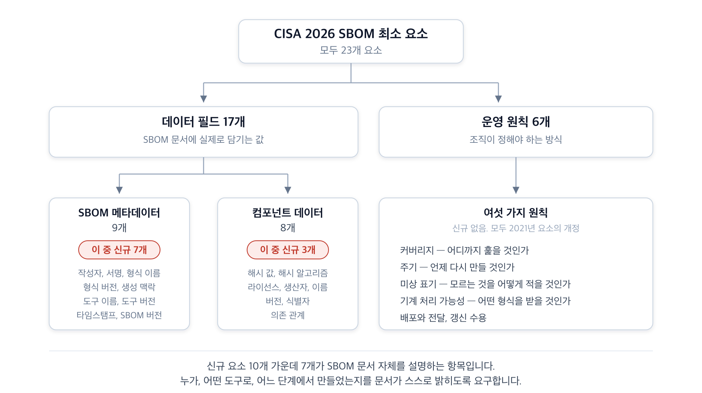
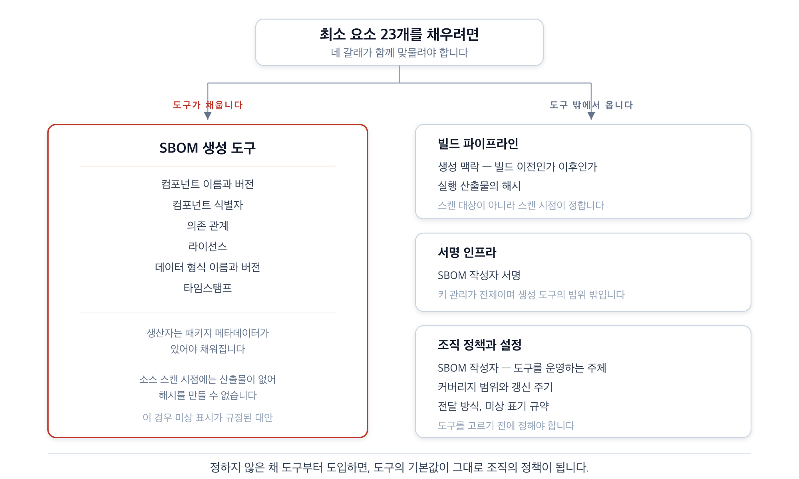
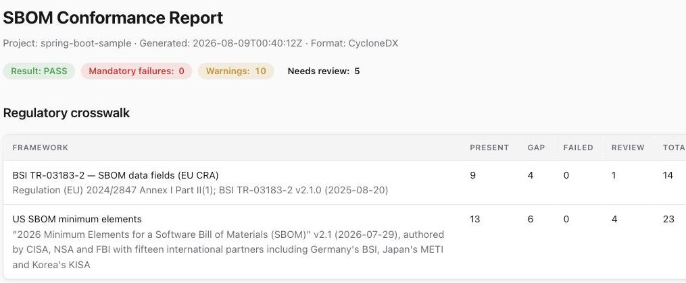

{}
이 글은 Claude Code를 이용해 작성했고, 인용한 핵심 사실은 1차 출처로 교차 검증했습니다.
{}

## 요약

2026년 7월 29일, 미국 사이버보안·인프라보안국(Cybersecurity and Infrastructure Security Agency, CISA)을 비롯한 18개 기관이 소프트웨어 자재 명세서(Software Bill of Materials, SBOM)가 최소한 담아야 할 요소(Minimum Elements) 개정판을 발행했습니다[A2](#a2). 2021년 미국 통신정보관리청(National Telecommunications and Information Administration, NTIA)이 만든 기준을 개정한 것이 아니라 대체(replaces)한다고 문서가 직접 밝힙니다.

요구 수준이 눈에 띄게 올라갔습니다. 데이터 필드가 7개에서 17개로 늘었고 운영 원칙 6개가 함께 규정됐습니다. 신규 요소만 10개입니다.

실무에서 중요한 변화는 세 가지입니다.

- 라이선스가 SBOM 최소 기준에 처음 들어왔습니다.
- 의존성은 깊이 제한 없이 전이 의존성까지 전부 기록하라는 요구가 붙었습니다.
- SBOM 문서 자체의 출처와 무결성을 밝히는 필드가 신설됐습니다.

이 문서에는 시행일도 강제력도 없습니다. 그럼에도 준비가 필요한 이유는 각국 규제가 SBOM을 요구하면서 정작 필드 목록은 열거하지 않기 때문입니다. 조달 계약에서 인용할 수 있는 다자 합의 기준이 생겼다는 점이 이 문서의 실질적 의미입니다.

준비의 성격을 오해하기 쉽습니다. 최소 요소를 채우는 일은 도구를 하나 고르는 문제가 아닙니다. 23개 요소 가운데 생성 도구가 혼자 채울 수 있는 것은 절반이 못 됩니다. 나머지는 빌드 파이프라인과 서명 인프라, 그리고 조직이 미리 정해 둔 정책이 채웁니다.

실제 도구가 어디까지 채우는지도 확인했습니다. SK텔레콤이 소프트웨어 공급망 보안을 위해 개발해 오픈소스로 공개한 SBOM 생성·관리 도구 BomLens로 23개 요소를 판정한 결과는 다음과 같습니다.

- 데이터 필드 17개 중 11개를 도구가 직접 값으로 채웁니다.
- 공급사가 보낸 SBOM을 23개 요소 기준으로 검사하고, 조직이 정할 4개는 사람 검토로 분리합니다.
- 나머지가 비는 이유는 도구의 미비가 아니라 실행 주체나 빌드 시점이 정해야 하는 값이기 때문입니다.

판정 화면은 설치 없이 [공개 데모](https://sktelecom.github.io/bomlens/demo/#/scan/FlaskDataService_3.2.0/conformance)에서 바로 확인할 수 있습니다.

## 1. 무엇이 바뀌었습니까

### 1.1 요소의 구조

최소 요소는 두 범주로 나뉩니다. SBOM 문서에 실제로 담기는 값이 데이터 필드 17개이고, 조직이 SBOM을 다루는 방식을 규정한 것이 운영 원칙 6개입니다.

**그림 1.** CISA 2026 SBOM 최소 요소의 구성 *(출처: 2026 Minimum Elements for a SBOM, 2026-07-29)*

2021년판에는 없던 범주가 SBOM 메타데이터입니다. 예전에는 작성자와 타임스탬프 정도만 물었지만, 이제는 어떤 도구로 언제 어느 단계에서 만들었고 누가 서명했는지를 문서 스스로 밝히도록 요구합니다.

### 1.2 세 가지 실질적 변화

**라이선스가 필수 항목이 됐습니다.** 2021년판 데이터 필드 7개에는 라이선스가 없었습니다. 보안과 취약점 관리를 목적으로 한 문서였기 때문입니다. 개정판은 컴포넌트 라이선스를 신규 요소로 추가하면서, 가능하면 SPDX 라이선스 식별자처럼 기계 처리 가능한 형태로 전달하고 독점 라이선스 조건의 존재도 함께 밝히라고 규정합니다. 오픈소스 프로그램 오피스(Open Source Program Office, OSPO)가 다루던 영역이 SBOM 최소 기준의 일부가 된 것입니다.

**의존성 해석의 하한이 사라졌습니다.** 2021년판의 깊이(Depth) 요소는 최상위 의존성만 요구했습니다. 개정판은 이를 커버리지(Coverage) 요소로 대체하면서 전이 의존성을 포함한 모든 구성요소를 요구하며, 일정 깊이까지만 기록하면 충분하다는 하한을 인정하지 않는다고 명시합니다. 문서는 이 변경의 이유를 솔직하게 적었습니다. 2021년의 기준은 "정보에 근거한 보안 결정에 필요한 정보의 깊이가 아니라 당시 SBOM 도구의 역량을 반영한 것"이었고, 그 사이 도구가 발전했으므로 요구를 올린다는 것입니다.

**공급자 이름이 컴포넌트 생산자로 바뀌었습니다.** 명칭 변경이 아니라 정의 변경입니다. 문서는 공급자 이름이 "실무에서, 특히 소프트웨어 배포자와 관련하여 모호한 것으로 드러났다"고 밝힙니다. 재배포자를 적어 온 관행을 중단하고 소프트웨어를 최초로 만든 주체를 가리키도록 조정한 것입니다. 오픈소스 프로젝트처럼 생산자가 불분명하면 출처 미상임을 명시하라고 요구합니다.

이 밖에 소프트웨어 식별(SWID) 태그가 인정 형식에서 빠졌습니다. 남은 것은 SPDX와 CycloneDX 둘입니다.

## 2. OSPO는 무엇을 정해야 합니까

운영 원칙 6개는 도구가 아니라 조직이 답해야 하는 항목입니다. 문서도 "조직은 SBOM을 요구하거나 제공하는 모든 정책·계약·약정에서 이 요소들을 명시적으로 다루어야 한다"고 적습니다.

### 2.1 어디까지 포함할 것인가

커버리지 요소는 전이 의존성 전부를 요구하되 코드가 아닌 파일은 제외할 수 있다고 합니다. 다만 설정 파일처럼 보안과 관련된 파일은 포함할 수 있다고 덧붙입니다. 어디까지를 보안 관련 파일로 볼지는 조직이 정해야 합니다.

판단 기준은 문서가 제시한 취약점 관리 관점이 유용합니다. SBOM 수신자가 새로 보고된 취약점과 연관된 구성요소가 목록에 없다면 그 취약점이 자신에게 영향을 주지 않는다고 결론 내릴 수 있어야 한다는 것입니다. 이 기준을 통과하지 못하는 범위 설정은 커버리지 요건을 충족하지 못합니다.

하위 구성요소마다 별도 SBOM으로 연결하는 방식도 허용되지만 조건이 붙습니다. 수신자가 연결된 모든 SBOM에 접근할 수 있어야 합니다. 링크만 걸고 접근 권한을 주지 않으면 요건을 채우지 못합니다.

### 2.2 언제 다시 만들 것인가

주기 요소는 각 소프트웨어 버전이나 갱신마다 대응하는 SBOM을 요구합니다. 새 빌드나 릴리스를 내면 새 SBOM을 만들어야 하고, 여기에는 의존성만 갱신된 빌드도 포함됩니다.

여기에 하나가 더 붙습니다. 기존 SBOM 데이터의 오류를 발견하거나 구성요소에 관한 새로운 사실을 알게 되면 개정판을 발행해야 합니다. 릴리스가 없어도 SBOM을 다시 내야 하는 경우가 생긴다는 뜻이며, 이를 위해서는 이미 배포한 SBOM이 어디로 갔는지 추적하는 수단이 필요합니다.

### 2.3 모르는 것을 어떻게 적을 것인가

미상 정보의 명시적 식별은 주요 갱신 항목입니다. 요구가 구체적입니다. 값이 없을 때 그 정보가 작성자에게 미상인지, 아니면 작성자가 알면서 보류하는지를 구분해 밝혀야 합니다.

이 구분은 수신자에게 다른 정보를 줍니다. 미상이면 공급망 추적이 거기서 끊겼다는 뜻이고, 보류라면 공급자가 알면서 주지 않는다는 뜻입니다. 문서는 후자의 경우 수신자가 문의할 수 있는 절차를 갖추라고 요구하고, 필수적인 구성요소 데이터를 보류하면 그 SBOM을 불완전한 것으로 볼 수 있다고 덧붙입니다.

실무에서는 표기 규약을 먼저 정해야 합니다. 필드를 그냥 비워 두면 셋 중 어느 경우인지 알 수 없습니다. 값이 없는 것인지, 확인하지 못한 것인지, 밝히지 않기로 한 것인지 구분되지 않습니다.

### 2.4 어떤 형식을 받을 것인가

기계 처리 가능 데이터 요소는 SPDX와 CycloneDX를 지목하면서, 널리 쓰이고 상호운용 가능한 형식을 수용하라고 합니다. 여기에 조건이 하나 붙습니다. 폐기된 버전으로 생성된 신규 소프트웨어의 SBOM은 받지 말아야 합니다.

이 조건은 수용 기준을 하나 더 만듭니다. 형식 이름만이 아니라 형식 버전까지 봐야 하며, 신규 요소인 SBOM 데이터 형식 이름과 버전이 이 판단의 근거가 됩니다.

### 2.5 계약에 무엇을 적을 것인가

위 항목들을 계약 문구로 옮기면 다음과 같이 정리됩니다.

- 요구할 형식과 최소 버전
- 전이 의존성을 포함한 커버리지 범위
- 릴리스마다의 제공 의무와 오류 발견 시 개정판 제공 의무
- 미상과 보류의 구분 표기, 그리고 보류된 항목에 대한 문의 절차

문서가 조직에 권하는 세 가지 조치도 같은 방향입니다. 갱신된 최소 요소를 충족하는 SBOM을 요구하고, 도구를 써서 SBOM 데이터를 생성·수집·분석하며, 스스로도 최소 요소를 충족하는 SBOM을 생성하라는 것입니다.

## 3. 누가 각 요소를 채웁니까

23개 요소를 누가 채우는지 나눠 보면 준비의 성격이 분명해집니다.

**그림 2.** 최소 요소 23개를 채우는 네 영역 *(출처: 원문 요소 정의를 근거로 정리)*

생성 도구가 혼자 감당할 수 있는 것은 컴포넌트 데이터 쪽입니다. 나머지는 도구 바깥에서 채워야 합니다.

**생성 맥락**은 빌드 파이프라인 안에서 기록해야 정확합니다. 소스에서 만든 SBOM은 "빌드 이전", 바이너리 분석으로 만든 SBOM은 "빌드 이후"에 해당하는데, 이 값은 스캔 대상이 아니라 스캔 시점이 결정합니다.

**컴포넌트 해시**는 실행 가능한 산출물이 있어야 계산됩니다. 소스 스캔 시점에는 그 산출물이 아직 없으므로 원천적으로 불가능하며, 문서도 이 경우 미상 표시를 규정합니다. 해시를 요구하려면 빌드 이후 단계에서 SBOM을 만들거나 갱신하는 흐름이 필요합니다.

**작성자 서명**은 키 관리가 전제입니다. 문서는 기존 소프트웨어 서명 인프라와 키 관리를 쓰라고 규정하며, 이는 SBOM 도구의 범위를 벗어납니다.

**SBOM 작성자**는 도구가 알 수 없는 값입니다. 정의가 "도구를 운영하는 주체"이므로 실행하는 쪽이 넘겨줘야 합니다.

### 3.1 어떤 형식이 신규 요소를 담습니까

신규 필드 10개를 담는 정도가 형식마다 다르므로, 어떤 형식을 쓸지 자체가 실무에서 따져야 할 결정이 됩니다[C3](#c3).

| 요소 | CycloneDX 1.6 | SPDX 2.3 | SPDX 3.0 |
|---|---|---|---|
| SBOM 생성 맥락 | `metadata.lifecycles[].phase` | 전용 필드 없음 | `software_Sbom.sbomType` |
| SBOM 작성자 서명 | 루트 `signature`에 내장 | 문서 내 규격 없음 | 서명 클래스 없음 |
| SBOM 버전 | 정수 + `serialNumber` | 문서 정체성 변경으로 처리 | 문서 정체성 + `amendedBy` |
| SBOM 도구 버전 | `tools.components[].version` | 생성자 문자열에 내장 | 전용 속성 없음 |
| 미상 표기 | 전역 표지 없음, 규약 필요 | `NOASSERTION` | `NOASSERTION` |

**표 1.** 신규 요소의 형식별 표현 가능 여부 *(출처: RunSafe Security 필드 매핑 분석, 2026)*

CycloneDX가 신규 메타데이터 쪽에서 유리합니다. 생성 맥락과 서명이 네이티브 필드로 있고, 원문이 예시로 든 수명주기 단계 어휘가 그대로 대응합니다.

반대로 미상 표기에는 SPDX 쪽에 더 나은 수단이 있습니다. `NOASSERTION`이라는 표준 표지가 있어 "값 없음"과 "확인하지 못함"을 구분할 수 있는데, CycloneDX에는 같은 층위의 표지가 없어 속성이나 주석으로 규약을 따로 정해야 합니다. 그런데 미상 표기는 이번 개정에서 요구가 강화된 항목입니다.

지금 시점의 판단은 이렇습니다. 최소 요소를 가장 온전히 담는 조합은 CycloneDX 1.6이되, 미상 표기 규약을 조직이 정해 두어야 합니다. SPDX를 주 형식으로 쓰는 조직은 2.3에 생성 맥락과 서명을 담을 자리가 없으므로 3.0 이행을 검토할 시점입니다.

## 4. 규제와의 관계

최소 요소 자체에는 법적 구속력이 없습니다. 면책 조항이 이 간행물은 "컴플라이언스·규제·법률 목적의 조언으로 의도되지 않았다"고 밝힙니다.

실질적인 영향력은 참조 관계에서 생깁니다. 유럽연합 사이버 복원력법(Cyber Resilience Act, 규정 (EU) 2024/2847)은 제조자에게 기술 문서의 일부로 SBOM 제공을 요구하지만 필드 목록을 조문에 열거하지 않습니다[A5](#a5). 독일 BSI TR-03183-2가 그 공백을 구체적인 기술 요구사항으로 채웠고, 인도 CERT-In과 일본 경제산업성도 각자의 가이드를 냈습니다. 최소 요소는 이들이 공통으로 참조하는 기준입니다. 2026년 9월 11일 시행되는 사이버 복원력법의 취약점 보고 의무는 별도 글에서 다뤘습니다[D2](#d2).

한 가지 유의할 점이 있습니다. 유럽위원회 통신네트워크·콘텐츠·기술총국(DG CONNECT)이 작성에 기여했지만, 문서 각주는 이 문서가 유럽연합 법을 해석하지 않고 위원회를 구속하지 않으며 모든 요소가 연합 법을 반영하지는 않는다고 밝힙니다. 사이버 복원력법 준수 근거로 이 문서를 그대로 쓸 수는 없습니다.

용어에서 혼동하기 쉬운 부분도 하나 있습니다. 원문 각주는 컴포넌트 생산자의 "생산자(producer)"를 사이버 복원력법의 "제조자(manufacturer)"와 혼동하지 말라고 명시합니다. 모든 제조자는 생산자이지만 모든 생산자가 제조자는 아닙니다. 두 제도를 함께 다루는 문서에서는 용어를 구분해 써야 합니다.

한국은 국가정보원 산하 국가사이버안보센터와 한국인터넷진흥원 두 기관이 공동 저작에 참여했습니다. 이 참여는 국내 조달과 사내 정책에서 이 문서를 인용할 근거가 됩니다. 정부 합동 소프트웨어 공급망 보안 강화 로드맵이 2026년 6월 발표된 직후에 국제 공통 기준이 갱신됐으므로, 국내 제도가 요구 필드를 구체화할 때 참조할 기준이 하나 생긴 셈입니다.

AI 시스템을 다루는 조직은 순서를 기억해 둘 만합니다. 원문은 AI 전용 요소를 도입하지 않고 G7 공동 가이던스에 맡겼습니다[A10](#a10). 두 문서는 상하 관계이며, 일반 소프트웨어 기준인 이 문서를 먼저 채운 뒤 AI 추가 요소를 더하는 순서입니다.

## 5. 실제 도구는 지금 어디까지 채웁니까

기준을 읽는 일과 도구가 그 기준을 실제로 채우는지 확인하는 일은 별개입니다. 형식에 자리가 있어도 도구가 값을 넣지 않으면 빈 필드로 남기 때문입니다.

SK텔레콤이 소프트웨어 공급망 보안을 위해 자체 개발해 오픈소스로 공개한 SBOM 생성·관리 도구 BomLens로 23개 요소를 전부 판정해 봤습니다. 추정이 아니라 실제 스캔 산출물과 소스 코드를 근거로 삼았습니다[D1](#d1). 글쓴이는 이 도구를 개발한 조직에 속해 있으므로, 아래 수치는 판정 근거를 함께 밝히고 채우지 못하는 항목도 그대로 적었습니다.

### 5.1 도구가 값으로 채우는 항목

데이터 필드 17개 가운데 11개를 도구가 직접 채웁니다.

- SBOM 메타데이터: 데이터 형식 이름과 버전, 생성 맥락, 타임스탬프, 도구 이름, SBOM 버전
- 컴포넌트 데이터: 이름, 버전, 식별자, 라이선스, 의존 관계

이 가운데 세 항목은 채우는 방식이 최소 요소의 요구와 직접 관련되어 있습니다.

- 생성 맥락은 입력 종류로 자동 판별합니다. 소스 스캔은 `pre-build`, 컨테이너와 바이너리 스캔은 `post-build`로 기록하므로 사용자가 값을 고를 필요가 없습니다.
- 라이선스는 소스 경로에서 98.4%, 컨테이너 경로에서 94.7%를 채웁니다. 소스 쪽은 패키지 매니페스트에서, 컨테이너 쪽은 운영체제 패키지 데이터베이스에서 읽습니다.
- 도구 이름에는 BomLens 자신과 하위 생성기를 함께 적습니다. 최소 요소가 요구하는 것은 SBOM을 생성하거나 수정한 도구이므로 둘 다 남깁니다.

운영 원칙 6개 중에서는 기계 처리 가능성과 배포·전달을 충족합니다. CycloneDX 1.6을 기본 형식으로 내고 SPDX 2.3 변환을 지원하므로, 최소 요소가 지정한 두 형식을 모두 다룹니다.

### 5.2 도구가 채울 수 없는 항목

나머지 항목이 비어 있는 이유는 도구의 미비가 아니라 3장에서 정리한 구조 때문입니다.

- SBOM 작성자와 작성자 서명: 실행하는 주체가 값을 넘겨야 합니다. 작성자는 `--sbom-author`로 받고, 서명은 cosign을 쓰는 별도 옵션입니다.
- 컴포넌트 해시: 소스 스캔 시점에는 해시를 걸 실행 산출물이 존재하지 않습니다. 컨테이너와 펌웨어처럼 산출물이 있는 경로에서는 스캔 대상 자체에 해시를 붙입니다.
- 컴포넌트 생산자: 패키지 메타데이터에 생산자 정보가 있어야 채워집니다. 소스 경로 60.9%, 컨테이너 경로 94.7%입니다.

값이 없을 때의 처리가 최소 요소 관점에서 중요합니다. 이 도구는 작성자를 지정하지 않으면 `unknown`을 적지 않고 필드를 비운 뒤, 문서 수준에 "비어 있는 필드는 작성자가 확인하지 못한 것"이라는 선언을 남깁니다. 최소 요소가 정의한 작성자는 도구를 운영하는 주체이고 그 주체는 자신이 누구인지 알고 있으므로, 도구가 `unknown`을 적으면 미상 표기가 아니라 사실과 다른 진술이 되기 때문입니다. 해시도 같은 원칙으로 값을 지어내지 않습니다.

### 5.3 받은 SBOM을 최소 요소로 판정하는 기능

공급사가 보낸 SBOM을 23개 요소 기준으로 검사하는 기능도 있습니다. 판정 결과는 세 갈래로 나옵니다.

**그림 3.** 적합성 판정 화면. 23개 요소를 모두 판정 대상에 넣고, 도구가 판단할 수 없는 4개는 사람 검토로 분리한다 *(BomLens 1.10.3 산출, 2026-08-09)*

- 충족 13개 — 데이터 필드 11개에 운영 원칙 2개를 더한 값입니다.
- 미달 6개 — 5.2에서 정리한 항목들입니다.
- 사람 검토 4개 — 커버리지, 갱신 반영(Accommodation of Updates to SBOM Data), 배포·전달, 주기입니다. 조직이 정하는 항목이므로 도구가 판정하지 않고 사람에게 넘깁니다.

도구가 판단할 수 없는 것을 통과로 처리하지 않고 따로 분리한다는 점이 실무에서 유용합니다. 사람 검토로 표시된 4개가 곧 2장에서 다룬 조직의 결정 사항과 겹칩니다.

같은 화면을 [공개 데모](https://sktelecom.github.io/bomlens/demo/#/scan/FlaskDataService_3.2.0/conformance)에서 직접 열어볼 수 있습니다. 설치 없이 브라우저에서 바로 볼 수 있고, 요소마다 무엇이 부족한지와 어떻게 채우는지가 항목별로 붙어 있습니다. 다만 데모에 담긴 것은 공급사가 제출한 SBOM을 검사한 결과여서 위 그림과는 대상이 다릅니다.

### 5.4 남은 항목

최소 요소를 온전히 채우기까지 남은 것도 있습니다.

- 도구 버전이 릴리스 번호가 아니라 이미지 태그로 기록됩니다. 최소 요소는 특정 코드 전달분을 식별할 수 있는 값을 요구합니다.
- SBOM 버전이 재생성해도 1로 고정되어 개정 관계를 표현하지 못합니다. 갱신 반영 요소와 직접 연결되는 항목인데, 로컬에서 동작하는 도구가 이전 산출물의 위치를 알 수 없다는 제약이 있어 사용자가 지정하는 방식이 현실적인 대안입니다.

## 6. 결론

최소 요소 개정판이 요구하는 것은 더 많은 필드가 아니라 다른 종류의 준비입니다.

라이선스가 최소 기준에 들어오면서 SBOM은 보안 부서만의 문서가 아니게 됐습니다. 라이선스 식별자를 기계 처리 가능한 형태로 채우고, 독점 조건의 존재를 밝히고, 모르는 경우 모른다고 적는 일은 OSPO의 업무 방식 그대로입니다. 달라진 것은 그 결과가 SBOM이라는 표준 형식으로 나가야 한다는 점입니다.

준비의 상당 부분은 도구를 고르기 전에 끝나야 합니다. 조직이 정해야 하는 항목은 네 가지입니다.

- 어디까지 포함할 것인가
- 언제 다시 만들 것인가
- 모르는 것을 어떻게 표기할 것인가
- 어떤 형식과 버전을 받을 것인가

이 항목들을 정하지 않은 채 도구부터 도입하면 도구가 만들어 주는 기본값이 그대로 조직의 정책이 됩니다.

도구에 요구할 것과 요구할 수 없는 것도 구분해야 합니다. 소스 스캔 도구에 실행 산출물의 해시를 요구할 수는 없고, 어떤 도구도 조직의 이름을 대신 정해 줄 수 없습니다. 채울 수 없는 값을 채우라고 요구하면 도구는 그럴듯한 값을 지어내게 되고, 그것은 최소 요소가 금지하는 방향입니다.

쓰고 있는 도구가 무엇을 채우고 무엇을 비워 두는지는 한 번 확인해 둘 만합니다. 형식 지원 여부와 필드 충족은 다른 문제이고, 그 차이는 산출물을 직접 열어 봐야 드러납니다. 확인해 볼 도구가 마땅치 않다면 5장에서 다룬 BomLens가 출발점이 됩니다. 오픈소스로 공개되어 있어 누구나 내려받아 쓸 수 있고, 생성한 SBOM이 23개 요소를 어디까지 채우는지와 공급사가 보낸 SBOM이 기준을 충족하는지를 같은 화면에서 확인할 수 있습니다.

## 참고문헌

**A2.** Cybersecurity and Infrastructure Security Agency 외 17개 기관 (2026). *2026 Minimum Elements for a Software Bill of Materials (SBOM)*. v2.1, 2026년 7월 29일 발행, TLP:CLEAR. <https://www.cisa.gov/sites/default/files/2026-07/2026_cisa_sbom_minimum_elements_508c.pdf>. <a href="#a2-ref-1" onclick="event.preventDefault(); history.back(); return false;" title="본문으로 돌아가기">↩</a>

**A5.** European Parliament and Council (2024). *Regulation (EU) 2024/2847 — Cyber Resilience Act*. Official Journal of the European Union, 2024년 10월 23일. <https://eur-lex.europa.eu/legal-content/EN/TXT/?uri=OJ:L_202402847>. <a href="#a5-ref-1" onclick="event.preventDefault(); history.back(); return false;" title="본문으로 돌아가기">↩</a>

**A10.** G7 Cybersecurity Working Group / CISA 외 (2026). *Software Bill of Materials for AI — Minimum Elements*. 2026년 5월 12일 발행, TLP:CLEAR. <https://www.cisa.gov/resources-tools/resources/software-bill-materials-ai-minimum-elements>. <a href="#a10-ref-1" onclick="event.preventDefault(); history.back(); return false;" title="본문으로 돌아가기">↩</a>

**A1.** National Telecommunications and Information Administration (2021). *The Minimum Elements For a Software Bill of Materials (SBOM)*. 2021년 7월 12일 발행. <https://www.ntia.gov/report/2021/minimum-elements-software-bill-materials-sbom>.

**A3.** Federal Register (2025). *Request for Comment on 2025 Minimum Elements for a Software Bill of Materials*. 2025년 8월 22일 게재, 의견수렴 2025년 10월 3일 마감. <https://www.federalregister.gov/documents/2025/08/22/2025-16147/request-for-comment-on-2025-minimum-elements-for-a-software-bill-of-materials>.

**B1.** SPDX. *The System Package Data Exchange*. <https://spdx.dev/>. ISO/IEC 5962:2021.

**B2.** CycloneDX. <https://cyclonedx.org/>. Ecma International, *ECMA-424: CycloneDX Bill of Materials Specification*, 2025년 12월.

**C3.** RunSafe Security (2026). *Mapping CISA's 2026 SBOM Minimum Elements to CycloneDX and SPDX*. <https://runsafesecurity.com/blog/sbom-minimum-elements-cyclonedx-spdx/>. — 본문 표 1의 근거입니다. 형식별 필드 대응은 이 분석을 옮긴 것이며 명세 원문과 직접 대조하지는 않았습니다. <a href="#c3-ref-1" onclick="event.preventDefault(); history.back(); return false;" title="본문으로 돌아가기">↩</a>

**D1.** BomLens. SK텔레콤이 소프트웨어 공급망 보안을 위해 개발해 공개한 SBOM 생성·관리 도구, Apache-2.0. <https://github.com/sktelecom/bomlens>. 5장의 충족 현황은 이 도구 1.10.3으로 실제 스캔한 산출물과 소스 코드를 근거로 판정했습니다. <a href="#d1-ref-1" onclick="event.preventDefault(); history.back(); return false;" title="본문으로 돌아가기">↩</a>

**D2.** [EU 사이버 복원력법(CRA) 취약점 보고 의무 — 2026-09-11 시행 대비 조사보고서]() (2026-06-09 갱신). <a href="#d2-ref-1" onclick="event.preventDefault(); history.back(); return false;" title="본문으로 돌아가기">↩</a>
