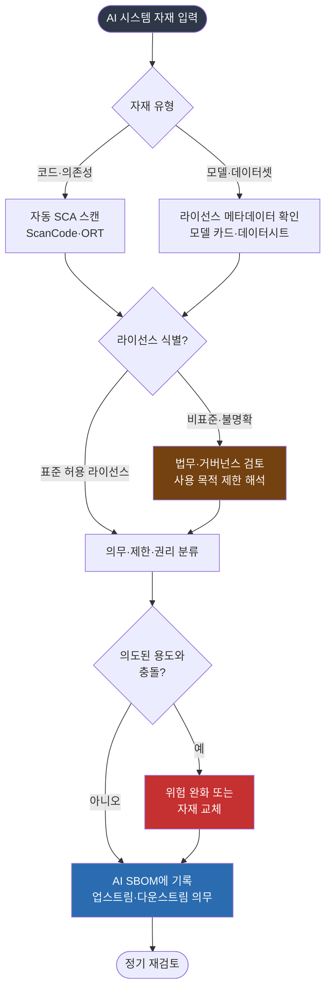

{}
이 조항은 **Phase 2 — AI 확장 프로세스** 단계에서 구축한다.
[전체 구축 로드맵 보기](../../#단계별-구축-로드맵)
{}

## 1. 조항 개요

라이선스 의무는 AI SBOM 가이드가 ISO/IEC 5230에서 가장 크게 확장된 지점이다. 전통적 오픈소스
컴플라이언스가 코드의 라이선스를 검토했다면, AI에서는 검토 대상이 네 갈래로 늘어난다. AI
시스템의 코드, 모델 가중치, 데이터셋(학습·테스트·검증 데이터셋을 포함), 그리고 AI 시스템 자체의
라이선스다. 한 모델이 다른 여러 모델에서 파생되는 일이 흔해, 모델 트리(Model Tree)에 놓인 각
상위 모델이 저마다 고유한 라이선스를 가진다.

3.5는 이 라이선스들을 검토해 AI 시스템의 의도된 용도에 비추어 각 라이선스가 부여하는 의무,
제한, 권리를 판단하는 절차를 갖출 것을 요구한다. 검토는 상위(업스트림)에서 물려받는 의무와
하위(다운스트림)로 넘기는 의무를 모두 다룬다.

## 2. 해야 할 활동

- 코드, 가중치, 데이터셋, AI 시스템 자체의 라이선스를 식별하는 절차를 수립한다.
- 모델 트리의 상위 모델별 라이선스를 추적하고, 각 라이선스의 의무·제한·권리를 문서화한다.
- 소스 코드와 의존성은 자동 스캔 도구로 1차 식별한다. *([본 가이드 권고])*
- 모델 가중치와 데이터셋, 비표준 라이선스는 법무 또는 거버넌스 검토로 판단한다. *([본 가이드 권고])*
- 외부에서 모델이나 데이터셋을 도입할 때 라이선스 메타데이터를 함께 받는 인입 절차를 둔다.
  *([본 가이드 권고])*
- 검토 결과(의무, 제한, 권리)를 AI SBOM에 기록해 추적한다.

## 3. 요구사항 및 입증자료

| 조항 번호 | 요구사항 (KO) | 입증자료 |
|-----------|--------------|---------|
| 3.5 | AI 시스템의 코드, 가중치, 데이터셋, 그리고 AI 시스템 자체의 라이선스를 검토해, 의도된 용도를 고려해 각 라이선스가 부여하는 의무, 제한, 권리를 판단하는 절차가 존재해야 한다. 모델 트리의 상위 모델이 각자 고유한 라이선스를 가질 수 있음에 유의한다. | **3.5.1** 식별된 각 라이선스가 부여하는 업스트림 및 다운스트림의 의무, 제한, 권리를 적절히 검토·문서화하는 문서화된 절차 |

<details><summary>영문 원문 보기</summary>

> **3.5 License obligations**
> A process shall exist for reviewing the relevant identified licenses for an AI system's code,
> weights, and datasets (including but not limited to training, testing, and verification datasets)
> as well as the license for the AI system itself to determine the obligations, restrictions, and
> rights granted by each license, taking into account the intended use of the AI system. Note that
> it's often the case that an AI system is trained on multiple other AI systems that may be
> identified in the AI system Model Tree for example; each of these may have their own licenses.
>
> **Verification material(s):**
> - A documented procedure to review and document upstream and downstream obligations,
>   restrictions, and rights granted by each identified license, as appropriate.

</details>

## 4. 입증자료별 준수 방법 및 샘플

### 3.5.1 라이선스 의무 검토·문서화 절차

**준수 방법**

검토 절차는 자재 유형에 따라 자동화 수준이 다르다는 점을 전제로 설계한다. 소스 코드와 의존성
라이선스는 FOSSology, ScanCode, OSS Review Toolkit 같은 자동 스캔 도구로 상당 부분 식별할 수
있다. 그러나 모델 가중치와 데이터셋의 라이선스, 그리고 모델 트리의 파생 관계는 이런 도구의
적용 범위 밖이거나 정확도가 낮다. 비표준 라이선스의 사용 목적 제한은 사람의 해석이 필요하다.
따라서 자동 스캔으로 1차 식별하고, 모델과 데이터셋과 비표준 라이선스는 법무 또는 거버넌스
검토로 넘기는 분업 구조가 현실적이다.

아래 그림은 자재가 들어올 때 라이선스 의무를 판단하는 의사결정 흐름이다.



**그림 1.** 라이선스 의무 검토 의사결정 흐름

**고려사항**

- **인입 게이트에서 메타데이터 강제**: 라이선스 의무가 누락되는 가장 큰 원인은 모델이 다운스트림
  으로 전파되며 출처와 라이선스 정보가 소실되는 라이선스 드리프트(license drift)다. 한 연구는
  모델에서 애플리케이션으로 넘어가는 전이에서 제한 조항의 상당수가 사라진다고 보고한다
  ([arXiv:2509.09873](https://arxiv.org/abs/2509.09873)). 다운스트림에서 복원하려 애쓰기보다,
  사내 모델·데이터셋 레지스트리에서 라이선스 메타데이터가 없는 자재의 인입을 막는 편이 효과적이다.
  *([본 가이드 권고])*
- **비표준 라이선스는 정책으로 선결정**: Llama 커뮤니티 라이선스나 OpenRAIL 계열의 행동 사용
  제한은 준수 여부를 사후에 자동 추적하기 어렵다. [3.1 정책](../../1-program-foundation/1-policy/)의
  허용·금지 목록으로 도입 시점에 결정한다. *([본 가이드 권고])*
- **모델 트리 추적**: 도입 모델이 어떤 상위 모델에서 파생되었는지를 모델 카드로 확인하고, 상위
  모델의 라이선스 의무가 하위로 전파되는지 검토한다.
- **데이터셋 사용 제한 확인**: CC-BY-NC 같은 비상업 라이선스 데이터셋을 상업 제품의 학습에
  사용했는지 점검한다. 데이터셋 라이선스 누락과 오기재가 흔하므로 원문으로 대조한다.
- **자동화 한계 인지**: 자동 스캔 도구의 결과를 최종 판단으로 삼지 않는다. 도구는 식별을 돕고,
  의무의 해석과 충돌 판단은 사람이 맡는다.

**샘플**

아래는 라이선스 의무 검토 절차서의 핵심 부분 샘플이다. 이 절차 문서가 입증자료 3.5.1이 된다.

```
## AI 라이선스 의무 검토 절차

### 1. 검토 대상
- AI 시스템 코드 및 의존성
- 모델 가중치 (도입 모델, 파인튜닝 모델)
- 데이터셋 (학습·테스트·검증)
- 모델 트리 상위 모델의 라이선스

### 2. 검토 단계
1) 자동 식별: 코드와 의존성은 SCA 도구로 라이선스를 스캔한다.
2) 메타데이터 수집: 모델과 데이터셋은 모델 카드·데이터시트에서 라이선스를 수집한다.
   메타데이터가 없으면 인입을 보류한다.
3) 분류: 식별된 라이선스를 정책의 허용·조건부·금지 목록에 대조한다.
4) 법무 검토: 비표준·불명확 라이선스는 법무·거버넌스 검토로 의무를 해석한다.
5) 기록: 업스트림·다운스트림 의무, 제한, 권리를 AI SBOM에 기록한다.

### 3. 책임과 주기
- 1차 식별: 개발 담당
- 의무 해석: 법무·AI 거버넌스 책임자
- 재검토: 모델·데이터셋 교체 시, 그리고 최소 분기 1회
```

## 5. 참고

- 라이선스 허용·금지 목록 정책: [3.1 정책](../../1-program-foundation/1-policy/)
- 검토 결과를 기록할 AI SBOM: [3.9 AI SBOM](../3-ai-sbom/)
- 자동 스캔 도구: [도구 — FOSSology](../../../tools/1-fossology/), [SCANOSS](../../../tools/9-scanoss/)
- AI 모델·데이터셋 라이선스 전략: [기업 오픈소스 관리 가이드 — AI 컴플라이언스](../../../opensource_for_enterprise/7-ai-compliance/)
