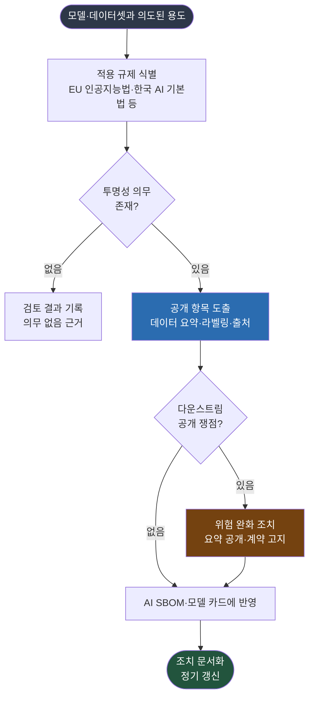

{}
이 조항은 **Phase 2 — AI 확장 프로세스** 단계에서 구축한다.
[전체 구축 로드맵 보기](../../#단계별-구축-로드맵)
{}

## 1. 조항 개요

라이선스 의무(3.5)가 "이 자재를 쓸 권리가 있는가"를 묻는다면, 투명성 의무는 "이 자재에 대해
무엇을 공개해야 하는가"를 묻는다. 두 의무는 다른 출처에서 온다. 라이선스 의무는 저작권자가
계약으로 부과하고, 투명성 의무는 규제가 법으로 부과한다.

3.6은 규제로부터 부과되는 투명성 의무가 있는지 검토하는 절차를 갖출 것을 요구한다. 검토
대상에는 학습·테스트·검증 데이터셋이 포함되며, 모델의 의도된 용도를 고려한다. 학습 데이터의
사용 사례가 투명성 쟁점(예: 다운스트림 수령자에 대한 공개 의무)을 야기하면 적절한 위험 완화
조치를 취해야 한다. EU 인공지능법이 2026년 8월부터 투명성 의무를 본격 적용하면서 이 조항의
실무 비중이 커지고 있다.

## 2. 해야 할 활동

- 도입·개발하는 AI 시스템에 적용되는 투명성 규제를 식별하는 절차를 둔다.
- 학습·테스트·검증 데이터셋에 공개 의무가 걸리는지 의도된 용도를 기준으로 검토한다.
- 다운스트림 수령자에 대한 공개 의무가 있으면 위험 완화 조치를 정한다.
- 취한 투명성 조치를 문서화한다.
- 규제기관이 정한 최신 투명성 의무를 정기적으로 갱신해 반영한다. *([본 가이드 권고])*

## 3. 요구사항 및 입증자료

| 조항 번호 | 요구사항 (KO) | 입증자료 |
|-----------|--------------|---------|
| 3.6 | 학습·테스트·검증 데이터셋을 포함해, 모델의 의도된 용도를 고려해 규제로부터 부과되는 투명성 의무가 있는지 검토하는 절차가 존재해야 한다. 투명성 쟁점(예: 다운스트림 공개 의무)이 있으면 위험 완화 조치를 취해야 한다. | **3.6.1** 취해진 투명성 조치를 검토·문서화하는 문서화된 절차 |

<details><summary>영문 원문 보기</summary>

> **3.6 Transparency obligations**
> A process shall exist for reviewing if there are any transparency obligations from regulations
> including but not limited to training, testing, and verification datasets, taking into account the
> intended use of the model. If the use case for the training data creates a relevant issue (e.g.,
> disclosure obligations to downstream recipients) in the context of transparency, then appropriate
> risk mitigation measures should be undertaken.
>
> **Verification material(s):**
> - A documented procedure to review and document the transparency measures undertaken.

</details>

## 4. 입증자료별 준수 방법 및 샘플

### 3.6.1 투명성 의무 검토·문서화 절차

**준수 방법**

투명성 의무는 규제마다 다르므로, 먼저 어떤 규제가 적용되는지부터 식별한다. 적용 규제가 정해지면
각 규제가 요구하는 공개 항목을 도출하고, 그 항목을 AI SBOM이나 모델 카드에 반영한다. 라이선스
의무와 달리 투명성 의무는 "공개"가 핵심이므로, 산출물이 외부에 전달될 수 있는 형태로 정리되어야
한다.

아래 표는 AI SBOM과 교차하는 주요 투명성 의무다. 규제 일정과 전체 맥락은
[3.10 거버넌스](../../4-governance/1-governance/)의 규제 매트릭스에서 함께 관리한다.

**표 1.** AI SBOM과 교차하는 투명성 의무 (2026-06 기준)

| 출처 | 투명성 의무 | AI SBOM·모델 카드 반영 |
|---|---|---|
| EU 인공지능법 Article 53 (GPAI) | 학습 데이터 요약 공개, 저작권 옵트아웃 존중 | 데이터셋 출처와 라이선스, 옵트아웃 처리 기록 |
| EU 인공지능법 Article 50 | AI 생성 콘텐츠 라벨링, AI 상호작용 고지 | 출력물 표시 정책 |
| 한국 AI 기본법 | 고영향·생성형 AI 표시 의무, 학습 데이터 출처 공개 | 모델 카드의 표시와 출처 항목 |
| 라이선스 유래 표기 | "Built with Llama" 표기, 파생 모델명 명시 등 | 라이선스 의무(3.5)와 함께 추적 |

다음 그림은 자재의 의도된 용도에서 투명성 의무를 도출하는 검토 흐름이다.



**그림 1.** 투명성 의무 검토 흐름

**고려사항**

- **데이터셋 출처가 핵심**: 투명성 의무의 다수가 학습 데이터에 걸린다. 데이터셋의 출처와
  라이선스가 AI SBOM에 기록되어 있어야 공개 의무를 이행할 수 있다. AI SBOM(3.9)과 직접 연결된다.
- **의도된 용도가 기준**: 같은 모델이라도 사용 사례에 따라 투명성 의무가 달라진다. 고위험
  용도나 일반 공중 대상 서비스는 의무가 무거워진다.
- **다운스트림 공개 의무**: 외부에 모델이나 시스템을 공급할 때 수령자에게 알려야 할 정보가
  있는지 검토한다. 위험 완화는 학습 데이터 요약 공개나 계약상 고지로 이행할 수 있다.
- **규제 변화 반영**: EU 인공지능법은 2026년 8월부터 투명성 의무를 적용하므로, 시점에 맞춰
  절차를 갱신한다. 갱신 책임은 거버넌스(3.10)가 관리한다.

**샘플 (투명성 의무 검토 절차)**

아래는 투명성 의무 검토 절차서의 핵심 부분 샘플이다. 이 절차 문서가 입증자료 3.6.1이 된다.

```
## 투명성 의무 검토 절차

### 1. 적용 규제 식별
AI 시스템의 의도된 용도와 배포 지역을 기준으로 적용 규제를 식별한다.
(예: EU 시장 배포 → EU 인공지능법, 국내 고영향 AI → 한국 AI 기본법)

### 2. 공개 항목 도출
규제별 투명성 의무를 공개 항목으로 정리한다.
- 학습 데이터 요약 (EU 인공지능법 Article 53)
- AI 생성·상호작용 표시 (EU 인공지능법 Article 50, 한국 AI 기본법)
- 데이터 출처 공개 (한국 AI 기본법)

### 3. 다운스트림 검토
외부 공급 시 수령자에게 전달할 정보를 검토하고, 필요한 위험 완화 조치를 정한다.

### 4. 반영과 문서화
도출한 공개 항목을 AI SBOM과 모델 카드에 반영하고, 취한 조치를 기록한다.

### 5. 책임과 주기
- 검토: 법무·AI 거버넌스 책임자
- 갱신: 규제 시행 일정 변경 시, 그리고 최소 반기 1회
```

## 5. 참고

- 라이선스 의무와의 구분: [3.5 라이선스 의무](../1-license-obligations/)
- 공개 항목을 담을 AI SBOM: [3.9 AI SBOM](../3-ai-sbom/)
- 규제 일정과 거버넌스: [3.10 거버넌스](../../4-governance/1-governance/)
- AI 모델 라이선스와 표시 의무: [기업 오픈소스 관리 가이드 — AI 컴플라이언스](../../../opensource_for_enterprise/7-ai-compliance/)
