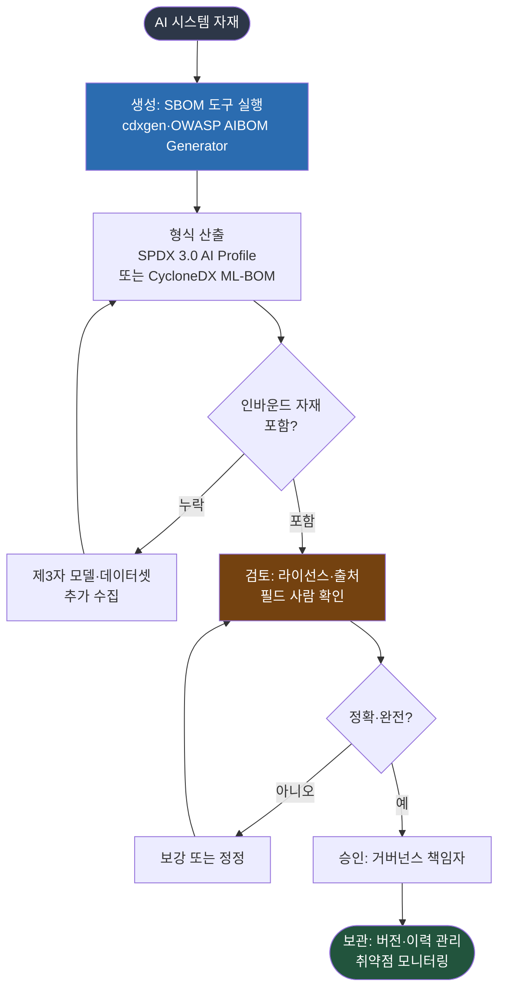

{}
이 조항은 **Phase 2 — AI 확장 프로세스** 단계에서 구축한다.
[전체 구축 로드맵 보기](../../#단계별-구축-로드맵)
{}

## 1. 조항 개요

AI SBOM(AI System Bill of Materials)은 AI 시스템을 구성하는 요소와 그 정보를 담은 목록이다.
전통적 SBOM이 소프트웨어 컴포넌트를 기록한다면, AI SBOM은 여기에 모델, 가중치, 데이터셋,
하이퍼파라미터를 더한다. 3.9는 AI SBOM을 생성하고 관리하는 절차를 갖출 것을 요구한다.

형식은 정해두지 않는다. 규격은 SPDX, CycloneDX, 또는 그 밖의 형식 등 어떤 것이든 무방하다고
명시한다. 다만 한 가지 의무가 있다. AI SBOM은 제3자로부터 유입되는 자재(inbound materials)를
반영해야 한다. 외부에서 도입한 사전학습 모델과 데이터셋이 빠지면 라이선스 의무([3.5](../1-license-obligations/))와
투명성 의무를 추적할 근거가 사라지기 때문이다.

AI SBOM 영역은 "생성은 도구로 자동화되지만, 정확성과 준수 판단은 사람이 채운다"는 경계가
가장 뚜렷한 곳이다. 이 페이지는 그 경계를 따라 절차를 안내한다.

## 2. 해야 할 활동

- AI 시스템의 구성요소(모델, 데이터셋 등)에 대한 식별, 추적, 검토, 승인, 보관 절차를 수립한다.
- AI SBOM 형식을 정한다(SPDX 3.0 AI Profile 또는 CycloneDX ML-BOM 권장). *([본 가이드 권고])*
- 제3자에게서 유입되는 모델과 데이터셋을 AI SBOM에 반드시 포함한다.
- 생성 도구를 CI/CD에 연동해 AI SBOM을 반복 생성한다. *([본 가이드 권고])*
- 생성된 AI SBOM의 라이선스와 출처 필드가 정확한지 사람이 검토한다. *([본 가이드 권고])*
- 절차가 준수되었음을 입증하는 기록(생성 이력, 승인 이력)을 보관한다.

## 3. 요구사항 및 입증자료

| 조항 번호 | 요구사항 (KO) | 입증자료 |
|-----------|--------------|---------|
| 3.9 | AI SBOM을 생성·관리하는 절차가 존재해야 한다. 형식은 SPDX, CycloneDX 등 어떤 것이든 무방하다. AI SBOM은 제3자로부터 유입되는 자재를 반영해야 한다. | **3.9.1** AI 시스템의 구성요소(모델, 데이터셋 등)에 관한 정보를 식별, 추적, 검토, 승인, 보관하는 문서화된 절차<br>**3.9.2** 공급 시스템에 대해 해당 절차가 적절히 준수되었음을 입증하는 기록 |

<details><summary>영문 원문 보기</summary>

> **3.9 AI System Bill of Materials**
> A process shall exist for creating and managing an AI SBOM, this can be in any format e.g. SPDX,
> CycloneDX, or another format. The AI SBOM shall account for inbound materials from third-parties.
>
> **Verification material(s):**
> - A documented procedure for identifying, tracking, reviewing, approving, and archiving
>   information related to the components of an AI system (e.g., model, datasets, etc).
> - Records for the supplied system that demonstrates the documented procedure was properly followed.

</details>

## 4. 입증자료별 준수 방법 및 샘플

### 3.9.1 AI SBOM 관리 절차 (식별, 추적, 검토, 승인, 보관)

**준수 방법**

AI SBOM 절차는 생성, 검토, 승인, 보관의 네 단계로 설계한다. 생성 단계는 도구로 자동화하고,
검토와 승인 단계는 사람이 맡는다. 도구가 모델 카드의 라이선스 필드를 그대로 옮겨 적더라도,
그 라이선스가 실제 사용 사례에 맞는지, 누락이나 오기재는 없는지는 도구가 판단하지 못하기
때문이다.

아래 그림은 AI SBOM 생성에서 보관까지의 흐름이다.



**그림 1.** AI SBOM 생성에서 보관까지의 절차

**도구 매핑**

각 단계에 활용할 수 있는 오픈소스 도구다. "자동화 수준"은 그 작업을 도구가 어디까지 대신하는지를
나타낸다.

| 단계 | 작업 | 자동화 수준 | 대표 도구 |
|------|------|------------|-----------|
| 생성 | 코드·의존성 BOM | 성숙 | cdxgen, Syft |
| 생성 | 모델·메타데이터 AIBOM | 도구 등장 | OWASP AIBOM Generator, cdxgen `aibom` |
| 분석 | 모델 바이너리 정적 검사 | 도구 등장 | Lab700x AI SBOM Scanner |
| 관리 | SBOM 저장·취약점 모니터링 | 성숙 | Dependency-Track, SW360 |
| 검토 | 라이선스·출처 정확성 판단 | 사람·정책 | 도구 보완 단계 |

각 도구의 설치와 사용법, 실행 화면은 [도구](../../5-tools/) 절에서 자세히 다룬다([OWASP AIBOM
Generator](../../5-tools/1-aibom-generator/), [cdxgen](../../5-tools/2-cdxgen/),
[모델·컨테이너 스캐너](../../5-tools/3-scanners/)).

cdxgen으로 AI BOM을 생성하는 명령은 다음과 같다. Hugging Face 모델 URL과 purl, Modelfile,
GGUF 아티팩트를 직접 입력할 수 있다([cdxgen AI-BOM 문서](https://github.com/cdxgen/cdxgen/blob/master/docs/AI_BOM.md)).

```bash
# AI 프로젝트 디렉토리에서 AI BOM 생성
cdxgen -t ai -o aibom.json .

# AI/ML 메타데이터(formulation)를 포함해 생성
cdxgen -t ai --include-formulation -o aibom.json .
```

OWASP AIBOM Generator는 Hugging Face 모델을 입력받아 CycloneDX 형식 AIBOM을 만들고 완전성
점수를 매긴다. OWASP Gen AI Security Project가 관리하며 Hugging Face Space로도 제공된다
([OWASP AIBOM Generator](https://genai.owasp.org/resource/owasp-aibom-generator/)).

**직접 실행 — cdxgen으로 생성해 보기**

사전학습 모델(`facebook/bart-large-cnn`)을 불러오는 요약 앱(`transformers`, `torch` 의존)에
cdxgen을 실제로 돌린 결과다. 도구가 의존성 5건을 자동으로 식별해 CycloneDX 1.7 형식 BOM을
만든다.

```text
$ cdxgen -t python --include-formulation -o aibom.json .
CycloneDX Generator 12.5.1 (Node.js)

생성된 components — 5건 (CycloneDX 1.7):
  transformers     4.44.2    pkg:pypi/transformers@4.44.2      license: 비어 있음
  torch            2.4.0     pkg:pypi/torch@2.4.0             license: 비어 있음
  numpy            1.26.4    pkg:pypi/numpy@1.26.4            license: 비어 있음
  tokenizers       0.19.1    pkg:pypi/tokenizers@0.19.1       license: 비어 있음
  huggingface-hub  0.24.6    pkg:pypi/huggingface-hub@0.24.6   license: 비어 있음
```

생성된 BOM의 컴포넌트 한 건은 다음과 같다. 식별 근거(evidence)는 채워지지만 `licenses`
필드는 비어 있다.

```json
{
  "name": "transformers",
  "version": "4.44.2",
  "purl": "pkg:pypi/transformers@4.44.2",
  "type": "library",
  "evidence": {
    "identity": [
      { "field": "purl", "confidence": 0.5,
        "methods": [{ "technique": "manifest-analysis", "value": "requirements.txt" }] }
    ]
  }
}
```

**그림 2.** cdxgen 12.5.1 실행 출력 *(실행일 2026-06-13, `-t python --include-formulation`)*

{}
- 도구는 `requirements.txt`에서 의존성 5건을 자동 식별해 BOM을 만들었다. 생성은 자동화된다.
- 그러나 각 컴포넌트의 `licenses` 필드가 비어 있다. 라이선스 정확성은 사람이 확인해 채워야 한다.
- 앱이 불러오는 사전학습 모델 `facebook/bart-large-cnn`은 코드 스캔만으로는 BOM에 잡히지
  않았다. 인바운드 자재로 별도 수집해 추가해야 한다(아래 고려사항 참고).

이 절이 말하는 "생성은 도구가, 정확성과 완전성은 사람이"라는 경계가 실제 도구 출력에서 그대로
드러난다.
{}

**형식 샘플 (CycloneDX ML-BOM)**

아래는 CycloneDX 1.6 ML-BOM의 모델 컴포넌트 구조를 줄인 예시다. 키 구조는
[CycloneDX 공식 스펙](https://cyclonedx.org/capabilities/mlbom/)의 `machine-learning-model`
컴포넌트와 `modelCard`를 따른다. 라이선스가 비표준(SPDX ID가 없는 경우)이면 `name`으로 적는다.

```json
{
  "bomFormat": "CycloneDX",
  "specVersion": "1.6",
  "components": [
    {
      "bom-ref": "model-llama31-8b",
      "type": "machine-learning-model",
      "group": "meta-llama",
      "name": "Llama-3.1-8B",
      "version": "1.0",
      "licenses": [
        { "license": { "name": "Llama 3.1 Community License" } }
      ],
      "modelCard": {
        "modelParameters": {
          "task": "text-generation",
          "architectureFamily": "llama",
          "datasets": [
            { "type": "dataset", "name": "사전학습 공개 코퍼스", "classification": "public" }
          ]
        },
        "considerations": {
          "useCases": ["사내 문서 요약"],
          "technicalLimitations": ["환각 가능성", "한국어 성능 편차"]
        }
      }
    }
  ]
}
```

SPDX 3.0을 쓴다면 AI 프로파일(AI Profile)과 데이터셋 프로파일(Dataset Profile)이 같은 정보를
표현한다([SPDX 3.0 AI Profile](https://spdx.github.io/spdx-spec/v3.0.1/model/AI/AI/)). 형식의
구체 필드와 생성 도구의 기술 상세는 [ISO/IEC 42001 가이드 — AI SBOM](../../../iso42001_guide/4-operation/2-ai-sbom/)에서
다룬다.

**고려사항**

- **인바운드 자재 반영(규격 의무)**: 외부에서 도입한 모델과 데이터셋이 AI SBOM에 빠지지 않도록,
  인입 시점에 SBOM 항목을 생성하는 절차를 둔다. 이것은 `shall` 수준의 의무다.
- **생성은 도구, 검토는 사람**: 생성 도구는 모델 카드에 적힌 라이선스를 그대로 옮긴다. 모델
  카드 자체에 라이선스가 누락되거나 잘못 적힌 경우가 흔하므로, 생성된 AI SBOM의 라이선스와
  출처 필드를 사람이 원문과 대조해 검토한다.
- **형식 일관성**: 조직 내에서 SPDX와 CycloneDX 중 하나를 기본 형식으로 정해 도구와 저장소를
  일관되게 운영한다. 두 형식 모두 모델과 데이터셋을 1급 구성요소로 다룬다.
- **CI/CD 연동**: AI SBOM은 한 번 만들고 끝나는 산출물이 아니다. 모델이나 데이터셋이 바뀔 때마다
  다시 생성되도록 파이프라인에 연동한다.

### 3.9.2 절차 준수 입증 기록

**준수 방법**

입증자료 3.9.2는 절차가 실제로 지켜졌음을 보여주는 기록이다. AI SBOM 파일 자체와 함께, 언제
누가 생성하고 검토하고 승인했는지의 이력을 남긴다. CI/CD에서 자동 생성한다면 빌드 로그와
생성된 SBOM 아티팩트가 기록이 되고, Dependency-Track 같은 관리 도구에 업로드한 이력도 증거가
된다.

**고려사항**

- **생성 이력 보존**: 공급한 AI 시스템의 버전별로 그 시점의 AI SBOM을 보관해 추적성을 확보한다.
- **승인 기록**: 검토와 승인을 누가 했는지 기록한다. [거버넌스(3.10)](../../4-governance/1-governance/)의
  수명주기 검토와 연결된다.

## 5. 참고

- 라이선스 의무 검토 절차: [3.5 라이선스 의무](../1-license-obligations/)
- AI SBOM 형식·생성 도구 기술 상세: [ISO/IEC 42001 가이드 — AI SBOM](../../../iso42001_guide/4-operation/2-ai-sbom/)
- SBOM 관리 도구: [Dependency-Track](../../../tools/7-dependency-track/), [cdxgen + Dependency-Track 연동](../../../tools/8-cdxgen-dt/)
- 거버넌스와 수명주기 검토: [3.10 거버넌스](../../4-governance/1-governance/)
