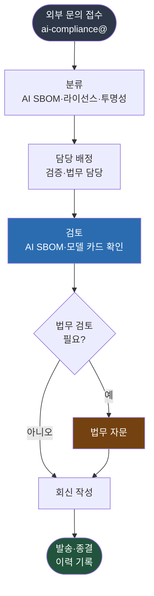

{}
이 조항은 **Phase 3 — 운영 체계** 단계에서 구축한다.
[전체 구축 로드맵 보기](../../#단계별-구축-로드맵)
{}

## 1. 조항 개요

공급망에서 AI 시스템을 주고받는 조직은 서로의 컴플라이언스를 확인해야 한다. 그러려면 외부에서
문의할 창구가 공개되어 있고, 그 문의에 조직이 대응할 준비가 되어 있어야 한다. 접근은 이
양방향을 보장한다.

3.7은 두 가지를 요구한다. 제3자가 AI SBOM 컴플라이언스 문의를 할 수 있는 수단을 공개적으로
명시하는 것과, 그 문의에 효과적으로 대응하는 내부 절차를 유지하는 것이다. AI에서는 모델과
데이터셋의 라이선스, 학습 데이터 출처, 모델 카드 같은 AI 고유 정보가 문의 대상에 더해진다.

## 2. 해야 할 활동

- 제3자가 AI SBOM 컴플라이언스 문의를 할 수 있는 수단(예: 공개 이메일 주소)을 공개한다.
- 공개 수단을 제품 고지문이나 웹사이트 등 외부에서 찾을 수 있는 곳에 게시한다.
- 외부 문의를 접수·분류·대응하는 내부 절차를 문서화한다.
- 대응 담당자와 처리 기한을 정한다.
- 문의와 대응 이력을 기록한다.

## 3. 요구사항 및 입증자료

| 조항 번호 | 요구사항 (KO) | 입증자료 |
|-----------|--------------|---------|
| 3.7 | 외부의 AI SBOM 컴플라이언스 문의에 효과적으로 대응하는 절차를 유지하고, 제3자가 문의할 수 있는 수단을 공개적으로 명시해야 한다. | **3.7.1** 관심 있는 당사자가 AI SBOM 컴플라이언스 문의를 할 수 있는 공개된 방법(예: 공개 연락 이메일)<br>**3.7.2** 제3자의 AI SBOM 컴플라이언스 문의에 대응하는 내부의 문서화된 절차 |

<details><summary>영문 원문 보기</summary>

> **3.7 Access**
> Maintain a process to effectively respond to external AI SBOM Compliance inquiries. Publicly
> identify a means by which a third party can make an AI SBOM Compliance inquiry.
>
> **Verification material(s):**
> - Publicly visible method that allows any interested parties to make an AI SBOM Compliance inquiry
>   (e.g., via a published contact email address).
> - An internal documented procedure for responding to third-party AI SBOM Compliance inquiries.

</details>

## 4. 입증자료별 준수 방법 및 샘플

### 3.7.1 공개된 외부 문의 수단

**준수 방법**

누구나 찾을 수 있는 공개 연락 수단을 명시한다. 역할 기반 이메일 주소(개인이 아닌 직무 주소)가
안정적이다. 게시 위치는 제품 고지문, 회사 웹사이트의 오픈소스·AI 정책 페이지, 모델 카드의 연락처
항목 등이다. 응답 기한을 함께 안내하면 신뢰를 높인다.

**샘플**

```
AI 컴플라이언스 문의: ai-compliance@company.com

당사가 제공하는 AI 시스템의 구성요소, 모델·데이터셋 라이선스, AI SBOM에 관한
문의를 받습니다. 접수 후 영업일 기준 14일 이내에 1차 회신을 드립니다.

(게시 위치: 제품 고지문, 회사 웹사이트 AI 정책 페이지, 모델 카드 연락처)
```

---

### 3.7.2 내부 문의 대응 절차

**준수 방법**

외부 문의를 접수해 답변하기까지의 내부 절차를 문서화한다. 접수, 분류, 담당 배정, 검토, 회신,
기록의 단계를 정하고 각 단계의 기한을 둔다. AI SBOM 문의는 모델 카드나 라이선스 검토 기록을
참조해야 하므로, AI SBOM 검증 담당과 라이선스 검토 담당이 함께 대응한다.

아래 그림은 외부 문의 대응 흐름이다.



**그림 1.** 외부 AI SBOM 컴플라이언스 문의 대응 흐름

**고려사항**

- **기한 설정**: 1차 회신 기한(예: 14일)과 최종 답변 기한(예: 60일)을 정한다.
- **AI 고유 정보 보호**: 문의에 답하며 모델 가중치나 학습 데이터 같은 민감 정보를 어디까지
  공개할지 기준을 둔다. 영업 비밀과 투명성 의무(3.6) 사이의 경계를 정한다. *([본 가이드 권고])*
- **이력 보관**: 문의 내용과 회신, 처리 기간을 기록해 입증자료로 보존한다.

**샘플 (대응 절차 개요)**

```
## AI SBOM 컴플라이언스 문의 대응 절차

1. 접수: ai-compliance@ 로 들어온 문의를 등록한다.
2. 분류: AI SBOM 요청 / 라이선스 문의 / 투명성 의무 문의로 분류한다.
3. 담당 배정: 분류에 따라 AI SBOM 검증 담당 또는 라이선스 검토 담당에게 배정한다.
4. 검토·회신: 관련 AI SBOM과 모델 카드를 확인해 회신한다. 민감 정보는 공개 기준에
   따른다. 필요 시 법무 검토를 거친다.
5. 기록: 문의·회신·처리 기간을 보관한다.

기한: 1차 회신 14일, 최종 답변 60일.
```

## 5. 참고

- 대응 담당의 역할과 자원: [3.8 효과적 자원 배분](../2-resourced/)
- 회신에 쓰이는 AI SBOM: [3.9 AI SBOM](../../2-ai-extension/3-ai-sbom/)
- 공개 범위와 투명성 의무: [3.6 투명성 의무](../../2-ai-extension/2-transparency-obligations/)
- ISO/IEC 5230 외부 문의 본보기: [ISO/IEC 5230 준수 가이드 — 3.2.1 외부 문의 대응](../../../iso5230_guide/2-relevant-tasks/1-access/)
