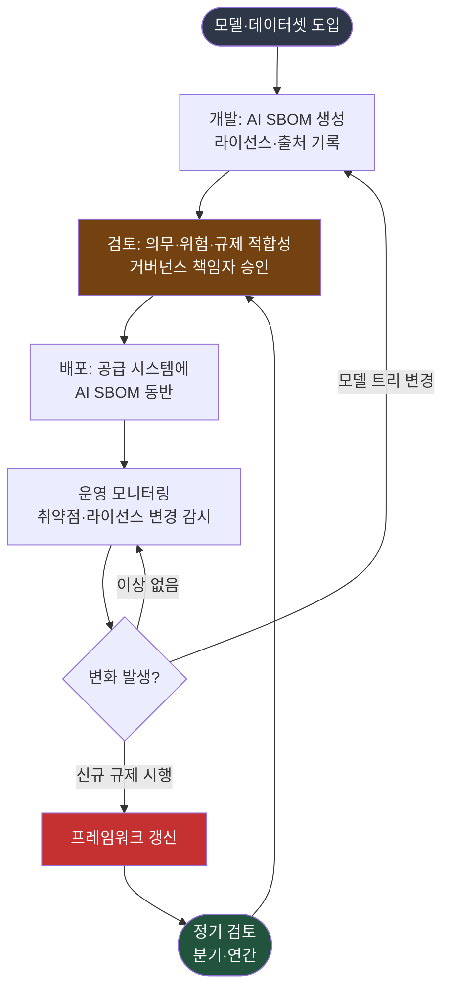

{}
이 조항은 **Phase 4 — 거버넌스** 단계에서 구축한다.
[전체 구축 로드맵 보기](../../#단계별-구축-로드맵)
{}

## 1. 조항 개요

거버넌스는 앞선 모든 조항을 하나로 묶어 AI 시스템 수명주기 전반에서 책임 있는 개발과 배포,
관리를 보장하는 틀이다. 정책(3.1)이 원칙을 세우고 라이선스 의무(3.5)와 AI SBOM(3.9)이 개별
프로세스를 만든다면, 거버넌스는 이들이 규제 변화와 모델 교체에도 일관되게 작동하도록 관리한다.

3.10은 AI 거버넌스 프레임워크, 정책, 관행을 갖출 것을 요구한다. 규격은 EU 인공지능법(EU AI
Act), 히로시마 AI 프로세스(Hiroshima AI Process), 중국 글로벌 AI 거버넌스 이니셔티브(Global
AI Governance Initiative) 같은 신흥 AI 법령의 준수를 강조하며, 윤리적 고려사항과 위험 관리,
투명성을 함께 다룬다. 핵심은 한 번 만든 프레임워크를 정기적으로 검토해 최신 규제와 모델 변화를
반영하는 것이다.

## 2. 해야 할 활동

- AI 시스템 수명주기 전반을 다루는 거버넌스 프레임워크 문서를 작성한다.
- 프레임워크에 신흥 AI 규제 추적, 위험 관리, 투명성, 윤리적 고려를 포함한다.
- 프레임워크를 정기적으로 검토하고 갱신하는 절차를 둔다.
- AI 시스템과 학습 데이터의 지속적 사용에 따르는 위험을 모니터링한다.
- 모델 트리 변경, 규제 시행, OSAID 분류 변화 같은 사건을 거버넌스에 반영한다. *([본 가이드 권고])*

## 3. 요구사항 및 입증자료

| 조항 번호 | 요구사항 (KO) | 입증자료 |
|-----------|--------------|---------|
| 3.10 | AI 시스템이 책임 있게 개발·배포·관리되도록 보장하는 AI 거버넌스 프레임워크, 정책, 관행을 갖춰야 한다. 신흥 AI 법령(EU 인공지능법, 히로시마 AI 프로세스, 중국 이니셔티브) 준수를 강조하고, 윤리적 고려·위험 관리·투명성을 다룬다. | **3.10.1** AI 시스템 수명주기에 대한 문서화된 AI 거버넌스 프레임워크. 해당 프레임워크를 정기적으로 검토하는 절차 포함 |

<details><summary>영문 원문 보기</summary>

> **3.10 Governance**
> An organization shall have a governance framework for AI, policies, and practices to help ensure
> that AI systems are developed, deployed, and managed responsibly. Governance emphasizes compliance
> with emerging AI laws and regulations, such as the EU AI Act, Hiroshima AI process or Global AI
> Governance Initiative (China), and addresses ethical considerations, risk management, and
> transparency. For example, understand the risks associated with ongoing use of AI Systems and
> training data in the context of their intended Programs. This could include the ability to monitor
> the lifecycle of the AI system and perform ongoing analysis of its intended uses.
>
> **Verification material(s):**
> - A documented AI governance framework for the lifecycle of an AI system with a process to review
>   the framework periodically.

</details>

## 4. 입증자료별 준수 방법 및 샘플

### 3.10.1 AI 거버넌스 프레임워크와 정기 검토 절차

**준수 방법**

거버넌스 프레임워크는 세 가지를 담는다. 신흥 규제를 추적해 의무를 도출하는 부분, AI 시스템
수명주기를 모니터링하는 부분, 그리고 프레임워크 자체를 정기적으로 검토하는 절차다. 규제는
빠르게 바뀌므로 프레임워크는 고정된 문서가 아니라 갱신을 전제한 살아있는 체계여야 한다.

규격이 거명한 세 축은 성격이 다르다. EU 인공지능법은 조문 단위의 구체적 의무를 부과하고,
히로시마 AI 프로세스는 자발적 투명성 보고를 운영하며, 중국 이니셔티브는 정책 선언에 가깝다.
거버넌스는 이 차이를 구분해 각각을 추적한다.

아래 표는 AI SBOM 관점에서 추적해야 할 주요 규제다. 전체 규제 매트릭스와 ISO/IEC 42001 맥락은
[ISO/IEC 42001 가이드 — 조직 맥락과 리더십](../../../iso42001_guide/1-context-leadership/)에서 다룬다.

**표 1.** AI SBOM과 교차하는 주요 AI 규제 (2026-06 기준)

| 규제·이니셔티브 | 시점 | AI SBOM 관점 핵심 의무 | 거버넌스 반영 |
|---|---|---|---|
| EU 인공지능법 Article 11 + Annex IV | 2027 (고위험) | 기술 문서화 의무 | AI SBOM을 기술 문서의 핵심 요소로 산출 |
| EU 인공지능법 Article 53 (GPAI) | 2026-08 | 학습 데이터 요약 공개, 저작권 옵트아웃 존중 | 데이터셋 출처와 라이선스 추적 |
| EU 인공지능법 Article 50 | 2026-08 | AI 생성 콘텐츠 라벨링 | 투명성 의무(3.6)와 연계 |
| 히로시마 AI 프로세스 | 2025 출범, 보고 2.0(2026-05) | 자발적 투명성 보고 | OECD 보고 프레임워크 참여 검토 |
| 중국 글로벌 AI 거버넌스 이니셔티브 | 2023 발표 | 정책 선언(구체 산출물 없음) | 동향 모니터링 |
| 한국 AI 기본법 | 2026-01 시행 | 고영향 AI 영향 평가, 표시 의무, 학습 데이터 출처 공개 | AI SBOM과 모델 카드 작성 |

수명주기 모니터링은 개발에서 폐기까지의 흐름에 거버넌스 점검점을 두는 것이다. 아래 그림은 AI
SBOM을 축으로 한 수명주기 거버넌스를 보여준다.



**그림 1.** AI SBOM을 축으로 한 수명주기 거버넌스

**고려사항**

- **규제 추적 책임 지정**: 신흥 규제를 누가 추적하고 의무를 도출하는지 거버넌스에 명시한다.
  EU 인공지능법은 2026년 8월과 2027년에 단계적으로 의무가 확대되므로 시점을 관리한다.
- **모델 트리 변경 관리**: 도입 모델이 새 버전으로 바뀌거나 상위 모델이 교체되면 라이선스
  의무가 달라질 수 있다. 변경을 거버넌스 검토 사건으로 등록한다. *([본 가이드 권고])*
- **OSAID 분류 갱신**: "오픈소스 AI"와 "오픈 웨이트(Open Weight)"의 구분(OSAID 1.0)은 모델
  라이선스 판단에 영향을 준다. 분류 기준 변화를 정기 검토에 포함한다.
- **검토 주기 명시**: 분기 단위로 모델과 데이터셋 변경을, 연 단위로 규제와 프레임워크 전반을
  검토한다. 검토 완료일과 검토자를 기록한다.
- **다른 조항과의 연결**: 거버넌스는 투명성 의무(3.6)의 규제 검토와 AI SBOM(3.9)의 수명주기
  관리를 상위에서 묶는다. 중복 절차를 만들지 말고 연결한다.

**샘플 (거버넌스 프레임워크와 연간 검토 계획)**

아래는 거버넌스 프레임워크 문서와 정기 검토 계획의 핵심 부분 샘플이다. 이 문서가 입증자료
3.10.1이 된다.

```
## AI 거버넌스 프레임워크

### 1. 범위와 목적
AI 시스템의 도입·개발·배포·운영·폐기 전 수명주기에 걸쳐 라이선스, 투명성, 위험,
규제 준수를 관리한다.

### 2. 거버넌스 구조
- AI 거버넌스 책임자: 프레임워크 승인, 규제 의무 최종 판단
- 규제 추적 담당: 신흥 AI 규제 모니터링, 의무 도출
- AI SBOM 검증 담당: 생성·검토·승인 절차 운영
- 법무: 비표준 라이선스와 규제 해석

### 3. 정기 검토 계획
| 주기 | 검토 항목 | 담당 | 산출물 |
|------|----------|------|--------|
| 분기 | 모델·데이터셋 변경, 모델 트리 라이선스 | AI SBOM 검증 담당 | 변경 검토 기록 |
| 반기 | 비표준 라이선스 분류, OSAID 갱신 | 법무 | 분류 갱신본 |
| 연간 | 규제 시행 일정, 프레임워크 전반, 정책 정합성 | AI 거버넌스 책임자 | 프레임워크 개정본 |

### 4. 변경 관리
모델 트리 변경, 신규 규제 시행, 라이선스 정책 변경이 발생하면 정기 검토를 기다리지
않고 임시 검토를 소집한다. 검토 결과와 조치는 변경 이력에 기록한다.
```

## 5. 참고

- 정책 기반: [3.1 정책](../../1-program-foundation/1-policy/)
- 투명성 의무와 규제 검토: [3.6 투명성 의무](../../2-ai-extension/2-transparency-obligations/)
- AI SBOM 수명주기 관리: [3.9 AI SBOM](../../2-ai-extension/3-ai-sbom/)
- 전체 규제 매트릭스와 ISO/IEC 42001 맥락: [ISO/IEC 42001 가이드 — 조직 맥락과 리더십](../../../iso42001_guide/1-context-leadership/)
