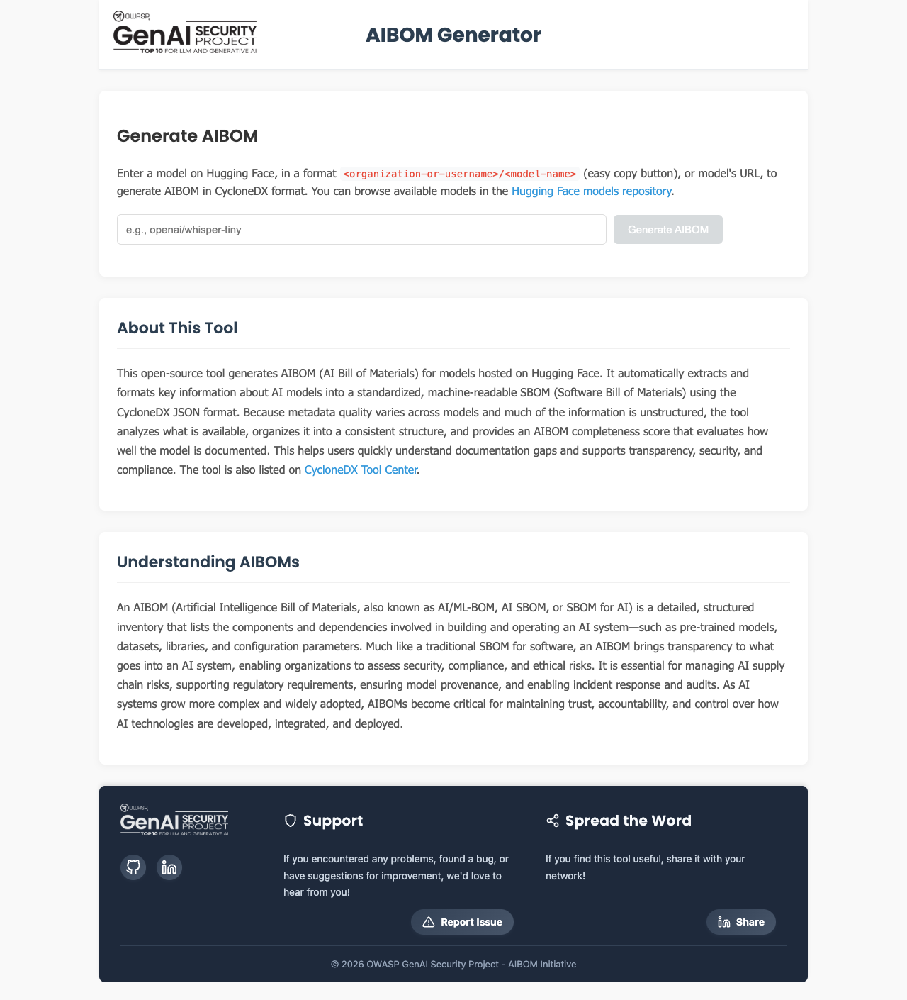
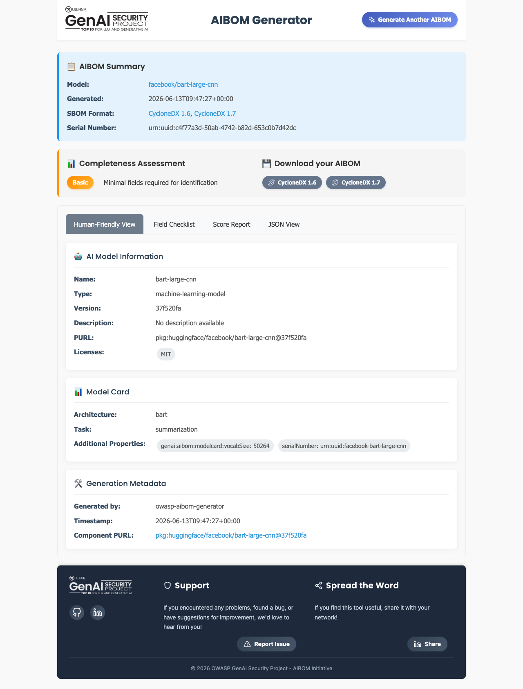

## 개요

OWASP AIBOM Generator는 Hugging Face 모델 ID를 입력받아 모델 카드 메타데이터를 가져오고,
CycloneDX 형식의 AI SBOM을 생성하는 오픈소스 도구다. OWASP Gen AI Security Project가 관리하며,
생성된 BOM이 얼마나 완전한지를 점수로 평가하는 기능이 특징이다.

cdxgen이 의존성을 빠르게 식별하되 라이선스를 비워 두는 것과 달리, 이 도구는 모델 카드에 적힌
라이선스와 작성자, 외부 참조를 채운다. [3.5 라이선스 의무](../../2-ai-extension/1-license-obligations/)가
요구하는 라이선스 검토의 출발점으로 쓰기 좋다.

## 주요 기능

- Hugging Face 모델의 메타데이터를 가져와 CycloneDX 1.6과 1.7 형식 AIBOM을 생성한다.
- 생성된 BOM의 완전성을 점수(0~100)와 프로파일로 평가하고 섹션별로 분해해 보여준다.
- 모델 정보, 모델 카드, 라이선스, 외부 참조를 사람이 읽기 쉬운 화면으로 보여준다.
- 웹 UI와 명령줄(CLI) 두 가지로 쓸 수 있다.

## 사용법 A — 웹 UI

브라우저에서 모델 ID만 넣으면 되어 가장 간단하다. OWASP Gen AI Security Project가 제공하는
Hugging Face Space를 쓰거나, 저장소를 받아 로컬에서 띄운다.

먼저 입력 화면에서 Hugging Face 모델 ID(예: `facebook/bart-large-cnn`)를 넣고 생성을 누른다.



**그림 1.** OWASP AIBOM Generator 입력 화면 *(GenAI Security Project, 캡처 2026-06-13)*

생성이 끝나면 결과 화면에 AIBOM 요약, 완전성 평가, 다운로드 버튼(CycloneDX 1.6과 1.7), AI 모델
정보, 모델 카드가 표시된다. 화면 상단의 완전성 평가는 BOM이 식별에 필요한 최소 항목을 갖췄는지
한눈에 보여준다.



**그림 2.** 생성 결과 화면 — 모델 정보, 라이선스(MIT), 완전성 평가(Basic) *(캡처 2026-06-13)*

결과 화면은 사람이 읽는 보기(Human-Friendly View)와 함께 필드 체크리스트, 점수 보고서, JSON
보기 탭을 제공한다. 라이선스 의무 검토와 AI SBOM 보관에 필요한 항목을 화면에서 바로 확인하고
CycloneDX 파일로 내려받는다.

## 사용법 B — 명령줄(CLI)

CI/CD에 넣거나 여러 모델을 일괄 처리할 때는 CLI가 편하다. 설치 후 모델 ID를 인자로 준다.

```bash
# 설치 (Python 가상환경 권장)
pip install "git+https://github.com/GenAI-Security-Project/aibom-generator"

# 모델 ID로 AIBOM 생성
aibom facebook/bart-large-cnn -o aibom.json
```

아래는 실제 실행 결과다. CycloneDX 1.6과 1.7을 생성하고 스키마 검증을 통과하며, 완전성 점수를
섹션별로 보여준다.

```text
$ aibom facebook/bart-large-cnn -o aibom.json

✅ Successfully generated CycloneDX 1.6 SBOM — Schema Validation (1.6): Valid
✅ Successfully generated CycloneDX 1.7 SBOM — Schema Validation (1.7): Valid

📊 Completeness Score: 58.7/100   Profile: Basic
   - Required Fields:        20/20
   - Metadata:                8/20
   - Component Basic:        17.1/20
   - Component Model Card:    6.7/30
   - External References:    10/10
```

**그림 3.** CLI 실측 출력 *(aibom CLI, 모델 facebook/bart-large-cnn, 실행 2026-06-13)*

생성된 BOM의 모델 컴포넌트는 라이선스와 모델 카드가 채워진다. cdxgen 출력과 달리 `licenses`
필드가 비어 있지 않다.

```json
{
  "type": "machine-learning-model",
  "name": "bart-large-cnn",
  "purl": "pkg:huggingface/facebook/bart-large-cnn",
  "licenses": [{ "license": { "id": "MIT" } }],
  "authors": [{ "name": "facebook" }],
  "modelCard": { "modelParameters": { }, "considerations": { } }
}
```

## 실측이 보여주는 것

{}
실측에서 완전성 점수는 58.7/100(Basic)이었다. Required Fields와 External References는 만점이지만
모델 카드 점수가 6.7/30으로 낮다. 이는 도구의 한계가 아니라, 모델 제공자가 Hugging Face 모델
카드에 정보를 충분히 채우지 않았기 때문이다. 도구는 있는 메타데이터를 충실히 가져오지만, 없는
정보를 만들어 내지는 못한다. 모델 카드가 부실하면 사람이 출처를 확인해 보강해야 한다.
{}

## 참고

- AI SBOM 생성과 관리 절차: [3.9 AI SBOM](../../2-ai-extension/3-ai-sbom/)
- 라이선스 의무 검토: [3.5 라이선스 의무](../../2-ai-extension/1-license-obligations/)
- 다른 생성 도구: [cdxgen](../2-cdxgen/)
- 공식: [OWASP AIBOM Generator](https://genai.owasp.org/resource/owasp-aibom-generator/)
