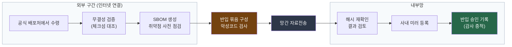

{}
이 가이드는 금융권의 오픈소스 활용·관리를 다룬다. 그 출발점이 폐쇄망이다.
반입·사내 미러·오프라인 취약점 관리는 식별, 사용 승인, 관리 등 모든 단계의 전제가 되므로,
여기에서 한 번 설명하고 각 단계 페이지에서는 "폐쇄망 적용 시" 박스로 이 페이지를 가리킨다.
{}

## 왜 폐쇄망을 먼저 다루는가

일반적인 오픈소스 실무는 인터넷 연결을 전제한다. 패키지 관리자로 의존성을 내려받고,
온라인 취약점 데이터베이스를 조회하며, 클라우드 기반 스캐너를 쓴다. 금융권의 중요 업무망과
핵심 시스템에서는 이 전제가 성립하지 않는다. 외부 통신이 차단된 환경에서는 오픈소스를
들여오는 일 자체가 통제 대상이 되고, 취약점 정보를 어떻게 얻을지가 먼저 풀어야 할 문제가 된다.

금융분야 오픈소스 소프트웨어 활용·관리 안내서(금융감독원·금융보안원, 2022, 이하 FSEC
안내서)는 관리 절차를
식별, 이슈 파악 및 해결, 사용 승인, 관리 네 단계로 제시한다. 그러나 폐쇄망에서는 "식별"보다
앞서 "어떻게 들여올 것인가"라는 관문을 먼저 통과해야 한다. 이 가이드가 폐쇄망을 0번 섹션으로
끌어올린 이유다.

{}
이 가이드는 금융분야 오픈소스 소프트웨어 활용·관리 안내서(금융감독원·금융보안원, 2022)를
대체하지 않는다. 안내서가 제시한 절차를 국제표준(ISO/IEC 5230·18974)과 연결해 실제로 운영
가능한 형태로 보완하는 보조 자료다. 안내서는 비규제 자율 안내이므로, 이 가이드의 권고도
법적 의무가 아니라 모범 실무로 읽어야 한다.

이 페이지가 설명하는 폐쇄망 절차는 대부분 표준이 직접 요구하지 않는 **[본 가이드 권고]**다.
국제표준이나 규제가 직접 요구하는 지점은 본문에서 **[ISO 요구]**, **[FSEC 안내서]**로 출처를
구분해 표시한다.
{}

## 함께 다뤄야 할 두 가지 현실

폐쇄망을 "고정된 물리적 망분리"로만 전제하면 가이드가 곧 낡는다. 규제 환경이 전환 중이기
때문이다. 금융위원회는 금융분야 망분리 개선 로드맵(2024-08-13)을 발표했고, 이어 전자금융감독규정과
시행세칙 개정이 2025-02-05에 시행됐다. 이 개정으로 오랫동안 유지되던 물리적 망분리 중심
규제가 자율보안·위험기반 접근으로 바뀌기 시작했다. 고유식별정보와 개인신용정보를
처리하지 않는 연구·개발 목적 업무는 금융회사가 자체 위험평가와 망분리 대체 정보보호통제 적용,
정보보호위원회 승인을 거쳐 망분리 예외를 적용할 수 있다. 내부 업무망에서 클라우드 기반
응용소프트웨어(SaaS, Software as a Service)를 쓰는 범위 확대 등 그 밖의 완화는 로드맵의 후속
단계로 추진 중이다.

따라서 금융권 담당자는 두 현실을 동시에 안고 일한다.

첫째, 중요 업무와 핵심 시스템에는 폐쇄망이 그대로 남아 있다. 반입 통제, 사내 미러, 오프라인
취약점 관리가 여전히 필요하다.

둘째, 연구·개발 등 예외가 열린 영역에서는 망분리 없이 일할 수 있게 됐다. 다만 규제 완화가 통제 면제를
뜻하지는 않는다. 망분리에 기대 자동으로 보호받던 부분을, 이제는 스스로 위험을 평가하고 통제를
설계하고 그 이행을 입증해야 한다. 책임이 규칙 준수에서 자율 입증으로 옮겨 갔다.

이 페이지는 폐쇄망 운영 실무를 먼저 설명하고, 마지막에 망분리 예외를 적용할 때 자체 위험평가를
어떻게 문서화하는지 다룬다.

## 반입 통제

폐쇄망에서 오픈소스를 들여오는 경로는 외부 구간에서 받아 검증하고 격리한 뒤 망연계 시스템(망간
자료전송)으로 내부망에 이관하는 흐름이다. 안내서의 식별 단계보다 먼저 부딪히는 실질적 첫 관문이다.



반입 절차는 다음을 포함한다.

- 무결성 검증: 내려받은 산출물의 해시값을 공식 배포처가 게시한 값과 대조한다.
- 악성코드 검사: 반입 구간에서 백신·악성코드 검사를 거친다.
- 구성요소 식별: 들여오는 산출물의 구성요소를 SBOM(Software Bill of Materials)으로 기록한다.
  이 SBOM은 ISO/IEC 5230의 SBOM 관리(§3.3.1)가 요구하는 입증자료가 된다. **[ISO 요구]**
- 반입 승인 기록: 누가 무엇을 왜 반입했는지, 검증 결과와 함께 남긴다. 이 기록은 감사 증적이 된다.

### 반입 절차 예제

한 라이브러리를 외부 구간에서 받아 내부망으로 옮기는 과정을 예로 든다. 도구 이름은 예시이며,
조직이 이미 쓰는 동급 도구로 바꿔도 된다.

외부 구간(인터넷 연결 가능 구역)에서 산출물을 받고 무결성을 확인한다.

```bash
# 1) 공식 배포처에서 산출물과 서명·체크섬을 함께 받는다
curl -LO https://example.org/lib/foo-1.2.3.tar.gz
curl -LO https://example.org/lib/foo-1.2.3.tar.gz.sha256

# 2) 게시된 해시와 대조해 무결성을 검증한다
sha256sum -c foo-1.2.3.tar.gz.sha256

# 3) 반입 단위의 구성요소를 SBOM으로 기록한다 (CycloneDX 형식)
syft foo-1.2.3.tar.gz -o cyclonedx-json > foo-1.2.3.sbom.json

# 4) 외부 구간에서 취약점을 미리 점검해 결과를 함께 반입 대상에 포함한다
grype sbom:foo-1.2.3.sbom.json -o json > foo-1.2.3.vuln.json
```

이 단계의 SBOM은 반입하는 산출물 자체를 식별하는 기록이다. 단일 소스 묶음에는 그 라이브러리가
의존하는 다른 컴포넌트가 동봉되지 않으므로, 전이 의존성은 이 명령으로 펼쳐지지 않는다. 전이
의존성은 각각 별도의 반입 단위로 들어와 사내 미러에 등록되고, 프로젝트 전체의 의존성은 빌드
시점에 프로젝트를 대상으로 SBOM을 생성해 식별한다(2번 섹션).

산출물, SBOM, 취약점 점검 결과, 체크섬을 하나의 반입 묶음으로 만들어 악성코드 검사를 거친 뒤
망간 자료전송으로 내부망에 옮긴다. 내부망에서는 해시를 다시 확인하고, SBOM과 취약점 결과를
검토한 뒤 사내 미러 저장소에 등록한다. 이때 반입 승인 기록을 함께 남긴다.

{}
처음 체계를 세우는 조직은 반입 경로를 하나로 단일화하고, 반입 묶음에 무엇을 포함할지(산출물,
해시, SBOM, 취약점 결과, 승인 기록)를 표준 양식으로 정하는 일부터 시작한다.

이미 운영 중인 조직은 반입 절차를 자동화하고, 사전 승인된 컴포넌트만 미러를 통해 공급되도록
강제하며, 반입 기록을 감사 증적 체계와 연동한다.
{}

## 사내 미러 저장소

폐쇄망 내부에 오픈소스를 공급하는 사내 미러 저장소를 둔다. Nexus, Artifactory 등 저장소
관리 도구를 온프레미스로 운영하거나, 언어별 패키지 저장소를 내부에 미러링한다. 개발자는
인터넷이 아니라 이 사내 미러에서만 의존성을 받는다.

미러는 오픈소스를 보관하는 저장소이면서, 무엇을 어떤 버전으로 쓸지 통제하는 지점이다.

- 반입 단계에서 만든 SBOM을 미러에 함께 등록해, 어떤 버전이 들어와 있는지 고정한다.
- 전이 의존성(직접 선언하지 않았지만 따라 들어오는 하위 의존성)까지 포함해 식별한다.
- 사전 승인되지 않은 컴포넌트는 미러에 올리지 않아, 승인 절차를 우회한 사용을 막는다.

사내 미러를 둠으로써 "개발자가 무엇을 쓰는지"를 한곳에서 파악하게 되고, 이는 식별 단계(2번
섹션)와 사용 승인 단계(4번 섹션)의 기반이 된다.

## 오프라인 취약점 관리

폐쇄망에서는 실시간 취약점 정보를 받을 수 없다. 신규 취약점(CVE, Common Vulnerabilities and
Exposures)을 인지하는 시점이 늦어지는 구조적 한계가 있으므로, 취약점 데이터를 정기적으로
들여오는 절차를 따로 마련한다.

접근 방식은 두 가지다.

- 외부망에서 스캔한 결과만 반입한다. 인터넷 연결이 가능한 구역에서 SBOM을 대상으로 취약점을
  점검하고, 그 결과 보고서를 내부망으로 옮긴다.
- 오프라인 취약점 데이터베이스를 정기적으로 동기화한다. 취약점 점검 도구가 참조하는 데이터베이스를
  외부에서 내려받아 내부 미러에 반입하고, 내부 도구가 그 미러를 바라보게 한다.

Grype와 Trivy는 취약점 데이터베이스를 캐시 디렉터리 단위로 받아 옮기는 방식으로, 물리적으로
분리된 폐쇄망(air-gap) 환경의 오프라인 갱신을 지원한다. Dependency-Track은 참조하는 취약점
데이터 소스(국가 취약점 데이터베이스, OSV, GitHub Advisories 등)의 주소를 설정으로 바꿔 내부
미러를 바라보게 할 수 있는데, 데이터 소스별로 미러를 따로 구성해야 해서 난도가 높다. 도입
전에 소규모 구성 검증을 거치기를 권한다. 도구가 오프라인 갱신을 지원하는지가 폐쇄망 취약점
관리의 핵심이다.

### 오프라인 취약점 데이터베이스 반입 예제

취약점 데이터베이스만 외부에서 받아 내부로 옮기는 흐름을 예로 든다.

외부 구간에서 데이터베이스를 내려받는다.

```bash
# 외부 구간: 취약점 DB 아카이브를 내려받는다 (도구별 명령은 예시)
grype db update          # 최신 취약점 DB를 로컬 캐시에 받는다
grype db status          # 받은 DB의 버전·생성 시각을 확인한다

# 받은 DB 캐시 디렉터리를 아카이브로 묶어 반입 대상으로 만든다
tar czf grype-db-$(date +%Y%m%d).tar.gz -C ~/.cache/grype/db .
```

아카이브의 해시를 확인하고 악성코드 검사를 거쳐 내부망으로 옮긴 뒤, 내부 점검 도구가 이
데이터베이스를 참조하도록 설정한다.

```bash
# 내부망: 반입한 DB 아카이브를 점검 도구가 참조하는 위치에 풀어 둔다
tar xzf grype-db-YYYYMMDD.tar.gz -C /opt/grype/db

# 오프라인 모드로 점검한다 (반입한 DB의 위치를 지정하고, 네트워크 갱신을 끈다)
GRYPE_DB_CACHE_DIR=/opt/grype/db GRYPE_DB_AUTO_UPDATE=false grype sbom:foo-1.2.3.sbom.json
```

Trivy는 데이터베이스를 받는 명령이 다를 뿐 흐름은 같다. 외부 구간에서 캐시를 받아 묶고,
내부에서 풀어 캐시 위치를 지정해 점검한다.

```bash
# 외부 구간: Trivy 취약점 DB를 로컬 캐시에 받아 아카이브로 묶는다
trivy image --download-db-only
tar czf trivy-db-$(date +%Y%m%d).tar.gz -C ~/.cache/trivy .

# 내부망: 캐시를 풀고, 갱신 없이 반입한 DB로 점검한다
tar xzf trivy-db-YYYYMMDD.tar.gz -C /opt/trivy
trivy sbom foo-1.2.3.sbom.json --skip-db-update --cache-dir /opt/trivy
```

자바 프로젝트를 점검하려면 별도의 자바 인덱스 데이터베이스가 필요하므로, 외부 구간에서
`trivy image --download-java-db-only`로 함께 받아 같은 캐시에 포함한다.

데이터베이스 동기화 주기와 책임자를 정하고, 동기화가 늦어지는 동안 발생할 수 있는 인지 지연을
관리한다. Dependency-Track에 운영 시스템의 SBOM을 등록해 두면, 데이터베이스를 갱신할 때마다
이미 운영 중인 시스템에 영향을 주는 신규 취약점을 자동으로 다시 평가한다. 지속 모니터링은 5번
섹션에서 자세히 다룬다.

## 폐쇄망에 맞는 도구 선택

폐쇄망에서는 클라우드 기반 스캐너를 쓸 수 없으므로 온프레미스로 설치하는 도구를 쓴다. 도구
자체가 오픈소스라면 그 도구도 반입 대상이 된다.

이 가이드가 도구 페이지에서 다루는 도구는 대부분 오픈소스이고 온프레미스 설치가 가능하다.
SBOM 생성에는 Syft, cdxgen, OSV-SCALIBR을, 라이선스 점검에는 FOSSology, SCANOSS를, 취약점
점검과 지속 감시에는 Dependency-Track, Grype, Trivy를 쓸 수 있다. 자세한 설치와 사용법은
[도구 페이지](../../tools/)를 참고한다.

특정 제품을 단독으로 권하지는 않는다. 폐쇄망에서 도구를 고를 때는 다음 기준으로 본다.

- 온프레미스 설치형으로 제공되는가.
- 취약점 데이터베이스를 오프라인으로 갱신할 수 있는가.
- SBOM 표준 형식(SPDX, CycloneDX)을 입출력하는가.
- 도구 자체의 라이선스가 사내 운영에 문제를 일으키지 않는가.

마지막 기준은 실제로 걸린다. 예를 들어 FOSSLight는 AGPL-3.0이다. 도구를 개조한 버전을
네트워크로 기능을 제공하는 방식으로 쓰면 소스 공개 의무가 생길 수 있으므로 법무 검토 항목으로 둔다.

{}
금융권은 지원 약정(SLA, Service Level Agreement), 한글 지원, 책임 소재 때문에 상용 소프트웨어
구성 분석(SCA, Software Composition Analysis) 도구를 함께 검토하는 경우가 많다. 이 가이드는
특정 상용 제품을 추천하지 않고, 위 선택 기준에 더해 폐쇄망 설치 제공 여부, 오프라인 데이터베이스
갱신, 국내 지원, 표준 출력 지원을 함께 따지도록 안내한다. 오픈소스 스택을 기본 권장안으로 두고,
상용 도구는 조직의 요구에 따라 보완하는 선택지로 본다.
{}

## 패치 지연 관리

폐쇄망에서는 취약점 패치도 반입 절차를 다시 거쳐야 하므로 즉시 대응이 어렵다. 신규 취약점이
공개돼도 패치를 받아 검증하고 내부로 옮기는 데 시간이 걸린다. 이 지연을 관리하는 장치를 둔다.

- 사전 승인된 미러로만 패치를 수급해, 출처가 불분명한 긴급 패치의 직접 반입을 막는다.
- 패치를 적용하기 전까지의 임시 완화책(영향 받는 기능 차단, 접근 제한 등)을 절차에 포함한다.
- 취약점의 심각도와 노출 정도에 따라 대응 기한을 정해, 지연이 방치되지 않게 한다.

## 망분리 예외 시 자체 위험평가

연구·개발 목적 업무에서 망분리 예외를 적용하면 폐쇄망의 자동 보호가 사라진다. 이때
오픈소스에 대한 위험을 스스로 평가하고 통제를 설계해 문서로 남겨야 한다. 망분리가 자동으로
막아 주던 위험을, 이제는 조직이 직접 평가하고 통제하며 그 결과를 입증한다.

자체 위험평가 문서에는 다음을 담는다.

- 대상 업무가 연구·개발 목적에 해당하며 고유식별정보와 개인신용정보를 처리하지 않는다는 판단 근거.
- 망분리 예외 구간에서 쓰는 오픈소스의 목록(SBOM)과 그 취약점·라이선스 위험.
- 금융감독원장이 정하는 망분리 대체 정보보호통제의 적용 내역.
- 인터넷 연결이 열린 만큼 추가되는 위험과 그에 대응하는 보안 통제(반입 검증을 대신할 통제).
- 통제의 이행을 확인하는 방법과 재평가 주기.

망분리 예외의 승인은 오픈소스 조직이 아니라 전사 보안 거버넌스의 소관이다. 이 문서는
정보보호위원회(또는 정보보호최고책임자, CISO)의 승인을 받는다. 승인된 평가서는 오픈소스
사용 승인 단계(4번 섹션)의 근거 자료가 되고, 정기 재평가(5번 섹션)의 대상이 된다.
양식은 산출물로 제공하는 [망분리 예외 자체 위험평가서
템플릿](../artifacts/2-policy-templates/#망분리-예외-자체-위험평가서)을 참고한다.

{}
전자금융보조업자나 외주 개발사가 폐쇄망 안에서 작업하거나 그들이 만든 산출물을 반입할 때도
같은 반입 통제가 적용된다. 외주 산출물에 SBOM과 취약점 점검 결과를 요구하는 방법은 식별(2번
섹션)과 사용 승인(4번 섹션)에서 다룬다.
{}

## FSEC 안내서·ISO 표준과의 연결

폐쇄망 운영은 안내서의 식별·관리 단계에 앞서는 전제 조건이면서, 동시에 두 단계의 품질을
좌우한다. 이 페이지의 폐쇄망 절차가 표준 입증자료·안내서 절차·규제와 어떻게 이어지는지는
다음과 같다.

| 폐쇄망 절차 | 연결되는 표준·규제 | 안내서 절차 |
|------|------|------|
| 반입 단계 SBOM 생성 | ISO/IEC 5230 §3.3.1 SBOM 관리 | 식별 |
| 사내 미러 구성요소 고정 | ISO/IEC 5230 §3.3.1 컴포넌트 기록 | 식별 |
| 오프라인 취약점 관리 | ISO/IEC 18974 취약점 탐지·해결 | 이슈 파악 및 해결 |
| 패치 지연 관리 | ISO/IEC 18974 취약점 조치 | 이슈 파악 및 해결 / 관리 |
| 망분리 예외 자체 위험평가 | 전자금융감독규정 자율보안(2025-02-05) | 사용 승인 |

표준별 입증자료와 안내서 절차의 전체 대조는 [가이드 개요의 매핑표](../)에서 확인한다.

{}
카카오뱅크는 KWG 12차 정기 미팅(2021-12)에서 컴플라이언스 검사를 개발 단계로 앞당기는
자동화 사례를 공유했다. 웹 서비스로만 제공되는 검사 도구는 금융권 보안 요건상 사내망에서
쓰기 어려워, 명령줄 도구로 대응하는 방향을 제시했다. 폐쇄망의 도구 제약을 보여 주는 사례다.

출처: 하헌관(카카오뱅크), "Shift-left and Automate Compliance Checks", [KWG 12차 미팅(2021-12) 발표자료](https://github.com/OpenChain-Project/OpenChain-KWG/releases/download/meeting-slides-2021/Shift-Left_and_Automate_Compliance_Checks.pdf).
{}

---

*최종 검토일: 2026-06-10. 이 페이지는 규제 변화 시, 그리고 연 1회 정기적으로 재검토한다.*
