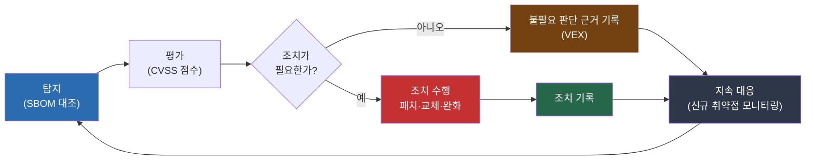

{}
식별로 무엇을 쓰는지 파악했다면, 그다음은 거기서 나오는 이슈를 풀어야 한다. 이슈는 두
종류다. 보안 취약점과 라이선스 의무다. FSEC 안내서의 두 번째 절차이고, ISO/IEC 18974의
취약점 탐지·해결(4.3.2)과 ISO/IEC 5230의 라이선스 사용 사례 처리(3.3.2)에 대응한다.

여기서 만드는 문서: 취약점 조치 기록(VEX 포함), 심각도별 대응 기한 기준.
{}

## 취약점 탐지에서 조치까지

ISO/IEC 18974는 SBOM(Software Bill of Materials)에 담긴 각 오픈소스 컴포넌트에 보안 보증
활동을 적용하도록 요구한다. 탐지부터 해결까지의 전 과정을 절차로 만들고, 각 취약점에 대한
수행 기록을 남겨야 한다. 절차는 다음 흐름을 따른다. **[ISO 요구]**

- 탐지: SBOM의 각 컴포넌트에 알려진 취약점(CVE, Common Vulnerabilities and Exposures)이
  있는지 점검한다.
- 평가: 탐지된 취약점에 위험·영향 점수를 매긴다. 공통 취약점 등급 체계(CVSS, Common
  Vulnerability Scoring System)를 쓴다.
- 조치 결정: 각 취약점에 필요한 수정 또는 완화 단계를 정하고 문서로 남긴다. 조치가 필요
  없다고 판단한 경우 그 판단 근거도 기록한다.
- 조치 수행: 위험 점수에 따라 패치, 버전 교체, 완화 설정 등을 수행한다.
- 지속 대응: 운영 중 새로 공개되는 취약점을 모니터링하고 영향받는 시스템에 대응한다.



이 절차가 ISO/IEC 18974의 취약점 탐지·해결 절차(4.3.2.1)이고, 그 수행 기록이 취약점·조치
기록(4.3.2.2)이다. 조치가 필요 없다고 판단한 결과를 VEX(Vulnerability Exploitability
eXchange) 형식으로 남기면, 같은 취약점을 반복 검토하지 않아도 된다.

### 취약점 점검과 지속 감시 예제

SBOM을 취약점 관리 도구에 등록하면, 도구가 새로운 취약점이 공개될 때마다 영향받는 컴포넌트를
다시 알려 준다. Dependency-Track에 운영 시스템의 SBOM을 등록하는 방식을 예로 든다. 도구는
예시이며 동급 도구로 바꿔도 된다.

```bash
# SBOM을 Dependency-Track 프로젝트에 업로드한다 (API 예시)
curl -X POST "https://dtrack.internal/api/v1/bom" \
  -H "X-Api-Key: $DT_APIKEY" \
  -F "project=$PROJECT_UUID" \
  -F "bom=@foo-1.2.3.sbom.json"
```

업로드 후에는 도구가 취약점 데이터베이스와 대조해 취약점 목록을 만든다. 폐쇄망에서는 이
데이터베이스를 오프라인으로 갱신한다. 한 번의 점검으로 끝나는 것이 아니라, 데이터베이스를
갱신할 때마다 이미 등록된 SBOM이 다시 평가돼 신규 취약점이 자동으로 드러난다. 운영 시스템의
지속 모니터링은 [관리](../5-manage/)에서 더 다룬다.

명령줄에서 한 번 점검할 때는 Grype나 Trivy를 쓸 수 있다.

```bash
# SBOM을 입력으로 취약점을 점검한다
grype sbom:foo-1.2.3.sbom.json
```

## 대응 기한

탐지만으로는 부족하다. 심각도에 따라 언제까지 조치할지 기한을 정해 두어야 지연이 방치되지
않는다. 심각도와 노출 정도를 함께 보아 우선순위를 매기고, 등급별 대응 기한을 정책에
명시한다. 아래는 기한을 정하는 예시이며, 조직의 위험 수용 수준에 맞춰 조정한다. **[본 가이드 권고]**

| 심각도(CVSS) | 인터넷 노출 시스템 | 내부 시스템 |
|------|------|------|
| 심각(9.0~10.0) | 즉시 ~ 수일 내 | 수일 ~ 1주 내 |
| 높음(7.0~8.9) | 1주 내 | 2주 ~ 1개월 내 |
| 중간(4.0~6.9) | 정기 점검 주기 내 | 정기 점검 주기 내 |

기한 내 조치가 어려운 경우의 임시 완화책과 예외 승인 절차도 함께 정한다.

{}
폐쇄망에서는 패치도 반입 절차를 거치므로 즉시 적용이 어렵다. 사전 승인된 미러로만 패치를
수급하고 적용 전까지의 임시 완화책을 절차에 넣는 방법은 [폐쇄망
운영](../0-closed-network/#패치-지연-관리)에서 다룬다.
{}

## 라이선스 이슈 해결

취약점과 함께 풀어야 할 다른 이슈는 라이선스다. 식별한 오픈소스의 라이선스 의무를 확인하고,
의무를 충족하지 못하는 사용을 찾아 해결한다. ISO/IEC 5230은 이를 라이선스 사용 사례 처리
절차(3.3.2.1)로 요구한다. **[ISO 요구]**

금융권에서 라이선스 이슈는 배포 여부에 따라 성격이 달라진다. 이 가이드는 두 경우를 나눠 본다.

- 외부로 배포하는 소프트웨어(대외 서비스, 고객 앱): GPL 계열 등 배포 기반 라이선스의
  의무(고지, 경우에 따라 소스 공개)가 발생한다. 라이선스 의무를 충족하는 절차를 갖춰야 한다.
- 외부로 배포하지 않는 사내 운영 시스템: 배포가 없어 GPL 등의 소스 공개 의무는 약하지만,
  라이선스 호환성과 사용 조건은 여전히 확인한다.

FSEC 안내서도 외부 배포 시 GPL 계열 사용에 대한 소스 공개정책 마련을 점검 항목으로 둔다.
배포 소프트웨어와 사내 운영 시스템의 범위 구분은 [관리](../5-manage/)에서 더 다룬다.

라이선스 점검에는 FOSSology, SCANOSS 같은 오픈소스 도구를 쓸 수 있다. 다만 도구 자체의
라이선스도 확인한다. FOSSLight(AGPL-3.0)의 사례는 [폐쇄망 운영의 도구
선택](../0-closed-network/#폐쇄망에-맞는-도구-선택)에서 다룬다.

{}
외주 산출물에서 발견한 취약점과 라이선스 이슈는 책임 소재를 먼저 정한다. 계약에 취약점
대응 의무와 라이선스 의무 이행을 명시했는지 확인하고, 외주사가 대응하지 못하는 경우의
처리 방법을 정한다. 계약 단계의 요구사항은 [사용 승인](../4-approve/)에서 다룬다.
{}

{}
처음 체계를 세우는 조직은 인터넷에 노출된 시스템의 심각 취약점부터 점검해 대응하고,
배포하는 소프트웨어의 라이선스 의무부터 확인한다. 위험이 큰 곳부터 좁혀 들어간다.

이미 운영 중인 조직은 8가지 취약점 처리 방법(위협 식별, 취약점 탐지, 후속 조치, 고객 통보,
배포 후 신규 취약점 분석, 지속적 보안 테스트, 위험 해결 검증, 위험 정보 보고)을 모두 절차로
갖추고, 취약점 대응을 자동화하며, VEX로 판단 기록을 재사용한다.
{}

## FSEC 안내서·ISO 표준과의 연결

| 이슈 해결 활동 | ISO/IEC 5230 | ISO/IEC 18974 | FSEC 안내서 |
|------|------|------|------|
| 취약점 처리 방법 정의 | — | 4.1.5.1 8가지 처리 방법 | 이슈 파악 및 해결 |
| 취약점 탐지·해결 절차 | — | 4.3.2.1 탐지·해결 절차 | 이슈 파악 및 해결 |
| 취약점·조치 기록 | — | 4.3.2.2 취약점·조치 기록 | 이슈 파악 및 해결 |
| 라이선스 사용 사례 처리 | 3.3.2.1 라이선스 사용 사례 처리 | — | 이슈 파악 및 해결 |

취약점 대응 절차의 조항별 상세는 [ISO/IEC 18974 준수 가이드의 보안 보증 조항](../../iso18974_guide/3-content-review/2-security-assurance/)에서,
8가지 처리 방법은 [표준 관행 구현 조항](../../iso18974_guide/1-program-foundation/5-standard-practice/)에서
더 자세히 다룬다.

{}
카카오뱅크는 KWG 20차 정기 미팅(2023-11)에서 ISO/IEC 18974 오픈소스 보안 보증을 준비한
사례를 공유했다. 취약점 탐지와 대응을 체계화한 금융권 보안 보증 사례다.

출처: 하헌관·이민애(카카오뱅크), "카카오뱅크 오픈소스 보안 보증 준비 사례 공유", [KWG 20차 미팅(2023-11) 발표자료](https://github.com/OpenChain-Project/OpenChain-KWG/releases/download/meeting-slides-legacy/kakaobank-ISO18974-conformance-case-study.pdf).
{}

---

*최종 검토일: 2026-06-10. 이 페이지는 규제 변화 시, 그리고 연 1회 정기적으로 재검토한다.*
