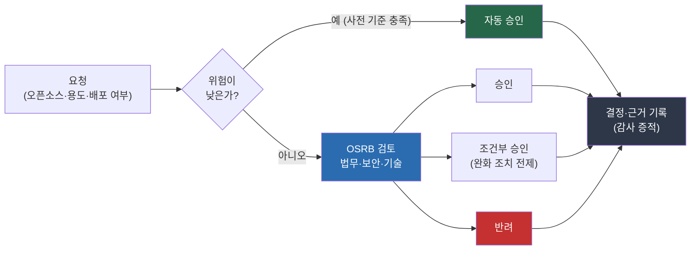

{}
식별과 이슈 해결을 거친 오픈소스를 실제로 쓸지 결정하는 단계다. 승인은 한 사람의 판단이
아니라 정해진 절차와 기록으로 이뤄져야 한다. FSEC 안내서의 세 번째 절차이고, ISO/IEC 5230의
라이선스 의무 검토(3.1.5)와 거버넌스에 연결된다.
{}

## 사용 승인 워크플로

사용 승인은 "이 오픈소스를 이 용도로 써도 되는가"에 답하는 절차다. 답의 근거는 앞 단계에서
나온다. 식별로 무엇인지 알고, 이슈 파악·해결로 취약점과 라이선스 의무를 파악한 뒤, 그 결과를
놓고 승인 여부를 정한다.

기본 흐름은 요청, 검토, 결정, 기록이다.

- 요청: 사용하려는 오픈소스와 용도, 배포 여부를 신청한다.
- 검토: 라이선스 의무, 보안 취약점, 기술 적합성을 함께 본다. 검토 주체는 거버넌스에서 정한
  오픈소스 검토 위원회(OSRB, Open Source Review Board)다.
- 결정: 승인, 조건부 승인(완화 조치를 전제로 허용), 반려 중 하나로 정한다.
- 기록: 결정과 그 근거를 남긴다. 이 기록이 감사 증적이 된다.

망분리 예외가 걸린 사용은 이 워크플로와 별도로, 자체 위험평가서에 대한
정보보호위원회(CISO)의 승인이 먼저 필요하다. 아래 절에서 다룬다.

모든 사용을 같은 무게로 검토할 필요는 없다. 위험이 낮은 사용은 사전에 정한 기준으로 자동
승인하고, 배포 소프트웨어에 들어가거나 라이선스 의무가 큰 사용만 위원회에 올리는 식으로
차등한다. ISO/IEC 5230은 라이선스 의무사항 검토 절차(3.1.5.1)를 입증자료로 요구한다.
**[ISO 요구]**

{}
처음 체계를 세우는 조직은 승인 신청 양식과 검토 기준을 정하는 일부터 시작한다. 누가 신청하고
누가 검토하며 누가 최종 승인하는지를 정해 문서로 남긴다.

이미 운영 중인 조직은 위험 수준별 자동 승인 기준을 마련해 검토 부담을 줄이고, 승인 기록을
식별 자산 인벤토리·감사 증적과 연동한다.
{}

## 망분리 예외 시 자체 위험평가

전자금융감독규정 개정(2025-02-05 시행)으로 고유식별정보와 개인신용정보를 처리하지 않는
연구·개발 목적 업무는 자체 위험평가와 망분리 대체 정보보호통제 적용을 거쳐 망분리 예외를
적용할 수 있다. 망분리 예외 자체의 승인은 오픈소스 검토 위원회가 아니라 전사 보안
거버넌스, 곧 정보보호위원회(또는 정보보호최고책임자, CISO)의 소관이다.

오픈소스 사용 승인은 이 절차와 맞물린다. 위험평가서에 들어가는 오픈소스 위험 정보(SBOM,
취약점, 라이선스)는 식별과 이슈 파악·해결 단계에서 나오므로, 오픈소스 관리 조직은 그
정보를 제공하고 검토를 지원한다. 망분리 예외 구간에서 쓸 오픈소스의 사용 승인을 검토할
때는 승인된 위험평가서를 근거 문서로 함께 보고, 그 결정을 기록한다. 평가서에 무엇을
담는지는 [폐쇄망 운영의 자체
위험평가](../0-closed-network/#망분리-예외-시-자체-위험평가)에서 다룬다. **[본 가이드 권고]**

{}
폐쇄망 안에서 쓰는 오픈소스는 반입 승인과 사용 승인이 맞물린다. 반입 단계의 검증 결과(무결성,
악성코드 검사, SBOM, 취약점 점검)를 사용 승인 검토에 함께 쓰면 절차가 중복되지 않는다.
반입 절차는 [폐쇄망 운영](../0-closed-network/#반입-통제)을 참고한다.
{}

## 외주 계약과 제안요청서

금융권은 외주 개발과 위탁이 많아, 사용 승인은 계약 단계로 거슬러 올라간다. 외주 산출물에
포함될 오픈소스를 통제하려면, 계약과 제안요청서에 오픈소스 관리 요구사항을 미리 넣어야 한다.

계약에 넣을 요구사항은 다음과 같다.

- SBOM(Software Bill of Materials) 제출: 산출물에 포함된 오픈소스의 목록을 표준 형식으로 제출하도록 요구한다.
- 라이선스 의무 이행: 라이선스 고지와 의무 이행의 책임을 명시한다.
- 취약점 대응: 취약점이 발견됐을 때의 대응 의무와 기한을 정한다.
- 소유권·권리 귀속: 산출물의 소유권, 저작권, 지식재산권 귀속을 명확히 한다.

마지막 항목은 전자금융감독규정 제21조와 닿는다. 2025-02-05 개정 전의 제21조는 정보처리시스템
구축과 전자금융거래 계약에서 제품의 소유권·저작권·지식재산권 귀속을 명확히 하도록 명시했고,
FSEC 안내서도 이를 근거로 권리 귀속 관리를 안내한다. 개정된 현행 제21조는 세부 항목을
나열하는 대신 계약의 안전성과 신뢰성, 공정성을 확보하기 위한 내부통제 절차를 수립하고
운용하도록 요구하는데, 권리 귀속 명확화는 그 내부통제의 핵심 내용으로 여전히 유효한 실무다. 외주 계약에 오픈소스 관련 권리
귀속을 분명히 적는 것은 이 요구를 충족하는 일이다. **[FSEC 안내서]**

{}
전자금융보조업자가 사용하는 오픈소스도 같은 승인 체계 안에 둔다. 외주사가 제출한 SBOM과
취약점 점검 결과를 검토해 승인하고, 그 책임을 누가 지는지 계약에 적는다. 외주사가 관리
역량을 갖추지 못한 경우의 보완 방법(직접 스캔, 대체 컴포넌트 요구)도 정한다.
{}

## FSEC 안내서·ISO 표준과의 연결

| 사용 승인 활동 | ISO/IEC 5230 | FSEC 안내서 |
|------|------|------|
| 라이선스 의무 검토 | 3.1.5.1 라이선스 의무사항 검토 절차 | 사용 승인 |
| 승인 결정·기록 | 3.1.5.1 검토·기록 절차(3.3.1.1 승인 절차 준용) | 사용 승인 |
| 망분리 예외 위험평가 | — (전자금융감독규정 자율보안) | 사용 승인 |
| 외주 계약 권리 귀속 | — (전자금융감독규정 제21조 내부통제) | 사용 승인(전자금융보조업자) |

승인 프로세스의 일반 실무는 기존 [기업 오픈소스 관리 가이드의 프로세스 섹션](../../opensource_for_enterprise/3-process/)에서
더 자세히 다룬다. 정책·절차 양식은 [정책·절차 템플릿](../../templates/)을 금융 맥락으로 보강해
쓰며, 보강한 골격은 산출물의 [금융 정책·절차 템플릿](../artifacts/2-policy-templates/)으로 제공한다.

{}
카카오뱅크는 KWG 13차 정기 미팅(2022-03)에서 ISO/IEC 5230 인증 사례를 공유하며, 오픈소스
사용을 검토하고 승인하는 체계를 함께 소개했다. 금융권에서 승인 거버넌스를 세운 사례다.

출처: 하헌관·이민애(카카오뱅크), 13차 공동 세션 "카카오와 카카오뱅크의 ISO/IEC 5230 인증 사례 공유" 중 카카오뱅크 발표분, [KWG 13차 미팅(2022-03) 발표자료](https://github.com/OpenChain-Project/OpenChain-KWG/releases/download/meeting-slides-2022/KakaoBank_ISO_IEC_5230_certification_case.pdf).
{}

---

*최종 검토일: 2026-06-10. 이 페이지는 규제 변화 시, 그리고 연 1회 정기적으로 재검토한다.*
