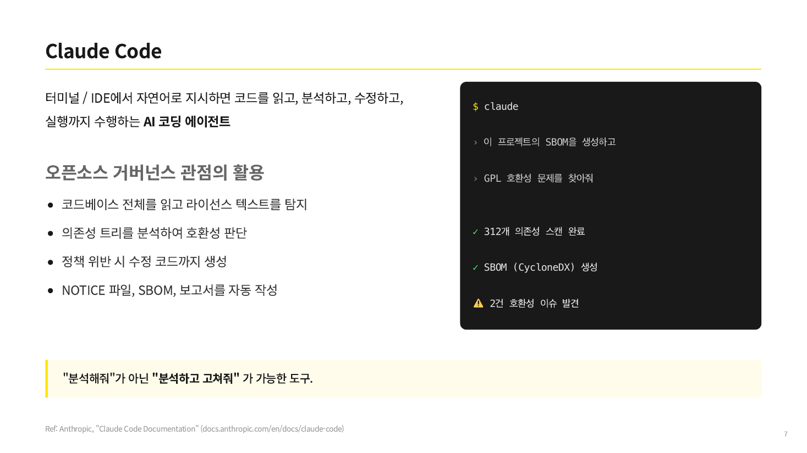

{}
도입 시점에 한 번 점검하고 끝내면 관리가 아니다. 오픈소스 위험은 운영 내내 이어지고,
새 취약점은 도입 뒤에 공개된다. FSEC 안내서의 마지막 절차인 관리(모니터링) 단계이고, ISO/IEC
18974의 지속 모니터링에 대응한다. 금융권에서 비중이 가장 큰 단계다.

여기서 만드는 문서: 정기 재평가 기록, 감사 증적 묶음.
{}

## 배포 소프트웨어와 사내 운영 시스템의 구분

오픈소스 관리의 초점은 흔히 외부로 배포하는 소프트웨어에 맞춰진다. 배포가 라이선스 의무를
일으키기 때문이다. 그러나 금융권에서 오픈소스가 가장 많이 쓰이는 곳은 외부로 배포되지 않는
사내 운영 시스템이다. 계정계와 정보계, 사내 금융 관리 시스템, 내부 서버가 그렇다. 이 가이드는
두 범위를 나눠 다룬다.

- 배포 소프트웨어(대외 서비스, 고객 앱): 라이선스 의무(고지, 경우에 따라 소스 제공)가 중심이다.
  ISO/IEC 5230의 영역이다.
- 사내 운영 시스템과 서버(비배포): 외부 배포가 없어 소스 공개 의무는 약하지만, 보안 취약점과
  공급망 위험은 오히려 크고 상시적이다. 취약점 지속 점검, 자산 인벤토리, 정기 재평가가
  중심이다. ISO/IEC 18974와 운영 복원력의 영역이다.

이 페이지는 두 번째 범위, 곧 사내 운영 시스템의 관리에 집중한다. 금융권 특유의 강조점이기
때문이다. 유럽연합의 디지털 운영 복원력법(DORA, Digital Operational Resilience Act)이 ICT
운영 복원력과 오픈소스 취약점·패치 관리를 요구하는 것도 같은 맥락이다. **[본 가이드 권고]**

## 운영 자산 인벤토리

지속 점검의 출발은 무엇이 가동 중인지 아는 것이다. 운영 중인 사내 시스템과 서버에 어떤
오픈소스가 들어 있는지 목록으로 만든다. 신규 도입만이 아니라 이미 오래 운영 중인 레거시까지
SBOM(Software Bill of Materials)으로 식별한다. 도입 기록이 없는 레거시를 빠뜨리면 점검 범위에
구멍이 생긴다.

운영 자산 인벤토리는 식별 단계([식별](../2-identify/))에서 만든 SBOM을 운영 시스템 기준으로
모은 것이다. 어떤 시스템이 어떤 컴포넌트를 쓰는지 연결해 두면, 신규 취약점이 공개됐을 때
영향받는 시스템을 곧바로 찾을 수 있다.

## 지속 취약점 모니터링

운영 단계의 핵심은 상시 감시다. 신규 취약점(CVE, Common Vulnerabilities and Exposures)이
공개될 때마다 영향받는 운영 시스템을 역추적하는 구조를 갖춘다. 이는 ISO/IEC 18974의 취약점
탐지·해결 절차(4.3.2.1)를 운영 단계로 이어 가는 활동이다. **[ISO 요구]**

방법은 운영 시스템의 SBOM을 취약점 관리 도구에 등록해 두는 것이다. Dependency-Track에 SBOM을
등록하면, 취약점 데이터베이스가 갱신될 때마다 등록된 모든 SBOM이 다시 평가돼 신규 취약점이
자동으로 드러난다. 서버와 컨테이너, 파일시스템은 Trivy로 주기적으로 스캔한다.


*그림: 운영 시스템별로 SBOM을 등록한 Dependency-Track 프로젝트 목록. 신규 취약점이 공개되면
이 목록에서 영향받는 시스템이 드러난다. 화면은 [cdxgen·Dependency-Track
튜토리얼](../../tools/8-cdxgen-dt/)의 캡처를 재사용했다.*

### 주기 스캔 예제

운영 서버를 정기적으로 스캔해 결과를 남기는 흐름을 예로 든다. 도구는 예시이며 동급 도구로
바꿔도 된다.

```bash
# 운영 서버의 파일시스템을 스캔해 결과를 날짜별로 보관한다
trivy fs --format json --output /var/log/oss-scan/$(date +%Y%m%d).json /opt/app

# 폐쇄망에서는 취약점 DB를 오프라인으로 갱신해 두고 자동 갱신을 끈다
TRIVY_SKIP_DB_UPDATE=true trivy fs /opt/app
```

폐쇄망에서는 취약점 데이터베이스를 오프라인으로 갱신한다. 갱신 절차는 [폐쇄망
운영](../0-closed-network/#오프라인-취약점-관리)에서 다룬다. 스캔 결과는 다음에서 다룰 감사
증적으로 보관한다.

{}
폐쇄망의 운영 시스템은 실시간 취약점 정보를 받지 못하므로, 오프라인 취약점 데이터베이스의
동기화 주기가 곧 신규 취약점 인지 주기가 된다. 동기화 주기와 책임자를 정하고, 인지 지연
구간에 발생할 수 있는 위험을 관리한다. 자세한 절차는 [폐쇄망 운영](../0-closed-network/#오프라인-취약점-관리)을 참고한다.
{}

## 정기 재평가

지속 모니터링이 자동 감시라면, 정기 재평가는 사람이 주기적으로 점검 체계 자체를 다시 보는
활동이다. 분기나 반기 같은 정기 점검과 함께, 시스템 변경 시점의 재점검을 절차로 만든다.
ISO/IEC 18974는 프로그램의 주기적 검토와 변경 증거(4.1.2.5)를 입증자료로 요구한다. **[ISO 요구]**

망분리 예외를 적용한 시스템은 자체 위험평가를 정기적으로 갱신한다. 규제 완화로 망분리에서
벗어난 만큼, 자율보안의 책임이 재평가 주기와 함께 이어진다. 자체 위험평가서는 [사용
승인](../4-approve/#망분리-예외-시-자체-위험평가)에서 다룬다.

## 감사 증적 관리

금융권은 내외부감사와 금융감독원의 정보기술(IT) 검사에 대비해야 한다. 관리 단계의 점검
기록은 그 자체로 감사 증적이 된다. 무엇을 언제 점검했고 어떤 취약점에 어떻게 대응했는지의
기록을 보관하면, 감사와 검사에서 요구하는 증적을 따로 만들 필요가 없다.

ISO 입증자료 체계를 감사 증적으로 재활용하는 것이 효율적이다. ISO/IEC 18974가 요구하는
취약점·조치 기록, ISO/IEC 5230이 요구하는 컴플라이언스 산출물 생성·보관(3.4.1.1, 3.4.1.2)이
그대로 감사 대응 자료가 된다. 증적을 어디에 얼마나 보관할지 정하고, 위변조를 막는 기록
방식을 갖춘다. **[본 가이드 권고]**

무엇을 보관할지의 체크리스트와 보관 위치 명세는 산출물로 제공하는 [감사 증적
목록](../artifacts/3-audit-evidence/)을 쓴다.

{}
처음 체계를 세우는 조직은 인터넷에 노출된 운영 시스템부터 SBOM을 등록해 지속 모니터링을
시작하고, 점검 기록을 한곳에 보관하는 것부터 한다.

이미 운영 중인 조직은 레거시까지 자산 인벤토리를 넓히고, 정기 재평가 주기를 절차화하며,
금융권 공급망 보안 플랫폼과 연계해 취약점 정보를 공유하고, 감사 증적을 위변조 방지 형태로
관리한다.
{}

## FSEC 안내서·ISO 표준과의 연결

| 관리 활동 | ISO/IEC 5230 | ISO/IEC 18974 | FSEC 안내서 |
|------|------|------|------|
| 지속 취약점 모니터링 | — | 4.3.2 출시 후 모니터링 | 관리 |
| 정기 재평가 | — | 4.1.2.5 주기적 검토·변경 증거 | 관리 |
| 산출물 생성·보관 | 3.4.1.1 생성, 3.4.1.2 보관 | — | 관리 |
| 감사 증적 | 3.4.1.2 보관 준용 | 4.3.2.2 취약점 및 조치 기록 | 관리 |

지속 모니터링과 보안 보증의 조항별 상세는 [ISO/IEC 18974 준수 가이드](../../iso18974_guide/)에서
더 자세히 다룬다.

{}
카카오뱅크는 KWG 30차 정기 미팅(2026-06)에서 금융권 감사 대응 경험을 공유했다. 금융감독원의
IT리스크 계량평가와 경영실태평가, 한국은행의 연간 금융정보화 추진현황 조사 등 여러 기관의
점검과 자료요청에 대응해 왔는데, 기관이 공통으로 확인하는 것은 오픈소스 현황 관리 여부,
현황 전체 목록, 관리 인력 구성, 정책 수립과 내규, 보안취약점 점검 절차의 다섯 가지였다.
분기마다 자체 점검을 하고 취약점을 지속 모니터링하는 평소 기록이 그대로 대응 자료가 됐다.

같은 미팅에서 AI 코딩 에이전트로 라이선스 식별과 호환성 분석, SBOM 생성, 고지문 작성을
자동화해 릴리스마다 반복되던 검증 작업을 줄인 사례도 소개했다.



*그림: AI 코딩 에이전트의 오픈소스 거버넌스 활용. 하헌관(카카오뱅크) 발표자료 7쪽.
슬라이드 이미지는 발표자 저작물로, 본문의 CC BY 4.0 적용 대상이 아니다.*

출처: 이민애(카카오뱅크), "금융회사로서의 오픈소스 관련 업무 대응 후기", [발표자료](https://github.com/OpenChain-Project/OpenChain-KWG/releases/download/meeting-slides-2026/30th-session3-finance-oss-report.pdf);
하헌관(카카오뱅크), "AI-driven Open Source Governance", [발표자료](https://github.com/OpenChain-Project/OpenChain-KWG/releases/download/meeting-slides-2026/30th-session1-ai-driven-oss-governance.pdf). KWG 30차 미팅(2026-06).
{}

---

*최종 검토일: 2026-06-10. 이 페이지는 규제 변화 시, 그리고 연 1회 정기적으로 재검토한다.*
