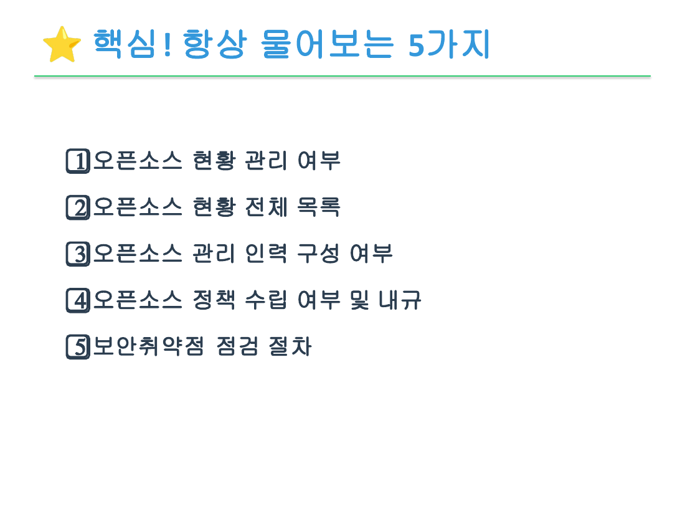

금융권은 내외부감사와 금융감독원의 정보기술(IT) 검사에 대비해 오픈소스 관리 활동의 증적을
보관해야 한다. 관리 단계의 점검 기록이 그대로 증적이 되므로, 따로 만들지 말고 평소 활동에서
나오는 기록을 체계적으로 모은다. 자세한 맥락은 [관리](../../5-manage/#감사-증적-관리)를 참고한다.

## 증적 체크리스트

아래 증적은 ISO/IEC 5230·18974의 입증자료와 겹친다. ISO 자가 인증을 준비하며 만든 문서가
그대로 감사 증적이 된다. 보관 위치와 기간은 조직 규정에 맞게 정한다.

| 증적 | 생성 활동 | 관련 ISO 입증자료 | 보관 위치(예시) | 비고 |
|------|------|------|------|------|
| 오픈소스 정책 문서와 개정 이력 | 거버넌스 | 5230 3.1.1.1 | 문서 관리 시스템 | 버전 이력 포함 |
| 역할·책임 문서, 담당자 지정 기록 | 거버넌스 | 5230 3.1.2.1, 3.2.2.1 | 문서 관리 시스템 |  |
| SBOM과 갱신 이력 | 식별 | 5230 3.3.1.1, 3.3.1.2 | SBOM 관리 도구 | 시스템별 |
| 취약점 점검 결과 | 이슈 파악·해결 | 18974 4.3.2.1, 4.3.2.2 | 취약점 관리 도구 | 날짜별 |
| 취약점 조치 기록(조치 불필요 판단 포함) | 이슈 파악·해결 | 18974 4.3.2.2 | 취약점 관리 도구 | VEX 포함 |
| 라이선스 검토 기록 | 이슈 파악·해결 | 5230 3.3.2.1 | 문서 관리 시스템 |  |
| 사용 승인 신청·검토·결정 기록 | 사용 승인 | 5230 3.1.5.1 | 승인 관리 도구 | 위원회 결정 근거 |
| 망분리 예외 자체 위험평가서 | 사용 승인 | (전자금융감독규정) | 문서 관리 시스템 | 정보보호위원회(CISO) 승인 이력, 재평가 이력 |
| 반입 승인 기록 | 폐쇄망 운영 | — | 문서 관리 시스템 | 검증 결과 포함 |
| 정기 재평가 결과 | 관리 | 18974 4.1.2.5 | 문서 관리 시스템 | 주기별 |
| 컴플라이언스 산출물(고지문 등) | 관리 | 5230 3.4.1.1, 3.4.1.2 | 배포 산출물 저장소 | 배포 소프트웨어 |
| 외주 계약의 오픈소스 요구 조항과 제출 SBOM | 사용 승인 | (전자금융감독규정 제21조 내부통제) | 계약 관리 시스템 | 전자금융보조업자 |

## 보관·관리 원칙

증적은 만드는 것만큼 지키는 것이 중요하다.

- 보관 기간을 정한다. 감사 주기와 규정 요구를 고려해 정하고, 전자금융거래 기록 보존 기간 등
  규정상 보존 기간과 어긋나지 않는지 확인한 뒤, 산출물 보관 절차(ISO/IEC 5230
  3.4.1.2)에 명시한다.
- 위변조를 막는다. 기록을 나중에 고칠 수 없는 방식(추가만 가능한 로그, 접근 통제)으로 남긴다.
- 추적할 수 있게 한다. 누가 언제 무엇을 했는지 알 수 있도록 기록에 행위자와 시각을 남긴다.
- 검사 대응을 미리 점검한다. 정기 재평가 때 증적이 빠짐없이 보관되는지 함께 확인한다.

{}
카카오뱅크는 KWG 30차 정기 미팅(2026-06)에서 금융감독원 IT리스크 계량평가와 경영실태평가,
한국은행의 연간 금융정보화 추진현황 조사, 예금보험공사 자료요청에 대응한 경험을 공유했다.
기관이 공통으로 묻는 것은 오픈소스 현황 관리 여부, 현황 전체 목록, 관리 인력 구성, 정책
수립과 내규, 보안취약점 점검 절차의 다섯 가지로, 위 증적 체크리스트와 대부분 겹친다.

*그림: 기관이 공통으로 확인하는 다섯 가지. 이민애(카카오뱅크) 발표자료 5쪽. 슬라이드
이미지는 발표자 저작물로, 본문의 CC BY 4.0 적용 대상이 아니다.*

지원이 끝난(deprecated) 컴포넌트의 활용 목적과 사유를 묻는 질의에는, 평소 남겨 둔 관리
기록(사용 목적, 보안취약점 부재 확인)으로 답할 수 있었다. 오래된 컴포넌트의 존재 자체보다
그것을 알고 관리하고 있다는 기록이 중요함을 보여 주는 사례다. 다만 기관마다 요구하는
목록의 범위와 양식이 달라, SBOM을 갖춰도 요청 양식에 맞춰 변환하는 작업은 남는다.

출처: 이민애(카카오뱅크), "금융회사로서의 오픈소스 관련 업무 대응 후기", [KWG 30차 미팅(2026-06) 발표자료](https://github.com/OpenChain-Project/OpenChain-KWG/releases/download/meeting-slides-2026/30th-session3-finance-oss-report.pdf).
{}

---

*최종 검토일: 2026-06-10. 이 페이지는 규제 변화 시, 그리고 연 1회 정기적으로 재검토한다.*
