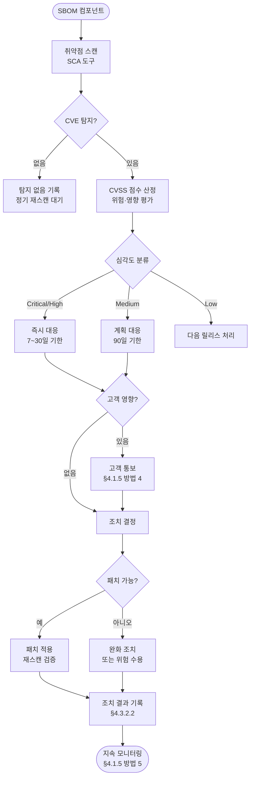

## 1. 조항 개요

§4.3.2는 ISO/IEC 18974의 핵심 조항으로, ISO/IEC 5230에 없는 18974 전용 신규
조항이다. SBOM에 포함된 각 오픈소스 컴포넌트에 대해 **취약점 탐지 → 위험
평가 → 조치 결정 → 고객 동의(필요 시) → 조치 수행 → 배포 후 신규 취약점
대응 → 지속 모니터링** 의 전 과정을 절차로 수립하고 이행 기록을 유지하도록
요구한다. §4.1.5가 취약점 처리 방법의 존재를 요구한다면, §4.3.2는 그 방법이
각 컴포넌트에 실제로 적용되어 기록이 남아 있을 것을 요구한다.

## 2. 해야 할 활동

- SBOM의 각 오픈소스 컴포넌트에 대해 알려진 취약점 존재 여부를 탐지한다.
- 탐지된 각 취약점에 위험·영향 점수(CVSS)를 할당한다.
- 각 취약점에 대해 필요한 수정 또는 완화 단계를 결정하고 문서화한다.
- 필요한 경우 사전에 결정된 수준 이상에서 고객 동의를 획득한다.
- 위험·영향 점수에 따라 적절한 조치를 수행하고 기록한다.
- 배포된 소프트웨어에 새로 공개된 취약점이 있는 경우 적절한 조치를 수행한다.
- 출시 후에도 공급 소프트웨어의 취약점 공개를 모니터링하고 대응한다.
- 취약점별 탐지 및 조치 결과를 컴포넌트 기록으로 유지한다.

## 3. 요구사항 및 입증자료

| 조항 번호 | 요구사항 (KO) | 입증자료 |
|-----------|--------------|---------|
| §4.3.2 | SBOM에 포함될 각 오픈소스 소프트웨어 컴포넌트에 보안 보증 활동을 적용하는 프로세스가 있어야 한다: 알려진 취약점 탐지 / 위험·영향 점수 할당 / 수정 또는 완화 단계 결정·문서화 / 필요 시 고객 동의 획득 / 위험 점수에 따른 조치 수행 / 새로 발견된 취약점 조치 / 출시 후 모니터링 및 취약점 공개 대응 | **4.3.2.1** 공급 소프트웨어의 오픈소스 소프트웨어 컴포넌트에 대해 알려진 취약점의 탐지 및 해결을 처리하기 위한 문서화된 절차<br>**4.3.2.2** 각 오픈소스 소프트웨어 컴포넌트에 대해 식별된 알려진 취약점 및 취해진 조치(조치가 필요하지 않은 경우도 포함)에 대한 기록이 유지 관리되어야 함 |

<details><summary>영문 원문 보기</summary>

> **§4.3.2 Security Assurance**
> There shall exist a process to apply security assurance activities to each
> open source software component that is to be included in the bill of
> materials (SBOM):
> - Applying a method to detect the existence of known vulnerabilities;
> - Assign a risk/impact score to each identified known vulnerability;
> - Determine and document the necessary remediation or mitigation steps for
>   each detected and scored known vulnerability;
> - Obtain customer approval above a pre-determined threshold, where
>   applicable;
> - Perform appropriate action based on risk/impact score;
> - Perform appropriate action for newly disclosed known vulnerabilities in
>   previously released supplied software;
> - Ability to monitor and respond to vulnerability disclosures for the
>   supplied software after its release.
>
> **Verification Material(s):**
> 4.3.2.1 A documented procedure for handling detection and resolution of
> known vulnerabilities for the open source software components of the
> supplied software.
> 4.3.2.2 For each open source software component, a record is maintained of
> the identified known vulnerabilities and action taken (including a
> determination that no action was required).

</details>

## 4. 입증자료별 준수 방법 및 샘플

### 4.3.2.1 취약점 탐지 및 해결 절차

**준수 방법**

SBOM의 각 오픈소스 컴포넌트에 대한 취약점 탐지부터 해결까지의 전체 과정을
문서화한 절차가 입증자료 4.3.2.1이다. 이 절차는 §4.1.5에서 정의한 개별 방법들을
통합하여 운영 흐름으로 구체화한 것이다.

아래 플로우차트는 CVE 탐지부터 조치 완료까지의 전체 흐름을 나타낸다.



**절차 단계별 상세**

아래는 플로우차트의 각 단계를 절차 문서 형태로 기술한 샘플이다.

```
[취약점 탐지 및 해결 절차]

1단계 — 취약점 탐지
- CI/CD 파이프라인 빌드 시 SCA 도구(Dependency-Track, OSV-SCALIBR 등)가
  SBOM을 기반으로 취약점을 자동 스캔한다.
- NVD, OSV, GitHub Advisory Database 등 복수의 취약점 DB를 참조한다.
- 배포 후에도 신규 CVE 발행 시 아카이브된 SBOM과 자동 대조한다.

2단계 — 위험·영향 점수 산정
- 탐지된 CVE에 대해 CVSS v3.1 기준 기본 점수를 산정한다.
- 당사 제품의 실제 사용 맥락(네트워크 노출도, 권한 필요 여부 등)을 고려하여
  환경 점수(Environmental Score)를 조정한다.
- 심각도 분류: Critical(9.0+) / High(7.0-8.9) / Medium(4.0-6.9) / Low(0.1-3.9)

3단계 — 조치 결정 및 문서화
- 심각도와 고객 영향 범위에 따라 조치 방법을 결정한다:
  · 패치 적용: 상위 버전으로 업그레이드 또는 패치 적용
  · 완화 조치: 패치가 없는 경우 네트워크 격리, 기능 비활성화 등
  · 위험 수용: 실제 악용 가능성이 낮고 완화 조치도 불필요한 경우
    (보안 담당자 + 오픈소스 PM 공동 승인 필수)
- 조치 결정 근거를 취약점 추적 시스템에 기록한다.

4단계 — 고객 동의 획득 (해당 시)
- Critical/High 취약점이 고객 배포 제품에 영향을 미치는 경우:
  · 고객사 보안 담당자에게 취약점 정보와 대응 계획을 사전 통보한다.
  · 패치 배포 일정과 완화 조치 방법을 공유한다.

5단계 — 조치 수행
- 결정된 조치를 조치 기한 내에 수행한다.
- 패치 적용 후 재스캔을 실행하여 취약점 제거를 확인한다.
- 조치 완료 결과를 §4.3.2.2 기록에 업데이트한다.

6단계 — 지속 모니터링
- Dependency-Track 등 도구를 통해 배포된 소프트웨어의 취약점 현황을
  상시 모니터링한다.
- 신규 CVE 발행 시 1~3단계를 자동 또는 즉시 재수행한다.
```

---

### 4.3.2.2 취약점 및 조치 기록

**준수 방법**

SBOM의 각 오픈소스 컴포넌트에 대해 식별된 취약점과 취해진 조치(조치가 불필요
하다고 판단한 경우 포함)를 기록하고 유지해야 한다. 이 기록이 입증자료 4.3.2.2다.
"조치가 필요하지 않은 경우도 포함"이라는 표현이 중요하다 — 취약점이 탐지되지
않은 컴포넌트도 스캔했다는 사실과 탐지 결과를 기록해야 한다.

기록은 Dependency-Track, Jira 보안 이슈 트래커, 스프레드시트 등 다양한
도구로 관리할 수 있으며, 감사 시 즉시 제출 가능한 형태로 유지한다.

**고려사항**

- **컴포넌트별 기록**: SBOM의 각 컴포넌트에 대해 개별 기록을 유지한다.
- **탐지 없음도 기록**: 취약점이 탐지되지 않은 컴포넌트도 스캔 날짜와 결과를
  기록한다.
- **조치 이력 추적**: 동일 컴포넌트의 취약점 발생·조치·재스캔 이력을 시계열로
  관리한다.
- **보관 기간**: 해당 소프트웨어의 지원 기간 + 최소 3년간 보관한다.

**샘플**

아래는 컴포넌트별 취약점 및 조치 기록부 샘플이다.

```
| 소프트웨어 | 버전 | 컴포넌트 | 컴포넌트 버전 | CVE ID | CVSS | 심각도 | 조치 내용 | 조치일 | 담당자 | 비고 |
|-----------|------|---------|--------------|--------|------|--------|-----------|--------|--------|------|
| MyProduct | v1.2.0 | openssl | 3.0.7 | CVE-2023-0286 | 7.4 | High | 3.0.8로 업그레이드 | 2023-02-10 | 김철수 | 재스캔 확인 완료 |
| MyProduct | v1.2.0 | zlib | 1.2.11 | CVE-2022-37434 | 9.8 | Critical | 1.2.13으로 업그레이드 | 2022-10-15 | 김철수 | 고객 통보 완료 |
| MyProduct | v1.2.0 | libpng | 1.6.37 | 없음 | - | - | 조치 불필요 | 2023-03-01 | 김철수 | 정기 스캔 결과 |
| FirmwareX | v2.3.0 | busybox | 1.35.0 | CVE-2022-28391 | 9.8 | Critical | 위험 수용 (네트워크 격리 완화) | 2022-11-20 | 김철수 | 패치 미존재, PM 승인 완료 |
```

## 5. 참고

- ISO/IEC 5230 대응 조항 없음 (18974 전용 신규 조항)
- 관련 가이드: [기업 오픈소스 관리 가이드 — 3. 프로세스](../../../opensource_for_enterprise/3-process/)
- 관련 도구: [Dependency-Track](../../../tools/7-dependency-track/), [OSV-SCALIBR](../../../tools/4-osvscalibr/)
- 연계 조항: [§4.1.5 표준 관행 구현](../../../iso18974_guide/1-program-foundation/5-standard-practice/), [§4.3.1 SBOM](../1-sbom/)
