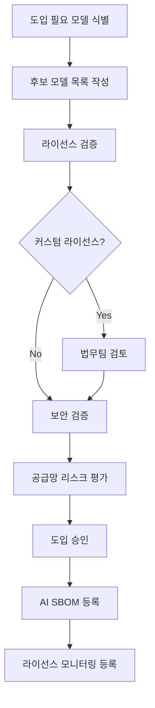

## 1. 개요

ISO/IEC 42001 §8.8은 외부에서 조달하는 AI 시스템(모델, API, 서비스)을 사용할 때
적절한 평가와 검증을 수행할 것을 요구한다. 오픈소스 관점에서는 **외부 오픈소스 AI 모델**을
조달할 때 라이선스·보안·공급망 리스크를 검증하는 절차가 핵심이다.

---

## 2. 외부 AI 조달의 세 가지 유형

| 유형 | 예시 | 오픈소스 관련성 |
|------|------|--------------|
| **오픈소스 AI 모델 직접 사용** | Llama, Mistral, Falcon 모델 가중치 다운로드 | 높음 — 라이선스 직접 적용 |
| **오픈소스 기반 AI 서비스** | Hugging Face Inference API, Ollama | 중간 — 기반 모델 라이선스 확인 필요 |
| **상용 AI API** | OpenAI API, Google Vertex AI | 낮음 — 서비스 약관 적용 (OSS 라이선스 직접 적용 안 됨) |

이 가이드는 **유형 1(오픈소스 AI 모델 직접 사용)**과 **유형 2(오픈소스 기반 AI 서비스)**를 중심으로 다룬다.

---

## 3. 오픈소스 AI 모델 조달 전 검증 체크리스트

외부 오픈소스 AI 모델을 도입하기 전 다음 항목을 검증한다.

### 3.1 라이선스 검증

```markdown
## 오픈소스 AI 모델 라이선스 검증 체크리스트

### 기본 라이선스 정보
- [ ] 라이선스 유형 확인: ___________________
      (Apache 2.0 / MIT / Llama Community / Gemma ToU / 기타)
- [ ] 라이선스 원문 출처 URL: ___________________
- [ ] 라이선스 버전 확인 (동일 모델의 이전 버전과 다를 수 있음)

### 상업적 사용 조건
- [ ] 상업적 사용 허용 여부: ✅ 허용 / ⚠️ 조건부 / ❌ 불허
- [ ] 사용자 수(MAU) 제한 조건: ___________________
      (예: Llama 3 — MAU 7억 초과 시 Meta 허가 필요)
- [ ] 매출 기반 제한 조건: ___________________

### 파생물(Fine-tuning) 조건
- [ ] 파인튜닝 허용 여부: ✅ 허용 / ⚠️ 조건부 / ❌ 불허
- [ ] 파인튜닝 모델 공개 의무 여부: ___________________
- [ ] 파인튜닝 모델 라이선스 요건: ___________________

### 재배포 조건
- [ ] 모델 가중치 재배포 허용 여부: ✅ 허용 / ⚠️ 조건부 / ❌ 불허
- [ ] 재배포 시 라이선스 문서 포함 의무: ___________________

### 표시(Attribution) 의무
- [ ] 저작자 표시 필요 여부: ✅ 필요 / ❌ 불필요
- [ ] 표시 방법 및 위치: ___________________
      (서비스 UI, 문서, API 응답 등)

### 법무 검토 필요 여부
- [ ] 표준 SPDX 라이선스가 아닌 경우 법무팀 검토 완료: ✅ / 해당 없음
- [ ] 법무팀 검토 일자: ___________________
- [ ] 검토 의견: ___________________
```

### 3.2 보안 검증

```markdown
### 보안 검증 항목
- [ ] 공식 배포 채널에서 다운로드 확인
      (공식 GitHub, Hugging Face 공식 계정)
- [ ] 파일 해시(SHA256) 검증 완료
- [ ] 알려진 취약점(CVE) 조회 완료
      (NVD, OSV.dev 검색 결과: ___________________)
- [ ] 모델 가중치의 악성 코드 삽입 여부 검토
      (신뢰할 수 없는 출처의 모델은 사용 금지)
- [ ] 라이선스 변경 모니터링 채널 등록
      (GitHub Watch, 공식 뉴스레터 등)
```

### 3.3 공급망 리스크 평가

```markdown
### 공급망 리스크 평가 항목
- [ ] 모델 공급자의 신뢰도 확인
      (개인 / 연구기관 / 기업 — 오픈소스 커뮤니티 평판)
- [ ] 모델 유지보수 활성도 확인
      (마지막 업데이트 일자, 이슈 대응 현황)
- [ ] 라이선스 변경 이력 확인
      (과거 라이선스 조건 변경 사례 여부)
- [ ] 대안 모델 식별
      (라이선스 변경 또는 서비스 중단 시 대안)
```

---

## 4. 주요 오픈소스 AI 모델 라이선스 리스크 요약

| 모델 계열 | 라이선스 | 주요 리스크 |
|---------|---------|-----------|
| **Llama 3.x** | Meta Llama Community License | MAU 7억 초과 시 Meta 승인 필요, 라이선스 버전별 조건 차이 |
| **Llama 2** | Meta Llama 2 Community License | 경쟁사(Meta 기준) 사용 제한, 파생 모델 "Llama 2" 명칭 사용 제한 |
| **Gemma 2** | Google Gemma ToU | Google 사용 정책 위반 시 라이선스 즉시 종료 |
| **Falcon** | Falcon License | 특정 규모 이상 수익 창출 시 라이선스 필요 (조건 확인 필수) |
| **Mistral 7B** | Apache 2.0 | 리스크 낮음 |
| **Phi-3** | MIT | 리스크 낮음 |
| **GPT-2, BERT** | MIT / Apache 2.0 | 리스크 낮음 |

{}
Llama, Gemma 등 커스텀 라이선스를 사용하는 모델은 **라이선스 원문을 직접 읽고**
법무팀 검토를 거친 후 사용한다. 커스텀 라이선스는 SPDX 표준 라이선스가 아니므로
일반적인 라이선스 분류 도구로는 자동 검토가 불가능하다.
{}

---

## 5. 외부 AI 모델 조달 프로세스



**체크포인트**:
- [ ] 외부 오픈소스 AI 모델 도입 전 라이선스 검증 절차가 수행되었는가?
- [ ] 커스텀 라이선스 모델의 경우 법무팀 검토가 완료되었는가?
- [ ] 도입된 외부 모델이 AI SBOM에 등록되어 있는가?
- [ ] 외부 모델 라이선스 변경을 모니터링하는 채널이 있는가?
- [ ] 라이선스 조건 위반 시 대응할 대안 모델이 식별되어 있는가?

---

## 6. 참고

- [운영 섹션 홈](../)
- [AI 시스템의 오픈소스 관리](../1-oss-in-ai/)
- [AI SBOM 가이드](../2-ai-sbom/)
- [ISO/IEC 18974 — §4.3.2 보안 보증](../../../iso18974_guide/3-content-review/2-security-assurance/)
- [기업 오픈소스 관리 가이드 — AI 컴플라이언스](../../../opensource_for_enterprise/7-ai-compliance/)
- [AI Work Group](../../../../resource/AI_work_group/)
