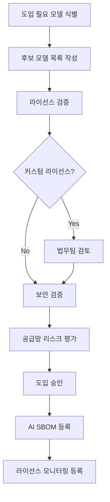

## 1. 개요

ISO/IEC 42001 §8.8은 외부에서 조달하는 AI 시스템(모델, API, 서비스)을 사용할 때
적절한 평가와 검증을 수행할 것을 요구한다. 오픈소스 관점에서는 **외부 오픈소스 AI 모델**을
조달할 때 라이선스·보안·공급망 리스크를 검증하는 절차가 핵심이다.

---

## 2. 외부 AI 조달의 세 가지 유형

| 유형 | 예시 | 오픈소스 관련성 |
|------|------|--------------|
| **오픈소스 AI 모델 직접 사용** | Llama, Mistral, Falcon 모델 가중치 다운로드 | 높음 — 라이선스 직접 적용 |
| **오픈소스 기반 AI 서비스** | Hugging Face Inference API, Ollama | 중간 — 기반 모델 라이선스 확인 필요 |
| **상용 AI API** | OpenAI API, Google Vertex AI | 낮음 — 서비스 약관 적용 (OSS 라이선스 직접 적용 안 됨) |

유형 1·2가 오픈소스 라이선스 직접 적용 영역으로 §3~§4의 핵심 대상이며,
유형 3(상용 AI API)도 ISO/IEC 42001 §8.8이 동일하게 요구하므로 §5에서 별도로 다룬다.

---

## 3. 오픈소스 AI 모델 조달 전 검증 체크리스트

외부 오픈소스 AI 모델을 도입하기 전 다음 항목을 검증한다.

### 3.1 라이선스 검증

```markdown
## 오픈소스 AI 모델 라이선스 검증 체크리스트

### 기본 라이선스 정보
- [ ] 라이선스 유형 확인: ___________________
      (Apache 2.0 / MIT / Llama Community / Gemma ToU / 기타)
- [ ] 라이선스 원문 출처 URL: ___________________
- [ ] 라이선스 버전 확인 (동일 모델의 이전 버전과 다를 수 있음)

### 상업적 사용 조건
- [ ] 상업적 사용 허용 여부: ✅ 허용 / ⚠️ 조건부 / ❌ 불허
- [ ] 사용자 수(MAU) 제한 조건: ___________________
      (예: Llama 3 — MAU 7억 초과 시 Meta 허가 필요)
- [ ] 매출 기반 제한 조건: ___________________

### 파생물(Fine-tuning) 조건
- [ ] 파인튜닝 허용 여부: ✅ 허용 / ⚠️ 조건부 / ❌ 불허
- [ ] 파인튜닝 모델 공개 의무 여부: ___________________
- [ ] 파인튜닝 모델 라이선스 요건: ___________________

### 재배포 조건
- [ ] 모델 가중치 재배포 허용 여부: ✅ 허용 / ⚠️ 조건부 / ❌ 불허
- [ ] 재배포 시 라이선스 문서 포함 의무: ___________________

### 표시(Attribution) 의무
- [ ] 저작자 표시 필요 여부: ✅ 필요 / ❌ 불필요
- [ ] 표시 방법 및 위치: ___________________
      (서비스 UI, 문서, API 응답 등)

### 법무 검토 필요 여부
- [ ] 표준 SPDX 라이선스가 아닌 경우 법무팀 검토 완료: ✅ / 해당 없음
- [ ] 법무팀 검토 일자: ___________________
- [ ] 검토 의견: ___________________
```

### 3.2 보안 검증

```markdown
### 보안 검증 항목
- [ ] 공식 배포 채널에서 다운로드 확인
      (공식 GitHub, Hugging Face 공식 계정)
- [ ] 공식 namespace와 정확 일치 확인 (typo-squatting 방어)
      (예: `meta-llama` vs `meta-Ilama` — 소문자 L과 대문자 I 혼동)
- [ ] 파일 해시(SHA256) 검증 완료 및 AI SBOM에 기록
- [ ] 모델 가중치 형식 확인
      (Safetensors 우선; `.pt`·`.bin` pickle 형식은 격리 환경에서 검증 후 운영)
- [ ] 알려진 취약점(CVE) 조회 완료
      (NVD, OSV.dev 검색 결과: ___________________)
- [ ] 모델 가중치의 악성 코드 · 백도어 삽입 여부 검토
      (신뢰할 수 없는 출처의 모델은 사용 금지, 평가 데이터셋으로 백도어 트리거 점검)
- [ ] 라이선스 변경 모니터링 채널 등록
      (GitHub Watch, 공식 뉴스레터 등)
```

### 3.3 공급망 리스크 평가

```markdown
### 공급망 리스크 평가 항목
- [ ] 모델 공급자의 신뢰도 확인
      (개인 / 연구기관 / 기업 — 오픈소스 커뮤니티 평판)
- [ ] 모델 유지보수 활성도 확인
      (마지막 업데이트 일자, 이슈 대응 현황)
- [ ] 라이선스 변경 이력 확인
      (과거 라이선스 조건 변경 사례 여부)
- [ ] 대안 모델 식별
      (라이선스 변경 또는 서비스 중단 시 대안)
```

---

## 4. 주요 오픈소스 AI 모델 라이선스 리스크 요약

| 모델 계열 | 라이선스 | 주요 리스크 |
|---------|---------|-----------|
| **Llama 3.x** | Meta Llama Community License | MAU 7억 초과 시 Meta 승인 필요, 라이선스 버전별 조건 차이 |
| **Llama 2** | Meta Llama 2 Community License | 경쟁사(Meta 기준) 사용 제한, 파생 모델 "Llama 2" 명칭 사용 제한 |
| **Gemma 2** | Google Gemma ToU | Google 사용 정책 위반 시 라이선스 즉시 종료 |
| **Falcon** | Falcon License | 특정 규모 이상 수익 창출 시 라이선스 필요 (조건 확인 필수) |
| **Mistral 7B** | Apache 2.0 | 리스크 낮음 |
| **Phi-3** | MIT | 리스크 낮음 |
| **GPT-2, BERT** | MIT / Apache 2.0 | 리스크 낮음 |

{}
Llama, Gemma 등 커스텀 라이선스를 사용하는 모델은 **라이선스 원문을 직접 읽고**
법무팀 검토를 거친 후 사용한다. 커스텀 라이선스는 SPDX 표준 라이선스가 아니므로
일반적인 라이선스 분류 도구로는 자동 검토가 불가능하다.
{}

---

## 5. 상용 AI API §8.8 평가 체크리스트

OpenAI · Anthropic · Google Vertex AI · AWS Bedrock · Azure OpenAI 등 상용 AI API는
오픈소스 라이선스가 직접 적용되지 않지만, ISO/IEC 42001 §8.8은 동일하게 외부 공급
AI 시스템에 대한 평가를 요구한다. 다음 세 영역을 도입 전 검토한다.

### 5.1 데이터 처리 · 학습 사용 검증

```markdown
### 데이터 처리 검증 항목
- [ ] 입력 데이터의 학습 사용 여부 (opt-in / opt-out 정책)
      (Enterprise/API 플랜은 기본 opt-out인지 확인)
- [ ] 출력 데이터 보존 기간 (zero-retention 옵션 가능 여부)
- [ ] API 호출 로그 저장 위치(국가) — 개인정보보호법 국외 이전 검토
- [ ] 데이터 처리 리전 선택 가능 여부 (EU·KR 리전 등)
- [ ] BAA(Business Associate Agreement) 체결 가능 여부 (의료 분야)
- [ ] 민감정보 · 영업비밀 입력 차단 정책 수립 여부
```

### 5.2 IP indemnification (지식재산 면책) 비교

생성형 AI 출력물의 저작권 침해 리스크에 대비해 주요 제공자는 IP 보증 정책을 운영한다.
플랜별 적용 범위와 조건이 다르므로 **약관 원문**과 **최신 정책 페이지**를 직접 확인한다.

| 제공자 | 보증 정책 명칭 | 적용 조건(요약) |
|--------|--------------|---------------|
| **OpenAI** | Copyright Shield | ChatGPT Enterprise · Team · API 사용자 (ChatGPT Plus·무료 명시적 제외) |
| **Anthropic** | IP Indemnification | Commercial Service Agreement 가입 시 |
| **Google Cloud** | Generative AI Indemnification | Vertex AI 약관 명시 모델 · 약관 준수 시 |
| **AWS** | IP Indemnification | Bedrock Titan + 약관 명시 third-party 모델(Claude·Llama 등 일부 — 약관 원문 확인 필요) · Amazon Q |
| **Microsoft (Azure OpenAI)** | Customer Copyright Commitment | Azure OpenAI Service |
| **Microsoft (M365 Copilot)** | Copilot Copyright Commitment | M365 Copilot · GitHub Copilot Business/Enterprise |

공통 면책 요건: **콘텐츠 필터 활성화**, **출력물 사후 검수**, **의도적 침해 시도 없음**,
**입력 데이터에 대한 적법한 권리 보유**(사용자가 prompt에 입력한 자료의 저작권·라이선스 적법성 보장).
면책 청구 가능 손해 범위(법무 자문 비용·합의금 등)는 제공자별로 다르므로 법무팀과 사전 협의.
실제 약관은 자주 변경되므로 도입 전 **약관 원문**을 직접 확인한다.

### 5.3 서비스 약관 변경 · 가용성 모니터링

```markdown
### 약관 · 가용성 모니터링 항목
- [ ] 약관 변경 알림 채널 등록 (이메일 알림 · 변경 로그 페이지 RSS)
- [ ] 가격 변경 정책 확인 (계약상 사전 통지 기간)
- [ ] SLA 가용성 보장 수준 (예: 99.9%)
- [ ] 서비스 종료(EOL) 정책 — 마이그레이션 기간 확보
- [ ] 대체 제공자 식별 (벤더 락인 방지 — 동등 모델 매핑 표 유지)
- [ ] 출력물 책임 한계 조항 검토 (Hallucination · Bias 면책 조항)
```

{}
상용 API의 가용성·약관 변경·가격 리스크에 대비해 **오픈소스 모델 자체 호스팅 옵션을
백업으로 확보**하는 것을 권장한다. AI SBOM에 두 옵션의 모델 매핑을 함께 기록하면
신속한 전환이 가능하다.
{}

---

## 6. 모델 공급망 공격 방어

오픈소스 모델 가중치 파일과 모델 허브(Hugging Face·PyTorch Hub 등)는 2024년 이후 **새로운
공격 표면**으로 확인되었다. 도입 전 다음 공격 유형을 인지하고 방어 통제를 적용한다.

### 6.1 알려진 공격 유형

| 공격 | 설명 | 방어 |
|------|------|------|
| **Pickle RCE** | PyTorch `.pt`·`.bin` 등 Python pickle 직렬화 모델에 임의 코드 삽입. 모델 로드 시점에 실행 | Safetensors 형식 우선 사용, untrusted 모델은 격리 컨테이너에서 로드 |
| **Typo-squatting** | Hugging Face·PyPI에서 모델명·패키지명 오타 변형 게시 (예: `meta-Ilama` vs `meta-llama`) | 공식 namespace 명시적 검증, PURL 핀고정, 다운로드 시 hash 검증 |
| **Model Poisoning** | 학습 데이터 · 가중치에 백도어 삽입 — 특정 트리거 입력 시 악의적 출력 | 신뢰 가능한 제공자, 벤치마크 데이터셋 비교, 트리거 패턴 점검 |
| **License-flip** | 모델 라이선스 사후 변경 후 기존 사용자에 소급 적용 시도 | 다운로드 시점 라이선스 본문 · 가중치 hash 함께 보관 |
| **Dependency Confusion** | private 모델명과 동일한 public 모델 발행으로 잘못 다운로드 유도 | namespace 명시적 지정, private registry 우선순위 설정 |

### 6.2 권장 방어 통제

```markdown
### 모델 공급망 방어 통제 체크리스트
- [ ] 모델 가중치는 Safetensors 형식 우선 (pickle 회피)
- [ ] 모델 파일 hash(SHA-256) 핀고정 + AI SBOM에 기록
- [ ] OpenSSF Model Signing · Sigstore 서명 검증 도입 (§6.3)
- [ ] SLSA for AI 빌드 레벨 평가 (§6.4)
- [ ] 모델 격리 환경(샌드박스)에서 1차 검증 후 운영 환경 반영
- [ ] 신규 모델 도입 시 보안팀 사전 검토 의무화
- [ ] 모델 허브 계정 typo-squatting 점검 자동화 (CI 단계)
- [ ] 모델 라이선스 본문 · 가중치 hash · 다운로드 일자를 함께 보관
```

{}
2024년 2월 JFrog Security 연구진은 Hugging Face Hub에서 **약 100개의 악성 모델**을 식별했다.
이들 다수는 pickle 직렬화를 악용해 모델 로드 시점에 reverse shell 등 RCE 페이로드를 실행하도록
설계되었다(일부는 시스템 정찰 목적). Hugging Face는 사고 이전부터 PickleScan과 Safetensors
형식을 운영해 왔으나, 사고를 계기로 보안 강화가 이뤄졌다. **공식 권장은 신뢰 가능한 출처의
Safetensors 형식 사용**이다.
{}

### 6.3 OpenSSF Model Signing 도입 절차

[OpenSSF Model Signing](https://github.com/sigstore/model-transparency)은
Sigstore(keyless OIDC 서명) · X.509 인증서 · 공개키 세 가지 방식을 지원하는
ML 모델 서명 표준이다. 2026년 기준 정식 패키지명은 `model-signing`(v1.1+)이다.

**(1) 설치**

```bash
# 기본 설치 (Sigstore 사용)
pip install model-signing

# X.509(PKCS #11 HSM) 지원 포함
pip install model-signing[pkcs11]
```

**(2) 모델 서명 (Sigstore keyless 방식, 권장)**

```bash
# 모델 디렉토리 전체에 대한 다이제스트 계산 후 Sigstore로 서명
# → Sigstore Fulcio가 OIDC 신원으로 단기 인증서 발급, Rekor 투명성 로그에 기록
# → model.sig 파일 생성
model_signing sign sigstore /path/to/llama-3.1-8b
```

**(3) 모델 검증 (서명자 신원 확인)**

```bash
# Google OIDC 사용 예시
model_signing verify sigstore /path/to/llama-3.1-8b \
  --signature model.sig \
  --identity "release-bot@example.com" \
  --identity_provider "https://accounts.google.com"

# GitHub Actions OIDC 사용 예시 (CI 환경에서 가장 흔함)
model_signing verify sigstore /path/to/llama-3.1-8b \
  --signature model.sig \
  --identity "https://github.com/myorg/myrepo/.github/workflows/release.yml@refs/heads/main" \
  --identity_provider "https://token.actions.githubusercontent.com"
```

> 정확한 CLI 구문은 [`sigstore/model-transparency`](https://github.com/sigstore/model-transparency) 공식 README를 도입 시점에 재확인합니다(서브커맨드/옵션명이 버전별로 변경될 수 있음).

**(4) 자체 키 사용 (오프라인 환경)**

```bash
# 서명 (RSA/EC 등 자체 키 페어)
model_signing sign key /path/to/model --private_key signing.key

# 검증
model_signing verify key /path/to/model --signature model.sig --public_key signing.pub
```

**(5) AI SBOM과 연계**

서명 검증 결과(서명자 identity · 발급 일자 · Rekor 로그 인덱스)를 AI SBOM
`hashes` · `attestation` 필드에 기록하여 감사 추적성을 확보한다. CycloneDX 1.6에서는
컴포넌트의 `signature` 필드에 직접 첨부할 수 있다.

### 6.4 SLSA for AI 빌드 레벨

[SLSA(Supply-chain Levels for Software Artifacts)](https://slsa.dev/spec/v1.0/)의
빌드 트랙은 ML 모델 빌드 파이프라인에도 동일하게 적용된다. **SLSA for AI**는 이를
모델 학습 · 파인튜닝 · 변환 과정에 매핑한 사용 사례다.

| 레벨 | 요구사항 (ML 모델 적용) | 활용 |
|------|----------------------|------|
| **L0** | (SLSA 미적용 상태를 편의상 표기 — 표준 정의 레벨이 아님) provenance 없음 | 로컬 실험·연구 단계만 허용 |
| **L1** | 빌드 플랫폼이 자동으로 provenance 생성 (학습 데이터·코드·하이퍼파라미터·환경) | 내부 모델 일반 |
| **L2** | provenance가 위변조 방지 서명을 보유 (in-toto attestation + Sigstore) — 호스팅 빌더 사용 | 외부 배포 모델·고객 제공 모델 |
| **L3** | 빌드 단계에서 사용자 정의 코드 주입 방지(은밀한·명시적) — 빌드 정의 외 학습 코드·하이퍼파라미터 주입 차단, hardened build 환경 | 고위험·규제 산업 |

SLSA 정식 안정 버전은 v1.0(2023-04 GA)이며 v1.1 draft가 진행 중이다. 도입 시점에
[SLSA 공식 사양](https://slsa.dev/spec/v1.0/)의 최신 안정 버전을 확인한다.

**ML 모델 provenance에 포함할 핵심 항목**

- 학습 데이터 hash(데이터셋 버전 · 라이선스)
- 학습 코드 git commit · CI/CD 빌더 ID
- 하이퍼파라미터 · 학습 환경(GPU 타입 · 라이브러리 버전)
- 베이스 모델 ID · hash(파인튜닝의 경우)
- 빌드 시작 · 종료 시간 · 빌더 신원

**적용 권장 순서**

1. **L1 우선 도입**: 학습 파이프라인에 provenance 자동 생성(예: GitHub Actions 빌더가 in-toto attestation 자동 출력)
2. **L2 단계**: provenance에 Sigstore 서명 추가 (§6.3 도구 활용)
3. **L3 단계**: hardened build 환경(예: GitHub Actions hosted runner의 격리 워크플로우, GCP/AWS 격리 빌더) 채택
4. AI SBOM에 SLSA 레벨 기록(`properties.slsaLevel`)

{}
**OpenSSF Model Signing**(서명) + **Sigstore**(투명성 로그) + **SLSA for AI**(provenance)는
서로 보완하는 3개 표준이다. 모델 배포자는 SLSA L2 이상 provenance를 in-toto attestation으로
생성하고, model-signing CLI로 Sigstore에 서명·등록한 뒤, 검증자는 Rekor 로그를 통해
변조 여부를 확인할 수 있다. 이 조합이 2026년 ML 공급망 보안의 사실상 산업 표준이다.
{}

---

## 7. 외부 AI 모델 조달 프로세스



**체크포인트**:
- [ ] 외부 오픈소스 AI 모델 도입 전 라이선스 검증 절차가 수행되었는가?
- [ ] 커스텀 라이선스 모델의 경우 법무팀 검토가 완료되었는가?
- [ ] 도입된 외부 모델이 AI SBOM에 등록되어 있는가?
- [ ] 외부 모델 라이선스 변경을 모니터링하는 채널이 있는가?
- [ ] 라이선스 조건 위반 시 대응할 대안 모델이 식별되어 있는가?
- [ ] 상용 AI API 도입 시 §5(데이터 처리·IP 보증·약관 모니터링) 평가가 수행되었는가?
- [ ] 모델 가중치 파일 hash · 형식(Safetensors 우선) · namespace가 검증되었는가?

---

## 8. 참고

- [운영 섹션 홈](../)
- [AI 시스템의 오픈소스 관리](../1-oss-in-ai/)
- [AI SBOM 가이드](../2-ai-sbom/)
- [ISO/IEC 18974 — §4.3.2 보안 보증](../../../iso18974_guide/3-content-review/2-security-assurance/)
- [기업 오픈소스 관리 가이드 — AI 컴플라이언스](../../../opensource_for_enterprise/7-ai-compliance/)
- [AI Work Group](../../../../resource/AI_work_group/)
