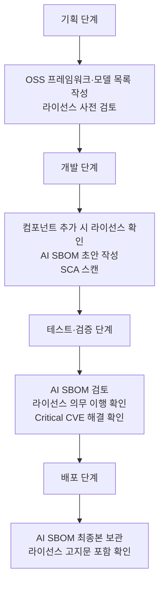

## 개요

ISO/IEC 42001 §8은 AI 관리 시스템의 **실제 운영** 단계를 다룬다.
오픈소스 관점에서 §8은 가장 많은 교차점을 포함하는 섹션이다.

| 하위 조항 | 내용 | 오픈소스 교차 |
|---------|------|-------------|
| §8.1 | 운영 기획 및 통제 | 오픈소스 검토 프로세스 운영 |
| §8.2~8.3 | AI 리스크 평가·처리 (운영 시) | OSS 취약점 리스크 대응 |
| §8.4 | AI 시스템 영향 평가 (운영 시) | OSS 취약점의 시스템 영향 |
| **§8.5** | AI 시스템 생애주기 | ★ OSS 프레임워크·모델 라이선스 |
| **§8.6** | AI 시스템을 위한 데이터 | ★ 오픈 데이터셋 라이선스 |
| §8.7 | 피드백 인터페이스 | — |
| **§8.8** | 외부 AI 시스템 조달 | ★ 외부 OSS 모델 공급망 검증 |

---

## 세부 페이지

이 섹션의 오픈소스 교차 항목은 다음 세부 페이지에서 상세히 다룬다:

| 페이지 | 대상 조항 | 핵심 내용 |
|--------|---------|---------|
| [AI 시스템의 오픈소스 관리](./1-oss-in-ai/) | §8.5, §8.6 | AI 프레임워크·모델·데이터셋 라이선스 컴플라이언스 |
| [AI SBOM](./2-ai-sbom/) | §7.5, §8.5 | AI SBOM 구성, 생성 도구, SPDX 3.0 활용 |
| [AI 공급망 검증](./3-supply-chain/) | §8.8 | 외부 오픈소스 AI 모델 조달 검증 체크리스트 |

---

## §8.1 운영 기획 — 오픈소스 검토 프로세스 통합

AI 시스템 개발 프로세스에 오픈소스 컴플라이언스 검토 단계를 통합한다.

**체크포인트**:
- [ ] AI 시스템 개발 프로세스에 오픈소스 컴플라이언스 검토 단계가 포함되어 있는가?
- [ ] 오픈소스 검토 없이 AI 시스템이 배포되는 것을 방지하는 게이트가 있는가?

---

## 참고

- [ISO/IEC 42001 가이드 홈](../)
- [기업 오픈소스 관리 가이드 — 3. 프로세스](../../opensource_for_enterprise/3-process/)
- [기업 오픈소스 관리 가이드 — AI 컴플라이언스](../../opensource_for_enterprise/7-ai-compliance/)
