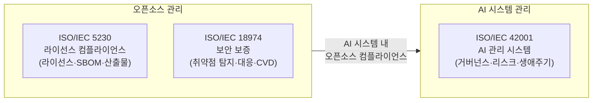

## 1. 세 표준의 관계

오픈소스를 사용하는 AI 시스템을 개발하는 기업은 세 가지 표준이 교차하는 지점에 있다.



ISO 5230과 18974는 **오픈소스 자체**를 관리하는 표준이고,
ISO 42001은 **AI 시스템**을 관리하는 표준이다. 두 영역은 독립적이지만,
AI 시스템이 오픈소스를 활용할 때 교차점이 발생한다.

{}
ISO/IEC 42001이 원칙적 요구사항을 제시하는 반면,
**ISO/IEC 42003**은 42001의 구체적 구현 방법을 안내하는 가이드(새롭게 승인된 work item)다.
OpenChain AI Work Group은 **AI SBOM**을 ISO 42003의 투명성·설명 가능성 조항
(Appendix C.2.11 — Transparency and Explainability)에 반영하는 것을 추진 중이다.
AI SBOM 의무화 관련 최신 동향은 [AI Work Group 활동](../../../resource/AI_work_group/)을 참고한다.
{}

---

## 2. 표준 기본 정보 비교

| 비교 항목 | ISO/IEC 5230 | ISO/IEC 18974 | ISO/IEC 42001 | ISO/IEC 42003 |
|-----------|-------------|--------------|--------------|--------------|
| **상태** | 발행 (2020) | 발행 (2023) | 발행 (2023) | 개발 중 |
| **제정 기관** | OpenChain Project → ISO | OpenChain Project → ISO | ISO JTC 1/SC 42 | ISO JTC 1/SC 42 |
| **관리 주체** | Linux Foundation OpenChain | Linux Foundation OpenChain | ISO | ISO |
| **표준 계열** | OpenChain 특화 표준 | OpenChain 특화 표준 | ISO 경영 시스템 표준 | ISO 42001 구현 가이드 |
| **대상** | 소프트웨어 공급망의 오픈소스 | 오픈소스 보안 취약점 | AI 시스템 전체 | ISO 42001 구현 방법 |
| **핵심 관리 대상** | 라이선스 의무 이행 | CVE 탐지·대응 | AI 거버넌스·생애주기 | AI SBOM·투명성 포함 |

---

## 3. 요구사항 형태 비교

세 표준은 요구사항을 표현하는 방식이 근본적으로 다르다.

### ISO/IEC 5230 · 18974 방식: 입증자료 번호 체계

각 조항마다 기업이 제출해야 할 **입증자료(Verification Material)**를 번호로 명시한다.

```
§3.1.1 정책
  입증자료:
  - 3.1.1.1 문서화된 오픈소스 정책
  - 3.1.1.2 정책 전파 절차
```

입증자료가 있으면 ✅ 충족, 없으면 ❌ 미충족으로 명확하게 판단할 수 있다.

### ISO/IEC 42001 방식: 경영 시스템 shall 요구사항

조항마다 "조직은 ~해야 한다(shall)"는 형태의 **원칙적 요구사항**을 제시하며,
어떤 문서나 기록으로 충족할지는 조직이 맥락에 맞게 결정한다.

```
§5.2 AI 정책
  "최고경영진은 AI 정책을 수립해야 한다(shall). 
   AI 정책은 조직의 목적에 적합해야 하며..."
```

이 때문에 ISO 42001은 ISO 5230/18974처럼 단순 체크리스트로 자가 인증을 하기 어렵고,
내부 갭 분석 또는 외부 인증기관의 심사가 필요하다.

---

## 4. 자가 인증 방법 비교

| 비교 항목 | ISO/IEC 5230 | ISO/IEC 18974 | ISO/IEC 42001 |
|-----------|-------------|--------------|--------------|
| **공식 자가 인증 도구** | OpenChain 온라인 체크리스트 | OpenChain 온라인 체크리스트 | 없음 |
| **자가 인증 비용** | 무료 | 무료 | 무료 (단, 내부 공수 필요) |
| **자가 인증 근거** | 체크리스트 완료 선언 | 체크리스트 완료 선언 | 내부 갭 분석 후 자체 선언 |
| **독립 평가** | OpenChain 파트너사 | OpenChain 파트너사 | 컨설팅 기관 |
| **제3자 인증** | OpenChain 공인 기관 | OpenChain 공인 기관 | BSI, TÜV SÜD 등 ISO 인증기관 |
| **인증 갱신** | 18개월 | 18개월 | ISO 인증기관 계약에 따름 |

---

## 5. 오픈소스 관련성 비교

| ISO 42001 조항 | 오픈소스 교차 내용 | 대응 ISO 5230 | 대응 ISO 18974 |
|----------------|-------------------|--------------|---------------|
| §5.2 AI 정책 | OSS 사용 원칙 AI 정책 포함 | §3.1.1 정책 | §4.1.1 정책 |
| §6.1.2 AI 리스크 평가 | OSS 라이선스·취약점 리스크 | — | §4.3.2 보안 보증 |
| §6.1.4 AI 영향 평가 | OSS 컴포넌트 영향 분석 | — | §4.1.5 표준 관행 |
| §7.2 역량 | OSS 컴플라이언스 역량 | §3.1.2 역량 | §4.1.2 역량 |
| §7.5 문서화 | AI SBOM | §3.3.1 SBOM | §4.3.1 SBOM |
| §8.5 AI 생애주기 | OSS 프레임워크 라이선스 | §3.3 콘텐츠 검토 | §4.3 콘텐츠 검토 |
| §8.6 AI 데이터 | 오픈 데이터셋 라이선스 | §3.3.2 라이선스 | — |
| §8.8 외부 AI 조달 | OSS 모델 공급망 검증 | §3.3 콘텐츠 검토 | §4.3.2 보안 보증 |
| §9.1 성과 평가 | OSS 컴플라이언스 지표 | §3.6 준수 | §4.4 준수 |

---

## 6. 어떤 표준부터 시작해야 하는가?

{}

**오픈소스 컴플라이언스 체계가 없다면**

→ **ISO/IEC 5230** 부터 시작한다.
라이선스 관리, SBOM, 정책, 교육의 기반을 구축한다.

---

**ISO 5230 체계가 있고, AI 개발도 하고 있다면**

→ **ISO/IEC 18974 + ISO/IEC 42001** 을 병행 검토한다.

- ISO 18974: AI 시스템에 사용된 오픈소스 취약점 관리 강화
- ISO 42001: AI 시스템 전체 거버넌스 수립 (오픈소스 교차 요건 포함)

두 표준은 상호 보완적이므로 동시에 추진하면 중복 작업을 줄일 수 있다.

---

**AI 시스템을 개발·서비스하는 기업이라면**

→ **ISO/IEC 42001** 의 오픈소스 교차 요구사항을 먼저 점검한다.
이 가이드의 [운영 섹션](../4-operation/)이 AI 시스템에서 당장 확인해야 할 항목을 안내한다.

---

**AI SBOM 의무화 동향을 따라가고 싶다면**

→ **ISO/IEC 42003** 동향을 주시한다.
OpenChain AI Work Group은 AI SBOM 컴플라이언스 가이드를 ISO 42003에 반영하는 것을 추진 중이다.
EU Cyber Resilience Act(CRA)도 AI 시스템의 투명성 수단으로 AI SBOM을 요구하는 방향으로 논의되고 있다.

{}

---

## 7. 세 표준 동시 운영 시 공통 기반

세 표준을 동시에 준수할 때 하나의 기반으로 활용 가능한 공통 요소:

| 공통 기반 요소 | ISO 5230 | ISO 18974 | ISO 42001 |
|----------------|:--------:|:---------:|:---------:|
| 오픈소스 정책 | ✅ §3.1.1 | ✅ §4.1.1 | ✅ §5.2 (AI 정책에 포함) |
| 역할·책임 문서 | ✅ §3.1.2 | ✅ §4.1.2 | ✅ §5.3 |
| 역량·교육 기록 | ✅ §3.1.2 | ✅ §4.1.2 | ✅ §7.2 |
| SBOM / AI SBOM | ✅ §3.3.1 | ✅ §4.3.1 | ✅ §7.5 |
| 리스크 평가 | — | ✅ §4.3.2 | ✅ §6.1.2 |
| 외부 문의 대응 | ✅ §3.2.1 | ✅ §4.2.1 | ✅ §8.7 (피드백 채널) |
| 준수 확인·갱신 | ✅ §3.6 | ✅ §4.4 | ✅ §9·§10 |
