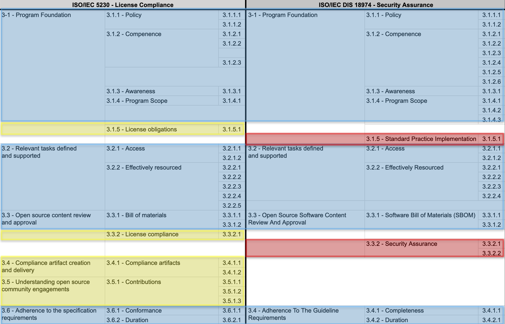

기업 오픈소스 관리를 위한 두개의 ISO 표준은 ISO/IEC 5230과 ISO/IEC 18974이다. 이 두 표준을 모두 준수함을 선언한 기업은 소프트웨어 솔루션을 배포하는 공급망 내에서 신뢰를 제공할 수 있게 된다. 

ISO/IEC 5230과 ISO/IEC 18974는 유사한 포맷의 표준으로 공통 요구사항을 다수 포함한다. 아래 표는 두 표준의 요구사항 중 공통 사항과 차이점을 보여준다. 

  

* 파란색 영역은 두 표준이 공통적으로 포함하는 요구사항이다. 
* 노란색 영역은 License Compliance를 위해 ISO/IEC 5230에서만 요구하는 항목이다. 
* 붉은색 영역은 Security Assurance를 위해 ISO/IEC 18974에서만 요구하는 항목이다. 

여기에서는 기업이 이 두 표준을 모두 준수하기 위해 충족해야 하는 여섯 가지 주요 요구사항과 각각의 준수 방법을 세부적으로 설명한다.