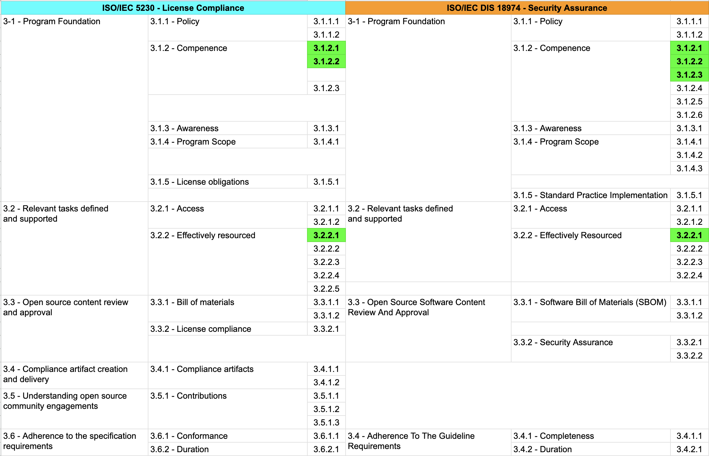

{}
**ISO/IEC 5230**: 3.1.2.1, 3.1.2.2, 3.2.2.1  
**ISO/IEC 18974**: 4.1.2.1, 4.1.2.2, 4.1.2.3, 4.2.2.1
{}

먼저, 기업은 오픈소스 관리 업무를 담당할 조직을 구성해야 합니다.

조직 구성 시 고려해야 할 내용은 다음과 같습니다:

- 조직의 역할과 책임
- 각 역할의 필요 역량
- 각 역할을 담당할 조직/담당자

## 1. 조직의 역할과 책임 정의

ISO 표준은 공통적으로 다음과 같이 프로그램 내 여러 참여자의 역할과 책임을 기술한 문서를 요구합니다.

{}
* 3.1.2.1 - A documented list of roles with corresponding responsibilities for the different participants in the program. 
`프로그램의 여러 참여자에 대한 역할과 각 역할의 책임을 나열한 문서`

{}

{}

* 4.1.2.1: A documented list of roles with corresponding responsibilities for the different Program Participants `여러 프로그램 참여자에 대한 각각의 책임을 나열한 문서`

{}

### 오픈소스 프로그램 매니저

오픈소스 관리 체계를 구축하기 위해서는 먼저 이를 책임지고 수행할 책임자가 필요합니다. 책임자는 `오픈소스 프로그램 매니저` 또는 `오픈소스 컴플라이언스 담당자` 등의 명칭으로 불리며, 여기서는 `오픈소스 프로그램 매니저`라는 용어를 사용합니다.

오픈소스 프로그램 매니저는 기업의 오픈소스 프로그램 오피스를 담당합니다. `오픈소스 프로그램 오피스`란 기업의 오픈소스 관리를 위한 조직을 의미하며, `오픈소스 사무국`이라는 용어로도 사용됩니다.

아래의 역량이 있다면 오픈소스 프로그램 매니저 역할에 적합하다고 할 수 있습니다.

- 오픈소스 생태계에 대한 이해 및 개발 경험
- 기업의 비즈니스에 대한 폭넓은 이해
- 기업 구성원에게 효과적인 오픈소스 활용을 전파할 수 있는 열정과 커뮤니케이션 능력

오픈소스 프로그램 매니저는 가능한 풀타임으로 역할을 수행할 수 있도록 보장되는 것이 좋습니다.

글로벌 ICT 기업은 이와 같은 우수한 오픈소스 프로그램 매니저를 채용하기 위해 노력하고 있습니다. 다음 사이트에서 다양한 채용 공고를 확인할 수 있습니다. : [https://github.com/todogroup/job-descriptions](https://github.com/todogroup/job-descriptions)

### 역할과 책임 문서화

기업은 오픈소스 프로그램 오피스에 필요한 각 역할을 정의하고, 어떠한 책임을 부여해야 하는지를 판단해야 합니다. 

소규모 기업의 경우, 오픈소스 프로그램 매니저 혼자서 모든 역할을 수행하는 것도 가능합니다. 기업의 규모에 따라 오픈소스 도구를 운영하는 IT 담당자도 필요할 수 있으며, 전문적인 법무 자문을 제공하기 위한 법무 담당의 역할이 요구될 수도 있습니다.

{}
1명이 여러 역할을 수행하는 것은 ISO 표준이 허용하지만, 인증 심사관은 다음을 추가로 확인합니다.

- **시간 배분**: 각 역할에 할당되는 업무 시간 비율(주간 단위)을 §3.2.2.2 인원 배치 적정성 입증자료에 명시
- **전문성 입증**: 각 역할별 필요 역량(특히 §4.2.2.3 보안 취약점 해결 전문성)을 동일 인물이 모두 보유함을 증명하는 자격증·교육 이력·실무 경력
- **외부 보완**: 본인이 보유하지 않은 전문성은 외부 자문 계약(법무·보안·도구 운영)으로 보완하고 계약서를 보관
- **권한 분리 원칙 충돌**: §3.2.2.4 책임 할당 절차에서 의사결정·승인·집행 권한이 동일인에게 집중되지 않도록 부분적 위임(예: 외부 OSRB 자문위원) 운영
{}

일반적으로 기업의 오픈소스 관리 체계 구축을 위해서는 아래의 역할이 필요합니다. 

- 법무 담당
- IT 담당
- 보안 담당
- 개발 문화 담당



<i>Individuals and teams involved in ensuring open source compliance : https://www.linuxfoundation.org/wp-content/uploads/OpenSourceComplianceHandbook_2018_2ndEdition_DigitalEdition.pdf</i>



이를 위해 아래와 같이 오픈소스 프로그램 오피스를 구성하는 역할과 책임을 문서화해야 합니다.

| No | 역할 | 책임 | ISO 매핑 |
|---|:---|:---|:---|
| 1 | 오픈소스 프로그램 매니저 | 회사의 오픈소스 프로그램에 대한 총괄 책임을 담당한다. | §3.1.2.1 · §4.1.2.1 |
| 2 | 법무 담당 (사내 법무팀 또는 외부 변호사) | 오픈소스 라이선스와 의무를 해석하고, 법적 위험 완화를 위한 자문을 제공한다. **사내 법무팀이 없는 경우 외부 변호사·법률사무소 자문 계약으로 대체 가능**(§3.2.2.3 허용). | §3.2.2.3 |
| 3 | IT 담당 | 오픈소스 분석 도구를 운영하고 자동화하여 모든 배포용 소프트웨어에 대해 오픈소스 분석이 원활히 수행되도록 시스템을 구축한다. | §3.1.2.1 |
| 4 | 보안 담당 (PSIRT 포함) | 오픈소스 보안 취약점 분석 도구를 운영하고, **취약점 해결 전문성**(PSIRT 운영·CVE 분석·외부 보안 자문 접근·CVD 처리)을 갖춘다. 단순 도구 운영이 아닌 **취약점 해결 능력**까지 포함되어야 §4.2.2.3을 충족한다. | §4.2.2.3 |
| 5 | 개발 문화 담당 | 사내 개발자들이 오픈소스를 적극적으로 활용하고 사내외 커뮤니티에 참여하여 선진 개발 문화를 습득할 수 있도록 지원한다. | §3.1.3.1 |
| 6 | 사업 부서 (팀별 1인 챔피언) | 소프트웨어 개발/배포 조직은 올바른 오픈소스 활용을 위해 오픈소스 정책 및 프로세스를 준수한다. **팀별 1인 챔피언 모델** 권장 — "전원" 표기는 §3.2.2.1 "이름" 요건 미충족. | §3.2.2.1 |
| 7 | **내부 모범 사례 검증 담당** ★ | **내부 프로세스가 OpenChain·NIST SSDF·OWASP 등 외부 모범 사례와 일치하는지 정기 검증**한다. 분기 또는 반기 단위 비교 보고서를 §4.1.2.6 입증자료로 보관한다. | **§4.1.2.6** ★ |

## 2. 필요 역량 정의

각 역할과 그에 대한 책임을 정의하였다면, 그 역할을 수행할 인원이 갖춰야 할 필수 역량이 무엇인지 파악해야 합니다. 

ISO 표준은 공통적으로 다음과 같이 각 역할을 위해 필요한 역량을 기술한 문서를 요구합니다.

{}

* 3.1.2.2 - A document that identifies the competencies for each role. `각 역할을 위해 필요한 역량을 기술한 문서`

{}

{}

* 4.1.2.2: A document that identifies the competencies for each role. `각 역할을 위해 필요한 역량을 기술한 문서`

{}

이를 통해 역할별 담당자가 해당 역할을 수행할 수 있는 역량을 갖추었는지 평가하고, 필요시 교육을 제공해야 하기 때문입니다. 

이를 위해 기업은 아래와 같이 각 역할을 위해 필요한 역량을 기술하여 문서화해야 합니다. 

| No | 역할 | 필요 역량 |
|---|:---|:---|
| 1 | 오픈소스 프로그램 매니저  | 1. 소프트웨어 개발 프로세스 이해 2. 저작권, 특허 등 오픈소스 라이선스와 관련한 지식재산 이해 3. 오픈소스 컴플라이언스에 대한 전문 지식 4. 오픈소스 개발 경험 5. 커뮤니케이션 스킬 6. 오픈소스 보안 보증에 대한 기본 지식  |
| 2 | 법무 담당 | 1. 오픈소스 생태계에 대한 기본 지식 2. 소프트웨어 저작권에 대한 전문 지식 3. 오픈소스 라이선스에 대한 전문 지식 4. 오픈소스 관련 법적 위험 평가 능력 |
| 3 | IT 담당 | 1. 오픈소스 컴플라이언스 프로세스에 기본 지식 2. 오픈소스 분석 도구에 대한 이해 3. IT 인프라에 대한 전문 지식 4. 자동화 및 CI/CD 파이프라인에 대한 이해 |
| 4 | 보안 담당 | 1. [DevSecOps](https://www.redhat.com/ko/topics/devops/what-is-devsecops)에 대한 폭넓은 이해 2. 오픈소스 보안 취약점 분석 도구에 대한 이해 3. 오픈소스 보안 취약점에 대한 전문 지식 4. 커뮤니케이션 스킬 5. 위험 평가 및 관리 능력 |
| 5 | 개발 문화 담당 | 1. 소프트웨어 개발 프로세스 이해 2. 오픈소스 컴플라이언스에 대한 기본 지식 3. 오픈소스 정책에 대한 이해 4. 교육 및 트레이닝 설계 능력 5. 오픈소스 커뮤니티 참여 경험 |
| 6 | 사업 부서 | 1. 소프트웨어 개발 프로세스 이해 2. 오픈소스 컴플라이언스에 대한 기본 지식 3. 오픈소스 정책에 대한 이해 4. 오픈소스 라이선스에 대한 기본 지식 5. 오픈소스 사용이 비즈니스에 미치는 영향 이해 |

## 3. 담당자 지정

오픈소스 프로그램 매니저는 관련 부서와 협의하여 각 역할을 위한 담당자를 지정하고 이를 문서화합니다. 이를 위해서는 CEO 등 최고 의사결정권자에게 오픈소스 컴플라이언스 체계 구축을 위한 목표와 방향을 보고하여 필요한 지원을 받아야 합니다.

오픈소스 관련 조직과 담당자는 반드시 풀타임으로 오픈소스 업무에 참여할 필요는 없습니다. OSRB (Open Source Review Board) 형태의 가상 조직을 구성하여 필요한 역할을 수행하는 것도 가능합니다. 

ISO 표준은 공통적으로 다음과 같이 프로그램 내 각 역할을 담당하는 인원, 그룹 또는 직무의 이름을 기재한 문서를 요구합니다.

{}

* 3.2.2.1 - Document with name of persons, group or function in program role(s) identified. `프로그램 내 각 역할을 담당하는 인원, 그룹 또는 직무의 이름을 기재한 문서 `

{}

{}

* 4.1.2.3: List of participants and their roles `참여자 명단과 그들의 역할`
* 4.2.2.1: Document with name of persons, group or function in Program role(s) identified `프로그램 내 각 역할을 담당하는 인원, 그룹 또는 직무의 이름을 기재한 문서`

{}

이를 위해 기업은 아래와 같이 프로그램 내 각 역할을 담당하는 인원, 그룹 또는 직무의 이름을 문서화해야 합니다. 

| No | 역할 | 담당 조직 | 담당자 (예시) |
|---|:---|:---|:---|
| 1 | 오픈소스 프로그램 매니저 | CTO 직속 OSPO | 김OO 책임 (full name은 별도 부록 명단) |
| 2 | 법무 담당 | 법무팀 또는 외부 변호사 | 이OO 변호사 (외부 계약 시 계약서 ID 병기) |
| 3 | IT 담당 | IT 인프라팀 | 박OO 매니저 |
| 4 | 보안 담당 (PSIRT) | 정보보안팀 | 최OO 책임 |
| 5 | 개발 문화 담당 | 개발자 관계(DevRel) | 정OO 매니저 |
| 6 | 사업 부서 | 각 개발팀 챔피언 | 팀별 1인(별도 부록 명단) |
| 7 | 내부 모범 사례 검증 담당 ★ | OSPO 자체 또는 외부 자문 | 검증 보고서 작성자명 |

> **샘플 표기 원칙**: §3.2.2.1, §4.1.2.3은 "이름"을 명시적으로 요구합니다. 위 표는 익명 표기(OOO)가 아닌 가상 실명 또는 별도 부록 명단 + 직무명 운영을 권장합니다. 사업 부서는 "전원" 표기를 피하고 **팀별 1인 챔피언** 모델로 매핑하여 책임 소재를 명확히 합니다.

다음 페이지에서는 역할, 책임, 필요 역량 및 담당자 지정 등을 문서화한 샘플을 참고할 수 있습니다. [[부록1]오픈소스 정책(샘플) - Appendix 1. 담당자 현황](../../templates/1-policy/#appendix-1-담당자-현황)

[SK텔레콤](https://www.sktelecom.com/)은 [OSRB](https://sktelecom.github.io/about/osrb/)를 구성하여 기업 내 오픈소스 정책과 프로세스를 만들고, 이슈 발생 시 협업하여 대응 방안을 마련하고 있습니다. 



<i>https://sktelecom.github.io/about/osrb/</i>



## 4. Summary

역할, 책임, 필요 역량 및 담당자 지정을 문서화한 샘플은 오픈소스 정책 템플릿 문서에서 확인할 수 있습니다. : [Appendix 1. 담당자 현황](../../templates/1-policy/#appendix-1-담당자-현황)

기업은 이를 참고하여 기업의 상황에 맞게 오픈소스 관리 조직을 구성할 수 있습니다. 

이렇게 오픈소스 프로그램 오피스 조직을 지정하고 문서화하면, ISO 표준 규격 중 아래의 붉은색으로 표시된 요구사항을 충족하게 됩니다. 

사실, 문서화하는 것보다 실제 업무를 충실히 수행할 담당자를 지정하고, 담당자가 역량을 확보할 수 있도록 지원하는 것이 더 중요합니다.

한국저작권위원회의 [오픈소스 라이선스 전문 교육](https://www.olis.or.kr/consulting/openswStudy.do)이나 [NIPA의 공개소프트웨어 매니지먼트 아카데미](https://www.oss.kr/oss_data/show/448d2e96-6819-45f4-b114-73cd41b3e9d3)에 참여하여 체계적인 교육을 수강하는 것도 도움이 됩니다.

오픈소스 프로그램 매니저와 보안 담당의 역할이 더욱 중요해지고 있습니다. 오픈소스 프로그램 매니저는 오픈소스 보안 보증에 대한 기본 지식도 갖추어야 하며, 보안 담당자는 [SBOM](https://www.cisa.gov/sbom) (Software Bill of Materials) 관리와 같은 새로운 보안 요구사항에 대한 이해도 필요합니다.

---

> **ISO/IEC 5230 / 18974 준수 가이드** — 이 섹션과 관련된 조항:
> - [§3.1.2 역량](../../iso5230_guide/1-program-foundation/2-competence/) — 역할별 역량 정의·평가 기록
> - [§3.2.2 효과적 리소스](../../iso5230_guide/2-relevant-tasks/2-resourced/) — 담당자 지정 문서화, 미준수 검토 절차

또한, 모든 역할에서 지속적인 학습과 최신 트렌드 파악이 중요해지고 있습니다. 오픈소스 생태계와 관련 기술, 법규는 빠르게 변화하고 있어, 각 담당자는 자신의 분야에서 지속적으로 지식을 업데이트해야 합니다. 이를 위해 [OpenChain](https://www.openchainproject.org/)이나 [TODO Group](https://todogroup.org/)과 같은 국제 커뮤니티에 참여하거나, [국내 오픈소스 컨퍼런스](https://www.oss.kr/)에 참석하는 것도 좋은 방법입니다.
