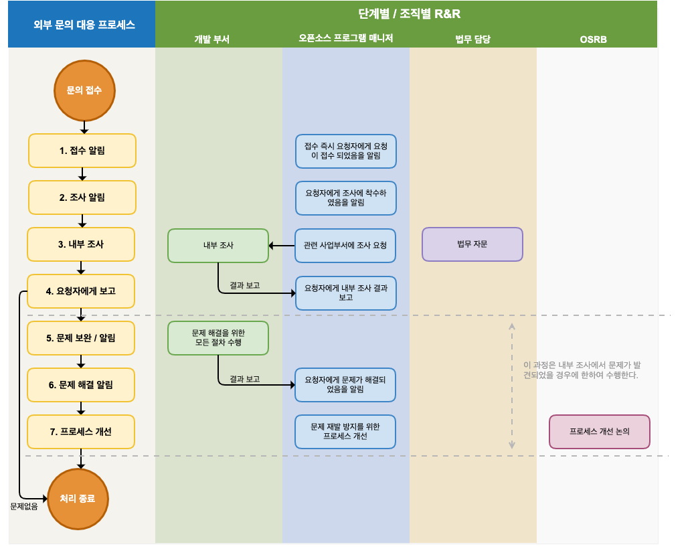

오픈소스 프로세스는 소프트웨어 개발 및 배포 과정에서 기업이 오픈소스 정책을 준수할 수 있도록 하는 실행 가능한 절차입니다. 

오픈소스 라이선스 컴플라이언스 측면에서는 소프트웨어를 개발하고 배포하면서 사용한 오픈소스에 대해 각 라이선스가 요구하는 조건을 준수하기 위한 활동을 수행하여 오픈소스 고지문(Notice), 공개할 소스 코드 (Source Code) 등의 산출물을 생성하게 됩니다.


<center><i>Simplified view of the compliance end-to-end process : https://www.linuxfoundation.org/wp-content/uploads/OpenSourceComplianceHandbook_2018_2ndEdition_DigitalEdition.pdf</i></center>


오픈소스 보안 보증을 위해서는 배포용 소프트웨어에 대한 보안 취약점 존재 여부를 탐지하고, 구조적/기술적 위협을 식별하여 출시 전에 문제를 해결하기 위한 활동을 수행해야 합니다.

기업이 효과적인 오픈소스 라이선스 컴플라이언스와 보안 보증을 이루기 위해서는 아래와 같은 프로세스를 구축해야 합니다. 

* 오픈소스 프로세스
* 오픈소스 보안 취약점 대응 프로세스
* 외부 문의 대응 프로세스
* 오픈소스 기여 프로세스

그럼 각 프로세스가 어떻게 구성되어야 하는지 하나하나 살펴보겠습니다.


## 1. 오픈소스 프로세스 

기업은 소프트웨어 개발 프로세스에 따라 오픈소스 라이선스 컴플라이언스와 보안 취약점 관리를 위한 오픈소스 프로세스를 구축해야 합니다. 

아래의 이미지는 기업이 일반적으로 채택하여 사용할 수 있는 샘플 오픈소스 프로세스입니다.

 

위 오픈소스 프로세스에 맞춰서 각 단계별로 취해야 할 절차는 다음과 같습니다. 

### (1) 오픈소스 식별 및 검사

오픈소스 식별 및 검사 단계에서는 사용하려는 오픈소스의 라이선스가 무엇인지 식별하고, 라이선스가 요구하는 의무사항은 무엇인지, 알려진 취약점은 존재하는지 확인해야 합니다. 

어떤 오픈소스를 사용하려고 하는지, 그 라이선스는 무엇인지, 각 라이선스가 부여하는 의무는 무엇인지, 알려진 취약점은 무엇인지 검토하고 기록합니다. 

ISO/IEC 5230 표준은 라이선스 컴플라이언스를 위해 일반적인 오픈소스 라이선스의 사용 사례를 다룰 수 있어야 하고, 각 식별된 라이선스에 의해 부여된 의무, 제한 및 권리를 검토하고 기록하기 위한 문서화된 절차를 요구합니다.

{}

* 3.3.2.1 - A documented procedure for handling the common open source license use cases for the open source components of the supplied software.<br>`배포용 소프트웨어 내의 오픈소스 컴포넌트에 대해 일반적인 오픈소스 라이선스 사용 사례를 처리하기 위한 문서화된 절차`
  
* 3.1.5.1 - A documented procedure to review and document the obligations, restrictions and rights granted by each identified license.<br>`각 식별된 라이선스에 의해 부여된 의무, 제한 및 권리를 검토하고 기록하기 위한 문서화된 절차`

{}

이를 위한 절차의 예는 다음과 같습니다. 

1. 오픈소스 프로그램 매니저는 주요 오픈소스 라이선스의 의무, 제한, 권리에 대한 가이드를 작성하여 제공합니다. 이 가이드에는 일반적인 오픈소스 라이선스의 사용 사례가 관리될 수 있도록 다음과 같은 사용 사례가 포함되어야 합니다.

   - 바이너리 형태로 배포
   - 소스 형태로 배포
   - 추가 라이선스 의무를 유발하는 다른 오픈소스와 통합
   - 수정된 오픈소스 포함
2. 사업 부서는 오픈소스 정책에서 정의한 기준에 따라 라이선스와 알려진 취약점을 확인합니다.
3. 사업 부서는 의문 사항을 오픈소스 프로그램 매니저와 보안 담당에게 문의합니다. 필요할 경우 외부 전문가에게 자문을 요청합니다.
4. 모든 결정 및 관련 근거는 문서화하여 보관합니다.

이를 위해 기업은 아래의 예시와 같이 제품 출시 전에 오픈소스 식별, 검사 단계를 통해 각 식별된 라이선스가 부가하는 의무, 제한과 알려진 취약점을 검토하고 기록하기 위한 문서화된 절차를 수립해야 합니다.

```

(1) 오픈소스 식별

사업 부서는 소프트웨어 설계 단계에서 다음 사항을 준수합니다.

- 소프트웨어를 설계하면서 예측 가능한 오픈소스 사용 현황을 파악하고 라이선스를 확인합니다.
- 오픈소스 라이선스별 의무 사항을 확인합니다. 라이선스별 의무 사항은 회사의 오픈소스 라이선스 가이드에서 확인할 수 있습니다. : https://sktelecom.github.io/guide/use/obligation/
- 각 오픈소스 라이선스의 소스 코드 공개 범위를 고려하여 소프트웨어를 설계합니다.

오픈소스 프로그램 매니저는 주요 오픈소스 라이선스 의무, 제한, 권리에 대한 가이드를 작성하고 공개하여 전사의 사업 부서에서 참고할 수 있도록 합니다. 이 가이드에는 일반적인 오픈소스 라이선스의 사용 사례가 관리될 수 있도록 다음과 같은 사용 사례가 포함되어야 합니다.

- 바이너리 형태로 배포
- 소스 형태로 배포
- 추가 라이선스 의무를 유발하는 다른 오픈소스와 통합
- 수정된 오픈소스 포함

사업 부서는 회사 규칙에 맞게 소스 코드에 저작권 및 라이선스를 표기합니다. 회사의 소스 코드 내 저작권 및 라이선스 표기 규칙은 다음 페이지에서 확인할 수 있습니다. (insert_link)

사업 부서는 새로운 오픈소스 도입 검토 시, 먼저 라이선스를 식별합니다. 회사의 오픈소스 라이선스 가이드에 따라 라이선스 의무, 제한 및 권리를 확인합니다. 회사의 오픈소스 라이선스 가이드에서 설명하지 않는 라이선스일 경우, 오픈소스 프로그램 매니저에게 도입 가능 여부 및 주의 사항을 문의합니다. 문의를 위해서 Jira Ticket을 생성합니다. 

오픈소스 프로그램 매니저는 오픈소스 라이선스 의무를 분석하여 소프트웨어 개발 조직에 안내합니다.

- 의문이 있는 경우, 법무 담당에 자문을 요청하여 명확한 가이드를 제공합니다.
- 새롭게 분석한 라이선스 정보는 전사 라이선스 가이드에 반영합니다.

보안 담당은 회사의 보안 보증을 위한 가이드를 제공합니다.

(2) 소스 코드 검사

사업 부서는 IT 담당자의 안내에 따라 오픈소스 점검을 요청하고 소스 코드를 제공합니다.

IT 담당은 오픈소스 분석 도구를 사용하여 오픈소스 점검을 하고, SBOM(Software Bill of Materials)을 생성합니다.

오픈소스 프로그램 매니저는 오픈소스 라이선스 의무 준수 가능 여부, 오픈소스 라이선스 충돌 여부를 검토하고, 이슈가 있으면 사업 부서에 해결을 요청합니다. 이슈 사항은 Jira Ticket으로 생성하여 사업 부서에 할당합니다.

보안 담당은 검출된 알려진 취약점을 검토하고 사전 정의한 Risk 분류 기준에 따라 사업 부서에 대응 가이드를 제공합니다. Risk는 CVSS(Common Vulnerability Scoring System) Score로 분류하며, Critical Risk는 1주 이내 조치할 수 있는 계획을 수립하도록 안내합니다.

```

오픈소스 식별 및 검사 단계에서는 소스 코드 스캔 도구를 사용할 수 있다. 이에 대한 자세한 내용은 "[1. 소스 코드 스캔 도구](../4-tool/#1-소스-코드-스캔-도구)"에서 설명합니다. 

### (2) 문제 해결

오픈소스 식별 및 검사를 통해 오픈소스를 식별하고 라이선스와 보안 취약점의 위험을 확인한 후에는 문제를 해결하는 절차가 필요합니다. 다음과 같은 방법으로 검출된 모든 문제를 해결해야 합니다.

- 이슈가 되는 오픈소스를 삭제합니다.
- 오픈소스 라이선스 이슈 해결을 위해 다른 라이선스 하의 오픈소스로 교체합니다. 
- 알려진 취약점이 해결된 버전의 오픈소스로 교체합니다. 

이를 위한 문서화된 프로세스의 예는 다음과 같습니다. 

```
(3) 문제 해결

사업 부서는 소스 코드 검사 단계에서 발견된 모든 문제를 해결합니다. 

이슈가 된 오픈소스를 제거하거나, 다른 라이선스 하의 오픈소스로 교체합니다. 보안 취약점 이슈의 경우 알려진 취약점이 수정된 버전으로 교체하는 등의 조치를 취합니다.

사업 부서는 발견된 모든 이슈를 해결하면 Jira Ticket 이슈를 Resolve하고, 재검토를 요청합니다.

```

### (3) SBOM 식별, 검토, 보관

오픈소스 라이선스 컴플라이언스 활동의 가장 기본은 배포용 소프트웨어에 포함된 오픈소스 현황을 파악하는 것입니다. 배포용 소프트웨어에 포함된 오픈소스와 그 라이선스를 식별하여 그 정보를 담고 있는 SBOM(Software Bill of Materials)을 작성하고 관리하는 프로세스를 구축해야 합니다. 배포용 소프트웨어의 버전마다 어떤 오픈소스가 포함되어 있는지 알고 있어야 소프트웨어를 배포할 때 각 오픈소스의 라이선스가 요구하는 의무 사항을 준수할 수 있기 때문입니다. 이는 오픈소스 보안 취약점을 발견하고 대응하기 위해서도 꼭 필요한 과정입니다.

모든 오픈소스는 배포용 소프트웨어에 통합하기 전에 검토 및 승인되어야 합니다. 오픈소스의 기능, 품질뿐만 아니라 출처, 라이선스 요건을 충족할 수 있는지, 알려진 취약점을 해결하였는지 등에 대해 사전 검토가 되어야 합니다. 이를 위해 검토 요청 → 리뷰 → 승인 과정이 필요합니다.

ISO 표준은 공통적으로 다음과 같이 배포용 소프트웨어에 사용된 모든 오픈소스 소프트웨어가 소프트웨어 수명 주기 동안 지속적으로 기록되도록 하는 문서화된 절차를 요구합니다.

{}

* 3.3.1.1 - A documented procedure for identifying, tracking, reviewing, approving, and archiving information about the collection of open source components from which the supplied software is comprised. <br>`배포용 소프트웨어를 구성하는 오픈소스 컴포넌트에 대한 정보를 식별, 추적, 검토, 승인 및 보관하는 문서화된 절차`

{}


{}

* 3.3.1.1: A documented procedure ensuring all Open Source Software used in the Supplied Software is continuously recorded across the lifecycle of the Supplied Software. This includes an archive of all Open Source Software used in the Supplied Software;<br>`배포용 소프트웨어에 사용된 모든 오픈소스 소프트웨어가 배포용 소프트웨어의 수명 주기 동안 지속적으로 기록되도록 하는 문서화된 절차. 여기에는 배포용 소프트웨어에 사용된 모든 오픈소스 소프트웨어의 저장소도 포함된다.`

{}

이를 위해 기업은 아래의 예시와 같이 오픈소스 프로세스에 SBOM에 대한 내용을 반영할 수 있다. 

```

(4) 검토

오픈소스 프로그램 매니저는 모든 이슈가 적절하게 보완되었는지 검토합니다. 필요할 경우, 오픈소스 분석 도구를 사용하여 소스 코드 검사를 재수행합니다.

보안 담당은 심각한 취약점이 모두 해결되었는지 검토합니다. 해결하기 어려운 취약점이 남아 있을 경우, 비즈니스 형태와 서비스 노출 현황 등을 고려하여 승인 가능 여부를 검토합니다.

(5) 승인

오픈소스 프로그램 매니저는 오픈소스 컴플라이언스 절차가 적절하게 수행되었는지 최종 승인하거나 거절합니다. 거절 시에는 이유에 대한 설명과 수정 방법을 사업 부서에 제안합니다.

(6) 등록

오픈소스 프로그램 매니저는 소프트웨어의 버전별 오픈소스 사용 목록을 추적하기 위한 BOM을 확정합니다.

IT 담당은 확정된 BOM을 시스템에 등록합니다. BOM에는 배포용 소프트웨어에 포함된 오픈소스 목록과 다음과 같은 정보를 포함합니다. 

- 배포용 소프트웨어의 제품(혹은 서비스) 이름과 버전
- 오픈소스 목록
  - 오픈소스 이름 / 버전
  - 오픈소스 라이선스

오픈소스 프로그램 매니저는 소프트웨어의 버전별 오픈소스 사용 목록을 추적하기 위한 BOM을 확정합니다.

```


SBOM 관리를 위한 도구에 대해서는 "[SBOM 관리 도구](../4-tool/#3-sbom-관리-도구)"에서 자세히 설명합니다.

또 이와 같은 오픈소스 프로세스의 모든 과정과 결과는 문서화가 되어야 합니다. 이메일을 사용하는 것보다는 [Jira](https://www.atlassian.com/software/jira), [Bugzilla](https://www.bugzilla.org/) 등의 이슈 트래킹 시스템을 이용하는 것이 이러한 과정을 효율적으로 문서화 할 수 있습니다.


### (4) 라이선스 컴플라이언스 산출물 생성

위에서 오픈소스 라이선스 컴플라이언스 활동의 가장 기본은 배포용 소프트웨어에 포함된 오픈소스 현황을 파악하는 것이라고 하였습니다. 이는 바로 오픈소스 라이선스 컴플라이언스의 핵심인 오픈소스 라이선스 요구사항을 올바르게 충족하기 위해서입니다. 즉, 배포용 소프트웨어에 포함된 오픈소스에 대한 컴플라이언스 산출물 세트를 생성하는 프로세스가 구축되어야 합니다.

ISO/IEC 5230 표준은 다음과 같이 컴플라이언스 산출물을 준비하고, 이를 배포용 소프트웨어와 함께 제공하기 위한 프로세스를 설명하는 문서화된 절차를 요구합니다.

{}

* 3.4.1.1 - A documented procedure that describes the process under which the compliance artifacts are prepared and distributed with the supplied software as required by the identified licenses.<br>`식별된 라이선스가 요구하는 컴플라이언스 산출물을 준비하고, 이를 배포용 소프트웨어와 함께 제공하기 위한 프로세스를 설명하는 문서화된 절차 `

{}

컴플라이언스 산출물은 크게 두 가지로 구분됩니다.

1. 오픈소스 고지문 : 오픈소스 라이선스 전문과 저작권 정보 제공을 위한 문서

    

    * 도구를 활용하여 취합한 SBOM에 해당하는 오픈소스 고지문을 생성하는 방법에 대해 "[오픈소스 컴플라이언스 산출물 생성 도구](../4-tool/#5-오픈소스-컴플라이언스-산출물-생성-도구)"에서 추가로 설명합니다.  

2. 공개할 소스 코드 패키지 : GPL, LGPL 등 소스 코드 공개를 요구하는 오픈소스 라이선스 의무 이행을 위해 공개할 소스 코드를 취합한 패키지

컴플라이언스 산출물은 배포용 소프트웨어를 배포할 때 함께 제공해야 합니다.

이를 위해 기업은 아래의 예시와 같이 오픈소스 프로세스에 고지 단계부터 배포 단계까지 컴플라이언스 산출물 생성에 대한 내용을 반영할 수 있습니다. 

```
(7) 고지

오픈소스 프로그램 매니저는 고지 의무를 준수하기 위해 오픈소스 고지문을 생성합니다. 오픈소스 고지문에는 다음과 같은 내용이 포함됩니다.

- 오픈소스 관련 문의할 수 있는 오픈소스 연락처
- 오픈소스별 고지 내용
  - 저작권 
  - 오픈소스 라이선스 이름
  - 오픈소스 라이선스 사본
  - (해당하는 경우) 소스 코드 사본을 얻을 수 있는 서면 약정 (Written Offer)

오픈소스 프로그램 매니저는 오픈소스 고지문을 생성하여 사업 부서에 전달합니다. 이때 소스 코드 공개가 필요할 경우 사업 부서에 공개할 소스 코드 취합 방법을 안내합니다.

사업 부서는 오픈소스 고지문을 제품 배포 시 동봉합니다. 화면이 있는 제품일 경우, 사용자가 메뉴를 통해 확인할 수 있도록 조치합니다. (예: 앱 > 메뉴 > 설정 > 저작권 정보 > 오픈소스 라이선스)

사업 부서는 GPL, LGPL 등 소스 코드 공개를 요구하는 라이선스 하의 오픈소스를 사용하였을 경우, 이에 대한 소스 코드 공개 범위를 확인하여 공개할 소스 코드를 취합합니다.

- GPL, LGPL 등의 라이선스 의무 준수를 위해 취합한 소스 코드는 제품에 탑재된 바이너리를 구성하는 소스 코드와 일치해야 합니다. 즉, 취합한 소스 코드를 빌드하면 제품에 탑재된 바이너리와 동일해야 합니다.

(8) 배포 전 확인

사업 부서는 오픈소스 컴플라이언스 활동이 적절히 수행되었음을 입증하는 다음의 산출물을 제출합니다.

1. 제품에 포함한 최종 오픈소스 고지문
2. 제품에 오픈소스 고지문이 포함되었음을 확인하는 자료 (예: 오픈소스 고지문을 보여주는 화면 캡처 이미지)
3. (해당할 경우) 공개할 소스 코드 (하나의 파일로 압축하여 제출)

오픈소스 프로그램 매니저는 사업 부서가 제출한 자료를 검토하여 이상 여부를 확인합니다.

(9) 배포

오픈소스 프로그램 매니저는 사업 부서가 제출한 컴플라이언스 산출물을 IT 담당자에게 제출합니다.

IT 담당은 컴플라이언스 산출물을 회사의 오픈소스 배포 사이트에 등록합니다.

```

배포용 소프트웨어를 배포하는 경우, 공개할 소스 코드 패키지를 동봉하는 것이 곤란할 수 있습니다. 이 경우, 최소 3년간 소스 코드를 제공하겠다는 서면 약정서(Written Offer)를 제공하는 것으로 대신할 수 있습니다. 일반적으로 서면 약정서는 제품의 사용자 매뉴얼을 통해 제공되며, 예시는 다음과 같습니다. 

```
The software included in this product contains copyrighted software 
that is licensed under the GPL. A copy of that license is included 
in this document on page X. You may obtain the complete Corresponding 
Source code from us for a period of three years after our last shipment 
of this product, which will be no earlier than 2011-08- 01, by sending 
a money order or check for $5 to:

GPL Compliance Division
Our Company
Any Town, US 99999

Please write“source for product Y” in the memo line of your payment.
You may also find a copy of the source at http://www.example.com/sources/Y/.
This offer is valid to anyone in receipt of this information.

<출처 : SFLC Guide to GPL Compliance>
```

따라서, 컴플라이언스 산출물은 3년 이상 보관해야 하며, 이를 위한 프로세스가 구축되어야 합니다. 

이를 위해 기업은 오픈소스 웹사이트 구축을 고려할 수 있습니다. 자세한 내용은 "[오픈소스 컴플라이언스 산출물 보관](../4-tool/#6-오픈소스-컴플라이언스-산출물-보관)"에서 확인하실 수 있습니다.


## 2. 오픈소스 보안 취약점 대응 프로세스

기업은 제품/서비스를 개발하면서 오픈소스 보안 취약점을 탐지하고 해결하는 등 보안 보증을 위한 활동을 수행해야 합니다. 

ISO/IEC 18974 표준은 다음과 같이 보안 보증 방법에 대한 문서화된 절차와 수행된 조치를 기록하도록 요구합니다.

{}

3.1.5 - Standard Practice Implementation  `3.1.5 - 표준 사례 구현`

The Program demonstrates a sound and robust handling procedures of Known Vulnerabilities and Secure Software Development by defining and implementing following procedures:<br>`프로그램은 다음 절차를 정의하고 구현하여 알려진 취약점 및 보안 소프트웨어 개발을 건전하고 강력하게 처리하는 절차를 갖춘다.`

* Method to identify structural and technical threats to the Supplied Software is defined;<br>`배포용 소프트웨어에 대한 구조적 및 기술적 위협을 식별하는 방법`
* Method for detecting existence of Known Vulnerabilities in Supplied Software;<br>`배포용 소프트웨어에서 알려진 취약점 존재 여부를 탐지하는 방법`
* Method for following up on identified Known Vulnerabilities;<br>`확인된 알려진 취약점에 대한 후속 조치 방법`
* Method to communicate identified Known Vulnerabilities to customer base when warranted;<br>`확인된 알려진 취약점을 보증 대상인 고객에게 알리는 방법`
* Method for analyzing Supplied Software for newly published Known Vulnerabilities post release of the Supplied Software;<br>`배포용 소프트웨어의 릴리스 후 새롭게 알려진 취약점이 공개되었을 때 이미 배포된 소프트웨어에 존재하는지 확인하는 방법`
* Method for continuous and repeated Security Testing is applied for all Supplied Software before release;<br>`지속적이고 반복적인 보안 테스트가 출시 전에 모든 배포용 소프트웨어에 적용되기 위한 방법`
* Method to verify that identified risks will have been addressed before release of Supplied Software;<br>`식별된 위험이 배포용 소프트웨어의 출시 전에 해결되었는지 확인하는 방법`
* Method to export information about identified risks to third parties as appropriate.<br>`식별된 위험에 대한 정보를 제3자에게 적절하게 내보내는 방법`

* 3.1.5.1: A documented procedure exists for each of the methods identified above.<br>`위에서 식별된 각 방법에 대한 문서화된 절차가 존재한다.`


3.3.2 - Security Assurance `3.3.2 - 보안 보증`

* 3.3.2.1: A documented procedure for handling detection and resolution of Known Vulnerabilities for the Open Source Software components of the Supplied Software;<br>`배포용 소프트웨어의 오픈소스 소프트웨어 컴포넌트에 대한 알려진 취약점의 탐지 및 해결을 위한 문서화된 절차`
* 3.3.2.2: For each Open Source Software component a record is maintained of the identified Known Vulnerabilities and action(s) taken (including even if no action was required).<br>`각 오픈소스 소프트웨어 컴포넌트에 대해 식별된 알려진 취약점 및 수행된 조치에 대한 기록을 유지한다(조치가 필요하지 않은 경우도 포함).`

{}

이를 위해 기업은 배포용 소프트웨어에서 알려진 취약점 존재 여부를 탐지하고, 식별된 위험이 출시 전에 해결해야 할 뿐 아니라 출시 후 새롭게 알려진 취약점에 대응하기 위한 방법과 절차를 갖춰야 합니다.

먼저 기업은 배포용 소프트웨어에 알려진 취약점이 있는지 탐지하고, 식별된 위험을 출시 전에 해결해야 합니다. 이와 같이 알려진 취약점을 탐지하고 해결하는 절차는 [오픈소스 프로세스](#1-오픈소스-프로세스)의 오픈소스 식별 단계, 소스 코드 검사 단계, 문제 해결 단계를 통해 수행할 수 있습니다.

그리고, 배포용 소프트웨어의 릴리스 후 새롭게 알려진 취약점이 공개되었을 때 이미 배포된 소프트웨어에 존재하는지 확인하고, 해결하기 위해서는 신규 보안 취약점 대응 프로세스를 수립해야 합니다.

아래는 신규 보안 취약점 발견 시 대응을 위한 프로세스 샘플입니다.


<center><i>신규 보안 취약점 대응 프로세스 (샘플)</i></center><br>


```

1. 신규 보안취약점 대응 프로세스

제품/서비스가 시장에 출시된 후 새롭게 보안 취약점이 보고될 경우 위험도에 따라 적절한 조치를 취하기 위해 다음과 같은 프로세스를 준수합니다.

(1) 모니터링

IT 담당은 새로운 보안 취약점을 모니터링하는 시스템을 구축하여 운영합니다. 이 시스템은 다음과 같은 기능을 수행합니다.

- 새로운 보안 취약점이 공개되는 것을 주기적으로 수집합니다.
- 새로운 알려진 취약점을 갖고 있는 오픈소스가 이미 출시된 제품/서비스에 사용된 경우, 해당 제품/서비스의 사업 부서 담당자에게 알림을 보냅니다. 이때 알림부터 검토, 조치, 해결 사항이 모두 문서화되어 기록될 수 있도록 Jira Issue Tracker를 사용합니다.


(2) 초기 대응

보안 담당은 사전 정의한 위험 분류 기준에 따라 사업 부서에 대응 가이드를 제공합니다. 위험은 CVSS(Common Vulnerability Scoring System) 점수로 분류하며, Critical Risk는 1주 이내에 조치할 수 있는 계획을 수립하도록 안내합니다.

사업 부서는 기존 출시한 제품/서비스에 새로운 보안 취약점이 발견된 경우, 보안 담당자가 제공한 대응 가이드에 따라 조치 계획을 수립합니다.

보증이 필요한 고객이 있는 경우, 사업 부서는 위험도에 따라 필요한 경우 이메일 등의 방법으로 확인된 알려진 취약점을 고지합니다.

(3) 문제 해결

사업 부서는 수립한 조치 계획에 따라 문제가 되는 오픈소스를 삭제하거나 패치된 버전으로 교체하는 등의 방법으로 보안 취약점 문제를 해결합니다. 발견된 모든 이슈를 해결하면, 재검토를 요청합니다.

(4) 검토

IT 담당은 오픈소스 분석 도구를 활용하여 문제가 적절하게 해결되었는지 확인합니다.

(5) 승인

보안 담당은 심각한 취약점이 모두 해결되었는지 검토합니다. 해결하기 어려운 취약점이 남아 있을 경우, 비즈니스 형태와 서비스 노출 현황 등을 고려하여 승인 여부를 검토합니다.

(6) 등록

IT 담당은 오픈소스 보안 취약점이 해결된 SBOM을 시스템에 등록합니다.

(7) 고지

오픈소스 프로그램 매니저는 오픈소스 보안 취약점이 해결된 SBOM을 기준으로 오픈소스 고지문을 생성하여 사업 부서에 전달합니다.

사업 부서는 제품 배포 시 동봉한 오픈소스 고지문을 교체합니다.

IT 담당은 수정된 오픈소스 고지문을 회사의 오픈소스 배포 사이트에 등록합니다.

(8) 배포

사업 부서는 오픈소스 보안 취약점 문제가 해결된 버전의 소프트웨어를 재배포합니다.

보안 담당은 제3자에게 공개가 필요한 위험 정보가 존재하는지 식별하고, 존재할 경우 IT 담당자에게 전달합니다.

IT 담당은 신별된 위험에 대한 정보를 오픈소스 웹사이트에 등록하여 제3자가 확인할 수 있게 합니다.

```


## 3. 외부 문의 대응 프로세스

기업이 외부 클레임으로 인해 법적 소송에까지 이르지 않기 위해서는 외부 문의 및 요청에 가능한 한 빠르고 정확하게 대응하는 것이 중요합니다. 이를 위해 기업은 외부 오픈소스 문의에 빠르고 효과적으로 대응할 수 있는 프로세스를 구축해야 합니다.

ISO 표준은 공통적으로 다음과 같이 제3자의 문의에 대응하기 위한 내부의 문서화된 절차를 요구합니다. 

{}

* 3.2.1.2 - An internal documented procedure for responding to third party open source license compliance inquiries.<br>`제 3자의 오픈소스 라이선스 컴플라이언스 문의에 대응하기 위한 내부의 문서화된 절차`

{}


{}

* 3.2.1.2: An internal documented procedure exists for responding to third party Known Vulnerability or Newly Discovered Vulnerability inquiries.<br>`제3자에 의한 알려진 취약점 또는 새로 발견된 취약점 문의에 대응하기 위한 내부의 문서화된 절차`

{}

아래 그림은 외부 문의 대응을 위해 기업이 갖춰야할 프로세스 샘플입니다.  


<center><i>외부 문의 대응 프로세스 (샘플)</i></center><br>

```

외부로부터의 오픈소스 컴플라이언스 문의에 신속하고 정확하게 대응한다면 소송까지 진행되는 위험을 크게 줄일 수 있다. 이를 위해 기업은 외부의 오픈소스 컴플라이언스 문의에 대응하기 위해 다음과 같은 프로세스를 준수합니다.

(1) 접수 알림

오픈소스 프로그램 매니저는 문의를 받은 즉시 요청자에게 문의가 접수되었음을 알립니다. 이때 조치 예정일을 함께 알립니다. 요청자의 의도가 무엇인지 정확히 파악하는 것이 중요하기 때문에 문의가 불명확한 경우 추가 설명을 요청합니다.

대응이 필요한 문의 및 요청의 주요 내용은 아래와 같습니다.

- 특정 제품 및 서비스에 오픈소스가 사용되었는지 문의
- 서면 약정(Written Offer)에 언급된 GPL, LGPL 라이선스 하의 소스 코드 제공 요청
- 오픈소스 고지문에 명시되지 않았지만, 제품에서 발견된 오픈소스에 대한 해명 및 소스 코드 공개 요청
- GPL, LGPL 등의 의무로 공개된 소스 코드에 누락된 파일 및 빌드 방법 제공 요청
- 저작권 표시 요청

오픈소스 프로그램 매니저는 접수한 요청에 대한 Jira Issue를 생성하여 대응 상황을 모두 자세히 기록합니다.

(2) 조사 알림

오픈소스 프로그램 매니저는 요청자에게 오픈소스 컴플라이언스를 충실히 수행하고 있음과 요청자의 문의를 조사하고 있음을 알립니다. 내부 조사 진행 상황이 업데이트될 때마다 알리는 것이 좋습니다.

(3) 내부 조사

오픈소스 프로그램 매니저는 요청 사항에 대한 내부 조사를 진행합니다. 문제가 된 제품의 버전에 대하여 컴플라이언스 프로세스가 적절하게 수행되었는지 BOM 및 문서화된 검토 이력을 통해 확인합니다. 필요 시 법무 담당에 자문을 요청합니다.

특정 사업 부서에서 확인이 필요한 사항일 경우 오픈소스 프로그램 매니저는 사업 부서에 조사를 요청합니다. 조사를 요청받은 사업 부서는 컴플라이언스 산출물에 문제가 있는지 즉시 확인하고 결과를 오픈소스 프로그램 매니저에게 보고합니다.

(4) 요청자에게 보고

오픈소스 컴플라이언스 담당은 조치 예정일 내에 내부 조사를 마치고, 요청자에게 결과를 알립니다.

- 요청자의 문의가 오해로 인한 잘못된 지적이었다면 추가 조치 없이 요청자에게 이를 알리고 처리를 종료합니다.
- 문제가 맞는다면 요청자에게 해당 오픈소스 라이선스의 의무를 이행하기 위한 정확한 방법과 시기를 알립니다.

(5) 문제 보완 / 알림

내부조사에서 실제 컴플라이언스 문제가 발견되면 해당 사업 부서는 컴플라이언스 문제를 해결하는 데 필요한 모든 절차를 수행합니다.

(6) 문제 해결 알림

문제를 해결한 후에는 즉시 요청자에게 알리고 문제가 해결되었음을 확인할 수 있는 최선의 방법을 제공합니다.

(7) 프로세스 개선

컴플라이언스 문제가 있었던 경우, OSRB 미팅을 통해 사례를 검토하고, 문제가 발생한 경위를 파악하여, 문제가 재발하지 않을 수 있도록 프로세스를 개선합니다.

```

## 4. 오픈소스 기여 프로세스

기업이 외부 오픈소스 프로젝트에 기여를 허용하는 정책을 갖고 있다면, 사내 개발자들이 어떤 절차로 외부 프로젝트에 기여할 수 있을지 관리하는 문서화된 절차가 있어야 합니다. 

ISO/IEC 5230 표준은 다음과 같이 오픈소스 기여를 관리하는 문서화된 절차를 요구합니다.


{}

3.5.1.2 - A documented procedure that governs open source contributions; <br>`오픈소스 기여를 관리하는 문서화된 절차`

{}

SK텔레콤에서 공개한 [오픈소스 기여 절차](https://sktelecom.github.io/guide/contribute/process/)는 좋은 예입니다.


[https://sktelecom.github.io/guide/contribute/process/](https://sktelecom.github.io/guide/contribute/process/)


## 5. 프로세스 현행화

프로세스가 문서화만 되어 있고 실제 운영되지 않는다면 바람직하지 않습니다. 또한, 업무 상황이나 조직 구성에 맞지 않게 되어 있는 것도 문제입니다. 기업은 프로세스가 회사 내부 조직과 상황에 맞게 항상 최신 상태로 유지되어야 합니다.

ISO/IEC 18974 표준은 다음과 같이 프로세스를 주기적으로 검토 및 개선해야 함을 요구합니다.

{}

* 3.1.2.5: Documented Evidence of periodic reviews and changes made to the process;<br>`프로세스를 주기적으로 검토하고 개선했음을 나타내는 문서화된 증거`
* 3.1.2.6: Documented verification that these processes are current with company internal best practices and who is assigned to accomplish them.<br>`이러한 프로세스는 회사 내부 모범 사례를 반영하여 항상 현행화되어야 하고, 이를 누가 책임지고 수행해야 하는지를 명시한 문서화된 증거`

{}

기업은 이를 위해 아래의 샘플과 같이 오픈소스 정책 문서 내에 매년 정기적으로 오픈소스 정책과 오픈소스 프로세스를 개선하고, 모든 과정을 문서화하여 기록하도록 정의할 수 있습니다. 

```
4. 역할, 책임 및 역량

정책의 효과를 보장하기 위해 다음과 같이 역할과 책임 및 각 역할의 담당자가 갖추어야 할 역량을 정의합니다.

(1) OSRB

OSRB(Open Source Review Board)는 회사의 오픈소스 관리를 위해 오픈소스 프로그램 매니저와 법무팀, 특허팀, 개발팀, 인프라팀 등 관련 조직의 책임자로 구성된 협의체입니다.

OSRB는 매년 정기적으로 검토하여 정책과 프로세스를 개선합니다. 모든 개선 과정은 문서화하여 기록합니다.
  - OSRB는 회사의 프로세스 수행 성과와 미흡한 부분, 모범 사례를 분석하고 비즈니스 환경을 반영하여 항상 현행화합니다.
  - 오픈소스 컴플라이언스를 위한 정책과 프로세스는 오픈소스 프로그램 매니저가 책임을 갖고 관리합니다.
  - 오픈소스 보안 보증을 위한 정책과 프로세스는 보안 담당이 책임을 갖고 관리합니다.

```


## 6. Summary

여기까지 프로세스를 구축하게 되면 ISO 표준 규격 중 아래의 노란색으로 표시된 요구사항을 충족할 수 있습니다.


