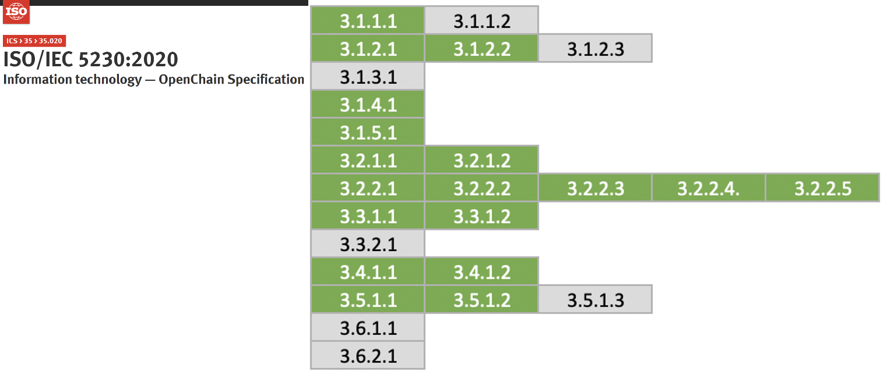

## 1. 소스 코드 스캔 도구

오픈소스 프로세스의 오픈소스 식별 및 검사 단계에서는 소스 코드 스캔 도구를 사용할 수 있습니다. 소스 코드 스캔 도구는 공급 소프트웨어에 포함된 오픈소스를 식별하고, 라이선스 및 저작권 정보를 추출하는 데 도움을 줍니다. 이러한 도구는 무료로 사용할 수 있는 오픈소스 기반 도구부터 상용 도구까지 다양합니다. 각 도구는 특장점이 있지만, 어떤 도구도 모든 문제를 해결할 수 있는 완벽한 기능을 제공하지 않습니다. 따라서 기업은 공급 소프트웨어의 특성과 요구사항에 맞는 적합한 도구를 선택해야 합니다.

많은 기업이 이러한 자동화된 소스 코드 스캔 도구와 수동 검토를 병행하여 이용합니다. 여기서는 두 가지 주요 오픈소스 소스 코드 스캔 도구를 소개합니다.

### (1) FOSSology

[FOSSology](https://www.fossology.org/)는 Linux Foundation에서 관리하는 오픈소스 프로젝트로, 라이선스 컴플라이언스 워크플로우를 지원하는 소스 코드 스캔 도구입니다.



<center><i>https://www.fossology.org/</i></center>



주요 기능:
- 소스 코드 스캔 및 라이선스 식별
- 라이선스 및 저작권 정보 추출
- 웹 기반 사용자 인터페이스 제공
- 대규모 코드베이스 분석 지원

FOSSology는 기업들이 무료로 사용할 수 있으며, 오픈소스 커뮤니티의 지속적인 개선과 지원을 받고 있습니다.

FOSSology의 설치 및 사용 방법은 [FOSSology 가이드](https://openchain-project.github.io/OpenChain-KWG/guide/governance_iso5230/appendix/3-tools/fossology/)를 참조하시기 바랍니다.

### (2) SCANOSS

[SCANOSS](https://www.scanoss.com/)는 오픈소스 소프트웨어 구성 요소를 식별하고 관리하기 위한 플랫폼입니다.

주요 기능:
- 빠른 소스 코드 스캔 및 오픈소스 컴포넌트 식별
- 라이선스 및 취약점 정보 제공
- API를 통한 통합 지원
- SBOM(Software Bill of Materials) 생성

SCANOSS는 무료 버전과 유료 버전을 제공하며, 클라우드 기반 서비스와 온프레미스 솔루션을 모두 지원합니다.

이러한 소스 코드 스캔 도구를 활용하여 공급 소프트웨어의 오픈소스 컴포넌트를 효과적으로 식별하고 관리할 수 있습니다. 그러나 도구의 결과만을 전적으로 신뢰하기보다는, 프로그램 참여자의 전문적인 검토와 판단이 함께 이루어져야 합니다.

## 2. Dependency 분석 도구

최근의 소프트웨어 개발에서는 [Gradle](https://gradle.org/), [Maven](https://maven.apache.org/)과 같은 패키지 관리자를 지원하는 빌드 환경을 사용합니다. 이러한 빌드 환경에서는 소스 코드가 없어도 빌드 타임에 필요한 Dependency 라이브러리를 원격 저장소로부터 받아와 공급 소프트웨어를 구성합니다. 이때의 Dependency 라이브러리는 공급 소프트웨어에는 포함되지만 소스 코드 스캔 도구로는 검출되지 않습니다. 따라서 Dependency 분석을 위한 도구를 활용하는 것이 중요합니다.

### (1) OSS Review Toolkit

[OSS Review Toolkit (ORT)](https://github.com/oss-review-toolkit/ort)은 오픈소스 라이선스 컴플라이언스를 자동화하기 위한 도구 모음입니다. ORT는 Analyzer라는 Dependency 분석 도구를 제공합니다.

Analyzer의 주요 기능:
- 다양한 패키지 관리자 지원 (Maven, Gradle, NPM 등)
- 프로젝트의 종속성 트리 생성
- 라이선스 및 저작권 정보 추출
- SPDX 형식의 보고서 생성


<center><i>https://github.com/oss-review-toolkit/ort#analyzer</i></center>


### (2) FOSSLight Dependency Scanner

[LG전자](https://www.lg.com/)에서 개발하고 오픈소스로 공개한 [FOSSLight Dependency Scanner](https://github.com/fosslight/fosslight_dependency_scanner)는 다양한 패키지 관리자를 지원하는 종속성 분석 도구입니다.

주요 기능:
- Gradle, Maven, NPM, PIP, Pub, Cocoapods 등 다양한 패키지 관리자 지원
- 오픈소스 라이선스 및 버전 정보 추출
- SBOM(Software Bill of Materials) 생성


<center><i>https://fosslight.org/ko/scanner/</i></center>



이러한 Dependency 분석 도구를 활용하여 공급 소프트웨어에 포함된 오픈소스 컴포넌트를 정확히 식별하고, SBOM을 생성할 수 있습니다. 이는 ISO/IEC 5230과 ISO/IEC 18974의 요구사항을 충족하는 데 도움이 됩니다.

## 3. 오픈소스 거버넌스 / SBOM 관리 도구

오픈소스 거버넌스와 SBOM(Software Bill of Materials) 관리는 효과적인 오픈소스 라이선스 컴플라이언스와 보안 보증을 위해 필수적입니다. ISO/IEC 5230과 ISO/IEC 18974 규격은 공급 소프트웨어에 포함된 오픈소스 소프트웨어 컴포넌트 기록을 문서화하여 보관할 것을 요구합니다.

{}

* 3.3.1.2 - Open source component records for the supplied software that demonstrates the documented procedure was properly followed.<br>`문서화된 절차가 적절히 준수되었음을 보여주는 공급 소프트웨어에 대한 오픈소스 컴포넌트 기록`

{}


{}

* 3.3.1.2: Open Source Software Component Records for the Supplied Software that demonstrates the documented procedure was properly followed.<br>`문서화된 절차가 적절히 준수되었음을 보여주는 공급 소프트웨어에 대한 오픈소스 소프트웨어 컴포넌트 기록`

{}

SBOM은 스프레드시트 프로그램으로도 관리할 수 있지만, 공급 소프트웨어의 수와 버전이 많아질 경우 수동 관리는 어려워집니다. 따라서 자동화된 오픈소스 도구를 도입하는 것이 효율적입니다.

### (1) SW360

[SW360](https://github.com/eclipse-sw360/sw360)은 Eclipse 재단이 후원하는 오픈소스 프로젝트로, 공급 소프트웨어별 오픈소스 목록을 추적하는 기능을 제공합니다.


주요 기능:
- 프로젝트, 컴포넌트, 라이선스 관리
- SBOM 생성 및 관리
- 취약점 관리
- 라이선스 의무사항 추적


SW360의 설치 및 사용 방법은 [SW360 가이드](https://openchain-project.github.io/OpenChain-KWG/guide/governance_iso5230/appendix/3-tools/sw360/)에서 확인할 수 있습니다.

### (2) FOSSLight

[FOSSLight](https://fosslight.org/)는 [LG전자](https://www.lg.com/)가 개발하고 오픈소스로 공개한 종합적인 오픈소스 관리 도구입니다.

주요 기능:
- SBOM 생성 및 관리
- 오픈소스 라이선스 컴플라이언스 검사
- 취약점 관리
- 오픈소스 고지문 생성


<center><i>https://fosslight.org/fosslight-guide/started/2_try/4_project.html</i></center>


LG전자는 FOSSLight를 수년간 사용하여 전사적으로 SBOM을 관리해왔으며, 2021년 6월에 이를 오픈소스로 공개했습니다. 한국어 가이드를 제공하여 국내 기업들의 사용을 돕고 있습니다.


<center><i>https://fosslight.org/</i></center>


이러한 도구들을 활용하여 기업은 효과적으로 오픈소스 거버넌스를 수행하고 SBOM을 관리할 수 있으며, ISO/IEC 5230과 ISO/IEC 18974의 요구사항을 충족할 수 있습니다.

## 4. 오픈소스 보안취약점 관리 도구

공급 소프트웨어에 포함된 알려진 취약점 또는 새로 발견된 취약점을 효과적으로 관리하기 위해 기업은 자동화된 도구 환경을 구축해야 합니다. 여기서는 세 가지 주요 오픈소스 보안취약점 관리 도구를 소개합니다.

### (1) OWASP Dependency-Check

[OWASP Dependency-Check](https://owasp.org/www-project-dependency-check/)는 프로젝트의 종속성을 분석하여 알려진 취약점이 있는지 검출하는 오픈소스 도구입니다.

주요 기능:
- 다양한 언어 및 패키지 관리자 지원 (Java, .NET, JavaScript, Ruby 등)
- CVE(Common Vulnerabilities and Exposures) 데이터베이스와 연동
- CI/CD 파이프라인과의 쉬운 통합
- HTML, XML, CSV, JSON 등 다양한 형식의 보고서 생성

### (2) SW360

[SW360](https://github.com/eclipse/sw360)은 Eclipse 재단에서 관리하는 오픈소스 소프트웨어 컴포넌트 관리 도구로, 보안 취약점 관리 기능도 제공합니다.

주요 기능:
- 등록된 Release에 대한 자동 취약점 확인
- CVE 정보 주기적 수집 (24시간마다 스케줄링)
- 프로젝트별 보안 취약점 조회
- 새로 공개된 취약점의 기존 제품 영향 추적

SW360으로 보안취약점을 관리하는 방법은 [SW360 가이드](https://openchain-project.github.io/OpenChain-KWG/guide/governance_iso5230/appendix/3-tools/sw360/)를 참고할 수 있습니다.

### (3) FOSSLight

[FOSSLight](https://fosslight.org/ko/)도 이와 유사하게 보안취약점 정보를 자동으로 취득하고, 보안취약점이 검출된 프로젝트 정보를 자동으로 확인하여 필요 시 메일 등 알림을 제공합니다.


이러한 도구들을 활용하여 기업은 ISO/IEC 18974의 요구사항을 충족하면서 효과적으로 오픈소스 보안 취약점을 관리할 수 있습니다.


## 5. 오픈소스 컴플라이언스 산출물 생성 도구

주요 오픈소스 컴플라이언스 산출물인 오픈소스 고지문은 공급 소프트웨어에 포함된 오픈소스의 저작권과 라이선스 정보를 제공하기 위한 문서입니다. 오픈소스 고지문은 수동으로 작성할 수도 있지만, 자동으로 생성하는 도구를 활용하는 것이 효율적입니다.

### (1) onot

[SK텔레콤](https://www.sktelecom.com/)은 사내에서 사용하는 오픈소스 고지문 자동 생성 도구를 [onot](https://github.com/sktelecom/onot)이라는 이름으로 오픈소스로 공개하였습니다. [카카오](https://www.kakaocorp.com/)에서도 주요 기능을 기여하는 방식으로 공동 개발에 참여하였습니다.


<center><i>onot 설치방법</i></center><br>

`onot`은 [SPDX](https://spdx.dev/) 문서 형식으로 작성된 SBOM을 자동으로 오픈소스 고지문 형식으로 변환하는 도구입니다. Python 프로그램으로 가볍고 간단하게 사용할 수 있습니다.


<center><i>onot 생성 오픈소스 고지문 샘플</i></center><br>

### (2) FOSSLight

[FOSSLight](https://fosslight.org/)도 취득한 SBOM을 기반으로 오픈소스 고지문을 자동으로 생성하는 기능을 제공합니다.


<center><i>https://fosslight.org/fosslight-guide/started/2_try/4_project.html</i></center>



이러한 도구들을 활용하면 오픈소스 고지문 생성 과정을 자동화하고 표준화할 수 있어, 오픈소스 라이선스 컴플라이언스 프로세스의 효율성과 정확성을 높일 수 있습니다. 또한 ISO/IEC 5230과 ISO/IEC 18974의 요구사항을 충족하는 데 도움이 됩니다.

## 6. 오픈소스 컴플라이언스 산출물 보관

오픈소스 컴플라이언스 산출물을 체계적으로 보관하고 관리하는 것은 오픈소스 라이선스 컴플라이언스를 위해 매우 중요합니다. 특히 GPL, LGPL 등 소스 코드 공개를 요구하는 라이선스의 경우, 공급 소프트웨어 배포 후 최소 3년간 소스 코드를 제공할 수 있어야 합니다. 

이를 위해 ISO/IEC 5230 표준은 다음과 같이 배포용 소프트웨어의 컴플라이언스 산출물 사본을 보관하기 위한 문서화된 절차를 요구합니다.

{}

* 3.4.1.2 - A documented procedure for archiving copies of the compliance artifacts of the supplied software - where the archive is planned to exist for a reasonable period of time (Determined by domain, legal jurisdiction and/or customer contracts) since the last offer of the supplied software; or as required by the identified licenses (whichever is longer). Records exist that demonstrate the procedure has been properly followed.<br>`배포용 소프트웨어의 컴플라이언스 산출물 사본을 보관하기 위한 문서화된 절차 - 산출물 사본은 배포용 소프트웨어의 마지막 배포 이후 합리적인 기간  동안 혹은 식별된 라이선스에서 요구하는 기간 동안 보관해야 한다(둘 중 더 긴 기간을 따름). 이러한 절차가 올바르게 수행되었음을 입증하는 기록이 존재해야 한다. `

{}

이를 위해 기업은 오픈소스 컴플라이언스 산출물을 안전하게 보관하고 필요시 외부에 공개할 수 있는 시스템을 구축해야 합니다.

### (1) GitHub Pages

[GitHub Pages](https://pages.github.com/)는 GitHub 저장소에서 직접 웹사이트를 호스팅할 수 있는 서비스입니다. 이를 활용하여 오픈소스 컴플라이언스 산출물을 보관하고 공개할 수 있습니다.

GitHub Pages를 사용하여 오픈소스 컴플라이언스 산출물을 보관하는 방법은 다음과 같습니다:

1. GitHub에 전용 저장소 생성
2. 저장소에 오픈소스 고지문 및 소스 코드 업로드
3. GitHub Pages 설정을 통해 웹사이트 활성화
4. 공개 URL을 통해 외부에서 접근 가능하도록 설정

GitHub Pages를 사용하면 다음과 같은 이점이 있습니다:

- 무료로 사용 가능
- 버전 관리 기능 제공
- 높은 가용성 및 안정성
- 쉬운 업데이트 및 관리

이러한 도구 환경은 SK텔레콤의 오픈소스 웹사이트에서 참고하실 수 있습니다.


<center><i>https://sktelecom.github.io/compliance/</i></center>


이 웹사이트는 오픈소스로 개발하였고, 소스 코드를 공개하고 있어서 다른 기업들도 쉽게 유사한 환경을 구축할 수 있습니다. 



<center><i>https://github.com/sktelecom/sktelecom.github.io</i></center>



GitHub Pages를 활용하여 오픈소스 컴플라이언스 산출물을 보관하고 공개함으로써, 기업은 오픈소스 라이선스 의무를 효과적으로 이행하고 투명성을 제고할 수 있습니다.

## 7. 지속적 통합/배포(CI/CD) 도구와의 연동

오픈소스 컴플라이언스 및 보안 보증 활동을 지속적 통합/배포(CI/CD) 파이프라인에 통합하면 개발 프로세스 전반에 걸쳐 자동화된 검사와 관리가 가능해집니다. 이를 통해 오픈소스 관련 이슈를 조기에 발견하고 해결할 수 있습니다.

### (1) Jenkins 플러그인

[Jenkins](https://www.jenkins.io/)는 널리 사용되는 오픈소스 자동화 서버로, 다양한 플러그인을 통해 오픈소스 컴플라이언스 및 보안 보증 도구들과 연동할 수 있습니다.

주요 Jenkins 플러그인:

- [FOSSology Plugin](https://plugins.jenkins.io/fossology/): FOSSology 스캔을 Jenkins 파이프라인에 통합합니다.
- [OWASP Dependency-Check Plugin](https://plugins.jenkins.io/dependency-check-jenkins-plugin/): 알려진 취약점 또는 새로 발견된 취약점 검사를 자동화합니다.
- [SW360 Plugin](https://github.com/eclipse/sw360/tree/main/jenkins-pipeline): SW360와 Jenkins를 연동하여 SBOM 관리를 자동화합니다.

Jenkins 파이프라인 예시:

```groovy
pipeline {
    agent any
    stages {
        stage('Checkout') {
            steps {
                checkout scm
            }
        }
        stage('Dependency Scan') {
            steps {
                dependencyCheck additionalArguments: '', odcInstallation: 'Default'
            }
        }
        stage('License Scan') {
            steps {
                fossology()
            }
        }
        stage('SBOM Update') {
            steps {
                sw360UpdateProject()
            }
        }
    }
    post {
        always {
            dependencyCheckPublisher pattern: '**/dependency-check-report.xml'
        }
    }
}
```

이 파이프라인은 소스 코드 체크아웃, 의존성 취약점 검사, 라이선스 스캔, SBOM 업데이트를 순차적으로 수행합니다.

### (2) GitLab CI/CD 파이프라인

[GitLab CI/CD](https://docs.gitlab.com/ee/ci/)는 GitLab에 내장된 지속적 통합/배포 도구로, `.gitlab-ci.yml` 파일을 통해 파이프라인을 정의합니다.

GitLab CI/CD 파이프라인 예시:

```yaml
stages:
  - scan
  - analyze
  - report

dependency_scan:
  stage: scan
  script:
    - docker run --rm -v $(pwd):/src owasp/dependency-check --scan /src --format "ALL" --out /src/reports

license_scan:
  stage: scan
  script:
    - docker run --rm -v $(pwd):/project fossology/fossology:latest /usr/local/fossology/fo_cli -c /project

sbom_update:
  stage: analyze
  script:
    - sw360 update-project

vulnerability_report:
  stage: report
  script:
    - generate_vulnerability_report
  artifacts:
    reports:
      dependency_scanning: reports/dependency-check-report.json

license_report:
  stage: report
  script:
    - generate_license_report
  artifacts:
    reports:
      license_scanning: reports/license-scan-report.json
```

이 파이프라인은 의존성 취약점 검사, 라이선스 스캔, SBOM 업데이트, 취약점 보고서 및 라이선스 보고서 생성을 수행합니다.

CI/CD 파이프라인에 이러한 프로세스를 통합함으로써, 오픈소스 컴플라이언스 및 보안 보증 활동을 자동화하고 개발 워크플로우에 원활하게 통합할 수 있습니다. 이는 ISO/IEC 5230과 ISO/IEC 18974의 요구사항을 효과적으로 충족하는 데 도움이 됩니다.


## 8. Summary

여기까지 도구 환경을 구축하게 되면 ISO/IEC 5230과 ISO/IEC 18974 표준 규격의 주요 요구사항을 충족할 수 있습니다. 



이러한 도구들을 활용함으로써 다음과 같은 이점을 얻을 수 있습니다:

1. 소스 코드 스캔 및 Dependency 분석 도구를 통해 공급 소프트웨어에 포함된 오픈소스를 정확히 식별하고 라이선스를 파악할 수 있습니다.

2. 오픈소스 거버넌스 및 SBOM 관리 도구를 사용하여 공급 소프트웨어의 오픈소스 컴포넌트를 체계적으로 관리하고 추적할 수 있습니다.

3. 오픈소스 보안취약점 관리 도구를 통해 알려진 취약점 또는 새로 발견된 취약점을 지속적으로 모니터링하고 대응할 수 있습니다.

4. 오픈소스 컴플라이언스 산출물 생성 및 보관 도구를 활용하여 라이선스 의무사항을 준수하는 데 필요한 문서를 효율적으로 생성하고 관리할 수 있습니다.

5. CI/CD 도구와의 연동을 통해 오픈소스 관리 프로세스를 개발 워크플로우에 통합하여 자동화할 수 있습니다.

이러한 도구 환경 구축을 통해 기업은 오픈소스 라이선스 컴플라이언스와 보안 보증 활동을 체계적이고 효율적으로 수행할 수 있으며, ISO/IEC 5230과 ISO/IEC 18974의 요구사항을 충족하는 데 큰 도움을 받을 수 있습니다.

오픈소스 관리 도구를 효과적으로 활용함으로써, 기업은 오픈소스 사용에 따른 법적 위험을 최소화하고, 보안 취약점에 신속하게 대응하며, 투명하고 신뢰할 수 있는 소프트웨어 공급망을 구축할 수 있습니다. 이는 궁극적으로 기업의 경쟁력 향상과 고객 신뢰 증진으로 이어질 것입니다.
