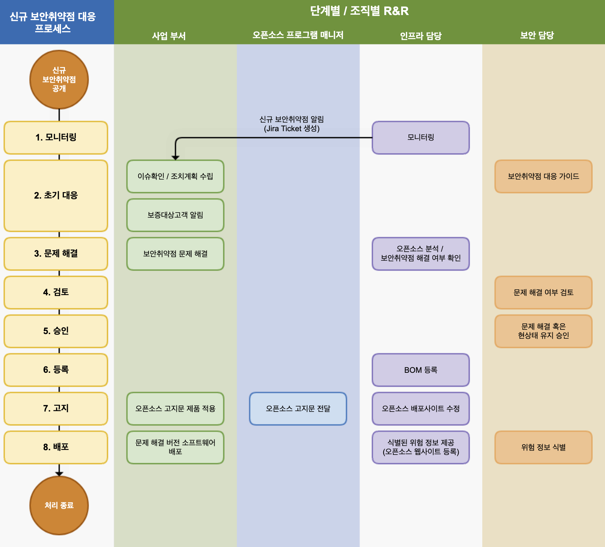

OOO 회사(이하 "회사"라 함)는 소프트웨어를 포함하는 제품과 서비스를 개발하면서 오픈소스 소프트웨어를 적극적으로 활용합니다. 회사는 오픈소스 리스크를 최소화하기 위해 소프트웨어를 배포하면서 (1) 오픈소스 라이선스가 부과하는 의무사항을 준수하기 위한 활동과 (2) 오픈소스 보안 취약점을 검출하고 후속 조치를 위한 적절한 활동을 수행해야 합니다. 이러한 활동을 보장하기 위해 오픈소스 프로세스를 따릅니다.

## 1. 오픈소스 프로세스

오픈소스 프로세스는 회사가 소프트웨어 제품 및 서비스를 개발하고 배포하기 위한 각 개발 단계에 맞게 오픈소스 라이선스 의무 준수와 오픈소스 보안 취약점 해결을 위해 수행해야 할 절차를 정의합니다. 소프트웨어 제품 개발/배포에 관여하는 모든 구성원은 다음의 오픈소스 프로세스 11단계를 준수합니다.

회사는 오픈소스 프로세스를 통해 오픈소스 리스크를 최소화하고, 고객에게 안전하고 안정적인 소프트웨어 제품과 서비스를 제공하기 위해 노력합니다.

### (1) 오픈소스 식별Identification of Open Source

사업 부서는 소프트웨어 설계 단계에서 다음 사항을 준수합니다.

- 소프트웨어를 설계하면서 예측 가능한 오픈소스 사용 현황을 파악하고 라이선스를 확인합니다.
- 오픈소스 라이선스별 의무 사항을 확인합니다. 라이선스별 의무 사항은 회사의 오픈소스 라이선스 가이드에서 확인할 수 있습니다. (insert_link)
- 각 오픈소스 라이선스의 소스 코드 공개 범위를 고려하여 소프트웨어를 설계합니다.

오픈소스 프로그램 매니저는 주요 오픈소스 라이선스 의무, 제한, 권리에 대한 가이드를 작성하고 공개하여 전사의 사업 부서에서 참고할 수 있도록 합니다. 이 가이드에는 일반적인 오픈소스 라이선스의 사용 사례가 관리될 수 있도록 다음과 같은 사용 사례가 포함되어야 합니다.

- 바이너리 형태로 배포
- 소스 형태로 배포
- 추가 라이선스 의무를 유발하는 다른 오픈소스와 통합
- 수정된 오픈소스 포함

사업 부서는 회사 규칙에 맞게 소스 코드에 저작권 및 라이선스를 표기합니다. 회사의 소스 코드 내 저작권 및 라이선스 표기 규칙은 다음 페이지에서 확인할 수 있습니다. (insert_link)

사업 부서는 새로운 오픈소스 도입 검토 시, 먼저 라이선스를 식별합니다. 회사의 오픈소스 라이선스 가이드에 따라 라이선스 의무, 제한 및 권리를 확인합니다. 회사의 오픈소스 라이선스 가이드에서 설명하지 않는 라이선스일 경우, 오픈소스 프로그램 매니저에게 도입 가능 여부 및 주의 사항을 문의합니다. Jira Ticket을 생성하여 문의합니다.

오픈소스 프로그램 매니저는 오픈소스 라이선스 의무를 분석하여 소프트웨어 개발 조직에 안내합니다.

- 의문이 있는 경우, 법무 담당에 자문을 요청하여 명확한 가이드를 제공합니다.
- 새롭게 분석한 라이선스 정보는 전사 라이선스 가이드에 반영합니다.

보안 담당은 회사의 보안 보증을 위한 가이드를 제공합니다.

### (2) 소스 코드 검사Auditing Source Code

사업 부서는 IT 담당자의 안내에 따라 오픈소스 점검을 요청하고 소스 코드를 제공합니다.

IT 담당은 오픈소스 분석 도구를 사용하여 오픈소스 점검을 하고, SBOM(Software Bill of Materials)을 생성합니다.

오픈소스 프로그램 매니저는 오픈소스 라이선스 의무 준수 가능 여부, 오픈소스 라이선스 충돌 여부를 검토하고, 이슈가 있으면 사업 부서에 해결을 요청합니다. 이슈 사항은 Jira Ticket으로 생성하여 사업 부서에 할당합니다.

보안 담당은 검출된 알려진 취약점을 검토하고 사전 정의한 Risk 분류 기준에 따라 사업 부서에 대응 가이드를 제공합니다. Risk는 CVSS(Common Vulnerability Scoring System) Score로 분류하며, Critical Risk는 1주 이내 조치할 수 있는 계획을 수립하도록 안내합니다.

| Risk | CVSS 2.0 | CVSS 3.0 | 조치 권고 일정 |
|---|:---:|:---:|:---:|
| Low | 0.0 - 3.9 | 0.0 - 3.9 | - |
| Medium | 4.0 - 6.9 | 4.0 - 6.9 | - |
| Hgh | 7.0 - 10.0 | 7.0 - 8.9 | 4주 이내 | 
| Critical | - | 9.0 - 10.0 | 1주 이내 |

### (3) 문제 해결Resolving Issues

사업 부서는 소스 코드 검사 단계에서 발견된 모든 문제를 해결합니다. 이슈가 된 오픈소스를 제거하거나, 다른 라이선스 하의 오픈소스로 교체하거나, 알려진 취약점이 수정된 버전으로 교체하는 등의 조치를 취합니다.

사업 부서는 발견된 모든 이슈를 해결하면 Jira Ticket 이슈를 Resolve하고, 재검토를 요청합니다.

### (4) 검토Reviews

오픈소스 프로그램 매니저는 모든 이슈가 적절하게 보완되었는지 검토합니다. 필요할 경우, 오픈소스 분석 도구를 사용하여 소스 코드 검사를 재수행합니다.

보안 담당은 심각한 취약점이 모두 해결되었는지 검토합니다. 해결하기 어려운 취약점이 남아 있을 경우, 비즈니스 형태와 서비스 노출 현황 등을 고려하여 승인 가능 여부를 검토합니다.

### (5) 승인Approval

오픈소스 프로그램 매니저는 오픈소스 컴플라이언스 절차가 적절하게 수행되었는지 최종 승인하거나 거절합니다. 거절 시에는 이유에 대한 설명과 수정 방법을 사업 부서에 제안합니다.

### (6) 등록Registration

오픈소스 프로그램 매니저는 소프트웨어의 버전별 오픈소스 사용 목록을 추적하기 위한 BOM을 확정한다.

IT 담당은 확정된 BOM을 시스템에 등록한다. BOM에는 배포용 소프트웨어에 포함된 오픈소스 목록과 다음과 같은 정보를 포함한다. 

- 배포용 소프트웨어의 제품(혹은 서비스) 이름과 버전
- 오픈소스 목록
  - 오픈소스 이름 / 버전
  - 오픈소스 라이선스

오픈소스 프로그램 매니저는 소프트웨어의 버전별 오픈소스 사용 목록을 추적하기 위한 BOM을 확정합니다.

IT 담당은 확정된 BOM을 시스템에 등록합니다. BOM에는 배포용 소프트웨어에 포함된 오픈소스 목록과 다음과 같은 정보를 포함합니다.

- 배포용 소프트웨어의 제품(혹은 서비스) 이름과 버전
- 오픈소스 목록
  - 오픈소스 이름/버전
  - 오픈소스 라이선스

### (7) 고지Notices

오픈소스 프로그램 매니저는 고지 의무를 준수하기 위해 오픈소스 고지문을 생성합니다. 오픈소스 고지문에는 다음과 같은 내용이 포함됩니다.

- 오픈소스 관련 문의할 수 있는 오픈소스 연락처
- 오픈소스별 고지 내용
  - 저작권 
  - 오픈소스 라이선스 이름
  - 오픈소스 라이선스 사본
  - (해당하는 경우) 소스 코드 사본을 얻을 수 있는 서면 약정 (Written Offer)

오픈소스 프로그램 매니저는 오픈소스 고지문을 생성하여 사업 부서에 전달합니다. 이때 소스 코드 공개가 필요할 경우 사업 부서에 공개할 소스 코드 취합 방법을 안내합니다.

사업 부서는 오픈소스 고지문을 제품 배포 시 동봉합니다. 화면이 있는 제품일 경우, 사용자가 메뉴를 통해 확인할 수 있도록 조치합니다. (예: 앱 > 메뉴 > 설정 > 저작권 정보 > 오픈소스 라이선스)

사업 부서는 GPL, LGPL 등 소스 코드 공개를 요구하는 라이선스 하의 오픈소스를 사용하였을 경우, 이에 대한 소스 코드 공개 범위를 확인하여 공개할 소스 코드를 취합합니다.

- GPL, LGPL 등의 라이선스 의무 준수를 위해 취합한 소스 코드는 제품에 탑재된 바이너리를 구성하는 소스 코드와 일치해야 합니다. 즉, 취합한 소스 코드를 빌드하면 제품에 탑재된 바이너리와 동일해야 합니다.

### (8) 배포 전 확인Pre-Distribution Verifications

사업 부서는 오픈소스 컴플라이언스 활동이 적절히 수행되었음을 입증하는 다음의 산출물을 제출합니다.

1. 제품에 포함한 최종 오픈소스 고지문
2. 제품에 오픈소스 고지문이 포함되었음을 확인하는 자료 (예: 오픈소스 고지문을 보여주는 화면 캡처 이미지)
3. (해당할 경우) 공개할 소스 코드 (하나의 파일로 압축하여 제출)

오픈소스 프로그램 매니저는 사업 부서가 제출한 자료를 검토하여 이상 여부를 확인합니다.

### (9) 배포Distribution

오픈소스 프로그램 매니저는 사업 부서가 제출한 컴플라이언스 산출물을 IT 담당자에게 제출합니다.

IT 담당은 컴플라이언스 산출물을 회사의 오픈소스 배포 사이트에 등록합니다.

### (10) 최종 확인Final Verifications

오픈소스 프로그램 매니저는 컴플라이언스 산출물이 이상 없이 회사의 오픈소스 포털에 등록되었는지, 외부에서 이상 없이 다운로드가 되는지 등 종합적인 확인을 합니다.

### (11) 모니터링Monitoring

오픈소스 프로그램 매니저는 오픈소스 컴플라이언스 산출물 생성이 미흡한 제품이 있는지 주기적으로 확인합니다. 그리고, 외부 문의에 신속하게 대응하기 위한 프로세스를 운영합니다. 외부 문의 대응 프로세스의 자세한 절차는 [2. 외부 문의 대응 프로세스]를 따릅니다.

보안 담당은 새롭게 알려진 취약점을 모니터링하고 대응하기 위한 프로세스를 운영합니다. 신규 보안 취약점 대응 프로세스의 자세한 절차는 [3. 신규 보안 취약점 대응 프로세스]를 따릅니다.

## 2. 외부 문의 대응 프로세스

외부로부터의 오픈소스 컴플라이언스 문의에 신속하고 정확하게 대응한다면 소송까지 진행되는 위험을 크게 줄일 수 있다. 이를 위해 기업은 외부의 오픈소스 컴플라이언스 문의에 대응하기 위해 다음과 같은 프로세스를 준수한다.

### (1) 접수 알림Acknowledge

오픈소스 프로그램 매니저는 문의를 받은 즉시 요청자에게 문의가 접수되었음을 알립니다. 이때 조치 예정일을 함께 알립니다. 요청자의 의도가 무엇인지 정확히 파악하는 것이 중요하기 때문에 문의가 불명확한 경우 추가 설명을 요청합니다.

대응이 필요한 문의 및 요청의 주요 내용은 아래와 같습니다.

- 특정 제품 및 서비스에 오픈소스가 사용되었는지 문의
- 서면 약정(Written Offer)에 언급된 GPL, LGPL 라이선스 하의 소스 코드 제공 요청
- 오픈소스 고지문에 명시되지 않았지만, 제품에서 발견된 오픈소스에 대한 해명 및 소스 코드 공개 요청
- GPL, LGPL 등의 의무로 공개된 소스 코드에 누락된 파일 및 빌드 방법 제공 요청
- 저작권 표시 요청

오픈소스 프로그램 매니저는 접수한 요청에 대한 Jira Issue를 생성하여 대응 상황을 모두 자세히 기록합니다.

### (2) 조사 알림Inform

오픈소스 프로그램 매니저는 요청자에게 오픈소스 컴플라이언스를 충실히 수행하고 있음과 요청자의 문의를 조사하고 있음을 알립니다. 내부 조사 진행 상황이 업데이트될 때마다 알리는 것이 좋습니다.

### (3) 내부 조사Investigate

오픈소스 프로그램 매니저는 요청 사항에 대한 내부 조사를 진행합니다. 문제가 된 제품의 버전에 대하여 컴플라이언스 프로세스가 적절하게 수행되었는지 BOM 및 문서화된 검토 이력을 통해 확인합니다. 필요 시 법무 담당에 자문을 요청합니다.

특정 사업 부서에서 확인이 필요한 사항일 경우 오픈소스 프로그램 매니저는 사업 부서에 조사를 요청합니다. 조사를 요청받은 사업 부서는 컴플라이언스 산출물에 문제가 있는지 즉시 확인하고 결과를 오픈소스 프로그램 매니저에게 보고합니다.

### (4) 요청자에게 보고Report

오픈소스 컴플라이언스 담당은 조치 예정일 내에 내부 조사를 마치고, 요청자에게 결과를 알립니다.

- 요청자의 문의가 오해로 인한 잘못된 지적이었다면 추가 조치 없이 요청자에게 이를 알리고 처리를 종료합니다.
- 문제가 맞는다면 요청자에게 해당 오픈소스 라이선스의 의무를 이행하기 위한 정확한 방법과 시기를 알립니다.

### (5) 문제 보완 / 알림Rectify

내부조사에서 실제 컴플라이언스 문제가 발견되면 해당 사업 부서는 컴플라이언스 문제를 해결하는 데 필요한 모든 절차를 수행합니다.

### (6) 문제 해결 알림Report

문제를 해결한 후에는 즉시 요청자에게 알리고 문제가 해결되었음을 확인할 수 있는 최선의 방법을 제공합니다.

### (7) 프로세스 개선Improve

컴플라이언스 문제가 있었던 경우, OSRB 미팅을 통해 사례를 검토하고, 문제가 발생한 경위를 파악하여, 문제가 재발하지 않을 수 있도록 프로세스를 개선합니다.

## 3. 신규 보안취약점 대응 프로세스

제품/서비스가 시장에 출시된 후 새롭게 보안 취약점이 보고될 경우 위험도에 따라 적절한 조치를 취하기 위해 다음과 같은 프로세스를 준수합니다.

### (1) 모니터링

IT 담당은 새로운 보안 취약점을 모니터링하는 시스템을 구축하여 운영합니다. 이 시스템은 다음과 같은 기능을 수행합니다.

- 새로운 보안 취약점이 공개되는 것을 주기적으로 수집합니다.
- 새로운 알려진 취약점을 갖고 있는 오픈소스가 이미 출시된 제품/서비스에 사용된 경우, 해당 제품/서비스의 사업 부서 담당자에게 알림을 보냅니다. 이때 알림부터 검토, 조치, 해결 사항이 모두 문서화되어 기록될 수 있도록 Jira Issue Tracker를 사용합니다.

### (2) 초기 대응

보안 담당은 사전 정의한 위험 분류 기준에 따라 사업 부서에 대응 가이드를 제공합니다. 위험은 CVSS(Common Vulnerability Scoring System) 점수로 분류하며, Critical Risk는 1주 이내에 조치할 수 있는 계획을 수립하도록 안내합니다.

| Risk | CVSS 2.0 | CVSS 3.0 | 조치 권고 일정 |
|---|:---:|:---:|:---:|
| Low | 0.0 - 3.9 | 0.0 - 3.9 | - |
| Medium | 4.0 - 6.9 | 4.0 - 6.9 | - |
| Hgh | 7.0 - 10.0 | 7.0 - 8.9 | 4주 이내 | 
| Critical | - | 9.0 - 10.0 | 1주 이내 |

사업 부서는 기존 출시한 제품/서비스에 새로운 보안 취약점이 발견된 경우, 보안 담당자가 제공한 대응 가이드에 따라 조치 계획을 수립합니다.

보증이 필요한 고객이 있는 경우, 사업 부서는 위험도에 따라 필요한 경우 이메일 등의 방법으로 확인된 알려진 취약점을 고지합니다.

### (3) 문제 해결

사업 부서는 수립한 조치 계획에 따라 문제가 되는 오픈소스를 삭제하거나 패치된 버전으로 교체하는 등의 방법으로 보안 취약점 문제를 해결합니다. 발견된 모든 이슈를 해결하면, 재검토를 요청합니다.

### (4) 검토

IT 담당은 오픈소스 분석 도구를 활용하여 문제가 적절하게 해결되었는지 확인합니다.

### (5) 승인

보안 담당은 심각한 취약점이 모두 해결되었는지 검토합니다. 해결하기 어려운 취약점이 남아 있을 경우, 비즈니스 형태와 서비스 노출 현황 등을 고려하여 승인 여부를 검토합니다.

### (6) 등록

IT 담당은 오픈소스 보안 취약점이 해결된 SBOM을 시스템에 등록합니다.

### (7) 고지

오픈소스 프로그램 매니저는 오픈소스 보안 취약점이 해결된 SBOM을 기준으로 오픈소스 고지문을 생성하여 사업 부서에 전달합니다.

사업 부서는 제품 배포 시 동봉한 오픈소스 고지문을 교체합니다.

IT 담당은 수정된 오픈소스 고지문을 회사의 오픈소스 배포 사이트에 등록합니다.

### (8) 배포

사업 부서는 오픈소스 보안 취약점 문제가 해결된 버전의 소프트웨어를 재배포합니다.

보안 담당은 제3자에게 공개가 필요한 위험 정보가 존재하는지 식별하고, 존재할 경우 IT 담당자에게 전달합니다.

IT 담당은 신별된 위험에 대한 정보를 오픈소스 웹사이트에 등록하여 제3자가 확인할 수 있게 합니다.