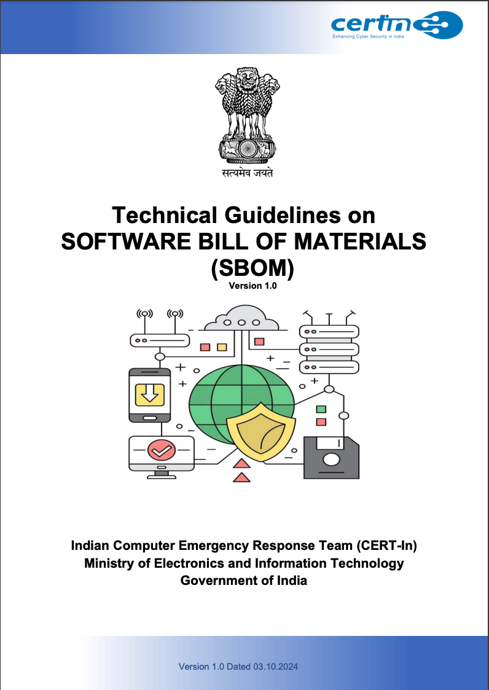

{}

본 문서는 인도 컴퓨터 비상대응팀(CERT-In)이 2023년 10월에 발표한 "[Technical Guidelines on Software Bill of Materials (SBOM)](https://www.cert-in.org.in/PDF/SBOM_Guidelines.pdf)"의 한국어 번역본입니다. 

원문은 인도의 공공 부문, 정부, 필수 서비스, 소프트웨어 수출 및 서비스 산업 관련 조직을 대상으로 SBOM 도입에 대한 기술적 지침을 제공하며, SBOM의 가치와 모범 사례를 중점적으로 다루고 있습니다.: [DOWNLOAD](./SBOM_Guidelines.pdf)

이 가이드라인은 한국 기업에도 다음과 같은 시사점을 제공합니다:

1. **경쟁력 강화**: SBOM 도입은 소프트웨어 공급망 보안을 강화하고 글로벌 시장에서 신뢰성을 높이는 데 기여할 수 있습니다.
2. **사이버 보안 향상**: SBOM은 취약점 관리와 사고 대응 능력을 개선하는 데 중요한 역할을 합니다.
3. **규제 대비**: 인도와 거래하거나 협력하는 기업들은 해당 지침을 숙지하고 준수할 필요가 있습니다.
4. **국제 협력 촉진**: 글로벌 표준 준수를 통해 국제 거래에서 투명성과 신뢰성을 확보할 수 있습니다.

이 번역본이 한국의 소프트웨어 개발 및 보안 전략 수립에 실질적인 도움이 되기를 기대합니다.

**Author : [장학성 (Haksung Jang)](https://haksungjang.github.io/)**

{}

## 1. Executive Summary

소프트웨어 제품은 다양한 구성 요소로 이루어져 있으며, 이 중 일부는 외부 소스에서 가져옵니다. 이러한 외부 구성 요소와 의존성에는 취약점이 있을 수 있어, 공격자가 이를 악용해 보안 사고나 침해로 이어질 수 있습니다. 주요 위협으로는 악성 코드 삽입, 오래된 구성 요소의 취약점 이용, [공급업체 침해](https://www.cisa.gov/sites/default/files/publications/defending_against_software_supply_chain_attacks_508_1.pdf) 등이 있습니다. 이로 인해 데이터 유출, 운영 중단, 평판 손상 등의 문제가 발생할 수 있습니다. 이러한 위협에 대응하려면 소프트웨어 구축이나 개발에 사용되는 구성 요소에 대한 가시성과 투명성을 확보해야 합니다. 소프트웨어 부품 명세서(Software Bill of Materials, SBOM)는 조직이 소프트웨어나 자산에 포함된 구성 요소를 정확히 파악하여 취약점을 식별하고 수정하는 데 도움을 줍니다. SBOM을 활용하면 조직은 소프트웨어 보안을 개선하고 잠재적 위협으로부터 보호할 수 있습니다.

**소프트웨어 부품 명세서(SBOM)** 는 소프트웨어를 구성하는 모든 요소, 라이브러리, 모듈의 목록으로, 소프트웨어 구성에 대한 투명성을 제공합니다. 소프트웨어가 더욱 복잡해지고 외부 구성 요소에 대한 의존도가 높아짐에 따라 소프트웨어 구성을 이해하는 것이 중요해졌습니다. 사이버 보안 측면에서 소프트웨어를 공격으로부터 보호하려면 소프트웨어 구축에 사용된 의존성과 구성 요소를 파악해야 합니다. 따라서 SBOM은 현대 사이버 보안 절차에서 핵심적인 도구입니다.

SBOM은 소프트웨어 보안 유지에 필수적입니다. 이를 통해 조직은 소프트웨어의 구성 요소를 이해하고, 잠재적 위험을 관리하며, 보안 문제에 대응하고, 규정을 준수할 수 있습니다. 다음은 조직이 SBOM을 구현함으로써 얻을 수 있는 주요 이점입니다:

1. **보안 관리 강화**: 소프트웨어의 구성 요소를 파악함으로써 조직은 보안 위협에 취약할 수 있는 요소를 식별하고 대응할 수 있습니다.
2. **효과적인 사고 대응**: 사이버 보안 사고 발생 시 SBOM은 상세한 구성 요소 정보를 제공하여 신속한 대응을 가능하게 합니다.
3. **취약점 식별 및 패치 관리**: 모든 구성 요소를 나열함으로써 조직은 소프트웨어의 알려진 취약점을 빠르게 발견하고 패치할 수 있습니다.
4. **공급망 보안**: 소프트웨어 제작에 사용된 외부 구성 요소에 대한 가시성을 확보함으로써 공급망 위험을 크게 줄일 수 있습니다.
5. **규정 준수 지원**: SBOM은 소프트웨어 구성의 투명성을 제공하여 조직이 보안 규정, 지침 및 모범 사례를 준수하는 과정을 간소화합니다.
6. **운영 효율성 향상**: 소프트웨어 구성 요소에 대한 명확한 이해를 통해 조직은 취약점 관리 프로세스를 간소화하여 시간과 자원을 절약할 수 있습니다.

인도 컴퓨터 비상 대응팀(CERT-In)은 특히 공공 부문, 정부, 필수 서비스, 소프트웨어 수출 및 서비스 산업 관련 조직을 위한 기술적 SBOM 지침을 발표했습니다. 부서와 조직은 보안을 강화하고 사이버 위협의 위험을 줄이기 위해 소프트웨어 조달 및 개발 과정에서 SBOM의 생성과 제공을 의무적인 표준 관행으로 삼도록 권장됩니다.

다음 장에서는 SBOM의 다양한 기술적 측면을 살펴보고 그 목적과 소프트웨어 공급망 생태계에서의 중요성이 증가하는 이유를 설명합니다. 두 번째 장에서는 SBOM의 개요와 범위 및 구현에 대해 논의하고, 이어서 SBOM 생태계에 대한 장에서는 SBOM의 다양한 수준과 분류에 대해 설명합니다. 그 다음 장에서는 SBOM 정보를 표현하는 데 사용되는 다양한 표준과 데이터 형식을 살펴보고, 최소 요소, 데이터 필드 및 자동화 지원에 대해 자세히 설명합니다. SBOM과 관련된 모든 프로세스와 관행의 목표, 안전한 SBOM 공유 및 배포에 대해 이 문서에서 상세히 다루며, SBOM의 취약점 추적 및 분석을 위한 접근 방식도 포함됩니다. 마지막으로, 문서의 마지막 장에서는 SBOM 구현을 위한 권장 사항과 모범 사례를 소개합니다.

## 2. SBOM 개요

### 2.1 필요성 및 활용

소프트웨어가 점점 복잡해짐에 따라 SBOM의 필요성이 더욱 커지고 있습니다. SBOM은 [소프트웨어 구성 분석(SCA)](https://www.revenera.com/blog/what-is-software-composition-analysis/) 도구의 기반이 되며, 취약점 탐지, 라이선스 준수 지원, 공급업체 위험 관리에 중요한 역할을 합니다.

소프트웨어 정의 시스템의 증가로 사이버 위협 환경이 크게 확대되었습니다. 공격자들은 민감한 시스템과 데이터에 침투하기 위해 소프트웨어 공급망을 점점 더 많이 노리고 있습니다.

부서와 조직은 소프트웨어 개발 및 조달 과정에서 [소프트웨어 부품 명세서(SBOM)](https://www.cisa.gov/sbom)의 생성과 제공을 표준 관행으로 삼도록 권장됩니다. 이를 통해 보안, 규정 준수, 위험 관리, 공급망 투명성, 품질 보증, 상호 운용성, 공급업체 관리를 개선할 수 있습니다.

조직은 소프트웨어 수명 주기의 모든 단계(설계, 개발, 분석, 배포, 유지 관리, 업데이트 포함)와 관련된 중요 구성 요소를 철저히 분석하고 SBOM 사용을 의무화해야 합니다.

SBOM은 다음 세 가지 주요 목적을 달성하는 데 도움을 줍니다:

1. 정부 부서와 조직이 소프트웨어 구매에 대해 정보에 기반한 사전 결정을 내릴 수 있도록 지원합니다.
2. 정부 기관 및 필수 서비스 조직 전반에 걸쳐 취약점 관리, 자산 추적, 규정 준수를 촉진합니다.
3. 조직의 소프트웨어 개발 및 제품 유지 관리를 지원합니다.

모든 정부, 공공 부문, 필수 서비스 조직은 소프트웨어와 솔루션 구매/조달 요구 사항에 SBOM을 포함해야 합니다. 또한 사용자 조직의 보안 팀은 취약점 관리 작업 과정에 SBOM 목록을 반드시 포함해야 합니다.

### 2.2 적용 & 범위

이 가이드라인은 인도 컴퓨터 비상 대응팀(CERT-In)에서 다음과 같은 기관, 특히 정부, 공공 부문, 필수 서비스 조직 및 소프트웨어 수출과 서비스 산업 관련 조직을 위해 발행되었습니다:

1. 소프트웨어 소비자 - 운영 지원, 생산성 향상, 비즈니스 목표 달성을 위해 소프트웨어 애플리케이션을 구매하는 조직.
2. 소프트웨어 개발자 - 맞춤형 소프트웨어 솔루션을 개발하는 조직.
3. 시스템 통합업체/소프트웨어 재판매업체 - 소프트웨어 제품을 배포하고 맞춤화, 통합, 지원, 교육 등 부가가치 서비스를 제공하는 조직.

SBOM은 가시성 확보, 취약점 패치, 노출 감소, 신속한 대응을 위한 필수 도구가 되고 있습니다. 예를 들어, 일반적인 조직은 상호 연결된 시스템, 엔드포인트, 제어 시스템, 자동화 소프트웨어, 운영 기술(OT) 구성 요소의 방대한 네트워크에 의존합니다. 이러한 복잡한 IT 및 OT 환경에 대한 정확한 SBOM을 유지하면 보안 팀이 공격 표면을 더 잘 이해하고 취약점에 더 효과적으로 대응할 수 있습니다. 이러한 사전 예방적 접근 방식은 조직이 운영을 보호하고 사이버 위협에 대한 복원력을 확보하는 데 도움이 됩니다.

예를 들어, 금융 기관에서 SBOM은 사이버 보안 관점에서 매우 중요합니다. 은행과 핀테크 기업은 디지털 서비스와 백엔드 시스템을 운영하기 위해 다양한 상용 제품(COTS) 소프트웨어, 오픈 소스 라이브러리, 맞춤 개발 구성 요소를 활용합니다. 이러한 다양한 소프트웨어 환경에 대해 최신 SBOM을 유지하면 보안 팀이 취약점을 신속하게 식별하고 완화하며, 산업 규정을 준수하고, 공급망 위험을 더 잘 관리할 수 있습니다.

소프트웨어 개발, 공급망 관리, 사이버 보안, 규제 준수와 관련된 SBOM의 사용 사례는 다음과 같습니다:

#### 2.2.1 소프트웨어 개발 및 유지 관리

SBOM은 소프트웨어 시스템을 구성하는 요소와 의존성의 상세한 목록을 제공합니다. 이 정보를 통해 개발자는 취약점을 더 효과적으로 관리하고, 라이선스를 추적하며, 소프트웨어의 출처를 모니터링할 수 있습니다. 정확하고 최신 상태의 SBOM을 유지하는 것은 조직이 소프트웨어 공급망 위험을 이해하고 애플리케이션의 보안과 무결성을 보장하기 위한 사전 조치를 취하는 데 중요합니다.

#### 2.2.2 공급망 관리

SBOM은 소프트웨어 공급망에 대한 투명성을 제공하여 조직이 외부 구성 요소의 보안과 신뢰성을 평가할 수 있게 합니다. 이는 외부 라이브러리나 구성 요소 사용과 관련된 잠재적 위험을 식별하는 데 도움이 되며 조달 및 공급업체 관리에 대한 정보에 기반한 의사 결정을 용이하게 합니다.

#### 2.2.3 사이버 보안

SBOM은 기존 보안 도구와의 통합, 자동화된 취약점 탐지, 복구를 지원하며 사이버 보안 관행에서 중요한 역할을 합니다. SBOM은 소프트웨어 구성 요소와 그 의존성에 대한 가시성을 제공하여 조직이 보안 취약점을 효과적으로 식별하고 완화할 수 있게 합니다. 소프트웨어 구성에 대한 포괄적인 이해를 통해 조직은 보안 사고에 신속하게 대응하고, 취약점을 패치하며, 소프트웨어 시스템의 무결성과 보안을 보장할 수 있습니다.

#### 2.2.4 규제 준수

SBOM은 특히 의료, 금융, 정부와 같은 필수 서비스를 다루는 산업에서 규제 준수를 위한 요구 사항이 되고 있습니다. 전 세계적으로 규제 기관들은 SBOM을 유망한 도구로 인식하고 있으며 EU 사이버 복원력 법(Cyber Resilience Act)과 같은 규정을 통해 SBOM 채택을 강조하고 있습니다.

#### 2.2.5 위험 관리

SBOM은 소프트웨어 공급망에 대한 통찰력을 제공함으로써 위험 관리 노력을 지원합니다. 조직은 알려진 취약점, 라이선스 충돌, 더 이상 사용되지 않는 라이브러리와 같은 특정 소프트웨어 구성 요소와 관련된 잠재적 위험을 평가할 수 있습니다. 이러한 위험을 사전에 관리함으로써 조직은 소프트웨어 시스템의 복원력을 향상시키고 보안 침해나 규정 준수 문제의 가능성을 최소화할 수 있습니다.

#### 2.2.6 상호 운용성 및 호환성

SBOM은 소프트웨어 구성 요소와 그 버전에 대한 상세한 정보를 제공함으로써 상호 운용성 및 호환성 테스트를 용이하게 합니다. 이는 서로 다른 소프트웨어 시스템이 호환성 문제 없이 원활하게 작동할 수 있도록 보장하는 데 도움이 되며, 따라서 소프트웨어 제품의 전반적인 품질과 신뢰성을 향상시킵니다.

### 2.3 SBOM 구현

SBOM은 모든 새로운 소프트웨어 구성 요소 출시에 대해 구현되어야 하며, 업데이트, 업그레이드, 출시, 패치 등 변경 사항이 있을 때마다 신속하게 갱신되어야 합니다. SBOM의 정확성은 구성 요소 자체가 변경되지 않았더라도 포함된 구성 요소에 대한 새로운 정보가 있을 때마다 업데이트하여 유지됩니다. 기존 구성 요소를 수정할 때는 일관된 접근 방식을 선택하세요. 변경 사항을 새로운 구성 요소로 취급하거나 기존 구성 요소를 업데이트하는 방식 중 하나를 선택하세요. 명확성을 위해 전체적으로 표준화된 버전 관리 방법을 사용하세요.

다음과 같은 조직의 시나리오를 고려해 보겠습니다:

A. 정부 조직 ***GovInsights***는 소프트웨어 개발 회사 ***TechGenius***를 고용하여 데이터 분석 애플리케이션 ***DataAnalyzer***를 개발합니다.

B. ***DataAnalyzer*** 제품을 개발하기 위해 ***TechGenius*** 회사는 다음 구성 요소를 사용합니다:

1. ***MessageMaster*** 회사의 ***Postfix & Twilio SDK***라는 SMS 및 이메일 서비스
2. ***DataVault*** 회사의 데이터베이스 구성 요소: ***PostgreSQL***
3. ***ServerSolutions*** 회사에서 제공하는 ***Apache Tomcat Server*** (이 서버는 많은 오픈 소스 라이브러리를 사용했습니다)

**앞서 언급한 시나리오의 다양한 구성 요소/소프트웨어와 해당 SBOM 유형 및 상태는 아래 표에 제공되어 있습니다:**

*Table 1: 소프트웨어 구성 요소와 SBOM 작성자 현황*
| 번호 | 이름 | SBOM 작성자 현황 |
| --- | --- | --- |
| 1 | ***DataAnalyzer*** 애플리케이션에 대한 SBOM | ***TechGenius*** 회사에서 개발하여 제품/애플리케이션인 ***DataAnalyzer***와 함께 ***GovInsights*** 조직에 제공될 예정 |
| 2 | ***PostgreSQL***에 대한 SBOM | ***DataVault***가 이 구성 요소에 대한 SBOM을 생성하지 않았기 때문에 ***TechGenius***가 최상위 수준 SBOM을 개발 |
| 3 | ***Apache Tomcat Server*** 플랫폼에 대한 SBOM | ***ServerSolutions*** 회사가 배포 SBOM을 생성하여 ***TechGenius***가 플랫폼을 조달했을 때 ***TechGenius***와 공유 |
| 4 | ***Postfix & Twilio SDK***에 대한 SBOM | ***MessageMaster***가 SBOM을 제공하지 않았기 때문에 TechGenius 회사가 전이적 SBOM을 생성 |

이 시나리오에서 이해관계자와 구성 요소 간의 상호 관계는 Figure 1에 시각적으로 표현되어 있습니다. 묘사된 바와 같이, SBOM 생태계 내의 수많은 주체는 소프트웨어의 제공자와 소비자 역할을 모두 수행합니다. 이는 다른 주체가 제공한 SBOM의 정보를 활용할 뿐만 아니라 새로 개발된 구성 요소에 대한 SBOM을 생성하고 이를 다른 주체와 공유하는 것을 포함합니다. 이상적으로는 소프트웨어 구성 요소의 제작자가 해당 SBOM의 작성자가 되어야 합니다.

*Figure 1: 시나리오 흐름도*

- SBOM 소비자: 완전한 SBOM을 요청해야 합니다.
- 소프트웨어 개발자: 정확하고 완전한 SBOM이 소비자에게 제공되도록 해야 합니다.

## 3. 생태계

SBOM 생태계는 소프트웨어 공급망 전반에 걸쳐 SBOM의 생성, 배포, 분석, 활용에 관여하는 이해관계자, 도구, 표준, 프로세스의 네트워크를 포함합니다. 이 섹션에서는 소프트웨어 소비자/개발자/시스템 통합업체 조직이 조직 수준에서 SBOM 생태계를 개발하기 위한 접근 방식을 설명합니다. 또한 SBOM의 다양한 분류에 대해 설명합니다.

### 3.1 SBOM 수준

SBOM의 다양한 수준은 각각 다른 정도의 세부성과 복잡성을 제공하며, 특정 요구 사항과 각 소프트웨어 환경의 복잡성을 반영합니다. 조직은 투명성, 위험 관리, 운영 효율성의 효과적인 균형을 달성하기 위해 하나 이상의 SBOM 수준을 구현하도록 선택해야 합니다.

| SBOM 수준 | 설명 |
| --- | --- |
| Top-Level SBOM | 제품에 통합되거나 직접 사용되는 소프트웨어 요소의 일반적인 요약을 제공합니다. 구성 요소 이름, 버전, 소프트웨어 내 상호 작용과 같은 필수 세부 정보를 포함합니다. |
| n-Level SBOM | 최상위 개요를 넘어 더 깊은 세부사항과 복잡성을 포함합니다. "N"은 임의의 깊이 수준을 나타내며, SBOM이 여러 계층 또는 세분화 수준에서 정보를 포함함을 의미합니다. |
| Delivery SBOM | 소프트웨어 출시 또는 배포 패키지의 일부인 모든 부분, 라이브러리, 의존성을 설명합니다. 이는 공급되는 소프트웨어의 구성에 대한 명확성을 제공합니다. |
| Transitive SBOM | 소프트웨어 구성 요소의 직접적인 의존성뿐만 아니라 간접적이거나 전이적인 의존성도 포함합니다. |
| Complete SBOM | 소프트웨어 시스템에 존재하는 모든 부분, 의존성, 관련 메타데이터의 완전하고 철저한 목록을 제공합니다. |

*Figure 2: SBOM 수준*

다중 SBOM 접근 방식을 채택하면 조직의 사이버 복원력을 크게 향상시킬 수 있습니다. 조직은 민감한 데이터를 노출하지 않고 보안 요구 사항을 해결하는 맞춤형 SBOM을 소비자를 위해 생성해야 합니다. 동시에 "완전한" 수준의 내부 SBOM을 유지하여 해당 소프트웨어와 관련된 취약점 업데이트를 식별하고 주기적으로 의무적으로 소비자와 상세히 공유해야 합니다. 이 접근 방식은 특히 조직이 완전한 소프트웨어 및 의존성 세부 정보를 공유함으로써 발생하는 데이터 유출 및 지적 재산 도용에 대한 제약이나 우려에 직면한 상황에서 생태계 전반에 걸쳐 사이버 복원력, 데이터 기밀성, 협력적 보안의 균형을 맞춥니다.

*Table 2: SBOM을 작성한 조직의 시나리오에 따른 수준 매핑*
| 번호 | 이름 | SBOM 수준 | SBOM 작성자 현황 |
| --- | --- | --- | --- |
| 1 | ***DataAnalyzer*** 애플리케이션에 대한 SBOM | Complete SBOM | ***TechGenius*** 회사에서 개발하여 제품/애플리케이션인 ***DataAnalyzer***와 함께 ***GovInsights*** 조직에 제공될 예정 |
| 2 | ***PostgreSQL***에 대한 SBOM | Top-Level SBOM | ***DataVault***가 이 구성 요소에 대한 SBOM을 생성하지 않았기 때문에 ***TechGenius***가 최상위 수준 SBOM을 개발 |
| 3 | ***Apache Tomcat Server*** 플랫폼에 대한 SBOM | Delivery SBOM | ***ServerSolutions*** 회사가 배포 SBOM을 생성하여 ***TechGenius***가 플랫폼을 조달했을 때 ***TechGenius***와 공유 |
| 4 | ***Postfix & Twilio SDK***에 대한 SBOM | Transitive SBOM | ***MessageMaster***가 SBOM을 제공하지 않았기 때문에 ***TechGenius*** 회사가 Transitive SBOM을 생성 |

### 3.2 SBOM의 분류

SBOM 분류는 소프트웨어 개발 생명주기 단계와 일치하며, 각각 고유한 데이터와 통찰력을 제공합니다. SBOM의 다양한 분류는 다음과 같습니다:

*Figure 3: SDLC 단계와 일치하는 SBOM 분류*

* 3.2.1 Design SBOM: 계획된 구성 요소를 포착하며, 실제로 존재하기 전에도 이를 기록합니다.
* 3.2.2 Source SBOM: 개발 환경을 반영하며, 소스 파일과 의존성을 포함합니다.
* 3.2.3 Build SBOM: 빌드 과정 중에 생성되며, 소스 파일, 의존성 및 사전 빌드된 구성 요소에 대한 세부 정보를 포함합니다.
* 3.2.4 Analyzed SBOM: 빌드 후 최종 소프트웨어 결과물을 검사하여 생성됩니다.
* 3.2.5 Deployed SBOM: 특정 시스템에 설치 및 구성된 소프트웨어의 목록을 제공합니다. 다양한 SBOM 유형의 정보를 결합하고 배포 환경을 고려합니다.
* 3.2.6 Runtime SBOM: 실행 중인 소프트웨어 구성 요소를 모니터링하여 생성됩니다. 외부 상호작용과 동적으로 로드된 의존성을 포함하여 런타임 실행 중의 정보를 캡처합니다.

### 3.3 조직의 SBOM 개발 및 채택을 위한 로드맵

조직 내 SBOM 생태계 구축은 단계적 접근이 필요합니다. 기본 토대(START)를 시작으로 발전(PROGRESS)시키고 최종적으로 성숙하고 확장 가능한 SBOM 구현(ADVANCE)에 도달해야 합니다. 활동 순서는 예시일 뿐이며, 조직의 보안 요구사항, 프로젝트 일정, 리소스 가용성에 따라 조정할 수 있습니다.

| 단계 | 활동 |
|------|------|
| START (기초 활동) | • 중요 자산 식별 및 프로젝트 계획 수립 • SBOM 형식 및 최소 요구사항 결정 • 보안 요구사항, 안전한 저장소 및 도구 식별 • 조달 과정의 일부로 SBOM 획득 |
| PROGRESS (발전) | • 안전한 설치 및 운영 지침 개발 • 각 구성 요소에 고유 식별자 할당 • 공급업체의 SBOM과 소비자의 내부 SBOM 매핑 • SBOM 준비 • 보안 소프트웨어 개발 수명주기의 각 단계에 SBOM 통합 • 안전한 구성 관리 수립 |
| ADVANCE (성숙 & 확장 가능한 SBOM) | • 취약점 추적 프로세스 강화 • 사고 대응 프로세스 강화 • 기존 SBOM의 주기적 분석 및 검토 업데이트 • 새로운 소프트웨어 구성 요소 및 산업 발전에 대한 인식 유지 |
*Figure 4: Steps & its Activities for Developing SBOM Ecosystem at Organizational Level*

#### 3.3.1 PHASE-1 (START): 기초 활동

이 단계의 기초 활동들은 SBOM 프로그램의 기반을 마련합니다. 첫 SBOM은 조달 과정에서 공급업체로부터 획득할 가능성이 높습니다. 소프트웨어는 아키텍처, 기존 리소스, 예산, 인력 가용성 측면에서 다양할 수 있으므로, 이 단계의 목적은 조직 내 SBOM 생태계 구축 방법을 수립하는 것입니다.

- **3.3.1.1 중요 자산 식별 및 프로젝트 계획 수립**: 역할, 책임, 일정, 리소스 요구사항을 정의하는 종합적인 프로젝트 계획을 수립합니다. 새로운 SBOM 프로세스에 대한 이해관계자의 동의를 얻기 위한 변경 관리 요구사항도 식별합니다.

- **3.3.1.2 SBOM 형식 및 최소 요구사항 결정**: SBOM 생성 전에 형식과 최소 데이터 요구사항을 정의합니다. 이는 공급망 전반에 걸쳐 일관된 공유와 처리가 가능한 표준화된 기계 판독 가능 구조를 보장합니다.

- **3.3.1.3 보안 요구사항, 안전한 저장소 및 도구 식별**: 사이트 보안 정책에 맞는 적절한 분류 및 처리 절차를 결정합니다. SBOM을 위한 안전한 저장소를 구축하고, 초기에는 개별 SBOM을 전용 저장소에 분리 저장합니다. SBOM 프로그램이 성숙해지면 자산 관리 애플리케이션과 통합하고 취약점 데이터 등 다른 보안 관련 정보와 연결합니다.

- **3.3.1.4 조달 과정의 일부로 SBOM 획득**: 구매 주문서나 계약서에 공급업체의 SBOM 제공 요구사항을 명시하고, SBOM 요소, 제공 시기 및 방법을 지정하여 투명성을 보장하고 SBOM 통합 프로세스를 용이하게 합니다.

#### 3.3.2 PHASE – 2 (PROGRESS)

이 단계는 안전한 설치 및 구성 관리를 확립하고, 공급업체 및 구성 요소 네임스페이스 문제를 해결하기 위해 고유한 구성 요소 식별을 통합하는 지속적인 활동을 포함합니다. 소프트웨어 개발 조직에 의한 보안 소프트웨어 개발 수명주기(SSDLC)와의 통합은 빌드 단계에서 소프트웨어를 보호하기 위한 실행 가능한 보안 정보를 제공하기 시작할 것입니다.

- **3.3.2.1 안전한 설치 및 운영 지침 개발**: 공급업체는 소비자 조직과 협력하여 대상 소비자의 기술 분야와 사용 요구에 맞춘 포괄적인 안전한 소프트웨어 설치 및 운영 체크리스트를 작성해야 합니다. 안전한 운영을 보장하기 위해 안전한 애플리케이션 설계, 개발, 구현 및 운영 지침에서 핵심 체크리스트 항목을 도출할 수 있으며, 이는 애플리케이션 수명 주기의 배포 및 운영 단계에서 다루어야 할 필수 고려 사항을 강조합니다.

- **3.3.2.2 각 구성 요소에 고유 식별자 할당**: 소비자가 리브랜딩을 인식하지 못하면 보안 업데이트나 취약점을 간과할 수 있어 악용에 취약해질 수 있습니다. 이로 인해 소비자가 자체 SBOM에 포함할 정확한 데이터 필드(예: 현재 공급업체 및 구성 요소 이름)를 조사하기 어려워집니다. 공급업체 및 구성 요소 이름 변경은 SBOM 수정과 이전 SBOM에서 후속 버전으로의 링크를 통해 수정 이력을 유지해야 합니다. 이를 해결하기 위해 고유 식별자를 생성해야 합니다.

*Table 3: 고유 식별자의 구문 및 예시*

| 필드 | 설명 | 예시 |
| --- | --- | --- |
| scheme | 식별자의 형식을 나타냄, 이 경우 Package URL (PURL) 형식의 pkg | pkg |
| type | 식별자의 유형을 지정, 이 경우 소프트웨어 구성 요소의 공급업체를 나타내는 supplier | supplier |
| namespace | 소프트웨어 구성 요소의 공급업체인 조직 또는 주체의 이름을 식별 | Apache Software Foundation |
| name | 소프트웨어 구성 요소 자체의 이름을 제공 | Apache Tomcat |
| version | 소프트웨어 구성 요소의 특정 버전을 나타냄 | 9.0.71 |
| qualifiers (선택사항) | 아키텍처, 운영 체제 또는 기타 메타데이터와 같은 소프트웨어 구성 요소에 대한 추가 맥락 정보 포함 가능 | arch=x86_64&os=linux |
| subpath (선택사항) | 해당되는 경우 소프트웨어 구성 요소 내의 하위 경로 또는 위치를 지정하는 데 사용 가능 | #server/webapps |

위 시나리오에 대한 고유 식별자는 다음과 같습니다:
pkg:supplier/ApacheSoftwareFoundation/ApacheTomcat@9.0.71?arch=x86_64&os=linux#server/webapps

*Table 4: 고유 식별자의 유용성*

| 문제 | Apache Tomcat 예시 | 고유 식별자가 도움이 되는 방법 |
| --- | --- | --- |
| 소유권 및 브랜딩 변경 | • 초기에 Apache Tomcat은 Apache Software Foundation에서 개발 및 유지 관리했습니다.  • 시간이 지나면서 소유권이 변경될 수 있고, 새 소유자가 프로젝트를 리브랜딩할 수 있습니다(예: "TomcatX" 또는 "Acme Tomcat"). | • pkg:supplier/Apache Software Foundation/Apache Tomcat@9.0.71?arch=x86_64&os=linux 식별자는 소유권 및 브랜딩 변경에도 여전히 유효합니다.  • 소비자는 SBOM을 새 식별자 pkg:supplier/Acme Corp/TomcatX@9.0.71?arch=x86_64&os=linux로 업데이트하여 이전 및 새 구성 요소 이름 간의 연결을 유지할 수 있습니다. |
| 버전 모호성 | • 공급업체가 Apache Tomcat의 새 버전(예: 10.0.0)을 출시하지만 동일한 구성 요소 이름을 유지합니다. | • 고유 식별자 pkg:supplier/Apache Software Foundation/Apache Tomcat@9.0.71?arch=x86_64&os=linux는 특정 버전(9.0.71)을 명확히 나타냅니다.  • 새 버전이 출시되면 소비자는 SBOM을 pkg:supplier/Apache Software Foundation/Apache Tomcat@10.0.0?arch=x86_64&os=linux로 업데이트하여 버전 모호성을 제거할 수 있습니다. |

- **3.3.2.3 공급업체의 SBOM과 소비자의 내부 SBOM 매핑**: 소비자 조직은 공급업체가 제공한 SBOM을 기반으로 내부 SBOM을 매핑하고 개발해야 합니다. 또한 내부 SBOM 개발자의 무결성과 효율적인 업데이트를 추적하기 위해 작성자 이름(소비자 조직의 담당자)과 타임스탬프를 포함해야 합니다.

- **3.3.2.4 SBOM 준비**: SBOM은 공급업체와 소비자 조직 모두에서 준비해야 합니다. 알려진 취약점 데이터와 공급업체 취약점 증명을 상호 연관시켜 취약점이 있는 설치된 구성 요소를 식별합니다. 이를 바탕으로 조직 내부적으로 또는 소프트웨어 공급업체에 의해 외부적으로 complete-level SBOM을 생성하여 공급망 공격에 대한 보안과 가시성을 향상시켜야 합니다.

- **3.3.2.5 보안 소프트웨어 개발 수명주기의 각 단계에 SBOM 통합**: 소프트웨어 개발 조직은 SSDLC의 각 단계에 SBOM을 통합할 수 있습니다. 설계 단계에서 SBOM은 구성 요소 선택 및 잠재적 보안 위험에 대한 결정을 알려야 합니다. 소프트웨어 개발 중 SBOM 사용은 효율성을 향상시키고 개발자와 사용자 모두에게 빌드 및 소스 구성 요소뿐만 아니라 제품 기능에 대한 더 큰 통찰력을 제공할 수 있습니다.

- **3.3.2.6 안전한 구성 관리 수립**: SBOM의 안전한 구성 관리를 보장하기 위해 엄격한 접근 제어, 암호화, 주기적인 소프트웨어 감사 및 보안 프레임워크와의 통합을 구현합니다.

#### 3.3.3 PHASE-3 (ADVANCE): 
취약점 모니터링과 취약점 관리 및 사고 대응을 위한 security orchestration tool과 SBOM의 원활한 통합 관련 활동 강화

* **3.3.3.1 취약점 추적 프로세스 강화**: SBOM과 연관된 취약점 정보를 수집합니다. 과거 취약점 정보는 SBOM 생태계에 통합되어야 하며, 전문가들은 SBOM repository에 나열된 component와 식별된 취약점을 상호 참조하고 관련 구성 데이터에 대한 장비 데이터베이스를 확인하여 알려진 취약점의 추적 및 분석을 위한 영향과 잠재적 완화 조치를 평가하는 절차를 보유해야 합니다.

* **3.3.3.2 사고 대응 프로세스 강화**: CERT-In은 다양한 위협에 대한 경고, 취약점 노트 및 권고사항을 발행합니다. 이러한 위협은 주로 새롭게 공개된 소프트웨어 취약점과 관련이 있습니다. 조직은 threat hunting team을 구성하여 이 정보를 활용해 새로 발견된 위협에 대해 조직이 취약한지, 그리고 이미 침해당했는지 여부를 판단해야 합니다.

* **3.3.3.3 기존 SBOM 업데이트를 위한 정기적 분석 및 검토**: 소프트웨어 component와 그 dependency가 최신 기록과 일치하는지 확인하고 적시에 업데이트를 보장하는 작업을 포함합니다.

* **3.3.3.4 새로운 소프트웨어 component와 산업 발전에 대한 인식 유지**: 조직은 SBOM 실무자들이 직면한 과제를 준수하면서 조직 내 구현, 새로운 SBOM 형식, 데이터 요소에 대한 정보를 공유하기 위해 독립적으로 또는 third-party 조직과 협력하여 SBOM 인식 프로그램을 유지하도록 권장됩니다.

### 3.4 라이선스 관리

라이선스 관리는 SBOM의 초기 활용 사례 중 하나입니다. 이는 복잡한 소프트웨어 포트폴리오를 가진 큰 조직이 다양한 소프트웨어 구성 요소의 라이선스와 조건을 추적하는 데 도움을 줍니다. 특히 오픈 소스 소프트웨어에 대해 중요합니다. SBOM은 각 구성 요소의 라이선스 정보를 제공할 수 있어, 사용자가 법적 위험 없이 해당 소프트웨어를 다른 애플리케이션의 구성 요소로 사용할 수 있는지 판단할 수 있게 합니다. 소프트웨어에 포함된 구성 요소의 라이선스 정보를 확인하면 [규정 준수](https://en.wikipedia.org/wiki/Regulatory_compliance) 실수를 방지하고, 라이선스 위반 위험과 관리에 필요한 노력을 줄일 수 있습니다. 

다음은 라이선스 관리 과정을 간소화하고 규정 미준수 위험을 줄이는 데 도움이 되는 방법들입니다:

1. 사용자가 평가 중인 제품의 라이선스와 모든 개별 구성 요소의 라이선스를 볼 수 있어야 합니다. 이를 통해 사용자는 제품 선택과 비즈니스 요구에 맞는 라이선스 계약 결정에 더 나은 판단을 할 수 있습니다.

2. [SPDX 식별자](https://spdx.dev/ids/)와 같은 식별자로 각 소프트웨어 라이선스를 구분합니다. 이 식별자들은 특정 라이선스 조건을 나타내는 고유 코드 역할을 합니다. 조직은 이를 활용해 소프트웨어 자산의 라이선스 의무를 효과적으로 관리하고 이해해야 합니다.

3. 주요 데이터베이스에서 라이선스 식별자를 찾을 수 없다면, Scancode, LicenseDB, AboutCode 같은 다른 라이선스 데이터베이스를 살펴봐야 합니다. 이런 대체 식별자에는 출처를 나타내는 접두사(예: "LicenseRef-scancode-")를 붙여 쉽게 파악하고 이해할 수 있게 해야 합니다.

4. SPDX 같은 잘 알려진 목록에 없는 라이선스를 만나면, 조직은 고유한 식별자를 부여해야 합니다. 이렇게 하면 시스템 내에서 알려지지 않은 라이선스를 제대로 식별하고 추적할 수 있습니다.

5. 라이선스를 자리 표시자나 템플릿으로 수정할 때는 기본 조건이 바뀌지 않도록 주의해야 합니다. 대신 [SPDX 라이선스 표현](https://spdx.github.io/spdx-spec/v2.3/SPDX-license-expressions/) 같은 고유 식별자로 구분되는 원본 라이선스의 일부로 봐야 합니다. 이는 라이선스 관리의 명확성과 일관성을 유지하는 데 도움이 됩니다.

6. 소프트웨어에 여러 라이선스가 적용될 때는 연산자(예: SPDX 연산자)를 사용해 올바르게 조합하는 것이 중요합니다. 이 연산자들은 서로 다른 라이선스 식별자를 연결해 라이선스 표현의 명확성과 일관성을 보장합니다. 이를 통해 소프트웨어에 적용되는 라이선스 조건을 정확히 나타낼 수 있습니다.

7. 라이선스 관리 시 라이선스 텍스트에 붙은 예외 조항은 "WITH" 같은 적절한 연산자를 써서 주 라이선스 식별자와 연결해야 합니다. 또한 예외 조항 이름은 라이선스 식별에 대한 정해진 요구 사항에 따라 식별자로 설명되어야 합니다.

8. 라이선스 텍스트를 조금 바꿀 때, 수정 내용이 원본 라이선스의 의미를 크게 바꾸지 않는다면 원본 라이선스와 같은 식별자를 쓰는 것이 좋습니다.

## 4. SBOM 준비

### 4.1 SBOM의 최소 요소

SBOM의 최소 요소는 소프트웨어 구성 요소와 관련된 필수 정보인 "Data Fields"를 규정합니다. "Automation Support" 탐지 및 관리는 보안 오케스트레이션 도구와 조직의 SBOM 구현을 위한 "Process 및 Practice"와 통합하여 개선될 수 있습니다. "Minimum Elements"의 범주와 정의는 다음과 같습니다.

*Table 5: SBOM의 최소 요소*
| 최소 요소 | 개요 | 정의 |
|-----------|-------|-------|
| Data Fields | 추적해야 할 각 구성 요소에 대한 기본 정보를 문서화 | 이 기본 구성 요소 정보는 다음을 포함합니다: • Component Name • Component Version • Component Description • Component Supplier • Component License • Component Origin • Component Dependencies • Vulnerabilities • Patch Status • Release Date • End-of-Life (EOL) Date • Criticality • Usage Restrictions • Checksums or Hashes • Comments or Notes • Author of SBOM Data • Timestamp • Executable Property • Archive Property • Structured Property • Unique Identifier |
| Automation Support | 소프트웨어 생태계 전반에 걸쳐 확장할 수 있도록 자동 생성 및 기계 판독성을 포함한 자동화 지원 | SBOM을 생성하고 사용하는 데 활용되는 데이터 형식은 다음을 포함합니다: • Software Package Data Exchange (SPDX) • CycloneDX |
| Practices and Processes | SBOM 요청, 생성 및 사용의 운영을 정의 | 조직의 SBOM 운영 절차 정의는 다음을 기반으로 해야 합니다: • Frequency • Depth • Known Unknowns • Distribution and Delivery • Access Control • Accommodation of Mistakes |

### 4.2 Data Fields

Data fields는 추적하고 유지해야 하는 각 구성 요소에 대한 기본 정보를 포함합니다. 조직은 소프트웨어 구성 요소, dependency, 관련 메타데이터의 포괄적인 목록을 만들어 소프트웨어 개발 수명 주기 전반에 걸쳐 더 나은 투명성, 보안 및 위험 관리를 가능하게 할 수 있습니다.

Data fields의 목적은 이러한 구성 요소를 적절히 식별하는 것입니다. 이를 통해 소프트웨어 공급망 전반에 걸쳐 추적이 쉬워지고 취약점이나 라이선스 데이터베이스 같은 다른 유용한 데이터 소스와 연결할 수 있습니다. 기본 구성 요소 정보는 다음을 포함합니다:

1. **Component Name**: SBOM에 포함된 소프트웨어 구성 요소나 library의 이름
2. **Component Version**: 소프트웨어 구성 요소의 버전 번호나 식별자
3. **Component Description**: 소프트웨어 구성 요소의 기능과 목적에 대한 간단한 설명
4. **Component Supplier**: vendor, third-party supplier 또는 오픈소스 프로젝트와 같이 소프트웨어 구성 요소를 제공한 주체나 조직
5. **Component License**: 소프트웨어 구성 요소가 배포되는 라이선스로, 라이선스 유형, 조건 및 제한 사항과 같은 세부 정보 포함
6. **Component Origin**: 소프트웨어 구성 요소의 출처나 기원(독점, 오픈소스 또는 third-party vendor에서 획득)
7. **Component Dependencies**: 현재 구성 요소가 의존하는 다른 소프트웨어 구성 요소나 library(이름과 버전 포함)
8. **Vulnerabilities**: 소프트웨어 구성 요소와 관련된 알려진 보안 취약점이나 약점에 대한 정보(심각도 등급 및 보안 권고 또는 CVE 식별자에 대한 참조 포함)
9. **Patch Status**: 알려진 취약점이나 문제를 해결하기 위한 패치나 업데이트의 가용성을 나타내는 소프트웨어 구성 요소의 패치 또는 업데이트 상태
10. **Release Date**: 소프트웨어 구성 요소가 출시되거나 사용 가능하게 된 날짜
11. **End-of-Life (EOL) Date**: 소프트웨어 구성 요소에 대한 지원이나 유지보수가 종료되도록 예정된 날짜로, 수명 주기의 종료를 나타냄
12. **Criticality**: 애플리케이션의 전반적인 기능이나 보안에 대한 소프트웨어 구성 요소의 중요도(주로 critical, high, medium, low로 분류)
13. **Usage Restrictions**: 수출 통제 제한이나 지적 재산권과 같이 소프트웨어 구성 요소와 관련된 사용 제한이나 제약 사항
14. **Checksums or Hashes**: 무결성과 신뢰성을 보장하기 위한 소프트웨어 구성 요소 파일의 암호화 체크섬이나 해시
15. **Comments or Notes**: 소프트웨어 구성 요소나 SBOM 포함과 관련된 추가 설명, 메모 또는 주석
16. **Author of SBOM Data**: 이 구성 요소에 대한 SBOM 데이터를 생성하는 주체의 이름
17. **Timestamp**: SBOM 데이터 조립의 날짜와 시간 기록
18. **Executable Property**: SBOM 내의 구성 요소가 실행 가능한지를 나타내는 속성
19. **Archive Property**: SBOM 내의 구성 요소가 아카이브나 압축 파일로 저장되어 있는지를 나타내는 특성
20. **Structured Property**: SBOM에 나열된 구성 요소 내 데이터의 구성된 형식을 정의하는 설명자
21. **Unique Identifier**: 각 소프트웨어 구성 요소에 할당된 고유 코드로, "pkg:supplier/OrganizationName/ComponentName@Version?qualifiers&subpath" 형식으로 구성되어 소유권 변경과 버전 업데이트를 추적하여 정확하고 일관된 소프트웨어 구성 요소 관리를 보장

*Table 6: 조직별 시나리오에서 활용된 Component의 Data Fields*

| Component Name | Apache Tomcat | PostgreSQL | Postfix | Twilio SDK |
| --- | --- | --- | --- | --- |
| Version | 9.0.41 | 13.3 | 3.5.6 | 7.17.0 |
| Description | 오픈소스 Java 웹 서버 | 오픈소스 관계형 데이터베이스 관리 시스템 | 오픈소스 메일 전송 에이전트(MTA) | SMS 송수신을 위한 Twilio API SDK |
| Supplier | Apache Software Foundation | PostgreSQL Global Development Group | Postfix Development Team | Twilio Inc. |
| License | Apache Software Foundation | PostgreSQL License | IBM Public License v1.0 | Apache License 2.0 |
| Origin | Apache License 2.0 | Open-source community | Open-source community | Vendor |
| Dependencies | Open-source community | None | None | None |
| Vulnerabilities | Java Runtime Environment (JRE) | None reported | None reported | None reported |
| Patch Status | None reported | Up to date | Up to date | Up to date |
| Release Date | Up to date | May 7, 2021 | October 15, 2020 | January 10, 2022 |
| End of Life Date | March 22, 2021 | May 7, 2026 | October 15, 2025 | January 10, 2027 |
| Criticality | March 22, 2025 | High | High | Medium |
| Usage Restrictions | High | None | None | Twilio 계정이 필요한 API 접근 |
| Checksums | None | SHA-256: d7f5a6b198e75c1f38d0fa158a9bc92 | SHA-256: 3bd5a7f02a81022a47a7e6cb9cb5e2b8 | SHA-256: 9f3b2e5ab24a5e68a3bda6a12c1febd1 |
| Hashes | SHA-256: 7f87a8b8ed5c23546789b8d758621 9a1 | MD5: b8c78139eef440fb3cb074e199b1e923 | MD5: e57cb8d0ae875fda9d60291f10689e4b | MD5: 6a8c4db98ce5f0c3a92416727bc80a5e |
| Comments | MD5: 8937d8b1a947f45d79e457b91c2e6543 | SQL 쿼리와 ACID 트랜잭션을 지원 | 메일 서버 간 이메일 전송을 용이하게 함 | Twilio의 클라우드 통신 플랫폼을 통해 애플리케이션에 SMS 기능을 통합 |
| Executable Property | Yes - catalina.sh와 startup.bat 같은 실행 가능한 바이너리 포함 | No - postgres와 같은 바이너리는 직접 실행할 수 없음 | No - postfix와 같은 바이너리는 직접 실행할 수 없음 | No - SDK 자체는 직접 실행할 수 없으나, 애플리케이션에서 사용할 수 있는 library와 module 포함 |
| Archive Property | No - 디렉토리 구조로 배포 | No - postgresql.conf를 포함한 설치 파일 세트로 배포 | No - main.cf를 포함한 설치 파일 세트로 배포 | Yes - twilio-python.tar.gz 또는 twilio-java.jar와 같은 패키지나 library 아카이브 파일로 배포 |
| Structured Property | Yes - server.xml과 같은 설정 파일에 정의된 요소 있음 | Yes - schema.sql과 같은 파일에 구조화된 데이터베이스 스키마 포함 | Yes - main.cf와 master.cf와 같은 설정 파일에 구조화된 형식 포함 | Yes - twilio.py 또는 twilio.xml과 같은 API 메소드와 설정을 정의하는 구조화된 파일 포함 |
| Unique Identifier | pkg:supplier/ApacheSoftwareFoundation/ApacheTomcat@9.0.71?arch=x86_64&os=linux#server/webapps | pkg:supplier/PostgreSQLGlobalDevelopmentGroup/PostgreSQL@13.5?arch=x86_64&os=linux | pkg:supplier/PostfixFoundation/Postfix@3.6.2?arch=x86_64&os=linux | supplier/TwilioInc/TwilioSDK@1.20.0?arch=x86_64&os=linux |

### 4.3 Automation Support

자동 생성 및 기계 판독성과 같은 자동화 지원은 소프트웨어 생태계와 조직 경계를 넘어 확장을 가능하게 합니다. SBOM 데이터를 다양한 도구와 프로세스에 원활하게 통합하여 소프트웨어 공급망 전반에 걸친 협업과 가시성을 촉진합니다.

| 자동화 기능 | 설명 |
| --- | --- |
| Component Discovery | 자동화된 도구는 소프트웨어 패키지, repository 및 소스 코드를 스캔하여 구성 요소를 식별하고 카탈로그화할 수 있습니다. 이는 수동 개입 없이 구성 요소의 초기 목록을 생성하는 데 도움이 됩니다. |
| Version Tracking | 자동화 도구는 소프트웨어 repository와 패키지 관리자를 모니터링하여 소프트웨어 구성 요소의 변경 사항과 업데이트를 추적할 수 있습니다. 이는 SBOM이 구성 요소의 최신 버전으로 유지되도록 보장하여 오래되거나 취약한 소프트웨어를 사용할 위험을 줄입니다. |
| Dependency Analysis | 자동화된 dependency 분석 도구는 소프트웨어 구성 요소 간의 dependency를 자동으로 식별하고 문서화할 수 있습니다. 이는 복잡한 관계를 이해하고 변경이나 취약점의 잠재적 영향을 평가하는 데 도움이 됩니다. |
| Vulnerability Assessment | 자동화된 취약점 스캐닝 도구는 소프트웨어 구성 요소를 NVD(National Vulnerability Database) 또는 CVE(Common Vulnerabilities and Exposures)와 같은 알려진 취약점 데이터베이스와 대조하여 분석할 수 있습니다. |
| License Compliance | 자동화된 라이선스 스캐닝 도구는 소프트웨어 구성 요소를 분석하여 배포되는 라이선스를 식별할 수 있습니다. 이는 라이선스 요구사항 compliance를 보장하고 독점 또는 오픈소스 소프트웨어의 무단 사용과 관련된 법적 문제를 방지하는 데 도움이 됩니다. |
| SBOM Generation | 자동화된 SBOM 생성 도구는 소프트웨어 repository, 패키지 매니페스트 및 취약점 데이터베이스와 같은 다양한 소스에서 정보를 수집하여 포괄적인 SBOM을 자동으로 생성할 수 있습니다. 이는 SBOM 생성 과정을 간소화하고 여러 프로젝트에 걸쳐 일관성과 정확성을 보장합니다. |
| Integration with DevOps Pipelines | 자동화 도구는 SBOM 생성과 분석을 DevOps pipeline에 통합하여 개발 수명 주기 전반에 걸쳐 소프트웨어 구성 요소의 지속적인 모니터링과 평가를 가능하게 할 수 있습니다. 이를 통해 보안 위험과 compliance 문제를 사전에 식별하고 완화할 수 있습니다. |
| Reporting and Visualization | 자동화된 보고 및 시각화 도구는 SBOM 데이터에서 실행 가능한 통찰력을 생성할 수 있습니다. 예를 들어 고위험 구성 요소 식별, compliance 상태 추적 및 dependency 그래프 시각화가 있습니다. 이는 이해관계자가 위험 완화 및 개선을 위한 정보에 입각한 결정을 내리고 우선순위를 정하는 데 도움이 됩니다. |
| Integration with Security Orchestration Platforms | 자동화 도구는 보안 오케스트레이션 플랫폼과 통합하여 SBOM 분석 결과를 기반으로 수정 워크플로우를 자동화할 수 있습니다. 이를 통해 보안 취약점을 완화하기 위한 패치, 업데이트 또는 구성 변경의 자동 배포가 가능합니다. |
| Monitoring and Maintenance | 자동화 도구는 구성 요소 정보 업데이트, 변경 사항 추적 및 이상이나 compliance 위반에 대한 경고 생성을 통해 SBOM의 지속적인 모니터링과 유지 관리를 용이하게 할 수 있습니다. |

*Figure 5: SBOM의 Automation Support 이점*

SBOM 데이터를 활용하기 위해서는 일관된 데이터 형식과 구현이 필요한 도구가 필요합니다. 자동화는 SBOM의 생성, 유지 관리 및 활용의 여러 측면을 지원할 수 있습니다. 이는 일관성 있는 변경 사항 구현, 시간 절약, 취약점 관리 개선 등 다양한 이점을 제공합니다. 자동화된 SBOM 생성은 감사 및 규정 준수 절차를 간소화하고 보안 취약점에 대한 대응 시간을 단축시킵니다. 조직은 이 기능을 현재의 취약점 관리 절차와 보안 정책의 실시간 감사 compliance에 포함할 수 있습니다. 두 가지 모두 표준화된 기계 판독 가능한 데이터 형식을 필요로 하는 자동화에 크게 의존합니다. SBOM을 생성하고 사용하는 데 사용되는 표준 형식은 다음과 같습니다:

1. [Software Package Data eXchange (SPDX)](https://spdx.dev/)
2. [CycloneDX](https://cyclonedx.org/)

## 5. 소프트웨어 Consumer/Developer/Integrator 조직을 위한 SBOM 프로세스와 관행

이 섹션에서는 실무자들이 SBOM을 어떻게 인식해야 하며, 실제로 이를 다루기 위해 어떤 프로세스를 수립해야 하는지 논의합니다. 이 장에서 언급된 주제들은 SBOM 생성, 배포 및 공유, 검증 및 확인, 취약점 및 악용 가능성 관리와 같은 SBOM 관행의 분석에서 도출되었습니다.

### 5.1 역할과 책임 수립

SBOM을 구현하기 위해서는 필요한 역할과 책임을 식별해야 합니다. 여기에는 관리 후원자, 프로젝트 리더, 시스템 엔지니어, 설계 엔지니어, 조달 전문가 및 운영 담당자가 포함되어야 합니다. 프로젝트 일정과 보안 요구사항에 따라 IT, 사이버보안 및 유지보수 인력과 같은 추가 지원을 포함시켜야 합니다. 이러한 역할들 간의 명확한 소유권과 협력을 보장하여 SBOM 구현과 기존 프로세스와의 통합을 추진해야 합니다.

*Figure 6: 역할 및 책임 수립 단계*

1. 주요 이해관계자 식별: SBOM 프로그램의 주요 이해관계자를 식별하기 위해 조직은 소프트웨어 개발, IT 운영, 보안, 조달, 비즈니스 리더십, compliance 팀 및 규제 기관의 대표자를 고려해야 합니다. 보안 데이터 처리, 취약점 관리 및 위험 평가에 대한 전문 지식을 제공하기 위해 사이버보안 전문가를 포함해야 합니다.

2. SBOM 관련 책임 정의: SBOM 생성, 소비, 취약점 모니터링, supplier 참여 및 보안 데이터 관리와 같은 작업을 설명합니다. 다음과 같은 사이버보안 중심의 책임을 할당합니다: 민감도와 위험에 따른 SBOM 데이터 분류, 보안 SBOM 저장소 및 접근 제어 구현, 취약점 관리 및 사고 대응 프로세스와 SBOM 데이터 통합.

3. 역할 및 소유권 할당: 사이버보안 전문가를 SBOM 프로그램 소유자 또는 공동 소유자로 지정하여 전반적인 보안이 보장되도록 합니다. 사이버보안 팀이 핵심 역할을 수행하면서 이해관계자의 전문성을 기반으로 SBOM 책임을 할당합니다.

4. 거버넌스 수립: 거버넌스 구조는 첫 번째 포인트에서 논의된 대로 조직 전반의 주요 이해관계자를 포함해야 합니다. 이 거버넌스 기구는 SBOM 관련 정책, 표준, 프로세스를 개발하고 명확한 책임을 할당하며, SBOM 데이터를 보호하기 위한 통제를 구현합니다.

5. 협업 활성화: 소프트웨어, IT 및 사이버보안 팀 간의 부서 간 협업을 촉진하여 SBOM 보안 과제를 해결합니다. 보안 SBOM 관행, 새로운 위협 및 최고 수준의 보안 통제에 대한 지식 공유를 장려합니다.

6. 교육 및 리소스 제공: SBOM 보안 요구사항, 보안 데이터 처리 및 SSDLC의 각 단계와 SBOM 통합에 대한 전문 교육을 제공합니다. 팀에 보안 SBOM 생성, 저장 및 소비 도구와 취약점 관리 및 위협 인텔리전스 리소스를 제공합니다.

7. 모니터링 및 개선: 조직은 정기적인 감사와 평가를 수행해야 합니다. 여기에는 SBOM 프로그램의 보안 태세를 지속적으로 평가하고 진화하는 위협과 compliance 요구사항을 해결하기 위한 조정이 포함되어야 합니다.

### 5.2 SBOM 기능 탐색을 위한 로드맵

이 섹션에서는 SBOM의 세 가지 주요 측면인 관행, 도구 지원 및 관련 문제의 목표를 탐구합니다. 이를 통해 소프트웨어 Developer/Consumer/Integrator 조직에게 다양한 기능을 탐색하고 SBOM의 특정 측면에서 실제로 달성해야 할 사항에 대한 로드맵을 제공합니다.

*Table 7: SBOM 개념의 목표*
| SBOM Functions | 목표 |
| --- | --- |
| Benefits | • SBOM의 주요 이점은 소프트웨어 제품에 대한 향상된 투명성과 가시성이어야 하며, 이는 잠재적인 SBOM 중심 생태계의 기반이 됩니다. • SBOM의 장점은 SBOM과 지원 도구의 학습 및 관리와 관련된 비용보다 커야 합니다. |
| Adoption | • third-party(오픈소스 또는 독점) component에는 SBOM이 갖춰져 있어야 합니다. • 조직 내의 모든 소프트웨어 제품(생산/사용)에 대해 SBOM이 생성되어야 합니다. |
| Generation Points | • SBOM은 소프트웨어 개발 수명 주기의 다양한 단계에서 생성되어야 합니다. • 소프트웨어 산출물에 변경이 있을 때마다 새로운 SBOM이 항상 재생성되어야 합니다. |
| Data Fields & standardization | • SBOM은 기존의 최소 요소 수와 표준 형식 외에도 데이터 필드와 형식 측면에서 조직별 특정 사용 사례로 사용자 정의되어야 합니다. |
| Distribution | • 내부 사용을 위한 SBOM을 생성하고 적절한 접근 제어를 보장하며, 독점 소프트웨어나 component를 배포할 때는 부분 SBOM 공유를 위한 콘텐츠 조정을 고려합니다. |
| Validation | • supplier는 SBOM의 무결성을 보장하기 위해 검증해야 합니다. |
| Vulnerability & Exploitability | • supplier는 consumer 조직에 Vulnerability Exchange Document를 제공해야 합니다. |
| Tools | • SBOM 소비를 취약점 또는 구성 관리 시스템과 같은 현재 도구와 통합합니다. |

### 5.3 보안 SBOM 배포: 접근 제어와 Public/Private SBOM

SBOM 데이터를 안전하게 통합하고 관리하려면 명확한 조건이 정의되어야 합니다. 이러한 조건은 라이선싱, 계약, 또는 소프트웨어 사용 및 권한 관리를 위한 기존 메커니즘을 통해 수립될 수 있습니다. supplier(오픈소스 관리자 포함)는 public SBOM 데이터를 선호할 수 있지만, 일부는 기밀성을 유지하며 특정 사용자에게만 접근을 제한할 수 있습니다. 이러한 단계를 통해 조직은 SBOM의 안전하고 통제된 배포를 구현하여 민감한 정보가 승인된 당사자에게만 접근 가능하도록 하면서도 소프트웨어 공급망의 투명성과 신뢰를 유지할 수 있습니다.

#### 5.3.1 접근 제어

- **5.3.1.1** SBOM 데이터에 대한 접근을 관리하기 위한 role-based access control (RBAC) 시스템을 정의합니다.
- **5.3.1.2** 다양한 이해관계자(예: developer, security team, supply chain partner)와 각자의 접근 요구사항을 식별합니다.
- **5.3.1.3** 각 역할에 적합한 권한과 특권을 할당합니다(예: 일반 사용자를 위한 읽기 전용 접근, SBOM 관리자를 위한 편집 및 업데이트 접근, 민감하거나 기밀인 SBOM 데이터에 대한 제한된 접근).

#### 5.3.2 Public 및 Private SBOM

- **5.3.2.1** SBOM의 두 가지 버전을 유지:
  - a) **Public SBOM**: 모든 이해관계자와 공유 가능한 비민감 정보를 포함합니다.
  - b) **Private SBOM**: 승인된 당사자만 접근할 수 있는 취약점과 같은 민감하거나 기밀 정보를 포함합니다.

#### 5.3.3 보안 배포 메커니즘

- **5.3.3.1** HTTPS와 같은 보안 통신 프로토콜을 활용하여 당사자 간 SBOM 데이터를 전송합니다.
- **5.3.3.2** 디지털 서명이나 암호화를 구현하여 SBOM 데이터의 무결성과 기밀성을 보장합니다.
- **5.3.3.3** 접근 제어 및 감사 기능을 제공하는 보안 파일 공유 플랫폼이나 도구를 사용합니다.

#### 5.3.4 자동화된 SBOM 생성 및 업데이트

- **5.3.4.1** 최신 상태와 정확성을 유지하기 위해 SBOM 생성 프로세스를 software development lifecycle (SDLC)에 통합합니다.
- **5.3.4.2** 소프트웨어 구성 요소나 dependency에 변경이 발생할 때 SBOM 업데이트 프로세스를 자동화합니다.

#### 5.3.5 SBOM 소비 및 검증

- **5.3.5.1** SBOM 데이터를 소비하고 검증하는 방법에 대한 명확한 지침과 문서를 제공합니다.
- **5.3.5.2** 이해관계자가 특정 요구사항과 보안 정책에 따라 SBOM을 검증할 수 있는 프로세스와 도구를 개발합니다.

#### 5.3.6 모니터링 및 감사

- **5.3.6.1** SBOM 데이터에 대한 접근과 변경을 추적하기 위한 로깅 및 감사 메커니즘을 구현합니다.
- **5.3.6.2** 정의된 접근 제어 정책의 compliance를 보장하기 위해 접근 로그와 감사 추적을 정기적으로 검토합니다.

#### 5.3.7 사고 대응 및 복구

- **5.3.7.1** SBOM 데이터와 관련된 보안 사고나 침해를 처리하기 위한 사고 대응 절차를 수립합니다.
- **5.3.7.2** 취약점이나 사고의 영향을 신속히 평가하고 관련 이해관계자와 복구 노력을 조율하기 위한 프로세스를 구현합니다.

### 5.4 SBOM 공유

소프트웨어 공급망의 투명성, 보안 및 compliance를 높이기 위해서는 supplier와 사용자 간에 SBOM을 공유하는 것이 필요합니다.

조직 내부에서 SBOM 문서를 공유하면 development, security, operations 및 법률 팀이 프로젝트에서 사용되는 소프트웨어 구성 요소와 dependency에 대한 통찰력을 얻을 수 있습니다. 이는 투명성을 촉진하고 협업을 강화하며 라이선싱 및 보안 요구사항의 compliance를 용이하게 합니다.

SBOM 문서 공유는 외부 partner, supplier 및 vendor 간의 신뢰를 높이는 데도 기여하며, 소프트웨어 제품이나 시스템 내에서 구현된 구성 요소, 라이선싱, 보안 조치에 대한 감사 가능한 증거를 제공합니다.

SBOM 문서 공유는 다음과 같은 채널과 형식을 통해 촉진됩니다:

1. **Secure File Sharing Platform**: 승인된 당사자와 안전하게 문서를 공유할 수 있는 환경 제공.
2. **API Integration**: 시스템 간 자동화되고 안전한 데이터 교환 지원.
3. **Collaboration Tool**: 프로젝트 관리 플랫폼이나 문서 공유 애플리케이션을 활용하여 팀 내부 또는 조직 간 안전한 공유 촉진.
4. **Industry Platform and Repository**: 특정 산업이나 커뮤니티 내에서 문서의 공유와 배포를 촉진하기 위해 구축된 플랫폼 활용.

문서를 공유할 때는 클라이언트가 진위성을 확인하고 변조 여부를 검증할 수 있도록 디지털 서명을 첨부하는 것이 권장됩니다. 또한, 어떤 정보를 public 또는 private으로 설정해야 하는지 명확히 식별하는 것이 중요합니다.

## 6. SBOM의 취약점 추적 및 분석

이 챕터에서는 Software Bill of Materials (SBOM)를 사용한 취약점 추적 및 분석에 대해 Vulnerability Exchange Document (VEX)와 Common Security Advisory Framework (CSAF)를 통해 설명합니다. VEX는 취약점 정보의 표준화된 공유를 용이하게 하고, CSAF는 보안 권고사항을 설명하기 위한 구조화된 프레임워크를 제공합니다.

a) VEX Document 설계: Vulnerability Exchange Document (VEX)는 취약점이 발견된 후 소프트웨어 공급망 관리를 담당하는 조직이나 주체(예: supplier)가 설계해야 합니다. VEX는 consumer가 수정 작업의 우선순위를 정할 수 있도록 취약점의 악용 가능성 상태를 알리는 역할을 합니다. 여기에는 소프트웨어 developer, vendor 또는 조달 및 compliance 관련 조직으로 구성된 팀이 포함되어야 하며, 이들은 소프트웨어의 취약점 추적과 분석을 담당합니다. VEX document는 supplier가 수행한 시간과 함께 수정, 해결 방법, 재시작/다운타임 요구사항, 점수 및 위험을 포함하여 취약점의 각 업데이트마다 반복적으로 업데이트됩니다. VEX document는 특정 소프트웨어 제품의 취약점 상태에 대해 다음 사항을 포함해야 합니다:

- Not affected - 이 취약점에 대한 수정이 필요하지 않음
- Affected - 이 취약점을 수정하거나 해결하기 위한 조치가 권장됨
- Fixed - 이러한 제품 버전에 취약점에 대한 수정사항이 포함되어 있음을 나타냄
- Under Investigation - 이러한 제품 버전이 취약점의 영향을 받는지 여부가 아직 확인되지 않음. 추후 릴리스에서 업데이트가 제공될 예정

b) Common Security Advisory Framework (CSAF) 채택: VEX document 이후에 supplier는 취약점에 대한 설명, 영향을 받는 제품 버전, 심각도 평가 및 권장되는 완화 단계와 같은 자세한 정보가 포함된 CSAF 권고사항을 제공해야 합니다. 이는 다음 예시를 통해 이해할 수 있습니다:

*Figure 7: SBOM의 취약점 추적 및 분석 단계 시퀀스 예시*

Log4j 취약점은 위 그림에 설명된 개념을 매핑하고 설명하는 예시로 사용됩니다:

1. Vulnerability Discovery: 2021년 12월, 널리 사용되는 Log4j logging library에서 심각한 취약점이 발견되었습니다.
2. VEX Publication (1주): 일주일 내에 Apache Software Foundation(Log4j의 관리자)은 취약점이 "Exploitable"이라고 명시한 VEX document를 발행했습니다.
3. CSAF Publication (3주): 최초 발견 약 3주 후, Apache Software Foundation은 Log4j 취약점에 대한 상세 정보가 포함된 CSAF 권고사항을 발표했습니다. CSAF 권고사항에는 취약점 설명, 영향을 받는 버전, CVSS 점수 10.0(심각도 위험), 완화 단계가 포함되었습니다.
4. Patch/Mitigation Instructions: CSAF 권고사항은 사용자가 Log4j의 패치된 버전으로 업데이트하거나 취약점을 해결하기 위한 다른 완화 조치를 구현하는 방법에 대한 지침을 제공했습니다.
5. Ongoing Updates: Apache Software Foundation은 상황을 계속 모니터링하고 새로운 정보나 추가 완화 전략이 가용해짐에 따라 업데이트를 제공했습니다.
6. SBOM Integration: Log4j library가 소프트웨어 구성 요소에 포함된 조직은 VEX와 CSAF 데이터를 자신의 SBOM에 통합하여 시스템의 영향을 받는 부분을 식별할 수 있었습니다. 이를 통해 수정 작업의 우선순위를 정하고 시스템이 Log4Shell 취약점으로부터 보호되도록 할 수 있었습니다.

c) 다양한 취약점 데이터베이스 및 권고사항과의 통합: supplier와 consumer는 SBOM 데이터를 취약점 데이터베이스, CERT-In 취약점 노트, 경고, 위협 인텔리전스 플랫폼 및 vendor별 권고사항과 통합하여 소프트웨어의 보안 상태에 대한 포괄적인 가시성을 확보할 수 있습니다. supplier는 SBOM 데이터를 직접 통합하여 구성 요소를 알려진 취약점에 매핑한 다음 향상된 SBOM을 customer에게 제공합니다. consumer는 API, 데이터 피드 또는 수동 프로세스를 활용하여 SBOM을 취약점 데이터와 통합함으로써 수정 작업을 식별하고 우선순위를 정할 수 있습니다.

d) Shift-left 접근 방식 및 취약점 스캐닝 구현: supplier는 보안 도구를 소프트웨어 개발 pipeline에 통합하여 shift-left 취약점 스캐닝을 구현해야 합니다. 이는 빌드 및 패키징 단계와 같은 SDLC의 초기 단계에서 소프트웨어 구성 요소의 취약점을 식별하기 위해 SBOM 데이터를 자동으로 분석하는 것을 포함합니다.

## 7. 권장사항 및 모범 사례

이 챕터에서는 소프트웨어 공급망 보안을 강화하기 위해 SBOM을 효과적으로 관리하기 위한 실용적인 권장사항과 모범 사례를 다룹니다.

### 7.1 권장사항

- 7.1.1 모든 정부, 공공 부문, 필수 서비스 조직 및 소프트웨어 수출과 서비스 산업 관련 조직은 모든 소프트웨어와 솔루션 구매/조달에 SBOM 요구사항을 포함해야 합니다.

- 7.1.2 정부, 공공 부문 및 필수 서비스 조직/부서에 공급되는 모든 소프트웨어는 complete SBOM이 동반되어야 합니다.

- 7.1.3 모든 정부, 공공 부문 및 필수 서비스 조직/부서는 사용, 조달 및 개발 중인 소프트웨어의 SBOM을 유지해야 합니다.

- 7.1.4 정부 및 공공 부문 조직/부서에 공급되는 소프트웨어의 SBOM은 이 문서의 4.2장에서 언급된 데이터 필드를 포함해야 합니다.

- 7.1.5 정부 및 공공 부문 조직/부서에 공급되는 소프트웨어의 SBOM을 생성하는 형식은 Software Package Data eXchange (SPDX) 또는 CycloneDX여야 합니다.

- 7.1.6 정부 및 공공 부문 조직/부서에 소프트웨어를 공급하는 소프트웨어 developer/integrator 조직은 취약점이 발견된 후 Vulnerability Exchange Document (VEX)를 설계하여 consumer가 수정 작업의 우선순위를 정할 수 있도록 악용 가능성 상태를 알려야 합니다. VEX document는 특정 소프트웨어 제품의 취약점 상태에 대해 다음을 포함해야 합니다:
    - Not affected - 이 취약점에 대한 수정이 필요하지 않음
    - Affected - 이 취약점을 수정하거나 해결하기 위한 조치가 권장됨
    - Fixed - 이러한 제품 버전에 취약점에 대한 수정사항이 포함되어 있음
    - Under Investigation - 이러한 제품 버전이 취약점의 영향을 받는지 여부가 아직 확인되지 않음. 추후 릴리스에서 업데이트가 제공될 예정
    
    VEX document 이후에 supplier는 취약점에 대한 설명, 영향을 받는 제품 버전, 심각도 평가 및 권장되는 완화 단계와 같은 상세 정보가 포함된 CSAF 권고사항을 제공해야 합니다.

- 7.1.7 Software Developer/Consumer/Integrator 조직은 SBOM 데이터를 취약점 데이터베이스, CERT-In 취약점 노트, 경고, threat intelligence platform 및 vendor별 권고사항과 통합하여 소프트웨어의 보안 상태에 대한 포괄적인 가시성을 확보해야 합니다.

- 7.1.8 Consumer 조직은 적용된 패치나 완화조치를 반영하기 위해 자체 SBOM을 업데이트해야 합니다.

- 7.1.9 각 소프트웨어 버전에 대해 별도의 SBOM을 유지하고, 추가 구성 요소 정보가 제공되거나 SBOM 오류가 수정될 때만 업데이트합니다.

- 7.1.10 Consumer 조직(특히 정부 및 공공 부문 조직)은 supplier가 제공한 SBOM을 기반으로 내부 SBOM을 매핑하고 개발해야 합니다.

- 7.1.11 소프트웨어 consumer 조직의 보안 팀은 취약점 관리 워크플로우에 SBOM 목록을 포함해야 합니다.

- 7.1.12 SBOM 프로세스의 정확성과 완전성을 보장하기 위해 정기적인 감사와 평가를 수행해야 합니다.

- 7.1.13 Consumer 조직은 VEX의 취약점 상태 정보와 SBOM의 구성 요소 데이터를 결합하여 소프트웨어 취약점을 식별하고 해결하기 위한 표적화된 접근 방식을 가능하게 하는 취약점 상태의 최신 뷰를 제공해야 합니다.

- 7.1.14 SBOM 데이터는 암호화, 접근 제어 및 기타 보안 조치를 사용하여 민감한 정보를 보호하면서 안전하게 저장되고 전송되도록 보장해야 합니다.

- 7.1.15 새로운 소프트웨어 구성 요소가 도입되거나 기존 구성 요소가 업데이트될 때 SBOM을 정기적으로 업데이트하기 위한 워크플로우를 수립해야 합니다.

### 7.2 모범 사례

- 7.2.1 구성 요소 이름, 버전, 라이선스 및 고유 식별자와 같은 상세한 메타데이터를 SBOM에 포함하도록 보장합니다.

- 7.2.2 SBOM의 정확성과 적시성을 유지하기 위해 secure software development lifecycle (SSDLC) 및 CI/CD pipeline에 SBOM 생성을 통합합니다.

- 7.2.3 심각도, 악용 가능성 및 잠재적 비즈니스 영향과 같은 요소를 기반으로 취약점 수정의 우선순위를 정하기 위한 위험 기반 접근 방식을 구현합니다.

- 7.2.4 SBOM 데이터의 처리, 공유 및 배포를 위한 명확한 정책과 절차를 수립합니다.

- 7.2.5 소프트웨어 공급망 보안과 관련된 compliance를 입증하고 규제 보고 의무를 충족할 수 있도록 SBOM 데이터를 생성해야 합니다.

- 7.2.6 중요한 보안 이벤트에 대해 관련 이해관계자에게 즉시 알림을 제공하여 적시에 수정할 수 있도록 경보 시스템을 구현합니다.

- 7.2.7 SBOM 분석을 통해 식별된 취약점의 수정 관리와 보안 사고 대응을 위한 상세한 플레이북을 개발합니다.

- 7.2.8 암묵적 신뢰 가정을 제거하여 보안을 강화하기 위해, 네트워크에 연결하려는 모든 사용자와 장치를 검증하는 zero-trust 보안 모델을 채택합니다.

- 7.2.9 시스템과 데이터에 대한 무단 접근의 위험을 줄이기 위해 추가 보안 계층으로 Multi Factor Authentication (MFA) 메커니즘을 구현합니다.

- 7.2.10 보안 취약점을 신속하게 식별하고 해결하기 위해 정기적인 취약점 평가와 측정을 수행합니다.

- 7.2.11 취약점을 감지하고 신속하게 해결하기 위해 소프트웨어 구성 요소와 dependency에 대한 지속적인 모니터링을 구현합니다.

- 7.2.12 제공된 SBOM의 정확성, 완전성 및 적시성에 대해 third-party 소프트웨어 vendor와 supplier로부터 보증을 받고, SBOM 요구사항 compliance를 보장하기 위한 계약 협약을 수립합니다.

- 7.2.13 애플리케이션이나 소프트웨어 내의 모든 소프트웨어 구성 요소의 라이선스가 서로 호환되는지 확인하기 위한 철저한 분석을 수행합니다. 서로 다른 라이선스가 적용된 구성 요소를 결합할 때 발생할 수 있는 충돌이나 제한사항을 식별합니다.

- 7.2.14 SBOM에 대한 변경, 추가 또는 업데이트와 함께 VEX document와 CSAF 기반 권고사항의 제공 및 정기적인 업데이트를 보장합니다.

- 7.2.15 developer부터 security team까지 모든 직원에게 SBOM의 중요성과 소프트웨어 공급망 보안 강화에서의 역할에 대한 포괄적인 교육 및 인식 프로그램을 제공합니다.

- 7.2.16 주요 구성 요소가 서로 다른 메타 정보를 가진 여러 인스턴스에 의존하는 경우, 각 인스턴스는 개별 메타 정보와 함께 별도로 나열되어야 합니다.