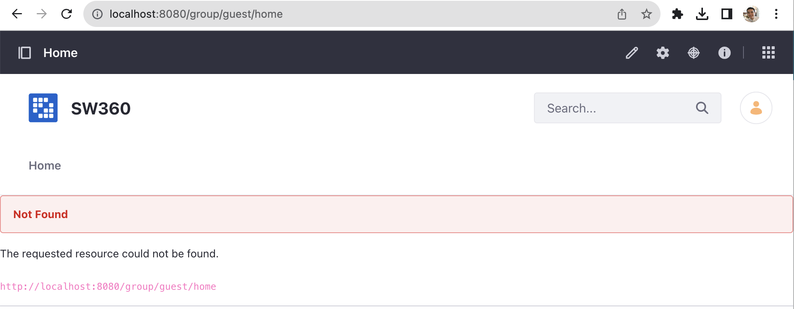
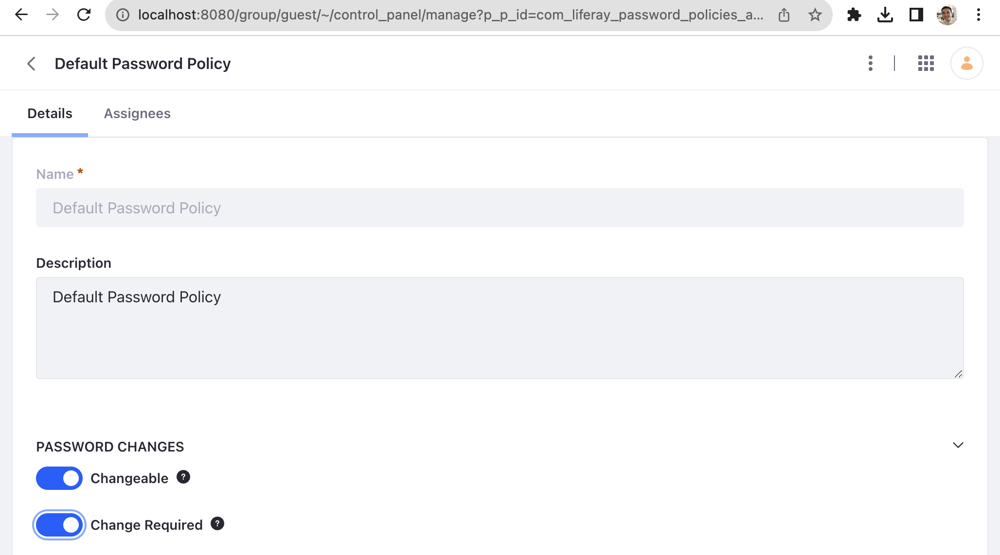

(Updated on August 29, 2023.)

오픈소스를 포함하는 제품을 개발하고 배포하는 기업이라면 각 제품과 릴리스 버전마다 사용한 오픈소스의 버전, 라이선스 등의 정보를 수집하고 추적해야 한다. 이를 통해 기업은 올바른 오픈소스 컴플라이언스 활동을 수행할 수 있다.

특히, NVD \(https://nvd.nist.gov/vuln\)에서 특정 오픈소스 버전에 보안 취약점이 보고 되었을때, 해당 버전을 사용하고 있는 제품이 무엇인지 추적을 할 수 없다면, 그 기업은 어느 제품에 보안 패치를 적용해야 할 지 알 수 없는 상황에 처하게 되고, 그 기업의 제품들은 보안취약점에 그대로 노출이 될 수 밖에 없다.

이렇듯, 오픈소스 정보를 추적하는 활동은 꼭 필요하다. 기업들은 이를 위해 자체 시스템을 구축하거나, 상용 서비스를 구매하여 사용하기도 한다. SW360은 Eclipse 재단에서 후원하는 오픈소스로서 소프트웨어 BOM에 대한 정보를 수집 및 추적하기 위한 웹 애플리케이션 및 저장소를 제공한다.


_<center>< https://www.eclipse.org/sw360/ ></center>_

## 주요 특징

SW360은 웹 기반의 UI를 제공하며 주요 기능은 다음과 같다.

* 제품에 사용된 컴포넌트 추적
* 보안 취약점 평가
* 라이선스 의무 관리
* 고지문 등 법적 문서 생성


## 설치

SW360은 다음과 같이 구성된다. 

* Frontend : Liferay-\(Tomcat-\)based portal application
* Backend : Tomcat-based thrift service
* Database : CouchDB

Project 구조와 설치를 위해 요구되는 소프트웨어 등 자세한 내용은 README의 Required software 부분에서 확인할 수 있다. : https://github.com/eclipse-sw360/sw360

SW360은 다음 두 가지의 설치 방법을 제공한다. 사용자는 이 중 하나를 선택하여 설치할 수 있다. 

1. Docker를 통해 Deploy 할 수 있다. : https://github.com/eclipse-sw360/sw360/blob/main/README_DOCKER.md 
2. SW360의 구성요소를 개별적으로 설치할 수 있다. : [https://github.com/eclipse/sw360](https://github.com/eclipse/sw360)
3. Vagrant \([https://www.vagrantup.com/](https://www.vagrantup.com/)\) 기반 설치 : Vagrant는 가상화 인스턴스를 관리하는 도구로서 sw360vagrant에서는 SW360을 한 번에 Deploy 하기 위한 환경을 제공한다. : [https://github.com/sw360/sw360vagrant](https://github.com/sw360/sw360vagrant)
   - Vagrant 기반 설치 가이드는 [여기](https://openchain-project.github.io/OpenChain-KWG/guide/nipa_openchain/appendix/3-tools/sw360/#%EC%84%A4%EC%B9%98)에서 확인할 수 있다. (단, 가이드 작성 시점과 현재 코드가 상이하여 정상동작하지 않을 가능성이 있습니다.)

이 가이드에서는 `Docker`로 Deploy하는 방법을 소개한다. 자세한 사항은 README를 참고한다. : https://github.com/eclipse-sw360/sw360/blob/main/README_DOCKER.md


### 1. 코드 다운로드

Docker Image 빌드를 위해 코드를 다운로드 한다. 테스트가 완료된 코드는 여기서 받을 수 있다. : https://github.com/haksungjang/sw360/tree/docker_build

```sh
git clone -b docker_build https://github.com/haksungjang/sw360.git
```

### 2. 빌드

먼저 [Docker](https://www.docker.com/)를 설치한다. (기업 개발자가 사용하려면 [유료 구매](https://www.docker.com/pricing/)가 필요할 수 있음에 주의하세요.)

아래와 같이 `docker_build.sh`를 실행하여 빌드한다. 

```sh
cd sw360
./docker_build.sh
```

정상적으로 빌드가 완료되면 아래와 같이 생성된 이미지를 확인할 수 있다. 

```sh
docker image ls

REPOSITORY                       TAG              IMAGE ID       CREATED          SIZE
eclipse-sw360/sw360              18-development   ab0fd848bf80   8 minutes ago    2.95GB
eclipse-sw360/sw360              latest           ab0fd848bf80   8 minutes ago    2.95GB
ghcr.io/eclipse-sw360/sw360      18-development   ab0fd848bf80   8 minutes ago    2.95GB
ghcr.io/eclipse-sw360/sw360      latest           ab0fd848bf80   8 minutes ago    2.95GB
eclipse-sw360/binaries           18-development   aa7debf0a1fc   8 minutes ago    347MB
eclipse-sw360/binaries           latest           aa7debf0a1fc   8 minutes ago    347MB
ghcr.io/eclipse-sw360/binaries   18-development   aa7debf0a1fc   8 minutes ago    347MB
ghcr.io/eclipse-sw360/binaries   latest           aa7debf0a1fc   8 minutes ago    347MB
eclipse-sw360/base               18-development   e5147733fc88   37 minutes ago   1.52GB
eclipse-sw360/base               latest           e5147733fc88   37 minutes ago   1.52GB
ghcr.io/eclipse-sw360/base       18-development   e5147733fc88   37 minutes ago   1.52GB
ghcr.io/eclipse-sw360/base       latest           e5147733fc88   37 minutes ago   1.52GB
ghcr.io/eclipse-sw360/thrift     0.18.1           0012d7998058   4 weeks ago      152MB
ghcr.io/eclipse-sw360/thrift     latest           0012d7998058   4 weeks ago      152MB
eclipse-sw360/thrift             0.18.1           0012d7998058   4 weeks ago      152MB
eclipse-sw360/thrift             latest           0012d7998058   4 weeks ago      152MB
```

### 3. 실행

`docker-compose up` 명령으로 생성된 이미지를 실행한다. 

```
docker-compose up
```

정상적으로 실행이 완료되면 아래와 같이 세개의 container가 실행된 것을 볼 수 있다. 

```
docker ps 

CONTAINER ID   IMAGE                 COMMAND                  CREATED         STATUS                   PORTS                                              NAMES
4299fd39010c   eclipse-sw360/sw360   "/app/entry_point.sh"    3 minutes ago   Up 3 minutes             0.0.0.0:8080->8080/tcp, 0.0.0.0:11311->11311/tcp   sw360
13fd5696b140   postgres:14           "docker-entrypoint.s…"   3 minutes ago   Up 3 minutes (healthy)   0.0.0.0:5438->5432/tcp                             sw360-postgresdb-1
7bb70f2daaf4   couchdb               "tini -- /docker-ent…"   3 minutes ago   Up 3 minutes (healthy)   4369/tcp, 9100/tcp, 0.0.0.0:5984->5984/tcp         sw360-couchdb-1
```

이 상태에서 `http://localhost:8080/`로 접근하면 다음과 같은 화면에 진입한다. 


## 설정

SW360을 정상적으로 설치한 후에는 아래의 절차대로 초기 설정이 필요하다. 자세한 내용은 여기에서 확인할 수 있다. : [SW360 Initial Setup Configuration](https://eclipse.dev/sw360/docs/deployment/legacy/deploy-liferay7.4/)

### 1. User, Login 설정

설정을 위해 다음 계정으로 로그인한다. 

* id : setup@sw360.org
* pw : sw360fossy

로그인을 하면 아래와 같이 Not Found라는 표시가 나타나게 된다. 



화면 우상단의 아이템 아이콘(큐브 모양)을 클릭하고 `Control Panel` 탭을 선택한다. 


`SECURITY` > `Password Policies` > `Default Password Policy` > `PASSWORD CHANGES` > `Change Requried`를 활성화한다. 



그리고, 다시 `Control Panel`탭에서 `CONFIGURATION` > `Instance Settings`을 선택한다. 그러면, `PLATFORM`메뉴를 볼 수 있다. 


거기서 `Users`를 선택한다. 그리고, `Default User Associations` 메뉴로 진입하고, `Apply to Existing Users`를 체크한다. 그리고 `Save`한다. 


이번에는 `Instance Settings` > `PLATFORM`에서 `User Authentication`를 선택한다. `General`로 진입하여 모든 항목을 Uncheck한다. (관리 목적상 필요한 항목은 Check하여 활성화할 수 있다.) 그리고 `Save`한다. 


끝으로, jquery와 font awesome을 활성화시켜야 한다. 이를 위해 `Control Panel` 탭에서 `CONFIGURATION` > `System Settings`으로 진입하면 `PLATFORM` 하위에 `Third Party`를 볼 수 있다. 


`Third Party`에 진입하여 `JQuery`와 `Font Awesome`을 각각 Enable시킨다. 


브라우저를 새로 실행하면 변경 사항이 적용된다. 

### 2. LAR 파일 import

SW360 설정을 위해서는 `*.lar` 파일들을 import해야 한다. 이를 설정하기 위해서는 메뉴로 진입해야 하는데, 메뉴 버튼은 화면 좌측 상단에 있다. 


메뉴에서 `Publishing` > `Import`에 진입한다.


우측의 `+` 버튼을 눌러 LAR 파일을 업로드 할 수 있는데, LAR 파일은 SW360 소스 파일 내 `frontend/configuration` 폴더 하위에 있다. (예: https://github.com/haksungjang/sw360/tree/docker_build/frontend/configuration)

먼저, `Public_Pages_7_4_3_18_GA18.lar` 파일을 업로드하고 `Continue` 버튼을 누른다. 


File Summary 화면에서 업로드된 LAR 파일 세부 내용을 볼 수 있다. 


제일 아래의 `AUTHORSHIP OF THE CONTENT`를 `Use the Current User as Author`로 변경하고 `Import` 버튼을 누른다. 


그러면 Import가 성공적으로 완료된 걸 볼 수 있다. 


이와 유사하게 `Private_Pages_7_4_3_18_GA18.lar` 파일을 Import한다. File Summary 화면에서 아래와 같이 `PAGES` > `Private Pages`로 변경한다. 


그리고, `PERMISSIONS`, `UPDATE DATA`, `AUTHORSHIP OF THE CONTENT` 항목을 각각 아래 이미지와 같이 선택하고, `Import`버튼을 눌러 Import를 수행한다. 


여기까지 수행을 마친 후 메뉴 상단의 `Home` 버튼을 누른다. 


그럼 아래와 같이 `Welcome to SW360!` 화면에 진입한다. 


`Start` 버튼을 눌러 SW360 첫 화면에 진입할 수 있다. (모든 항목이 비어있다.)


### 3. User Account 설정 (테스트용)

SW360 메뉴에서 `Admin` > `User`를 선택한다. 


화면 하단의 `UPLOAD USERS` 메뉴에서 테스트를 위한 User 리스트를 업로드 한다. (테스트를 위한 User 리스트는 여기에서 다운 받을 수 있다. : [test_users_with_passwords_12345.csv](https://github.com/haksungjang/sw360/blob/main/frontend/configuration/test_users_with_passwords_12345.csv) )


그러면 다음과 같이 9개의 User 리스트가 업로드 된 것을 볼 수 있다. 


여기서 보이는 User 리스트 중 하나인 `user@@sw360.org` 계정으로 다시 로그인을 시도한다. Password는 `12345`이다. 


## Basic Workflow

### 1. License 등록

SW360을 처음 설치하면 먼저 자주 사용하는 오픈소스 라이선스 들을 등록해야 한다. 라이선스 다음과 같은 정보를 포함한다. 

* Full Name
* Short Name
* License Type
* GPL-2.0 Compatibility \(예: yes, no\)
* License Text

메뉴 &gt; Licenses &gt; Add License를 선택하면 다음과 같이 Create License 화면으로 진입한다. 


이와 같이 라이선스를 하나씩 수동으로 등록하는 일은 상당히 수고스러울 수 있는데, 다행히 SW360은 SPDX License List를 한 번에 Import 하는 기능을 제공한다. 메뉴 &gt; Admin &lt; Import SPDX Information을 클릭한다.  


그러면, 곧 SPDX License List가 자동으로 등록됩니다. 메뉴 &gt; Licenses에서 338개의 License가 등록된 것을 확인할 수 있다. 


### 2. Component 및 Release 등록

SW360에서 Component는 하나의 소프트웨어 단위이다. 여기에는 다양한 형태의 소프트웨어가 해당할 수 있으며, 그 예는 다음과 같다. 

* 오픈소스 소프트웨어
* 라이브러리
* 3rd party 소프트웨어

Component는 다음과 같은 정보를 포함한다.  

* Component Name
* Main Licenses
* Categories \(예: Library, Cloud, Mobile, ...\)
* Component Type \(예: OSS, Internal, InnerSource, Service, Freeware\)
* Default Vendor
* Homepage URL

Release는 Component에서 하나의 Version을 가리키는 단위이다. 따라서 하나의 Component는 여러 개의 Release를 가질 수 있다. Release는 하나의 Component 하위에 생성되어 관리된다. 

Release는 다음과 같은 정보들을 포함한다. 

* Component Name
* Version
* License
* Download URL
* CPE ID \(예: cpe:2.3:a:apache:maven:3.0.4\)

예를 들어, zlib-1.2.8을 등록해야 한다면, 먼저 Component에 zlib을 먼저 등록한 후, Release에 zlib 1.2.8을 등록한다. Menu &gt; Components &gt; Add Component를 선택하면 Create Component 화면으로 진입하여 zlib에 대한 정보를 등록할 수 있다. 


Component를 생성하면, Components &gt; Releases &gt; Add Release에서 zlib-1.2.8 version에 대한 정보를 등록할 수 있다. 


하나의 zlib이라는 Component에 1.2.8과 1.2.11 version을 각각의 Release로 등록하였을 때, Release Overview 화면에서 다음과 같이 2개의 Release가 존재하는 것을 볼 수 있다. 


SW360은 다수의 Component 정보를 Import 시키기 위한 기능을 제공한다. 메뉴 &gt; Admin &gt; Import / Export에 CSV template에 등록을 원하는 Component 정보를 입력 후 Import 할 수 있다. 


단, 이 기능은 2020년 2월 기준 아직 안정적으로 동작하지 않을 수 있다.  

### 3. Project 생성

Project는 하나의 제품을 가리킨다. 사업 유형에 따라 제품일수도 있고, 서비스 혹은 소프트웨어 일수도 있다. Project에는 제품에 사용된 Component/Release를 등록하여 관리한다. 

Project 생성 시에는 다음과 같은 정보를 등록한다. 

* Project Name
* Version
* Project type \(예: Product, Customer Project, Service, Internal Project, InnerSource\)

메뉴 &gt; Projects &gt; Add Project를 통해 Project를 생성할 수 있다. 


Project를 생성하고 나면, 포함하는 Release나 하위 Project를 등록한다. 메뉴 &gt; Projects에서 해당 Project를 선택하면 “Linked Releases and Projects”에서 Linked Projects와 Linked Releases를 등록할 수 있다. 


다음은 SuperCalc라는 Project에 OpenSSL 1.0.1과 zlib 1.2.8을 Linked Releases로 등록한 이후의 화면이다. 


### 4. 보안 취약점 관리

SW360은 등록된 Release에 대해 보안 취약점이 있는지 자동으로 확인할 수 있다. 이를 위해 SW360은 CVE 정보를 주기적으로 수집하도록 스케쥴링하는 기능을 제공한다. 메뉴 &gt; Admin &gt; Schedule 에서 CVE SEARCH 정보를 24시간마다 수집하도록 스케쥴링을 설정할 수 있다. 


이렇게 스케쥴링을 설정하면 SW360은 정해진 시간에 CVE Search 사이트\([https://cve.circl.lu/](https://cve.circl.lu/)\)에서 CVE 정보를 수집한다. 수집한 CVE 정보는 메뉴 &gt; Vulnerabilities에서 확인할 수 있다. 


이렇게 Vulnerabilities 정보가 수집된 이후에는 생성한 Project에 보안 취약점이 있는지 조회할 수 있다. 위에서 생성한 SuperCalc Project에서는 85개의 보안 취약점이 보고된 것을 확인할 수 있다. 


이와 같은 방법으로 기업에서 개발/배포하는 소프트웨어를 SW360에 등록하여 관리한다면, 오픈소스 컴플라이언스뿐만 아니라 보안 취약점에 대해서도 리스크를 최소화할 수 있는 형태로 관리가 가능하다. 

또한 SW360은 위와 같은 Web Interface 뿐만 아니라 대부분의 기능을 REST API로 제공하여서 FOSSology 등의 다른 도구와의 연동이 가능하다. : [https://github.com/eclipse/sw360/wiki/Dev-REST-API](https://github.com/eclipse/sw360/wiki/Dev-REST-API)

즉, 소스 코드 스캐닝 도구의 분석 결과를 SW360에 Import 시키는 등의 방법으로 DevOps에 Integration 시켜서 Project, Release 등록을 자동화시켜서 관리한다면 효율성이 크게 증가될 것이다. 

