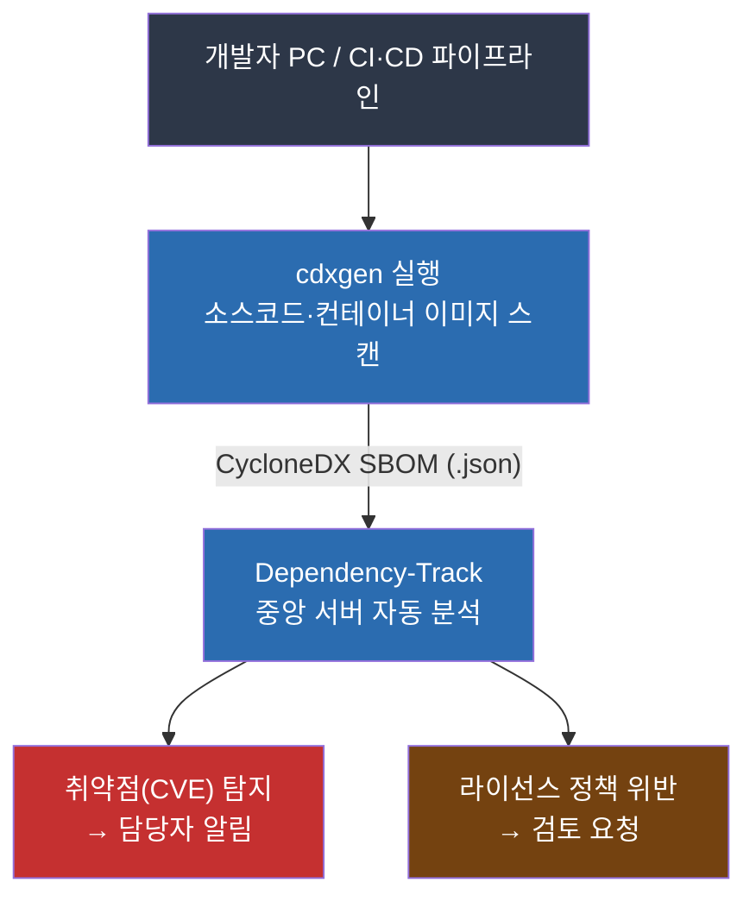
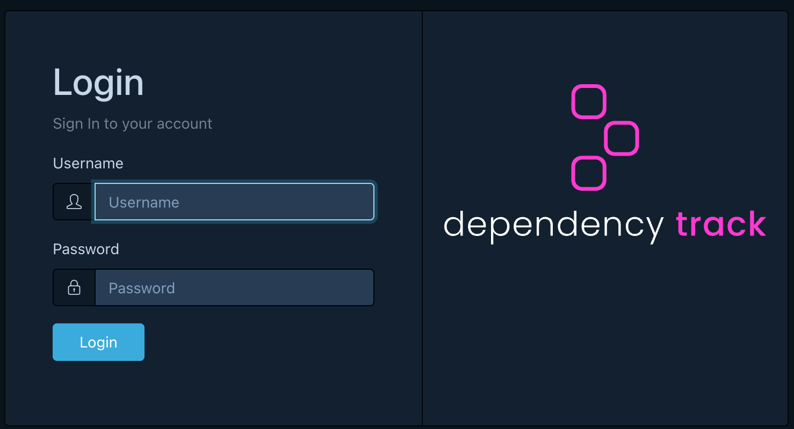
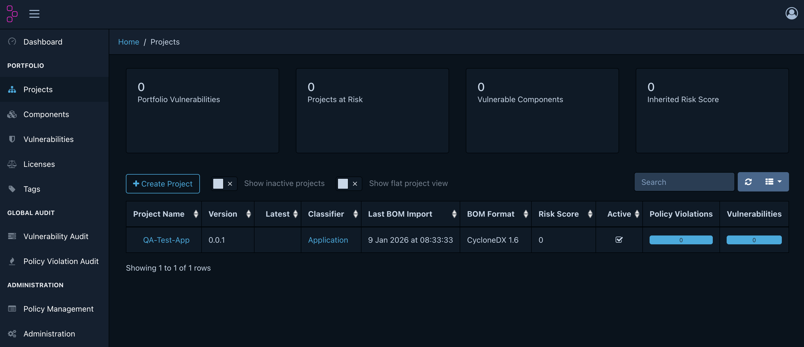
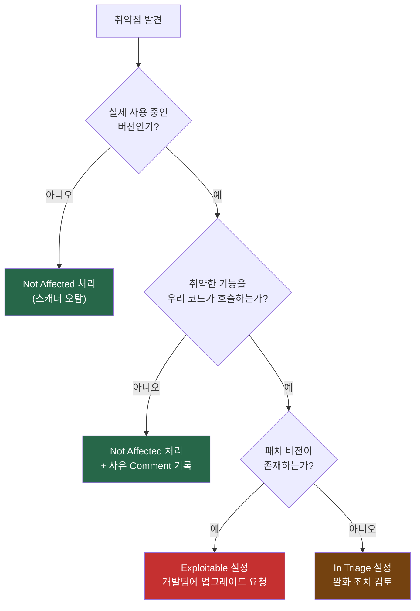

오픈소스 관리를 처음 시작하는 기업이 하루 안에 기본 자동화 환경을 갖출 수 있는
도구 조합으로 **cdxgen + Dependency-Track**을 권장합니다.

이 가이드는 설치·설정부터 라이선스·취약점 점검 환경 구성, 일상 운영까지
단계별로 안내합니다.

## 왜 cdxgen + Dependency-Track인가

오픈소스 관리의 핵심은 두 가지입니다.

1. **무엇이 들어있는지 파악** — SBOM(Software Bill of Materials) 생성
2. **위험 요소 지속 모니터링** — 취약점(CVE)·라이선스 정책 위반 탐지

cdxgen은 1번을, Dependency-Track은 2번을 담당합니다.
두 도구 모두 Apache-2.0 라이선스의 **무료 오픈소스**입니다.

### 전체 자동화 흐름



### 이 조합을 선택한 이유

| 기준 | 내용 |
|------|------|
| **비용** | 두 도구 모두 무료 오픈소스 (Apache-2.0) |
| **표준 준수** | CycloneDX 형식 — ISO/IEC 5230 및 NTIA SBOM 요건 충족 |
| **광범위한 언어 지원** | Java, Node.js, Python, Go, Rust 등 20개 이상 |
| **중앙 통합 관리** | 전사 프로젝트 취약점·라이선스 현황을 한 화면에서 파악 |
| **자동화 용이성** | REST API 기반 — CI/CD 파이프라인 연동 간단 |

> 다른 도구와의 비교: FOSSology, SW360 등도 강력한 도구이지만 초기 설정 복잡도가 높습니다.
> 이 가이드의 조합은 **하루 안에** 기본 환경을 갖출 수 있도록 최소화했습니다.
> 각 도구의 상세 기능은 [cdxgen 가이드](../5-cdxgen/)와
> [Dependency-Track 가이드](../7-dependency-track/)를 참고하세요.

## Dependency-Track 설치

### 사전 준비: Docker 환경

Dependency-Track은 Docker Compose로 실행합니다.
Docker가 없다면 [Rancher Desktop](https://rancherdesktop.io/)을 설치합니다 (macOS·Windows, 무료).
설치 후 터미널에서 아래 명령으로 정상 설치를 확인합니다.

```bash
docker --version
```

> **docker compose 명령어 호환성**: Docker Desktop·Rancher Desktop 환경에서는 `docker compose`(플러그인)를 사용합니다.
> macOS에서 Homebrew나 Colima로 Docker를 설치한 경우 `docker-compose`(하이픈)를 사용해야 할 수 있습니다.
> 이 가이드의 모든 `docker compose` 명령이 실패하면 `docker-compose`로 대체하세요.

### 설치 및 실행

홈 디렉토리에 전용 폴더를 만들고 공식 설정 파일을 받아 실행합니다.

```bash
# 1. 작업 폴더 생성 (홈 디렉토리 기준)
mkdir ~/dependency-track && cd ~/dependency-track

# 2. 공식 docker-compose.yml 다운로드
curl -LO https://dependencytrack.org/docker-compose.yml

# 3. 실행 (처음 실행 시 이미지 다운로드로 1~2분 소요)
docker compose up -d
```

API 서버는 포트 **8081**, 프론트엔드는 포트 **8080**에서 실행됩니다.

### 초기 로그인

브라우저에서 `http://localhost:8080` 접속합니다.



초기 계정 `admin` / `admin`으로 로그인합니다.
로그인 직후 비밀번호 변경 화면이 자동으로 표시됩니다. 즉시 새 비밀번호로 변경하세요.

> 브라우저에서 로그인이 정상적으로 되지 않는 경우, API 서버(8081 포트)가 완전히 기동될 때까지
> 추가로 1~2분 대기 후 재시도하세요.

### 서버 관리

```bash
# 시작 (PC 재부팅 후)
cd ~/dependency-track && docker compose up -d

# 중지
docker compose down

# 상태 확인
docker compose ps
```

> 초기 설치 후 NVD 등 취약점 데이터베이스 동기화에 **최소 24시간** 이상 소요됩니다.
> 서버 로그에 `Mirroring` 메시지가 출력되는 것은 정상입니다.
> 동기화 완료 전에는 취약점이 탐지되지 않을 수 있습니다.

## Vulnerability Sources 최소 권장 설정

기본값으로 다수의 취약점 소스가 활성화되어 있습니다. 처음부터 모두 켜면
중복 알림이 과도하게 발생하여 관리 부담이 커집니다.

**권장: NVD + GitHub Advisories만 활성화**

`Administration` → `Vulnerability Sources`에서 아래 표를 참고하여 설정합니다.

| 소스 | 권장 설정 | 이유 |
|------|----------|------|
| **NVD** | 활성화 | CVE 기반 표준 DB. CVSS 점수 포함. 필수 |
| **GitHub Advisories** | 활성화 | npm·Python·Go·Ruby 생태계 패키지 보안 권고. NVD와 보완적 |
| Google OSV | 초기 비활성화 | NVD·GitHub와 중복이 많아 알림 폭증 원인. 운영 안정 후 필요 시 추가 |
| OSS Index | 초기 비활성화 | 계정 등록 필요. 중복 커버리지 |
| VulnDB | 비활성화 | 유료 서비스 |

> **운영 팁**: 6개월 이상 운영 후 탐지 누락이 있다고 판단되면 OSV를 추가 활성화하세요.
> 처음부터 전부 켜는 것보다 점진적으로 확장하는 방식을 권장합니다.

## 라이선스 정책 설정

Dependency-Track의 정책 엔진(Policy Engine)을 사용하면
라이선스 위반을 자동으로 탐지할 수 있습니다.

좌측 메뉴 → `Policy Management` → 화면 우측 상단 `Create Policy` 클릭

### 정책 1: Copyleft 라이선스 경고

독점 소프트웨어에 Copyleft 라이선스 컴포넌트가 포함되면
소스 공개 의무가 발생할 수 있습니다. 검토 트리거를 위한 경고로 설정합니다.

**정책 기본 설정**:

| 항목 | 설정값 |
|------|--------|
| Policy Name | `Copyleft License Warning` |
| Policy Operator | `ANY` (조건 중 하나라도 일치하면 발동) |
| Violation State | `WARN` |

`Create` 버튼으로 정책 저장 후, 생성된 정책을 클릭하여 상세 화면으로 진입합니다.
**Conditions** 섹션에서 `+ Add Condition`을 클릭하여 라이선스마다 조건을 하나씩 추가합니다.

| Condition Subject | Condition Operator | Condition Value |
|-------------------|--------------------|-----------------|
| License | `IS` | `GPL-2.0-only` |
| License | `IS` | `GPL-3.0-only` |
| License | `IS` | `AGPL-3.0-only` |
| License | `IS` | `LGPL-2.1-only` |
| License | `IS` | `LGPL-3.0-only` |

`WARN`으로 설정하면 빌드가 중단되지 않고 검토 요청 알림만 발송됩니다.

### 정책 2: 상업적 사용 제한 라이선스 차단

상업적 사용 자체를 제한하는 라이선스는 처음부터 사용을 막아야 합니다.
같은 방법으로 두 번째 정책을 생성합니다.

| 항목 | 설정값 |
|------|--------|
| Policy Name | `Restricted License Block` |
| Policy Operator | `ANY` |
| Violation State | `FAIL` |

| Condition Subject | Condition Operator | Condition Value |
|-------------------|--------------------|-----------------|
| License | `IS` | `BUSL-1.1` |
| License | `IS` | `SSPL-1.0` |

`FAIL`로 설정하면 해당 컴포넌트를 포함한 프로젝트에 위반 표시가 나타납니다.

> **정책 적용 범위**: 정책 생성 후 Projects 탭에서 특정 프로젝트에 적용하거나,
> Portfolio 전체에 적용할 수 있습니다.

## cdxgen SBOM 생성 및 자동 업로드

### API Key 발급

자동화 스크립트가 Dependency-Track에 SBOM을 업로드하려면 API Key가 필요합니다.

`Administration` → `Access Management` → `Teams`


1. `+ Create Team` 클릭 → 팀 이름 `Automation Agents` 입력 후 `Create`
2. 생성된 팀을 클릭하여 상세 화면 진입
3. **Permissions** 섹션에서 아래 두 항목 체크:
   - `BOM_UPLOAD` (SBOM 업로드 권한)
   - `PROJECT_CREATION_UPLOAD` (프로젝트 자동 생성 권한)
4. **API Keys** 섹션 → `+ Create API Key` 클릭


생성된 키(`odt_publicId_...` 형식)를 복사하여 안전한 곳에 보관합니다.
키는 생성 직후에만 전체 값을 확인할 수 있습니다.

### cdxgen 설치

```bash
npm install -g @cyclonedx/cdxgen
```

Node.js가 없는 환경에서는 Docker 이미지를 사용할 수 있습니다.
자세한 설치 방법은 [cdxgen 가이드](../5-cdxgen/)를 참고하세요.

### SBOM 생성 및 업로드 스크립트

아래 스크립트를 `scan-upload.sh`로 저장하면 SBOM 생성과 업로드를 한 번에 처리합니다.

> **버전 호환성**: cdxgen 최신 버전(v12+)은 CycloneDX 1.7 형식을 기본 생성하지만,
> Dependency-Track v4.14 기준 CycloneDX 1.6까지 지원합니다.
> `--spec-version 1.6` 옵션을 반드시 지정하세요.

```bash
#!/bin/bash
# 사용법: ./scan-upload.sh <프로젝트명> <버전>
# 예시:   ./scan-upload.sh "my-app" "1.0.0"

PROJECT_NAME="${1:?프로젝트명을 입력하세요}"
PROJECT_VERSION="${2:?버전을 입력하세요}"
DT_URL="http://localhost:8081"
API_KEY="${DT_API_KEY:?환경변수 DT_API_KEY를 설정하세요}"

# SBOM 생성
echo "[1/2] SBOM 생성 중..."
cdxgen -r --spec-version 1.6 -o sbom.json .

if [ ! -s sbom.json ]; then
  echo "SBOM 생성 실패: package.json, pom.xml 등 의존성 파일이 있는지 확인하세요."
  exit 1
fi

# Dependency-Track 업로드
echo "[2/2] Dependency-Track 업로드 중..."
RESPONSE=$(curl -s -X POST "${DT_URL}/api/v1/bom" \
  -H "X-Api-Key: ${API_KEY}" \
  -F "autoCreate=true" \
  -F "projectName=${PROJECT_NAME}" \
  -F "projectVersion=${PROJECT_VERSION}" \
  -F "bom=@sbom.json")

if echo "${RESPONSE}" | grep -q '"token"'; then
  echo "업로드 완료: http://localhost:8080 에서 결과를 확인하세요."
else
  echo "업로드 실패: ${RESPONSE}"
  exit 1
fi
```

```bash
# 실행 방법
export DT_API_KEY="발급받은_API_KEY"
chmod +x scan-upload.sh
./scan-upload.sh "my-app" "1.0.0"
```

업로드 후 Dependency-Track에서 프로젝트가 자동 생성된 것을 확인합니다.



## 결과 확인 및 일상 운영

### 대시보드 개요

`http://localhost:8080` → **Dashboard**


| 항목 | 내용 |
|------|------|
| **Portfolio Vulnerabilities** | 전사 프로젝트의 취약점 심각도별 현황 |
| **Projects at Risk** | 위험도가 높은 프로젝트 목록 |
| **Policy Violations** | 라이선스 정책 위반 현황 |

### 취약점 Triage 기준

`Projects` → 프로젝트 선택 → `Audit Vulnerabilities` 탭

무조건 모든 Critical 취약점을 긴급 처리할 필요는 없습니다.
아래 3단계로 판단합니다.



### 라이선스 정책 위반 대응

좌측 메뉴 → `Policy Violation Audit`에서 전사 위반 항목을 확인합니다.

- **WARN (경고)**: 개발팀과 라이선스 사용 여부 협의 후 문제없으면 `Approved` 처리
- **FAIL (차단)**: 해당 컴포넌트를 허용 라이선스 버전으로 교체 요청

### 일상 점검 체크리스트

| 주기 | 점검 항목 |
|------|----------|
| **매일** | Dashboard에서 신규 Critical 취약점 발생 여부 확인 |
| **매주** | `Not Set` 상태 취약점을 `Exploitable` 또는 `Not Affected`로 분류 |
| **매월** | 팀별 Risk Score 변화 추이 검토 (점수 감소 추세가 정상) |
