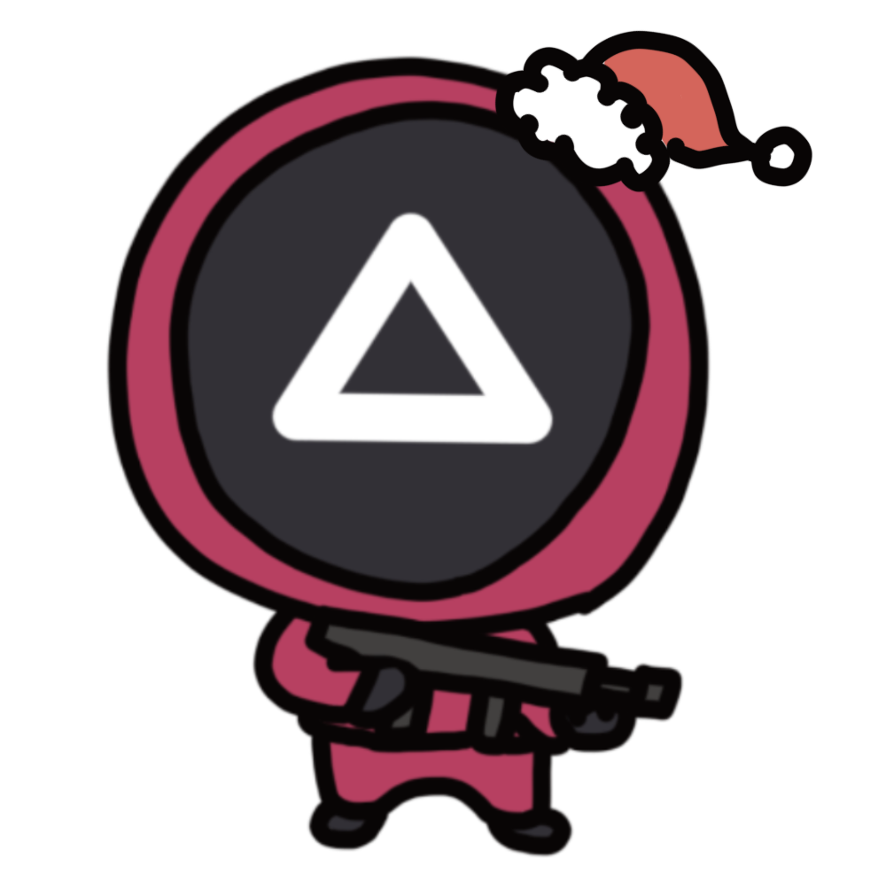
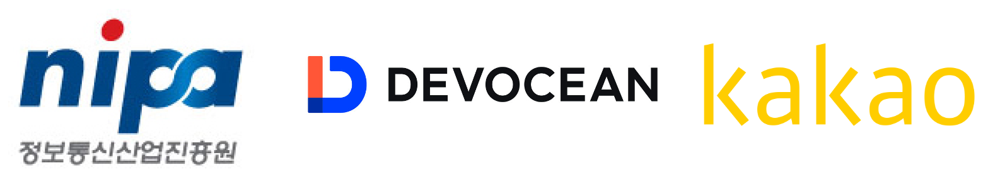

  

## 일정

* 일정: 2021-12-20 (월) 오후2시~
* 장소
  - [Gather Town](https://www.gather.town/) (접속 방법은 별도 메일 공지 참고)

## Agenda
| No | Agenda           | Speaker | Slide |
|----|-----------------|------|------|
| 1  | OpenChain Update  | 	Shane Coughlan, Linux Foundation | - |
| 2  | OpenChain KWG Update | 장학성, SK텔레콤 | [pdf](./OpenChain_Korea_update_20211220.pdf) |
| 3  | 중국 GPL 소송 사례 | 장학성, SK텔레콤 | [pdf](./virtualapp_case_20211220.pdf) | 
| 4  | 최근 소송 사례 : Stockfish v. ChessBase, SFC v. Vizio| 박원재, LG전자 | [pdf](./stockfish_n_sfc_case_211220.pdf) | 
| 5  | Shift-left and Automate Compliance Checks | Arlo (하헌관), 카카오뱅크 | [pdf](./Shift-Left_and_Automate_Compliance_Checks.pdf) | 
| 6  | 소그룹 모임 (Case Study) | All | - |
| 7  | 오징어게임 | All | - |
| 8  | 오픈소스 보안취약점 공격 유형 | Robin (황민호), 카카오 | [pdf](./OpenSourceVulnerability_20211220.pdf) |

## 소그룹 모임 주제
1. (개인, 회사) 올 한해 어땠는지? 내년 계획이 있다면?
2. KWG에 바라는 점이 있다면 (한분이 취합하여 공유)

## Video

### OpenChain Update 

<iframe width="560" height="315" src="https://www.youtube.com/embed/RA8rnLFmSvE" title="YouTube video player" frameborder="0" allow="accelerometer; autoplay; clipboard-write; encrypted-media; gyroscope; picture-in-picture" allowfullscreen></iframe>

### OpenChain KWG Update

<iframe width="560" height="315" src="https://www.youtube.com/embed/f1JbeIb-stA" title="YouTube video player" frameborder="0" allow="accelerometer; autoplay; clipboard-write; encrypted-media; gyroscope; picture-in-picture" allowfullscreen></iframe>

### 중국 GPL 소송 사례 

<iframe width="560" height="315" src="https://www.youtube.com/embed/teAla8RjniQ" title="YouTube video player" frameborder="0" allow="accelerometer; autoplay; clipboard-write; encrypted-media; gyroscope; picture-in-picture" allowfullscreen></iframe>

### 최근 소송 사례 : Stockfish v. ChessBase, SFC v. Vizio

<iframe width="560" height="315" src="https://www.youtube.com/embed/5M6VLarc2N0" title="YouTube video player" frameborder="0" allow="accelerometer; autoplay; clipboard-write; encrypted-media; gyroscope; picture-in-picture" allowfullscreen></iframe>

### Shift-left and Automate Compliance Checks

<iframe width="560" height="315" src="https://www.youtube.com/embed/z3S_PuqLXVs" title="YouTube video player" frameborder="0" allow="accelerometer; autoplay; clipboard-write; encrypted-media; gyroscope; picture-in-picture" allowfullscreen></iframe>

### 오픈소스 보안취약점 공격 유형

<iframe width="560" height="315" src="https://www.youtube.com/embed/N7ELgngaTFs" title="YouTube video player" frameborder="0" allow="accelerometer; autoplay; clipboard-write; encrypted-media; gyroscope; picture-in-picture" allowfullscreen></iframe>

## Minutes
### OpenChain Update (Shane Coughlan / Linux Foundation)
1. OpenSource License Compliance Management Training course 개설
   * 무료로 이용 가능하며, Certification도 획득 가능
2. 첫번째 Playbook 발간
   * 중소 규모의 기업에서 어떻게 OpenChain을 도입할 수 있는지 가이드
 
> 위 두 자료는 [https://www.openchainproject.org/]에서 확인할 수 있음

### 중국 GPL 소송 사례 (장학성 / SK Telecom)
1.	VirtualApp 소송 사례
   * 원고: Jining Luohe Network Technology Co., Ltd (VirtualApp 저작권자) 
   * 피고: 세 곳의 회사
      * Fujian Fengling Chuangjing Technology Co., Ltd. (Dim Sum Desktop 저작권 소유자)
      * Beijing Fengling Chuangjing Technology Co., Ltd. (1번 회사의 모회사이며, Dim Sum Desktop 개발사)
      * Shenzhen Tencent Computer System Co., Ltd. (Dim Sum Desktop을 운영하기 위한 서비스인 Application Bao 운영)
2. VitualApp이란?
   * VirtualApp은 가상 Android 환경을 제공하는 소프트웨어이며, GPL 3.0이 적용됨 
   * 그러나 2017년 1월 24일에 "당신은 이 프로젝트를 무료로 사용할 수 있는 권한이 없다" 라는 안내가 추가됨
   * 2017년 8월에 VirtualApp을 설립하고 상용 비즈니스 시작 
   * 2017년 10월에 오픈소스 라이선스 제거
3. Dim Sum Desktop
   * VirtualApp과 마찬가지로 가상 Android 환경을 제공하는 소프트웨어
   * Dim Sum Desktop은 GitHub에 공개된 VirtualApp의 2018년 8월 16일자 버전을 받아서 개발됨 (GPL 3.0이 적용된 버전이지만, 상업적 사용을 금지한다는 문구도 포함되어 있음)
4. 소송 제기
   * 원고는 소프트웨어 저작권 침해를 중단할 것을 요구하였음 (즉, Dim Sum Desktop 소프트웨어의 다운로드, 설치, 운영 중단 요구)
   * 경제적 손실 배상과 합리 비용을 배상할 것을 요구
5. 법원 판결
   * 중국은 영문을 기반으로 한 오픈소스 라이선스의 법적 효력을 인정하고, 라이선스 위반을 저작권 침해로 판결
 
> 상세한 내용은 [링크](https://openchain-project.github.io/OpenChain-KWG/blog/2021/20211115-virtualapp_gpl/)에서 확인할 수 있음

### 최근 소송 사례: Stockfish vs ChessBase, SFC vs Vizio (박원재 / LG전자)
1. Stockfish vs ChessBase
   * 원고: Stockfish 개발자들
   * 피고: ChessBase GmbH
   * 사건
     * Stockfish는 Glaurung Engine을 기반으로 개발되었으며, GPL 3.0이 적용됨
     * ChessBase에서 판매하는 Fat Fritz는 Neural Network 기술이 사용되었고, Fat Fritz 2에서는 Stockfish 가 사용됨
     * ChessBase는 Fat Fritz 2 SE를 판매하고 Source code 공개하고 있으나, Neural Network의 weight를 공개하지 않아 논란이 됨
   * 쟁점
     * Weight 값이 파생 저작물 범주에 포함되는가? 코드와 데이터의 경계이므로 애매하고, 법원 판결을 기다려야 함
     * Licensor가 License의 GPL 3.0을 일방적으로 종료할 수 있는가? Weight가 파생저작물 범주에 포함되지 않는다고 판단하면 현 시점에는 ChessBase가 위반한 것으로 판단
2. SFC vs Vizio
   * 원고: SFC (오픈소스 프로젝트에 법률 서비스를 제공하기 위한 회사
   * 피고: Vizio (전자기기 제조 회사)
   * 사건
     * Vizio는 SmartCast 라는 자체 OS를 바탕으로 TV 제조/판매
     * SFC에 Vizio가 리눅스 기반으로 만들었으나 GPL, LGPL 소스코드의 제공 또는 Written Offer 제공에 대한 의무사항을 이행하지 않는다는 제보를 받음
     * 알고 보니, 2018년~2020년에 여러 차례에 걸처 소스코드를 제공했으나 컴파일 가능한 형태가 아니였고, 지속적인 보완을 요구함
     * 2020년 1월 이후부터는 커뮤니케이션이 단절됨
     * 2021년 10월에 SFC에서 소송 제기
   * 쟁점
     * 보통은 비영리 단체가 오픈소스 저작권자를 대신하여 소송을 제기하는데, 이번 건은 소비자가 고소를 한 것이므로 주목을 받게 됨

### Shift-left and Automate Compliance Checks (Arlo(하헌관) / 카카오뱅크)
1. Shift-left 테스트가 무엇인가?
   * 요구사항, 설계, 테스트, 배포까지의 개발 라이프사이클에서 품질에 대한 검증을 초기 단계부터 집중하자라는 것
   * 릴리즈 단계로 갈수록 리스크 대응 비용이 커지기 때문
2. FossID를 통한 자동화 구성 
   * Rest API 문서들이 잘 작성되어 있어서 자동화 구현에 용이하였음
   * 전반적인 구성
       1. Gitlab 에서 코드 다운로드
       2. FOSSID API 통해 스캔, 결과 취득, 보고서 생성
       3. Jenkins 통해 칸반에 이슈 등록 (FossID 스캔 링크와 html 리포트 첨부)
3. 추후 Plan
   * DevSecOps 구축
     * 개발과 보안을 함께 챙길 수 있도록 프로세스 운영
4. Q&A 세션
   1. 어느 시점에 검증 리포트 요청을 하는게 좋은가? 
      * (SKT) 첫 빌드가 되면
      * (LG전자) 형상관리 생서되면
      * (카카오뱅크) 개발자가 커밋을 하는 시점
      * (LINE) 기업의 개발문화에 따라 정하는게 좋을 것
      * (현대모비스) 개발하면서 부분적인 코드를 fossID 통해서 검증해보는 기능도 있다고 함
      * (카카오) IdE 플러그인 설치하고 코드 작성 전에 체크하는 추세가 많은 듯
   2. 카카오에서 개발한 OLIVE를 사용하지 않는 이유는?
      * (카카오) 웹 서비스로만 제공하고 있어서 카카오 뱅크와 같은 금융권에서는 보안상 사용이 어려움. CLI를 준비하고 있음.
	
###	사례로 보는 오픈소스 보안 취약점 공격 유형 (Robin(황민호) / Kakao)
1. Log4shell
   * JNDI를 통한 원격 코드 실행이 가능했음
   * 2.15.0 버전이 배포된 후에도 DDoS 공격 취약점이 발견되어 패치 버전이 계속 배포되고 있음
    > CVE란 공개적으로 알려진 컴퓨터 보안 결함 목록  
    > CVE - 4자리 연동 – 순차 식별자로 구성됨  
    > NVD 사이트에서 별도 데이터베이스로 관리되고 있음
2. Dependency Confusion
   * Dependency Hijacking
     * 패키지 매니저가 비공개 저장소에서 서드 파티 패키지를 끌어오는 기본 방식에서 발견된 결함  
     * Private repository에서 가져와야 하는데, 악성 코드가 심어진 public repository에서 설치하게 만듬
     * MS 백서의 가이드
       1. 여러 개가 아닌 하나의 private feed를 참조
       2. 제어된 범위를 명시적으로 지정하여 패키지 보호
       3. Client 측에서 검증 기능을 활용
   * Typosquatting 
     * 오픈소스를 검색할 때 단순한 오타를 유도하는 공격 방식
     * 주로 Pypi, NPM, Ruby gem 에서 발견
     * 예시) Jellyfish > jeIlyfish, Lodash > lodahs
   * Malware
     * 오픈소스에 악성 소프트웨어를 포함하여 배포
     * 예시
       * Event stream : 꽤 인기있던 npm 라이브러리의 하위 종속성인 flatmap-stream 에 비트코인 지갑을 훔치는 멀웨어가 포함되어 배포됨
       * Rest-client : 1.6.13에 특정 사이트에서 원격 코드를 가져오고 외부 서버로 보내도록 악성 코드를 포함시킴
       * Octopus scanner : netbean 저장소를 감염시켜 jar 바이너리, 프로젝트 파일 및 종속성 내 악성 페이로드를 배포, 감염된 저장소가 개발 환경에 복제 또는 fork 될 경우 악성코드에 감염됨
   * Stealing administrator privileges
     * 비밀번호 유출이나 무차별 대입시도로 인해 오픈소스 관리자의 계정을 탈취하여 악성코드가 포함된 오픈소스가 배포되는 케이스
     * 예시
       * Bootstrap-sass : bootstrap의 saas 버전에 악성코드가 심어져서 쿠키 파일을 로드하고 내용을 실행 시킴
       * Ua-parser-js : 클린 버전을 패치 버전으로 설치할 때 활성화되는 악성코드를 포함시킴, 암호화폐 채굴 소프트웨어를 다운로드하고 실행시키는 코드
   * Next-gen attack
     * Software supply chain 이나 IDE 플러그인 등을 대상으로 하는 차세대 공격
     * 예시
       * Codecov : 도커 이미지 생성할 때 프로세스의 버그를 악용하여 자격 증명을 취득, CDN 버킷에 access 하여 bash 스크립트를 악의적으로 변경
       * Vs-extension : visual studio 확장 프로그램을 통해 공격자는 RSA 키 등 중요한 정보를 훔쳐 VCS에 접근하거나 Production 서버에 연결하여 시스템을 손상시킴
2. 보안취약점을 피하는 실무 팁 4가지
   1. 내 소프트웨어가 어떤 구성으로 되어 있는지 파악하기
   2. 종속성 문제 해결
   3. 코드 스캔 자동화를 통해 알려지지 않은 불확실한 요소를 찾기
   4. 라이선싱 위험에 주의하기
   5. 구글에서도 프레임워크를 제안하고 있음
      * 구글과 OSSF에서 오픈소스 위험 점수를 생성하는 자동화 도구인 SCORECARD V2 출시함

## Photo Gallery

## 후원

