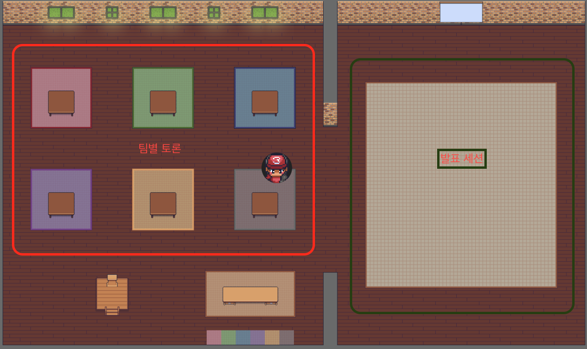

  

## 일정

* 일정: 2021-12-20 (월) 오후2시~
* 장소
  - [Gather Town](https://www.gather.town/) (접속 방법은 별도 메일 공지 참고)

[Game Zone]

  

 
[Meeting Zone]

  

## Agenda
| No | Agenda           | Speaker | Slide |
|----|-----------------|------|------|
| 1  | OpenChain Update  | 	Shane Coughlan, Linux Foundation | - |
| 2  | OpenChain KWG Update | 장학성, SK텔레콤 | [pdf](./OpenChain_Korea_update_20211220.pdf) |
| 3  | 최근 소송 사례| 장학성, SK텔레콤 & 박원재, LG전자 | [pdf](./virtualapp_case_20211220.pdf) | 
| 4  | Shift-left and Automate Compliance Checks | Arlo (하헌관), 카카오뱅크 | - | 
| 5  | 소그룹 모임 (Case Study) | All | - |
| 6  | 오징어게임 | All | - |
| Bonus  | 오픈소스 보안취약점 공격 유형 | Robin (황민호), 카카오 | [pdf](./OpenSourceVulnerability_20211220.pdf) |

## 소그룹 모임 주제
1. (개인, 회사) 올 한해 어땠는지? 내년 계획이 있다면?
2. KWG에 바라는 점이 있다면 (한분이 취합하여 공유)

## Attendees

## Video

## Minutes

## Photo Gallery

## 후원

