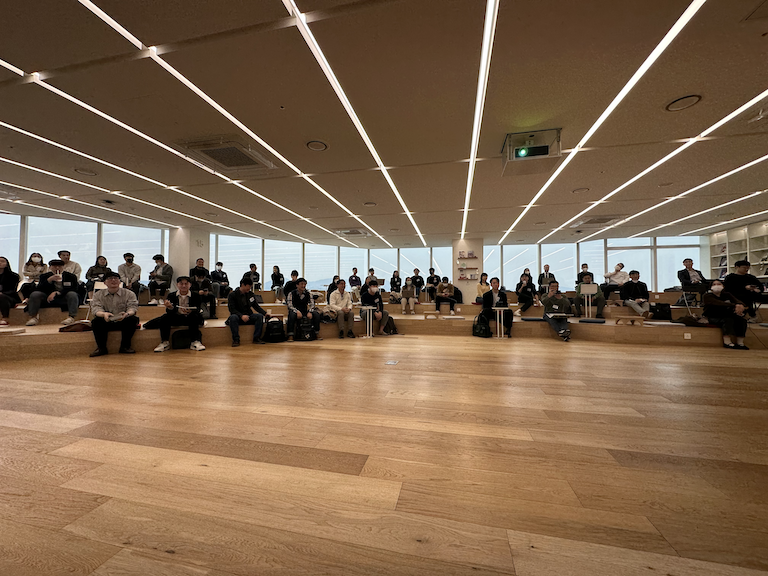
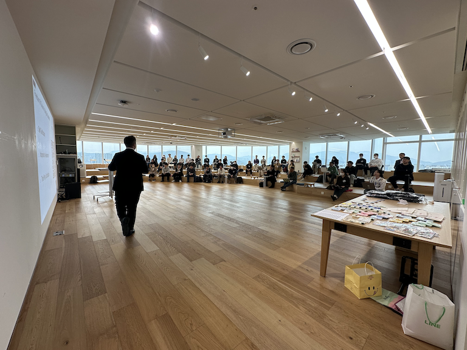

## 일정

* 일정: 2023-03-28 (화) 오후2시~4시
* 장소: 라인플러스 (경기도 성남시 분당구 서현1동)

## Agenda

### 1부 발표 세션
| No | Agenda           | Speaker | Slide |
|----|-----------------|------|------|
| 0  | Welcome & OpenChain KWG Update | 라인플러스 이서연 | [pdf](./OpenChain_Korea_update_20230328.pdf) |
| 1  | OpenChain Global Update  | 	Shane Coughlan, Linux Foundation | [pdf](./global-updates-public.pdf) |
| 2  | OpenChain 보안 규격 소개 | SK텔레콤 장학성 | [pdf](./OpenChain%EB%B3%B4%EC%95%88%EB%B3%B4%EC%A6%9D%EA%B7%9C%EA%B2%A9%EC%86%8C%EA%B0%9C_20230328_%EC%9E%A5%ED%95%99%EC%84%B1.pdf)
| 3  | Legal Issues of AI Technologies  / Case Study: Getty Images v. Stability AI | ETRI 박정숙 | [pdf](./OpenChain-KWG_2023%EB%85%843%EC%9B%94_ETRI_%EB%B0%95%EC%A0%95%EC%88%99.pdf)|
| 4  | 네트워킹 시간 | all | - |

### 2부 Mini Summit - "오픈소스 관리 자동화 도구"
| No | Agenda           | Speaker | Slide |
|----|-----------------|------|------|
| 5  | 도구 별 의존성 분석 방식 | 카카오 Rain(임현지) | [pdf](./%EB%8F%84%EA%B5%AC%EB%B3%84_%EC%9D%98%EC%A1%B4%EC%84%B1_%EB%B6%84%EC%84%9D_%EB%B0%A9%EC%8B%9D.pdf) |
| 6 | 소리소리 오소리 | LG전자 김소임 책임 | [pdf](./230328_History_of_OSORI_%EB%B0%9C%ED%91%9C%EC%9A%A9.pdf) |
| 7  | FOSSLight 슈퍼 대변신 | LG전자 김경애 | [pdf](./230328_FOSSLight_2023_%EB%A1%9C%EB%93%9C%EB%A7%B5_%EA%B3%B5%EC%9C%A0.pdf) |
| 8  | 요즘 OLIVE 써봤니? | 카카오 Violet(황은경) | [pdf](./Openchain_KWG_17th_OLIVE.pdf) |
| 9  | onot, 이제 제법 쓸만해졌어요! | 카카오 Rogers(한현민) | [pdf](./openchain_kwg_17th_onot.pdf) |

* 리뷰 : https://devocean.sk.com/opensource/techBoardDetail.do?ID=164691

## Sponsor

## Photo

  

 

  
  

 

  

 

  
  

 

  

 

  
  

 

  

 

  
  

 

  

