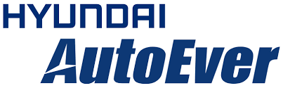

## 일정

* 일정: 2023-09-19 (화) 오후1시30분~5시
* 장소: 현대오토에버 (서울특별시 강남구 테헤란로 510)

## 아젠다

### 세션 0. Intro & Update

| Time | Agenda           | Speaker | Slide |
|----|-----------------|------|------|
| 13:30~13:40 | Welcome & Intro | 민석기/류창한, 현대오토에버 |  -  |
| 13:40~13:50 | OpenChain Global Update  | 	Shane Coughlan, Linux Foundation | - |
| 13:50~14:00 | OpenChain KWG Update   Legal subgroup 소개  | 장학성, SK텔레콤 / 이서연, 라인플러스   박정숙, ETRI | [slide](./OpenChain_Korea_update_20230919.pdf)   [slide](./LegalSubgroup소개자료-20230919-R1.pdf)  |

### 세션 1. 현대차그룹과 오픈소스

| Time | Agenda           | Speaker | Slide |
|----|-----------------|------|------|
| 14:00~14:10 | 현대차그룹 오픈소스 리스트 공개를 통한 중소/중견기업 지원 방안 | 류창한, 현대오토에버 | [slide](./현대차그룹_기술분야별_활용_오픈소스_리스트공개_F.pdf) |
| 14:10~14:40 | 현대차그룹 오픈소스 관리시스템 구축 사례  - 현대자동차  - 현대모비스  - 현대오토에버 |  이창우, 현대자동차 이영준, 현대모비스 이지현, 현대오토에버 |    [slide](./KWG현대차발표자료.pdf)   [slide](./모비스_KWG_발표자료.pdf)   [slide](./fosslight_적용사례_20230919_Autoever.pdf) |
| 14:40~15:00 | 네트워킹 | ALL |  -  |

### 세션 2. Best Practice

| Time | Agenda           | Speaker | Slide |
|----|-----------------|------|------|
| 15:00~15:20 | LG전자 제품 보안 관리 체계 기반 오픈소스 보안 보증 표준 준수 사례 소개 | 정재욱, LG전자 |  [slide](./LG전자제품보안관리체계기반_오픈소스보안보증표준준수사례%20소개_정재욱.pdf)  |
| 15:20~15:40 | 우당탕탕 LINE의 OpenChain 인증 여정 | 이서연/김동혁, 라인플러스 |  -  |
| 15:40~16:00 | 혼돈의 AI 오픈 소스 라이선스 | 최혜성, LG전자 |  [slide](./혼돈의AI오픈소스라이선스.pdf)  |
| 16:00~16:20 | 네트워킹 | ALL |  -  |

### 세션 3. 그룹 토의

| Time | Agenda           | Speaker | Slide |
|----|-----------------|------|------|
| 16:20~17:00 | 그룹 토의 | ALL (진행 : 이서연, 라인플러스) |  -  |

## Sponsor

 

 
 

## 참석 기업/기관

## Photo

