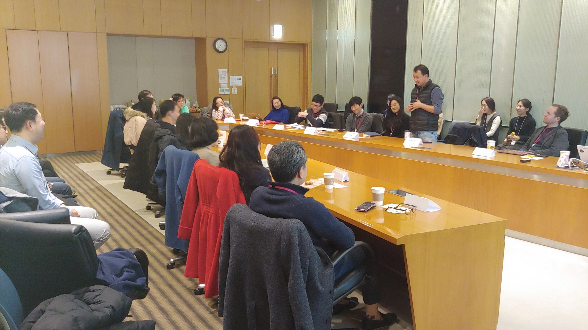

## Organizer

* LG Electronics

## Intro

* Purpose: Linux Foundation의 OpenChain Project 소개 및 한국 기업 참여와 활용을 위한 교류회
* Scheduled : 2019-01-23 (수) 오후2시 - 5시
* Place : LG Electronics Seocho R&D Campus
* Article : [openchain-workshop-in-korea-january-23rd-2019](https://www.openchainproject.org/news/2019/01/24/openchain-workshop-in-korea-january-23rd-2019)

## Agenda

| No | Agenda           | Speaker | Slide |
|----|-----------------|------|------|
| 1  | Keynote  | 	Haksung Jang / LGE | [Download](openchain_korea_workshop_intro_2019-01-23.pdf) |
| 2  | Great Open Source Compliance For Everyone | Shane Coughlan, Linux Foundation | - | 
| 3  | How do we OpenChain? | Haksung Jang / LGE | [Download](openchain_korea_workshop_how_do_we_openchain_2019-01-23.pdf) | 
| 4  | Introduce yourself & Workshop – OpenChain and Korea | Soim Kim / LGE | [Download](openchainkoreaworkshop_livepoll_result_2019-01-23.pdf) | 

## Attendees

* LG Electronics (12)
* SK telecom (1)
* Kakao (3)
* Hyundai Motors (4)
* Samsung Electronics (5)

## Photo Gallery

  
  

 

  

