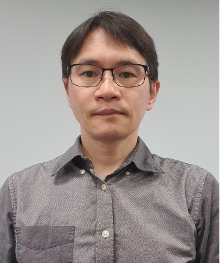

  
30th Meeting · 2026.06.09 (화)

  <h1 class="kwg-conf-hero__title">AI 거버넌스와 금융권 오픈소스 컴플라이언스</h1>
  
AI 시대의 오픈소스 거버넌스 실무와 금융권 감사 대응 체크포인트를 현업 사례로 공유합니다.

  

    <strong>일시</strong> 2026-06-09 (화) 14:00–17:00
    <strong>장소</strong> 카카오뱅크 · 여의도 파크원 타워2 35층
  

  
참가 신청은 OpenChain KWG 메일링리스트로 안내됩니다. 가입하시면 신청 링크를 받아보실 수 있습니다.

  

    <a class="kwg-conf-cta" href="../../../about/subscribe/">메일링리스트 가입</a>
    <a class="kwg-conf-cta kwg-conf-cta--ghost" href="https://map.naver.com/p/search/%ED%8C%8C%ED%81%AC%EC%9B%90%20%ED%83%80%EC%9B%8C2" target="_blank" rel="noopener">네이버지도</a>
    <a class="kwg-conf-cta kwg-conf-cta--ghost" href="https://map.kakao.com/link/search/%ED%8C%8C%ED%81%AC%EC%9B%90%20%ED%83%80%EC%9B%8C2" target="_blank" rel="noopener">카카오맵</a>
  

<ul class="kwg-conf-chips">
  <li class="kwg-conf-chip">OpenChain</li>
  <li class="kwg-conf-chip">AI Governance</li>
  <li class="kwg-conf-chip">금융권 Audit</li>
  <li class="kwg-conf-chip">OSS Compliance</li>
</ul>

## 이런 분께 추천

- 금융·규제 산업에서 오픈소스 컴플라이언스 정책을 운영하는 담당자
- AI 도입 이후 오픈소스 거버넌스 범위를 재정의해야 하는 조직
- 감사·점검 대응을 위한 체크리스트와 증적 관리가 필요한 팀

## 아젠다

  

    
14:00–14:10

    

    

      
Welcome &amp; Greetings

      
카카오뱅크 기술기획팀장 김종성

    

  

  

    
14:10–14:30

    

    

      
OpenChain Updates

      
운영진

    

  

  

    
14:30–14:55

    

    

      
Session 1. AI-driven Open Source Governance

      
하헌관 · 카카오뱅크

    

  

  

    
14:55–15:15

    

    

      
휴식 및 네트워킹

      
Coffee break

    

  

  

    
15:15–15:40

    

    

      
Session 2. Claude Mythos가 Open Source에 미치는 영향

      
김강보 · 안랩

    

  

  

    
15:40–16:05

    

    

      
Session 3. 금융회사로서의 오픈소스 관련 업무 대응 후기

      
이민애 · 카카오뱅크

    

  

  

    
16:05–16:50

    

    

      
그룹 토의

      
All Participants

    

  

  

    
16:50–17:00

    

    

      
마무리 및 단체 사진 촬영

      
운영진

    

  

## 발표자 소개

  

    
    
하헌관 매니저

    
카카오뱅크 · Session 1

    
카카오뱅크 오픈소스 거버넌스, DevSecOps, CMDB 운영

  

  

    
    
김강보 팀장

    
안랩 · Session 2

    
안랩 연구인프라팀에서 팀장으로 근무하며, CI/CD 인프라 구축을 비롯해 OSS(Open Source Software) 검증, 정적 분석, 개발 프로세스 정립, 배포 및 서명, 특허와 외부 과제 관리 등 R&D 전반의 개발 지원 환경을 설계·운영하고 있습니다. 특히 보안 제품을 구성하는 오픈소스의 컴플라이언스 준수와 보안 취약점 대응, 그리고 정적 분석을 중심으로 한 개발부터 배포까지 이어지는 CI/CD 체계 구축을 주요 업무로 담당하고 있습니다.

  

  

    
    
이민애 매니저

    
카카오뱅크 · Session 3

    
카카오뱅크 오픈소스 거버넌스, 사내 IT 업무 관련 정책 담당, 내외부감사 대응

  

## Sponsor

  이번 미팅 후원
  

