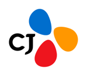

  

    
31st Meeting

    <h1 class="kwg-conf-hero__title">OpenChain KWG 31차 정기 모임</h1>
    
2026년 가을 정기 모임을 CJ와 함께 준비하고 있습니다. 지금은 함께 나눌 발표 주제를 모집하고 있습니다.

    

      <strong>일시</strong> 2026-09-08 (화) 14:00–17:00
      <strong>장소</strong> CJ인재원 · 서울 중구
    

    
참가 신청과 세부 프로그램은 OpenChain KWG 메일링리스트로 안내됩니다. 가입하시면 신청 링크를 받아보실 수 있습니다.

    

      <a class="kwg-conf-cta" href="../../../about/subscribe/">메일링리스트 가입</a>
      <a class="kwg-conf-cta kwg-conf-cta--ghost" href="https://map.naver.com/p/search/CJ%EC%9D%B8%EC%9E%AC%EC%9B%90" target="_blank" rel="noopener">네이버지도</a>
      <a class="kwg-conf-cta kwg-conf-cta--ghost" href="https://map.kakao.com/link/search/CJ%EC%9D%B8%EC%9E%AC%EC%9B%90" target="_blank" rel="noopener">카카오맵</a>
    

  

  

    08
    2026년 9월 · 화
  

<ul class="kwg-conf-chips">
  <li class="kwg-conf-chip">OpenChain</li>
  <li class="kwg-conf-chip">OSS Compliance</li>
  <li class="kwg-conf-chip">Korea Work Group</li>
</ul>

## 이런 분께 추천

- 기업에서 오픈소스 컴플라이언스 정책을 운영하거나 새로 도입하려는 담당자
- OpenChain(ISO 5230), SBOM, 보안 취약점 대응 실무를 고민하는 조직
- 다른 회사의 사례를 듣고 실무 네트워크를 넓히고 싶은 분

## 아젠다

세부 프로그램은 준비 중입니다. 확정되는 대로 이 페이지에 공개하고 메일링리스트로 안내드립니다.

  
발표 주제를 모집합니다

  
31차 모임에서 함께 나눌 주제를 기다립니다. 완성된 사례가 아니어도 좋습니다. 진행 중인 고민이 오히려 토의를 활발하게 만듭니다. 사내 사정으로 회사명을 밝히기 어려우면 익명이나 일반화된 형태로 발표하셔도 됩니다.

  <ul class="kwg-conf-callout__list">
    <li><strong>주제 발표</strong> 25분 내외, 질의응답 시간 별도</li>
    <li><strong>듣고 싶은 주제</strong> 직접 발표하지 않더라도 누군가 공유해 주기를 바라는 주제</li>
    <li><strong>라이트닝 토크</strong> 5분에서 10분 정도로 가볍게 소개하는 시간</li>
    <li><strong>그룹 토의 주제</strong> 모임 후반 토의 시간에 다루고 싶은 주제</li>
  </ul>
  

    <a class="kwg-conf-cta" href="https://github.com/OpenChain-KWG/meeting/discussions/15" target="_blank" rel="noopener">발표 주제 제안하기</a>
  

  
제안은 2026년 8월 14일(금)까지 남겨 주시면 프로그램 편성에 반영합니다.

## Sponsor

  이번 미팅 후원
  

