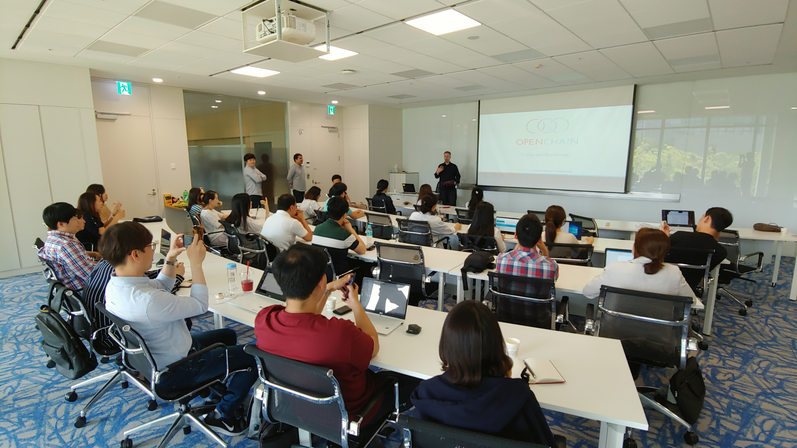

## Organizer

* Samsung Electronics

## Intro

* Scheduled: 2019-06-12 (Wed) 2 pm-5pm
* Venue: 삼성전자 서울R&D캠퍼스(우면동) E타워 1층 107회의실 (Conference Room 107, E-Tower, Seoul R&D Campus Samsung Electronics (Umyeon-dong))

## Agenda

| No | Agenda           | Speaker | Slide |
|----|-----------------|------|------|
| 1  | OpenChain Today and Tomorrow  | 	Shane Coughlan, Linux Foundation | [Download](openchaintodayandtomorrow-190612090644.pdf) |
| 2  | 기업 내 Open Source 검증 시스템 구축 현황 (Open Source Verification System Construction Status) | 삼성전자 조재민 (Jaemin Cho, Samsung Electronics) | - | 
| 3  | Open Source 분석 도구 검토 현황 (Open Source Analysis Tool Review) | 삼성전자 김희성 (Hee Sung Kim, Samsung Electronics) | - | 
| 4  | Open Source Compliance Tool based on Open Source | LG전자 장학성 (Haksung Jang, LG Electronics) | [fossology](036_oss_tooling_20190506_fossology_and_sw360_updates_04.pdf), [oss-toolchain](oss-compliance-toolcahin-2019.pdf), [ClearlyDefined](ClearlyDefined-Crowdsourcing-Project-Security-and-Licensing-Data-Jeff-McAffer-Microsoft.pdf) | 

## Attenddes
* KT (1)
* KTDS (2)
* LG Electronics (9)
* NCSOFT (2)
* SK telecom (1)
* Samsung Electronics (7)
* Kakao (5)
* Hyundai Motors (3)

## Photo Gallery

  
  

 

  

