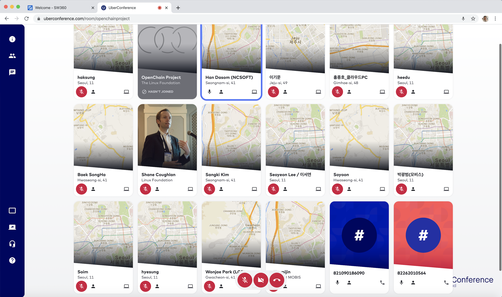

## Online Meeting

* Schedule: 2020-03-19 (Thu) 2:00~ pm
* How to join on PC
  1. PC에서 https://uberconference.com/openchainproject 접속
  2. Your Name 입력 후, “Join audio-only” 클릭하여 방에 입장
  3. Confirm settings 화면에서 마이크와 스피커 설정 확인 후 > Join conference
* How to join on Phone  
  1. 핸드폰에서 02-6022-2388로 전화
  2. 855 889 3011 # 입력

## Agenda

| No | Agenda           | Speaker | Slide |
|----|-----------------|------|------|
| 1  | OpenChain Update  | 	Shane Coughlan, Linux Foundation | [Download](OpenChain_Korea_Meeting_5_March_2020.pptx) |
| 2  | Open Source Compliance in the Enterprise 한글 요약본 소개 (Introduction to Korean Summary of Open Source Compliance in the Enterprise ) | 엔씨소프트 한다솜 (Dasom Han, NCSoft) |  [Download](OSC-Enterprise-ko_Openchain KWG_20200317_FN.pdf) | 
| 3  | OpenChain 해설서 발간 (NIPA) 소개 (Introduction to OpenChain Guide Published by NIPA) | SK텔레콤 장학성 (Haksung Jang, SK Telecom) | [Link](https://www.oss.kr/oss_guide/show/7050bff0-d06b-43f0-99a6-9975afcd486f)  | 
| 4  | SW360 설치 및 사용방법과 보안취약점 관리 소개 (How to install&use SW360, and Security Vulnerabilities Management) | SK텔레콤 장학성 (Haksung Jang, SK Telecom) |[Download](OpenChainKWG-5th-SW360.pdf)  | 
| 5  | Case Study : BOM Tracking 방법 (How to track BOM) | All | -  | 
| 6  |OpenChain KWG Updates | SK텔레콤 장학성 (Haksung Jang, SK Telecom) |[Download](OpenChainKWG-5th-Updates.pdf)  | 

## Attenddes

* NCSoft
* Kakao
* Hyundai Motors
* Hyundai Mobis
* LINE Plus
* LG Electronics
* SK telecom

## Minutes

* [5th-minutes.pdf](5th-minutes.pdf)
