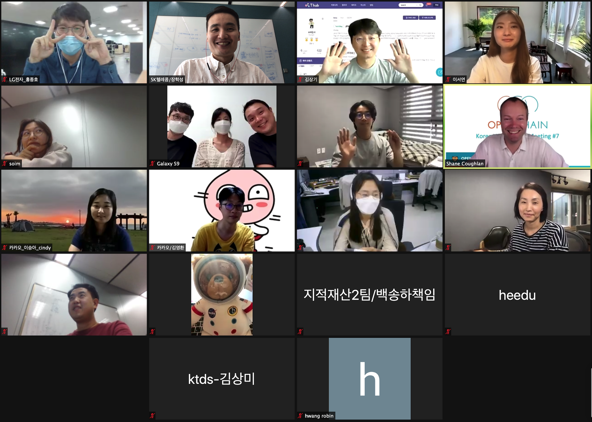

## Intro

* Schedule: 2020-09-22 (Tue) 2:00~4:00 pm
* How to join
  - Join Zoom Meeting ( https://us02web.zoom.us/j/9990120120?pwd=NzVCaFE2L1RRRFZaSkk0dm8xdlplUT09 )
  - Meeting ID: 999 012 0120
  - Password: 123456

## Agenda

| No | Agenda           | Speaker | Slide |
|----|-----------------|------|------|
| 1  | OpenChain Update  | 	Shane Coughlan, Linux Foundation | - |
| 2  | LG전자의 오픈소스 컴플라이언스 관리 시스템 (OSC System) 소개 | LG전자 김소임 |  - | 
| 3  | 오픈소스 관련 책 요약 및 소개 - '오픈소스로 미래를 연마하라' | 라인 이서연 | [Download](forge-your-future.pdf)  | 
| 4  | Case Study : 오픈소스 공개 practices (GitHub, CLA 등) | All | - |
| 5  | OpenChain KWG Update | SK텔레콤 장학성 | [Download](openchain-kwg-7th-2020-09-22.pdf) |
| 6  | Free Discussion | All | - |

## Attenddes
* Hyundai Mobis
* Hyundai Motors
* Kakao
* ktds
* LINE Plus
* LG Electronics
* NCSOFT
* SamSung Electronics
* SK telecom

## Minutes

### 1. OpenChain Update (Shane Coughlan / Linux Foundation)

* OpenChain은 곧 ISO 표준 인증 절차가 완료될 예정
	* 이에따라 다양한 교육 자료를 제작할 예정이며, 국가별로 번역이 필요할 것으로 예상됨
* OpenChain T-shirt 제작 안내

---

### 2. LG전자의 오픈소스 컴플라이언스 관리 시스템, OSC System 소개 (김소임 / LG전자)

#### 주요 기능

* Project : 배포하는 SW별로 생성하여 OSC Process를 수행 

	* 포함된 OSS 목록을 업로드하면, 리뷰어가 리뷰하고, 소스 코드 공개가 필요한 사항을 시스템에서 보여줌 (라이선스 별 상세정보를 보여주어, 각 라이선스 별 소스 코드 취합 범위를 확인 가능)
	* 최종적으로 OSS Notice가 발행되고, 해당 파일과 공개할 소스코드를 [http://opensource.lge.com](http://opensource.lge.com)에 배포하는 구조

* 3rd Party Project : 3rd party SW별 OSS 목록을 관리

* OSS / License 상세 정보 : OSS, License 에 따른 Obligation, Resctriction확인 가능. (각각 nickname을 관리하여 동일한 License를 다르게 표기하여도 매핑됨)

* Vulnerability : OSS 별 보안취약점 확인 가능

* BAT (Binary analysis tool) : binary를 업로드하면, OSS를 검출하여 보여줌

#### 앞으로의 계획

OSC System은  오픈소스로 공개 준비 중

---

### 3. 오픈소스 관련 책 요약 및 소개 - ['오픈소스로 미래를 연마하라'](https://g.co/kgs/KkXrAJ) (이서연 / 라인플러스)

기술 숙련도나 전문분야에 상관없이 독자들이 FOSS 프로젝트에 어떻게 기여할 수 있는지 알려주는 책

#### 자유 소프트웨어·오픈 소스에서 얻을 수 있는 것
* 기술적 혜택, 경력상 혜택, 인맥적 혜택

#### 기여 준비하기
* 내가 어떤 기여를 할 수 있을지 체크리스트를 만들어보자
* 기여 과정
	* 기여하고 싶다는 것을 깨닫는다 - 프로젝트를 찾는다 - 할 일을 찾는다 - 환경을 구성한다 - 기여 작업을 한다 - 기여를 제출한다 - 피드백을 받고 코드 개선을 반복한다 - 기여가 받아들여진다 - (반복)

#### 프로젝트 찾기
* 목표 세우기
* 요건 모으기: 기술, 관심, 시간 여유, 목표
* 후보 프로젝트 모으기
	* 매일 사용하는 소프트웨어가 FOSS인지 확인해보자
	* `관심분야` + `open source` 라고 검색해보자
* 최종 선택을 하기 전에 살펴보아야 할 것들
	* 기여하기 얼마나 쉬운가? 가이드 문서가 친절한가? 
	* 이슈 트래커를 살펴보고 질문해보자
	* 작게 시작하고 장기적인 관점을 가지자

#### 이 책의 활용법
* 오픈소스 기여 가이드로 활용
	* 오픈소스 기여 워크샵
* 현재 공개중인 오픈소스가 새 기여자들에게 얼마나 친절한지 되돌아보는 가이드로 활용

---

### 4. Case Study: 오픈소스 공개 practices(GitHub, CLA 등)

* 

---

### 5. OpenChain KWG Update

* KWG 로고 제작! (Thanks to [@soimkim](https://github.com/soimkim))
* 새 로고를 넣은 T-Shirt 제작 예정. 신청은 추후 공지

## Video

## Photo Gallery

  

