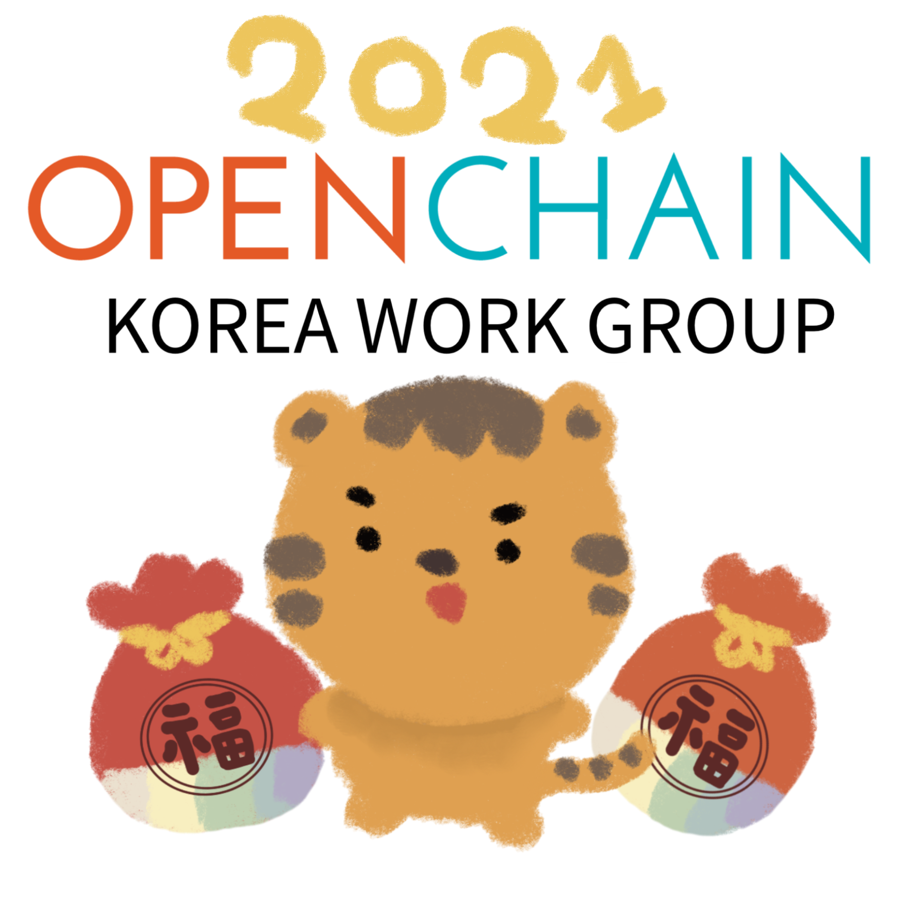

  

## 일정

* Schedule: 2021-03-11 (Thu) 2:00~4:00 pm
* How to join
  - Join Google Meet : https://meet.google.com/kbs-yjce-fcv

## Agenda

| No | Agenda           | Speaker | Slide |
|----|-----------------|------|------|
| 0  | Intro & Greetings  | Newcomers | [download](./OpenChain_Korea_20210311_intro.pptx) |
| 1  | OpenChain Update  | 	Shane Coughlan, Linux Foundation | - |
| 2  | FOSSLight Dependency 소개 | LG전자 석지영 | [download](./FOSSLight_dependency.pptx) | 
| 3  | OpenChain KWG Update /   ISO/IEC 5230 인증 3가지 방법 | SK텔레콤 장학성 | [download](./OpenChain_Korea_20210311_update.pptx)    [download](./OpenChain_Korea_20210311_howto.pptx)|
| 4  | 오픈소스와 함께한 1,273일간의 기록 (ISO 인증 취득 과정) | NCSOFT 한지호 | [download](./★오픈소스와%20함께한%201273일간의%20기록_20210311_FN.pdf)| 
| 5  | Case Study | All | - |
| 6  | Free Discussion | All | - |

## Case Study
* 주제 : ISO/IEC 5230 인증 취득을 고려하고 있는지? 

## Attendees
* ...

## Video

### OpenChain Update

<iframe width="560" height="315" src="https://www.youtube.com/embed/9hudq2KgcDY" frameborder="0" allow="accelerometer; autoplay; clipboard-write; encrypted-media; gyroscope; picture-in-picture" allowfullscreen></iframe>

### FOSSLight Dependency 소개

<iframe width="560" height="315" src="https://www.youtube.com/embed/lUZYlkdlH4M" frameborder="0" allow="accelerometer; autoplay; clipboard-write; encrypted-media; gyroscope; picture-in-picture" allowfullscreen></iframe>

### OpenChain KWG Update / ISO/IEC 5230 인증 3가지 방법

<iframe width="560" height="315" src="https://www.youtube.com/embed/ifauIfkRLT8" frameborder="0" allow="accelerometer; autoplay; clipboard-write; encrypted-media; gyroscope; picture-in-picture" allowfullscreen></iframe>

### 오픈소스와 함께한 1,273일간의 기록 (ISO 인증 취득 과정)

<iframe width="560" height="315" src="https://www.youtube.com/embed/bDDYWwVhuGw" frameborder="0" allow="accelerometer; autoplay; clipboard-write; encrypted-media; gyroscope; picture-in-picture" allowfullscreen></iframe>

## Minutes
### 1. OpenChain Update (Shane Coughlan, Linux Foundation)
#### ISO 인증
- 일본, 미국, 한국의 몇몇 회사들이 인증을 받음
- 가장 큰 뉴스는 이 회사들에 ISO 표준을 적용했을 때 잘 작동한다고 했다는 것. 이는 표준이 잘 만들어졌다는 증명이 될 수 있음
- 꼭 규모가 큰 회사 뿐 아니라 조금 더 작은 규모의 회사에서도 인증을 받았다는 것이 아주 큰 성과였음
#### 교육
- 이메일로 신청하면 교육팩을 받아볼 수 있다. (오픈체인, 오픈소스, 오픈체인 인증받는 방법 등에 대한 [Slidedeck](https://onedrive.live.com/view.aspx?resid=674AE6F2A656C9C5!2198&ithint=file%2cpptx&authkey=!ANO7Sm_QmBvRoBA))
- [Training course](https://1drv.ms/w/s!AsXJVqby5kpnkRH05071m4j0CybH)
#### 설문
- [Project annual survey](https://forms.gle/XDBAKQjaG3vNs6iR7)
- 모든 질문에 응답할 필요는 없고 원하는 질문에만 응답하는 것도 가능
- 60초~10분까지 소요되는 분량이며 많은 참여를 독려

### 2. FOSSLight Dependency 소개 (석지영, LG전자)
#### LG전자의 Open Source 프로젝트로 FOSSLight Scanner와 FOSSLight System 공개 예정
- FOSSLight Scanner: 오픈소스 분석 스캐너
- FOSSLight System: 오픈소스 컴플라이언스 통합 시스템
#### FOSSLignt System 사용 방법
- FOSSLight Scanner로 스캔한 결과를 업로드
- Indentification, Packaging, Distribution 절차를 거쳐서 오픈소스 라이선스 고지문 발급 및 배포까지 완료
#### FOSSLight Scanner 
- 소스코드 스캔은 ScanCode 활용
- Dependency 스캔은 FOSSLight Dependency Scanner 활용
- Binary 스캔은 별도 바이너리 스캔 툴 활용
현재는 FOSSLight Dependency Scanner만 공개하였으나, 추후 전체 프로젝트를 공개할 예정
#### FOSSLight Dependency Scanner 
- 레포지토리 링크: https://github.com/LGE-OSS/fosslight_dependency
- 사용 언어: Python
- 오픈소스 라이선스: Apache License 2.0
- 지원하는 패키지 매니저: Gradle, Maven, NPM, PIP, Pub (추후 Cocoapods, Yarn 추가 예정)
- 각 dependency의 OSS 정보 확인
  - OSS Name
  - OSS Version
  - License Name
  - Download Location
- OSS 정보 확인 시 정확한 라이선스 분석을 위해 라이선스 텍스트 분석 오픈소스도 활용함
  - Nomos standalone(https://github.com/fossology/fossology/tree/master/src/nomos/agent)
  - Askalono (https://github.com/jpeddicord/askalono)
#### LG전자 오픈소스 가이드 페이지
  - LG Open Source : http://oss.lge.com
  - LG OSC Process Guide : https://lge-oss.github.io/guide/
  - LG FOSSology Guide : https://lge-oss.github.io/fossology-guide/
  - LG ORT(Oss Review Toolkit) Guide : https://lge-oss.github.io/oss-review-toolkit-guide/
#### Q&A
- ORT와 비교하면 어떤지?
  - ORT는 무거운 편이고, 간결하게 사용하기 위해 FOSSLight 라는 시스템을 개발한 것
- Gradle의 경우, 분석 프로그램에 플러그인을 설치해야 하는데, LG전자 정책상 플러그인 설치를 강제하고 있는지?
  - FOSSLight Requirements 에 플러그인을 설치하고 스캔하라고 가이드하고 있음

### 3. OpenChain KWG Update (장학성, SK텔레콤)
#### Korea Work Group 스티커 배포 (Designed by Soim)
#### ISO/IEC 5230 적합성 인증 선언
- 엔씨소프트, LG전자 인증 획득
#### OpenChain 규격 2.1 한국어 번역 완료
- https://github.com/OpenChain-KWG/Specification-Translation-KR 
- Special Thanks to Contributors: LG전자 김경애님, 홍종호님
#### OpenChain 규격 2.1에 맞게 자체인증 질문지 개선
- https://github.com/OpenChain-Project/Online-Self-Certification-Web-App
- https://github.com/OpenChain-Project/conformance-questionnaire
#### Korea Work Group 블로그 공간 개설
- 작성 방법: https://github.com/OpenChain-Project/OpenChain-KWG/wiki/Blog-%EC%9E%91%EC%84%B1%ED%95%98%EA%B8%B0
#### Sub Group
- Planning Group : KWG 거버넌스 체계 구축, 정기 모임 일정/Agenda, 주요 의사결정, 회의록 작성, 굿즈 제작 등
- Conformance Group: OpenChain 인증 획득 준비 및 정보 공유

### 4. ISO/IEC 5230 인증 3가지 방법 (장학성, SK텔레콤)
#### Self Certify
- OpenChain 프로젝트에서 추천하는 방법, 웹사이트에서 무료로 제공하고 있고 대부분의 기업이 채택하고 있음
- 링크: https://certification.openchainproject.org
- 방법
  - 회원가입
  - 현수준 진단
  - 미비한 사항들 보완
  - 모든 사항 Yes 체크 후 제출
  - General Manager에게 인증 수행 결과 제출
  - General Manager가 간단한 질의응답 형태로 확인 절차 거침
  - 이상이 없다면 적합성 인증 취득 선언
#### Independent Assessment
- 제3자가 평가, 미비점 보완을 위한 지원 제공
- 아직 ISO/IEC 5230은 제3자 평가를 의무화한 조항은 없음
- 컨설팅 제공이 주요 포인트
- 주요 업체1 - AlektoMetis
  - 미비점 분석, 보완을 위한 Task 수행
- 주요 업체2 - Source Code Control
  - 적합성 인증 획득을 위해 체계적인 계획 수립하여 대시보드화
  - 각 항목마다 세부 방법 및 담당자  할당하여 관리
#### Third Party Certification
- 인증전문 기관에 의한 평가
- 인증서 발행
- 주요 업체1 - TUV SUD (글로벌 시험 인증 기관)
- 주요 업체2 - PwC (세계 4대 회계법인 중 하나, 다국적 회계 감사 기업)
#### 국내 인증 현황 및 시사점
- 국내에 아직 ISO/IEC 5230 교육 및 인증을 제공하는 업체는 없음
- 대기업 그룹사의 경우 한 기업이 전문 지식 및 경험을 획득하고, 계열사 및 관계사 대상으로 Independent Assessment 형태의 서비스를 제공할 수 있을 것 (예: 자동차 업계)
#### NIPA 발간한 OpenChain 해설서
- 기업 공개SW 거버넌스 OpenChain 2.0 해설
- ISO/IEC 5230에 맞게 개정 예정 
#### Q&A
- ISO/IEC 5230 표준 문서는 깃허브에 공개되어 있는지? 자세한 문서는 없는지?
  - 한글 번역 작업 진행 중: https://github.com/OpenChain-KWG/Specification-Translation-KR

### 5. 오픈소스와 함께한 1,273일간의 기록 (한지호, 엔씨소프트)
#### 엔씨소프트의 오픈소스 컴플라이언스 활동은 2017년 6월부터 시작
#### 2017년
- 오픈소스 분야의 지식이 없었기 때문에 오픈소스 라이선스와 관련된 사외 교육 수강
- 오픈소스 분야에 이미 경험이 많은 타 기업의 담당자분들께 의견을 구하기도 하였음
  - Special Thanks to 전현준 변리사님, 장학성님, 황은경님
- 오픈소스 컴플라이언스를 담당할 조직 세팅
- 프로세스 수립
- 오픈소스 검증 및 사용에 대한 가이드를 정리하여 사내 위키에 공개
- 오픈소스 문의를 받을 사내 메일 그룹 생성
#### 2018년
- Protex 도입하여 오픈소스 검증 착수
- 당시에는 소스코드 스캔 및 컴플라이언스는 주로 보안 부서에서 담당하였고, 커뮤니케이션이나 서브 업무만 지원 
- 라이브 중인 프로덕트를 대상으로 오픈소스 사용 고지 완료
#### 2019년 
- 사내 개발자 컨퍼런스에서 오픈소스 라이선스 검증에 대한 경과 발표
- 오픈소스 검증을 주로 담당하던 보안 부서가 사라지게 되어서 오픈소스 컴플라이언스 업무의 R&R을 새로 수립하였음
- Protex의 한국 총판 업체도 변경되면서 Protex 계약을 종료하고, 오픈소스 스캔 도구로 Fossology를 도입함
#### 2020년
- OpenChain 인증 준비 착수
- OpenChain 2.0 요구사항 중 충족하지 못한 부분들 보완
  - 문서화된 오픈소스 정책 수립
  - 오픈소스 기여 정책 수립
  - 전사 오픈소스 교육
- 오픈소스 정책/가이드를 만들어서 사내 Developers 사이트에 공개
  - 도움이 되었던 도서: 오픈소스로 미래를 연마하라
- 월간 전사 임원회의 및 경영회의에서 오픈소스 컴플라이언스 업무에 대해 공유
  - 대표님을 포함한 경영진 레벨에서 스폰서십 확보
- 오픈소스 교육 콘텐츠 개발
  - 30분 내외의 동영상 
  - 강의용 PPT와 스크립트 공개: https://github.com/ncsoft/oss-basic-training 
- 전사 오픈소스 교육 시행
  - 전사 개발자, PM, QA직군 대상
  - 약 93% 수료
  - 설문조사 시행하여 오픈소스 라이선스에 대한 이해 수준 평가 (5점 만점에 4.2점)
- 2020년 12월 15일, OpenChain 2.1 인증 획득 
#### 그 이후
- 현재도 오픈소스 컴플라이언스 활동 지속
- 해외 퍼블리셔/지사에서 서비스하는 프로덕트에 대해서도 검증 및 고지 완료
- 사내 Stackoverflow 서비스에 [오픈소스 지식채널]을 만들어서 질의 응답하고 있음 
#### Q&A
- 설문조사 참여율을 어떻게 높였는지?
  - 강제성 없이 설문조사했을 때에는 30%의 참여율을 보였으나, 더이상 권장하지는 않았음
  - 전사 교육 시행 시 설문조사까지 완료하여야 수료되도록 강제성을 부여했음

## Photo Gallery

## OpenChain News
...

