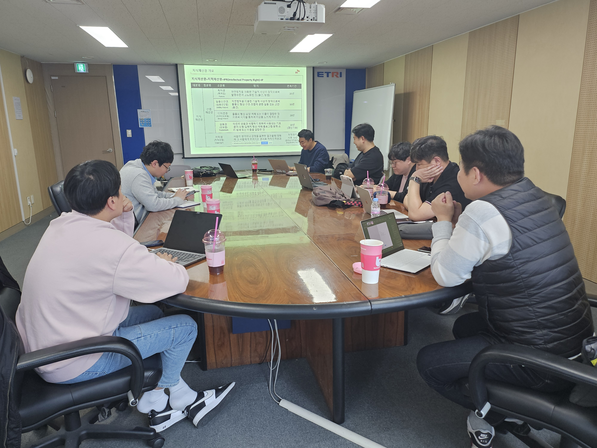
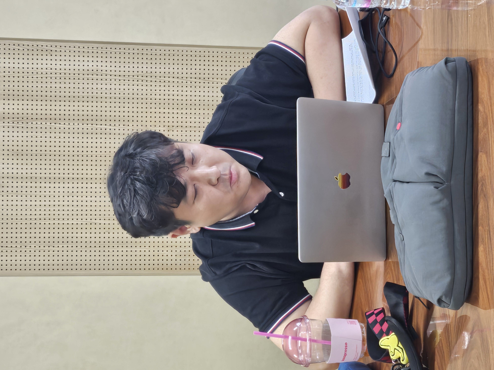
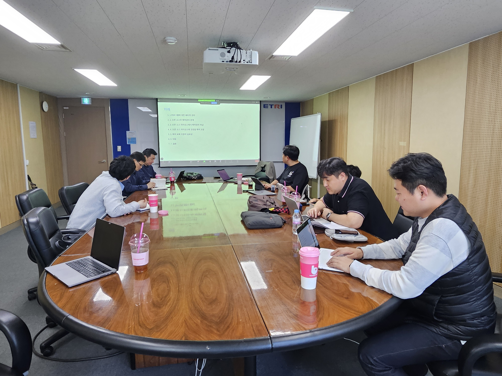
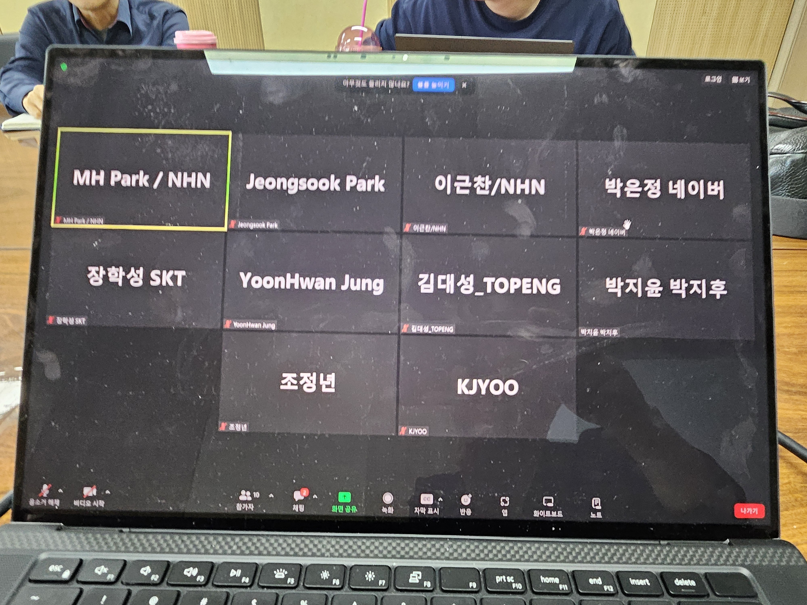
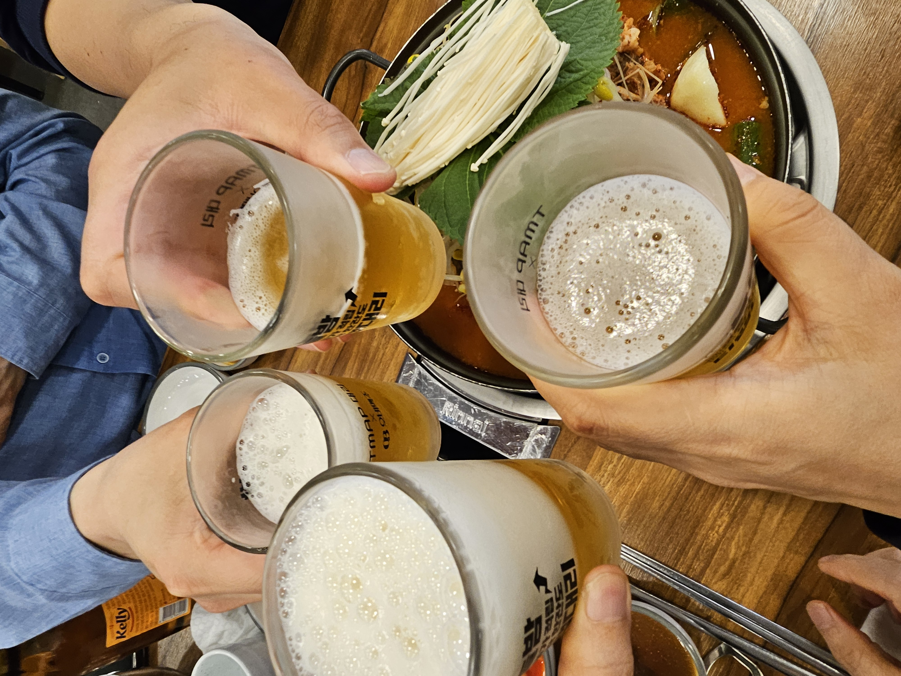

---
title: "4th Meeting"
linkTitle: "Legal SG 4th Meeting"
weight: 2
date: 2024.4월 24일 15:00~17:00
type: docs
description: Legal SG 4th Meeting 
---

## Schedule

* 목적 : Legal Subgroup 4차 회의
* 일시 : 2024년 4월 24일 오후 3시
* 장소 : ETRI 서울사무소(남부터미널 근처)

## Attendees
* 김강보, 김대성, 류창한, 박명헌, 박은정, 박원재, 박정숙, 백송하, 신학철,
* 유경재, 이근찬, 장학성, 정윤환, 조정년, 홍종호 외

## Agenda
| No | Subject           | Speaker | Slide |
|----|-----------------|------|------|
| 1  | (소송사례) Entr’Ouvert vs. Orange 프랑스 소송 사례 | 조정년, SK주식회사  | [pdf](발표자료1-SK주식회사_조정년.pdf) |
| 2  | (주제발표) 오픈소스 라이선스 특허보복조항 | 박명헌, NHN | [pdf](발표자료2-NHN-박명헌.pdf) |

## Meeting Minutes

## Photo Gallery

　
　
　
　
　
　
　
　
　
　
　
　
　
　

