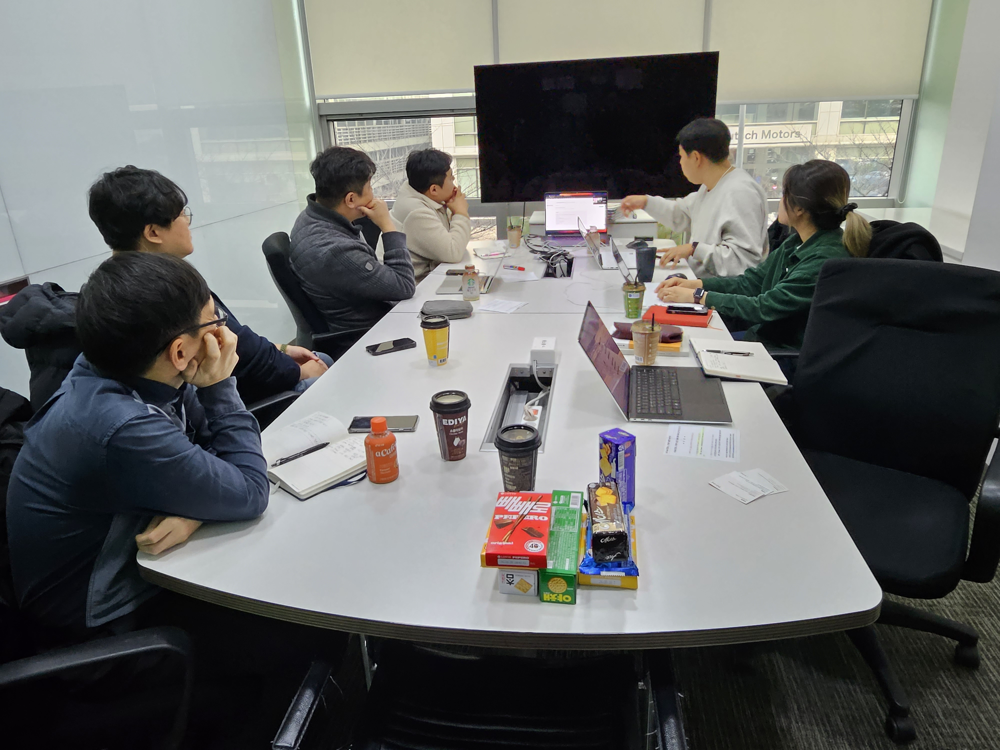

---
title: "2nd Meeting"
linkTitle: "Legal SG 2nd Meeting"
weight: 2
date: 2023-12-13(수) 16:30~18:00
type: docs
description: Legal SG 2nd Meeting 
---

## Schedule

* 목적 : Legal Subgroup 2차 회의
* 일시 : 2023.12.13.(수) 16:30~18:00
* 장소 : LG전자 회의실 + 온라인(WebEx)

## Attendees(20명)
* 김강보, 박명헌, 박원재, 박정숙, 유경재, 이근찬, 이혜인 (이상 대면) 
* 김상미, 김진아, 송선옥, 이서연, 이영준, 이혜규, 장학성, 전미진, 정윤환, 주군호, 최소현, 한현정, 현세영(이상 온라인)

## Agenda
| No | Subject           | Speaker | Slide |
|----|-----------------|------|------|
| 1  | Open Compliance Summit Japan 2023 소개      | 장학성, SKT     |   |
| 2  | (소송사례) Stability AI 집단소송 – Motion to Dismiss| 박원재, LG전자  |  [pdf]([legal_2nd]Stability_ClassAction_MTD(박원재).pdf) |
| 3  | (주제발표) GPL-2.0: 라이선스 경계 문제와 컴플라이언스     | 박정숙, ETRI	    | [pdf]([발표자료]LegalSubgroup2차회의-GPL-2.0-20231213-R2(박정숙).pdf)  |

## Meeting Minutes(짧은 개최소감)

* 온라인, 오프라인 합쳐 20분 정도가 참석
* 장학성님께서 Open Compliance Summit Japan 2023의 분위기와 주요 주제에 대해 소개해 주심. (“CJK 협업”이라는 단어가 제 다이어리에 메모되어 있네요.)
* 박원재님께서 Stable Diffusion의 집단소송 현황에 대해 소개해 주심
* (참고) 저작권 등록의 필요성: 손해액 산정에 유용하게 사용. 소송을 걸기 위해서는 침해 전에 저작권이 등록되어 있어야 함
* 박정숙님께서 GPL-2.0의 라이선스 경계 이슈에 대한 소개해 주심 (발표자료는 계속 업데이트해나갈 예정)
* 스터디 모임답게 궁금증을 서로 질문하고 활발히 논의하는 자리였음
* 참석해 주신 모든 분들께 감사인사 드립니다.
* 새해 복 많이 받으시고 내년 2월에 뵙겠습니다. 다음부턴 회의록을 좀더 잘 작성하도록 노력하겠습니다.

## Photo Gallery

　
　
　

