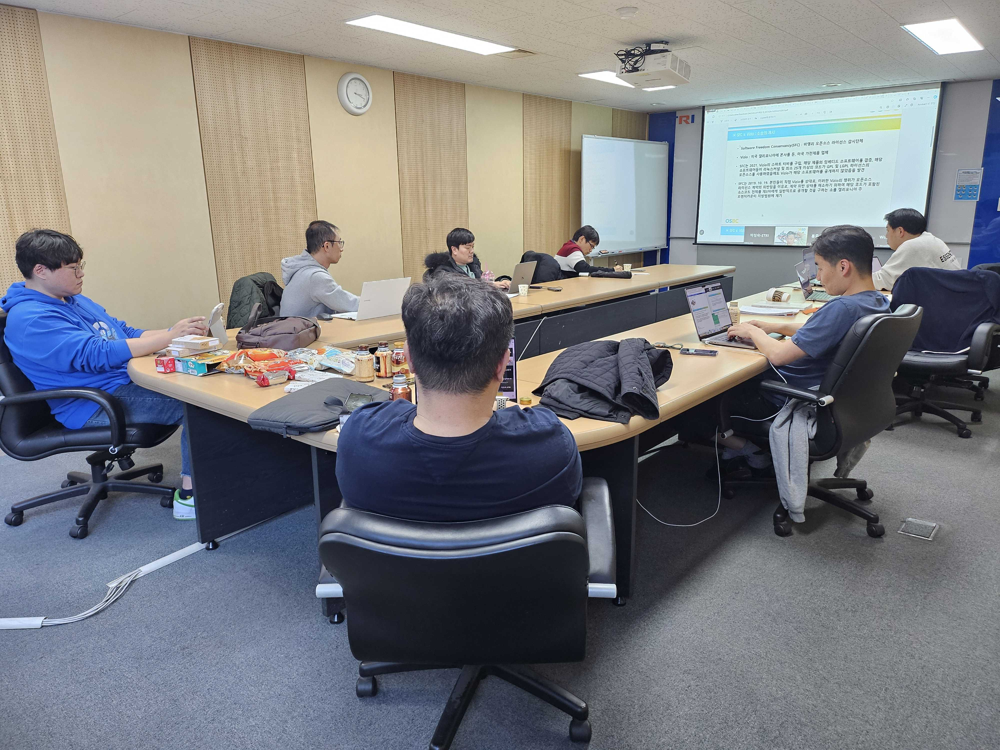
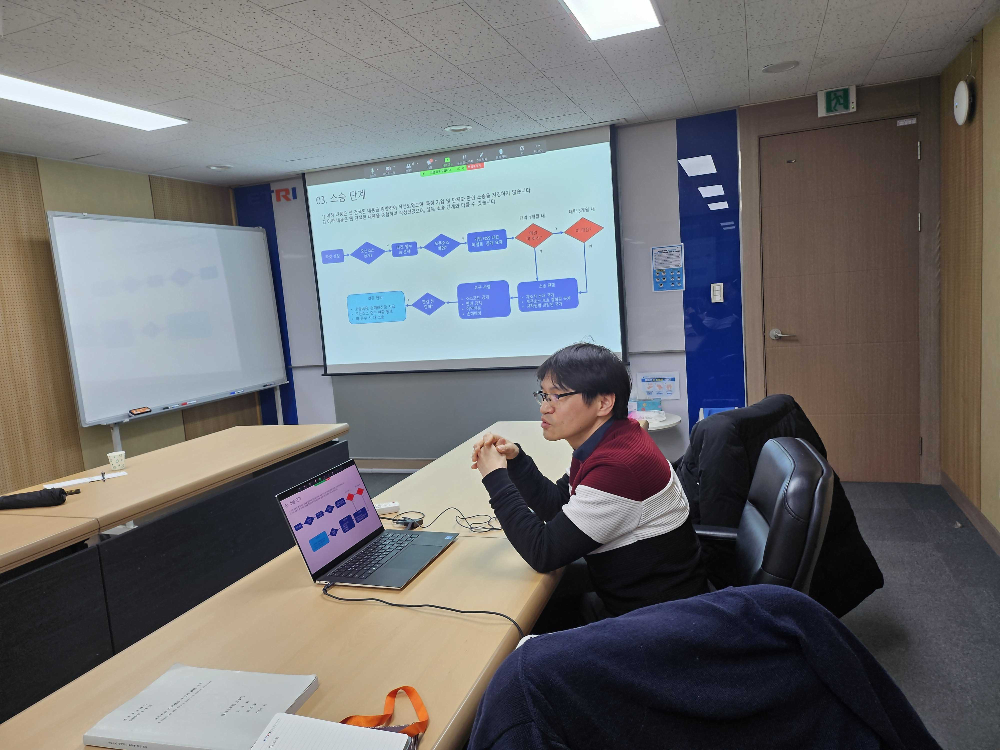
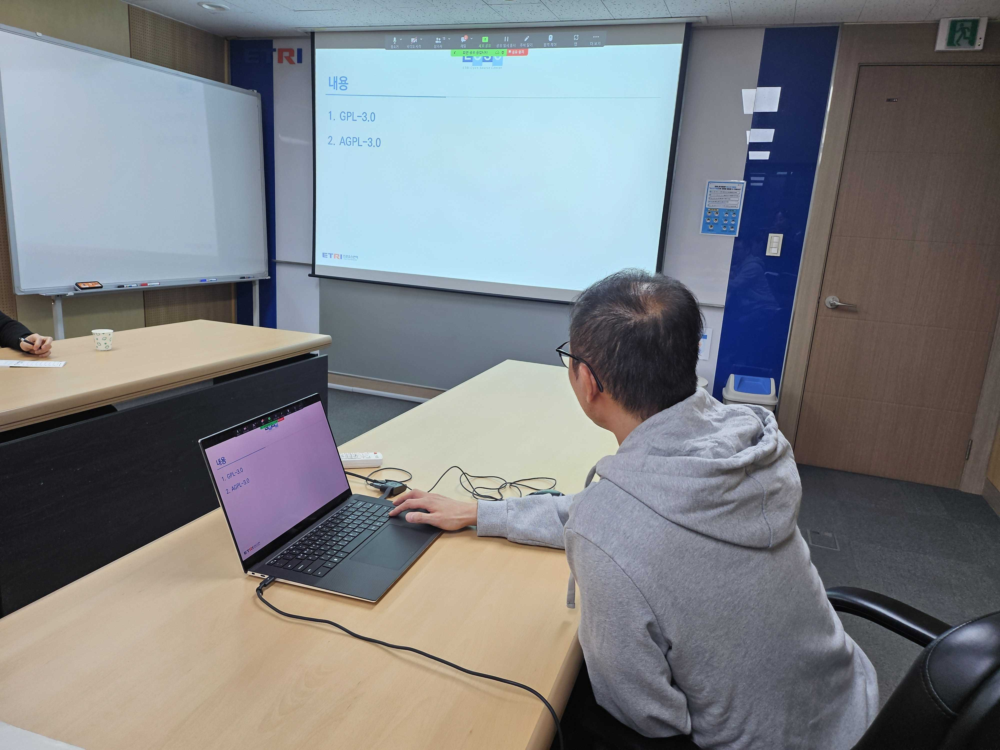

---
title: "3rd Meeting"
linkTitle: "Legal SG 3rd Meeting"
weight: 2
date: 2024-2-14(수) 15:00~17:20
type: docs
categories: ["legal"]
tags: ["SFC", "Vizio", "중국", "GPL", "분쟁사례"]
description: Legal SG 3rd Meeting 
---

## Schedule

* 목적 : Legal Subgroup 3차 회의
* 일시 : 2024년 2월 14일(수) 15:00~17:20
* 장소 : ETRI 서울사무소 소회의실1 + 온라인(Zoom)

## Attendees
* 김강보, 김기련, 김동혁, 김상미, 김시안, 김승우, 김진아, 김형진, 류창한, 
* 박명헌, 박슬희, 박원재, 박은정, 박정숙, 신학철, 엄숭광, 유경재, 윤석경, 
* 이근찬, 이완근, 장학성, 전미진, 정윤환, 조민지, 주군호, 최소현, 홍종호

## Agenda
| No | Subject           | Speaker | Slide |
|----|-----------------|------|------|
| 1 | Updates | 사회자 | [pdf](회의자료-LegalSG-3차-20240214.pdf) |
| 2 | Introducing New Issues |   |    |
| 2-1 | SFC v. Vizio | 이완근, OSBC | [pdf](./발표자료1-OSBC%20이완근.pdf) |
| 2-2 | 중국의 오픈소스 2차적저작물 소송 판결 결과 소개 | 사회자 | 회의자료 참고 |
| 2-3 | LF의 오픈소스 라이선스 컴플라이언스 리포트 소개 | 사회자 | 회의자료 참고 |
| 3 | (소송사례) GPL-violations.org는 어떤 사항들을 문제삼았나? | 김강보, 안랩  | [pdf](./발표자료2-안랩%20김강보.pdf) |
| 4 | (주제발표) GPL의 발전: GPL-3.0, AGPL-3.0      | 엄숭광, ETRI | [pdf](./발표자료3-ETRI%20엄숭광.pdf)|
| 5 | 회의록 | 사회자 | [pdf](./회의록-LegalSG-3차-20240214.pdf) |

## Meeting Minutes
회의록 파일 참고

## Photo Gallery

　
　
　
　
　
　
　

