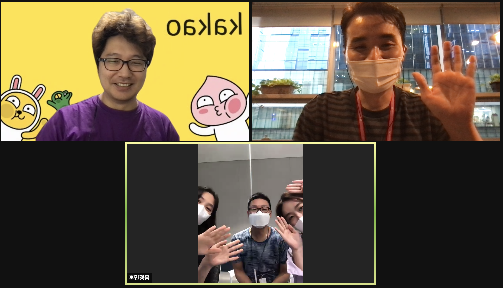

## Intro

* Schedule: 2021-08-27 (금) 16:00~17:20 / Zoom
* Attendees
  * 라인플러스 이서연
  * 엔씨소프트 한지호, 한다솜, 김다은
  * 카카오 황민호(Robin)
  * SK텔레콤 장학성

## Agenda

1. 근황 토크 
2. 거버넌스 논의 (논의 결과 및 세부 내용은 메일링리스트로 공유)
   * 3rd party 인증 업체 등 OpenChain Partner사 참여 방안 
   * KWG 거버넌스 문서화 필요
     * 11차 모임 시 draft 공유 / 12차 모임에서 확정
     * 2022년 시행 목표
3. 2021년 3분기 KWG Meeting
   * 일정 : 9/30 (목), 14:00~16:00
   * Join : Zoom (라인플러스 제공)
   * Agenda
     * Call for Paper (8/30~9/24)
   * 소그룹 토의 (Case Study)
     * 3-5명 소그룹으로. 15분. 

## Photo Gallery
