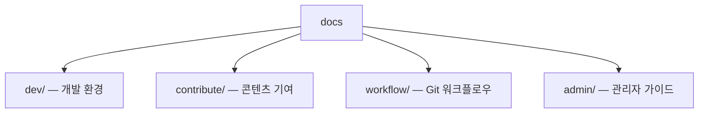

# OpenChain KWG 문서 (docs/)

OpenChain KWG 웹사이트 개발 및 기여에 관한 문서 모음입니다.

---

## 개발 환경 (dev/)

| 문서 | 설명 |
|------|------|
| [개발 환경 구축하기](dev/setup.md) | Hugo, NodeJS 설치 및 환경 구성 |
| [로컬에서 웹사이트 구동하기](dev/local-server.md) | PostCSS 설치, 빌드, 로컬 서버 실행 |

---

## 콘텐츠 기여 (contribute/)

| 문서 | 설명 |
|------|------|
| [Meeting 내용 작성하기](contribute/meeting.md) | 정기 미팅 페이지 생성 및 수정 방법 (Archetype 포함) |
| [Subgroup 내용 작성하기](contribute/subgroup.md) | Subgroup 활동 페이지 추가/수정 방법 |
| [Blog 작성하기](contribute/blog.md) | 뉴스/기술 블로그 작성 방법 |
| [Index 페이지 헤더 영역 작성하기](contribute/index-page.md) | `_index.md` Front Matter 작성 가이드 |
| [영문 페이지 작성](contribute/english-page.md) | `/ko` ↔ `/en` 다국어 페이지 반영 방법 |
| [파일 첨부와 그림 보여주기](contribute/file-attachment.md) | 이미지 삽입, 대용량 파일 GitHub Releases 업로드 규칙 |

---

## Git 워크플로우 (workflow/)

| 문서 | 설명 |
|------|------|
| [Git Workflow](workflow/git-workflow.md) | Fork → Clone → Branch → PR 전체 흐름 |

---

## 관리자 가이드 (admin/)

| 문서 | 설명 |
|------|------|
| [Review와 Test 절차](admin/review-test.md) | PR Review, 로컬 Test 방법 |
| [수정 사항 반영 및 Deployment](admin/deployment.md) | master branch 반영 및 GitHub Pages 배포 |

---

## 빠른 시작

처음 기여하시는 분은 아래 순서를 따르세요.

1. [개발 환경 구축하기](dev/setup.md) — Hugo, NodeJS 설치
2. [Git Workflow](workflow/git-workflow.md) — Fork & Clone (Step 1~4)
3. [로컬에서 웹사이트 구동하기](dev/local-server.md) — 빌드 및 로컬 확인
4. 콘텐츠 추가/수정 (위 contribute/ 문서 참고)
5. [Git Workflow](workflow/git-workflow.md) — Commit & Pull Request (Step 5~7)
