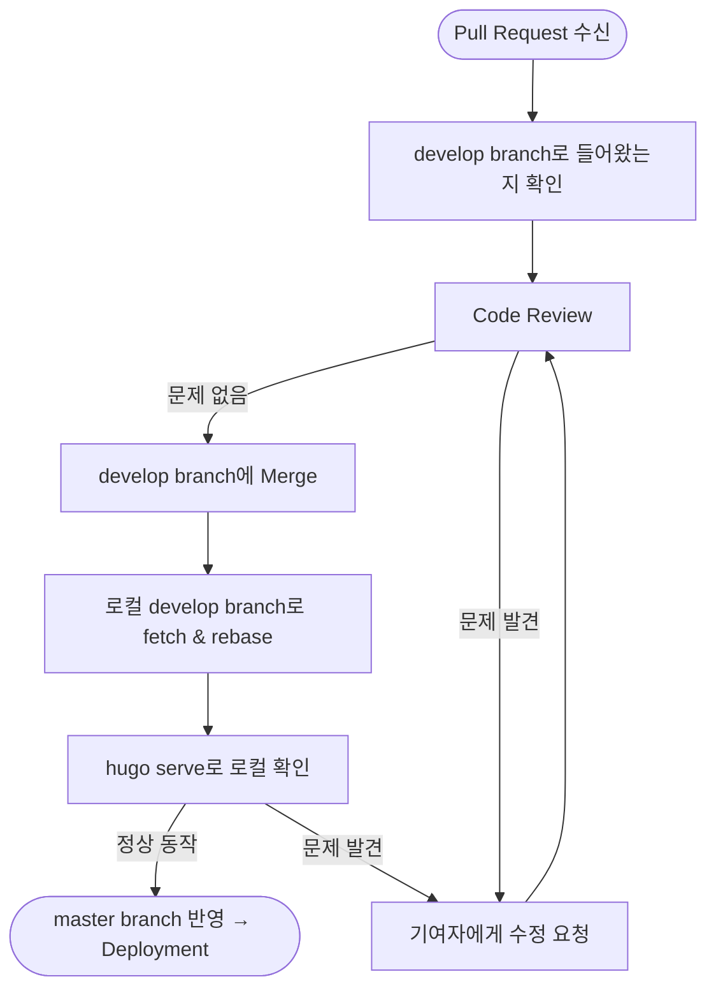

# Review와 Test 절차 및 방법

관리자는 Pull Request가 들어오면 다음 절차로 Review와 Test를 수행한다.



## Review

1. Pull Request가 develop branch로 들어왔는지 확인한다.
2. Code 레벨로 검토 후 문제가 발견되지 않았다면 develop branch에 Merge한다. 특별한 문제가 있을 경우, 기여자에게 수정을 요청하여 보완하는 과정을 거친다.

## Test

Pull Request를 Merge한 최신의 develop branch를 로컬의 develop branch로 fetch & rebase한다.

```bash
$ git checkout develop
$ git fetch
$ git rebase origin/develop
```

로컬의 develop branch에서 **hugo serve**하여 Pull Request 수정 사항이 정상적으로 동작하는지 확인한다. : http://localhost:1313/OpenChain-KWG/

(국문과 영문을 함께 확인한다.)

## 다음 단계

Review와 Test가 완료되면 → [수정 사항 반영 및 Deployment](deployment.md)
