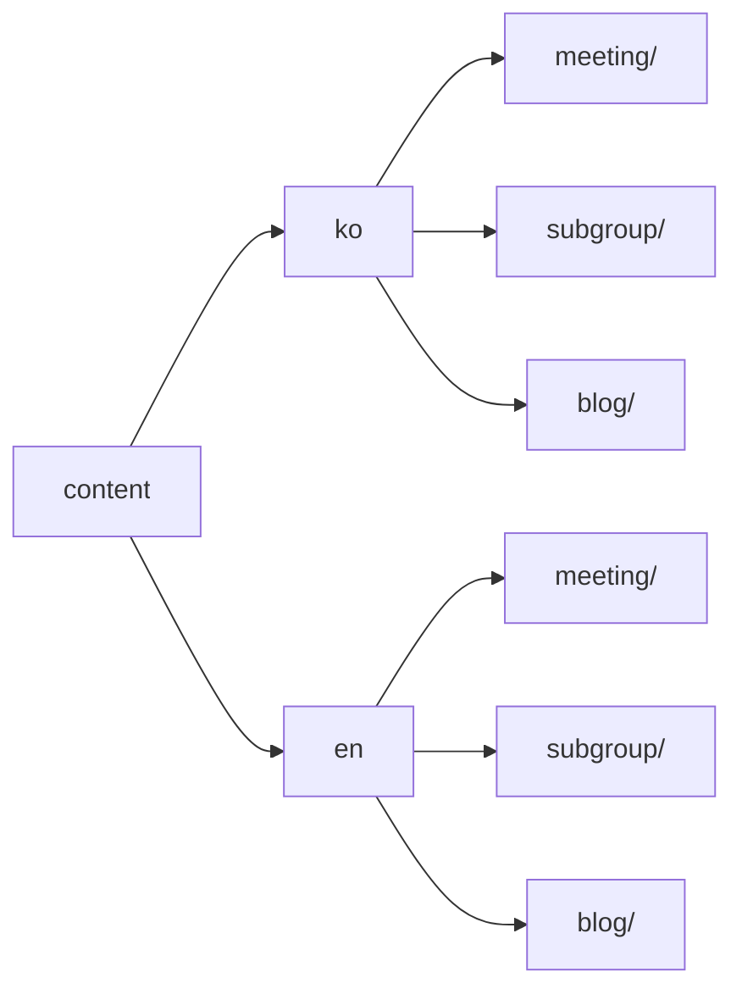

# 웹사이트 영문 페이지 작성

OpenChain KWG 웹사이트는 국문을 기본으로 하고, 영문도 지원합니다.

웹사이트 상단 메뉴의 Korea / English 버튼을 눌러서 원하는 언어를 선택할 수 있습니다.

소스 코드를 [다운로드](../workflow/git-workflow.md)하여 국문 페이지에 내용을 추가/수정하였으면 아래 안내에 따라 영문 페이지에도 이를 반영하세요.

## 영문 페이지 작성 방법

소스 코드의 [`/content`](https://github.com/OpenChain-Project/OpenChain-KWG/tree/master/content) 디렉토리에는 [`/en`](https://github.com/OpenChain-Project/OpenChain-KWG/tree/master/content/en)와 [`/ko`](https://github.com/OpenChain-Project/OpenChain-KWG/tree/master/content/ko)이 존재합니다.

```
$ ls ./content
en  ko
```

`/en`과 `/ko`를 비교해보면 동일한 구조의 디렉토리를 갖고 있으며, 텍스트 파일 내 텍스트만 각각 영문/국문으로 되어 있습니다.

즉, 국문 작성을 위해 `/ko` 디렉토리 하위에 추가/수정한 파일을 동일하게 `/en` 디렉토리 하위에도 적용하세요. 이때, `_index.md` 파일 등 텍스트 파일 내 국문 텍스트만 영문으로 수정하면 됩니다.

## 디렉토리 구조 참고



`/ko`에서 추가한 파일과 동일한 경로를 `/en` 하위에 생성하고, 텍스트만 영문으로 작성하면 됩니다.
